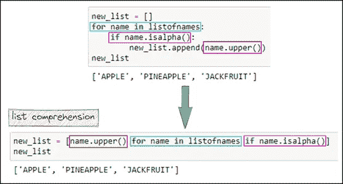
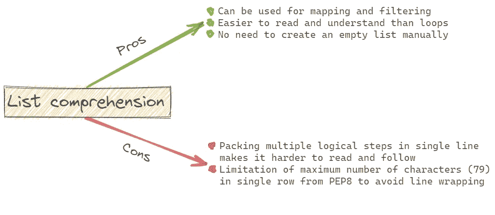
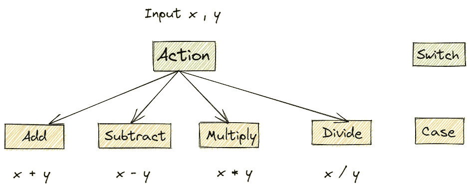
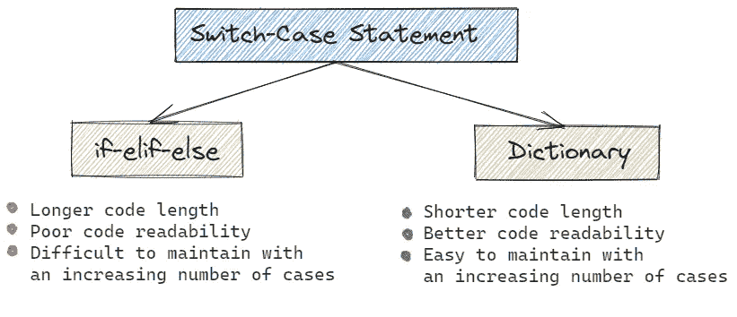
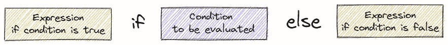

# 获得更好代码的 3 个 Python 技巧

> 原文：<https://towardsdatascience.com/3-python-tricks-for-better-code-511c82600ee1?source=collection_archive---------40----------------------->

## 编程；编排

## ..第二个技巧让我的 python 程序执行速度提高了 440 倍！


布雷特·乔丹在 [Unsplash](https://unsplash.com?utm_source=medium&utm_medium=referral) 上拍摄的照片

**大蟒道！💡**

利用 Python 独特的特性编写代码，提高了代码的可读性，减少了执行时间，并使程序更短。

我在最近的项目中使用了这 3 个技巧，这使得我的 Python 程序长度减少了近 75%,同时可读性更好。

在上一篇文章中，我讨论了用 Python 编码来加速代码执行的最好的 [**省时的**](/3-time-saving-python-tricks-a017f4215aeb) 方法。⏳

在接下来的 4 分钟里，你将学习 Python 中的 3 个技巧，用缩短的代码长度写出更好的代码。

# 列出理解

列表理解是最好的，也是最真实的💡基于现有列表创建列表的方法。

为了让文字更清晰，这里举个例子。让我们创建一个简单的字符串列表。

```
listofnames = ["apple", "orange100", "banana2",
                 "pineapple", "10grapes", "jackfruit"]
```

接下来，如果字符串是纯字母的，我想从最近创建的大写`listofnames`中创建一个所有字符串的列表。

该任务可以使用`for`循环和`if`语句来完成，但这不是 Pythonic 式的方法。相反，使用如下所示的列表理解将代码长度限制在一行内。

```
new_list = [name.upper() for name in listofnames if name.isalpha()]
```

让理解变得更简单，让我们将列表理解与 for 循环和 if 语句进行比较。



作者列表理解和 For 循环|图像的比较

如上图所示，`for`循环中最里面的元素将是列表理解中的第一个元素。

然而，列表理解并不是在所有情况下都是正确的选择。在某些情况下，它会使您的代码运行缓慢并消耗更多内存。🚩



列表理解|作者图片的优缺点

根据程序的复杂程度，您必须在列表理解和 for 循环之间做出选择。重要的是编写一个易于理解和修改的代码。

# 用于复制 Switch-Case 语句的字典

使用字典📚在 Python 中复制 Switch-Case 和多个`if-elif-else`语句。

与其他编程语言不同，Python 不支持`Switch-Case`语句。这可以通过使用`if-elif-else`语句来实现。

用字典替换多个`if-elif-else`语句使得我的程序 ***比上一个版本的* ⚡** 快了 440 倍。

让我们看看这个例子。
变量 action 是开关，其取值是 Case。根据该值，执行程序的不同路径。



Switch-Case 语句|作者图片

当然，这可以使用 if-else 语句来实现。但是，随着复杂性的增加，代码的可读性将开始下降。

下面是如何在`if-else`中实现这一点。

使用 If-Else 语句按作者复制 Switch-Case | Gist

仅语句`if-elif-else`就占用了 11 行代码，具有良好的代码可读性，并且这将随着案例的增加而不断增长。

更好的方法是，使用包含所有案例的字典。📚请参见下面的示例。

使用目录复制交换机-案例|作者要点

简单！代码长度减少，但代码可读性仍优于`if-elif-else`。

在更复杂的场景中，这些`lambda`函数可以直接被用户定义的函数代替。因此，随着情况的增加，代码长度将总是只增加一行。

此外，根据代码的复杂性，字典可以改善完整代码的执行时间。在我的项目中，它使我的代码速度提高了 440 倍。



作者使用字典|图像的优势

# 三元条件句

当您希望在特定条件为真时执行一行或一段代码时，请使用 Python 条件。

通常，这是使用一个`if`语句来完成的。然而，一个`if`至少需要 2 行代码。有一种更简洁的方式来编写这样的条件语句 Python 中的三元运算符。

顾名思义，三元运算符有三个参数—条件为真时要计算的表达式，条件为假时要计算的表达式。



Python 三元运算符语法|作者图片

让我们以写一个小代码来检查这个人是否是老年人为例，根据他的年龄。简单地说，开始一个可变的年龄。

```
age = 79
```

使用三元条件，这段代码减少到只有一行。

```
print("Senior Citizen") if age>60 else print("Not a Senior Citizen")
```

然而，相同的逻辑可以在下面的`if-else`中实现。

```
if age>60:
    print("Senior Citizen")
else:
    print("Not a Senior Citizen")
```

显然，三元条件使代码*缩短了 75%,同时也提高了可读性。*

*这些是来自我的经验的提示和技巧，对每个人保持代码**干净、简短**和**易于理解**都是有用的。*

*如果您在项目中处理大量文本数据，那么我建议您阅读这些字符串操作方法。*

*</five-must-know-string-methods-in-python-e97925d12eec> [## Python 中五个必须知道的字符串方法

towardsdatascience.com](/five-must-know-string-methods-in-python-e97925d12eec) 

这就是你如何在更快地进行数据分析的同时发挥创造力。

</five-ways-for-faster-data-analysis-801a043bfea9>  

要阅读媒体上的所有故事和文章，你今天就可以成为媒体会员&让⚡ ***无限制*** ⚡访问所有媒体故事。

> [*在这里报名*](https://medium.com/@17.rsuraj/membership) *和* [*加入我的邮箱订阅*](https://medium.com/subscribe/@17.rsuraj)

当你在这里注册并选择成为付费媒介会员，我会从你的会员费中获得一部分作为奖励。

## **感谢您阅读并投入您宝贵的时间！**

您可以随时联系我，获得建设性的反馈或关于数据分析的精彩讨论。📈📊 📉

❓对通过项目学习感兴趣吗？？

在我的[***Github***](https://github.com/17rsuraj)回购上查了一堆项目。📚📚

这里有一篇关于 Pythonic 编程方式的有趣文章。

<https://www.udacity.com/blog/2020/09/what-is-pythonic-style.html> *