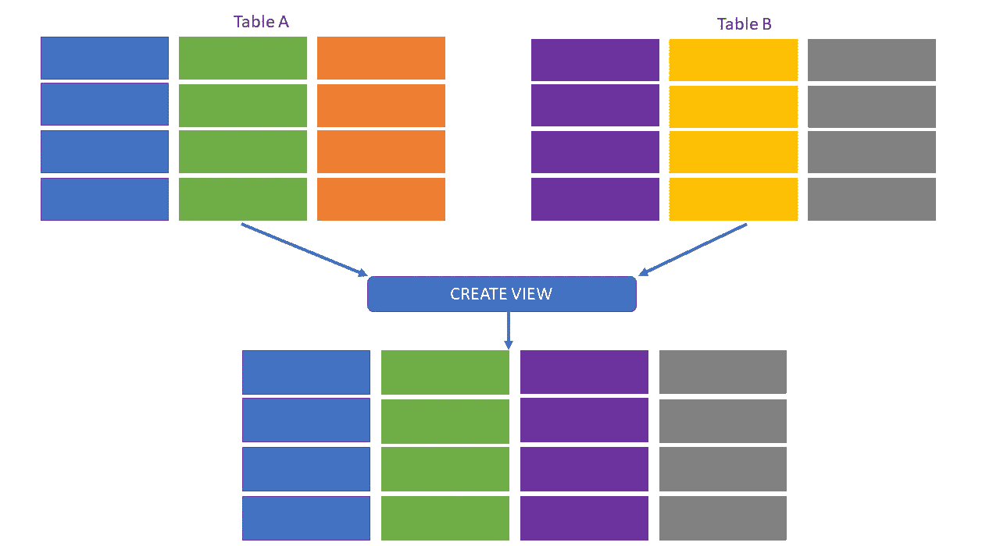
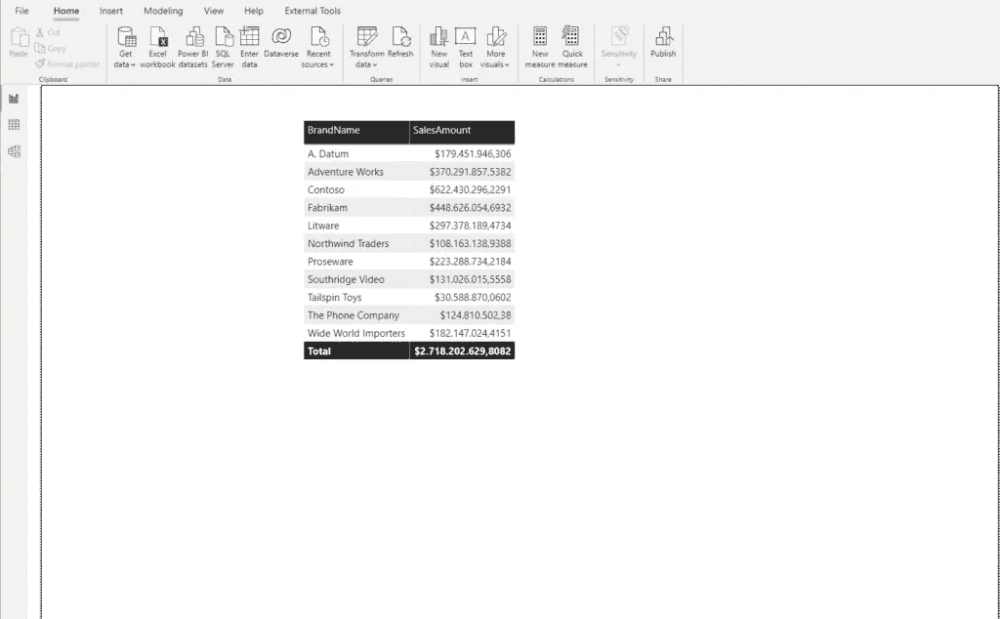
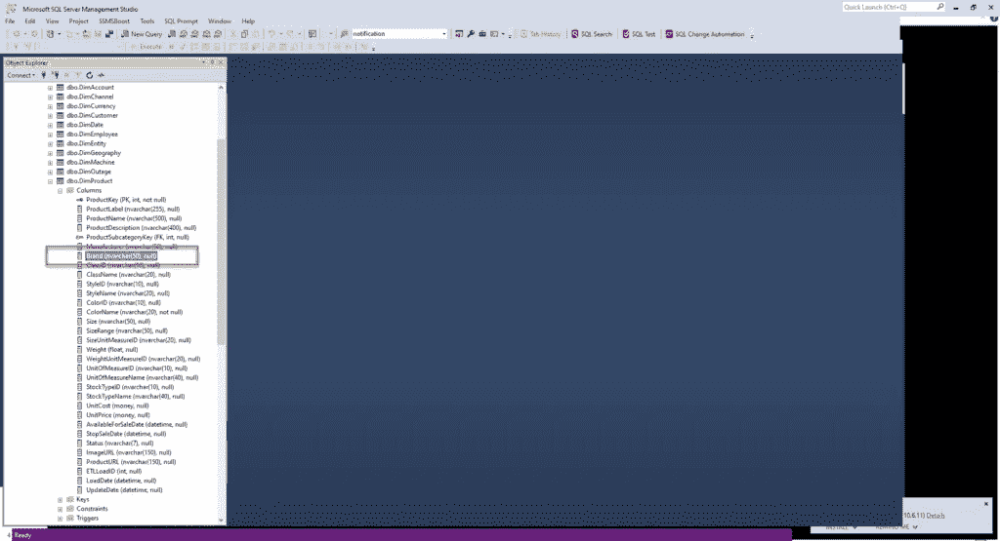
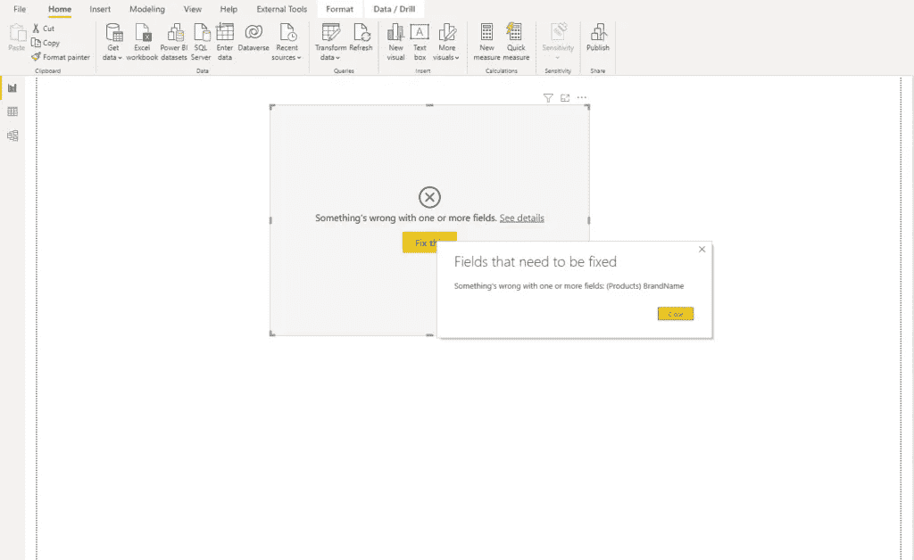
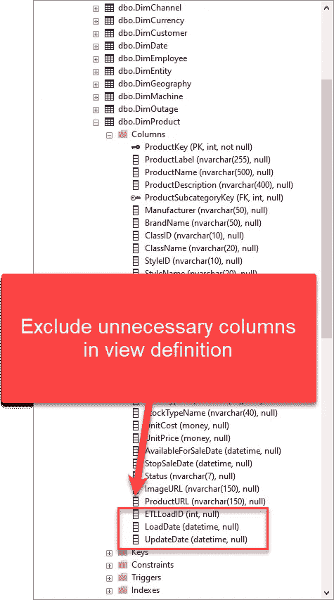
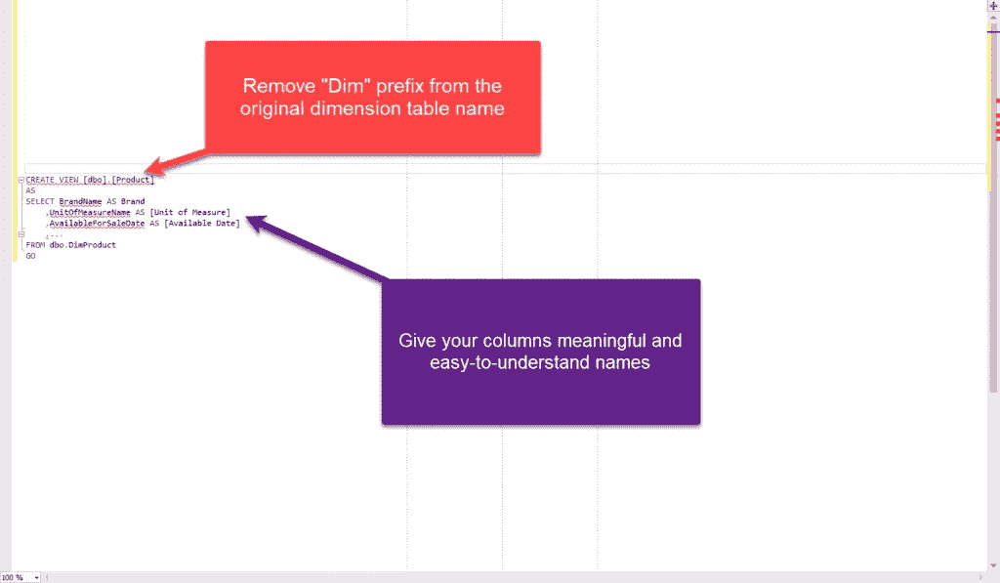

# 在 Power BI 中使用视图而不是表的 3 个理由！

> 原文：<https://towardsdatascience.com/3-reasons-to-use-views-instead-of-tables-in-power-bi-272fb9616691?source=collection_archive---------14----------------------->

## 在本文中，我们将揭开视图的神秘面纱，并解释为什么在从 SQL 数据库导入数据时，它们应该是您的首选。



作者插图

最近几个月，我经常被问到在 Power BI 中导入数据时是否应该使用表或视图。我特意将单词*标记为 importing* ，因为本文的主要目的是比较视图和表在导入模式下的用法。如果你有兴趣了解更多关于直接查询模式的信息，在哪些场景下你会(不)想使用它，请参考[这篇文章](/direct-query-in-power-bi-what-when-why-8180825812d2)。

## 首先什么是视图？

我猜你们都知道什么是桌子，我就不花时间解释了。而且，如果您来自 SQL 世界，您可能知道什么是视图:)…然而，有许多没有 SQL/数据库背景的 Power BI 内容创建者，因此他们至少应该有一个关于视图的基本介绍。

数据库视图就是对数据库中数据的存储查询。这个存储查询可以针对表和其他视图(您可以创建一个查询其他视图的视图)。这个存储的查询(视图定义)代表数据库的一部分，但是 ***它不存储任何物理数据*** ！这是与“常规”表的第一个重要区别——视图不存储数据，这意味着每当您需要来自视图的数据时，底层存储查询将针对数据库执行。因为视图在您每次“调用”它们时都在运行，所以它们总是会从底层表中选取相关的数据。这意味着您不需要担心底层表中是否发生了变化(删除/更新的行)，因为您总是可以从表中获得实际的数据。

## 使用视图的优势

在某些情况下，与常规表相比，视图可以提供多种优势:

*   视图可以包含(并且通常包含)多个表之间的连接，产生一个结果集，从而降低复杂性
*   视图可能只包含数据的子集(例如，您可以创建一个只包含销售额大于 X 的视图；包含当前未结采购的视图；查看仅包括在 X 年注册的客户，等等。)
*   您可以使用视图为您的分析工作负载预聚合数据，使用聚合函数，如 SUM、AVG、COUNT 等
*   视图可用于控制对基础数据的访问:例如，您可以创建一个只包含美国地区销售额的视图，然后授予相关用户对该视图的访问权限。这样，您就不会暴露表中的所有数据，因为您可以限制对表的访问，而只授予对视图的访问
*   视图不消耗数据库中的空间(除了存储查询定义的少量内存)——不要忘记，视图不存储物理数据！

考虑到所有这些优点，我相信您已经可以设想视图在 Power BI 中使用时可以提供的一些好处。

然而，我也确信您可能对潜在的警告有所顾虑——即与“常规”表相比时的性能。敬请关注，我们将“揭开”在您的 Power BI 解决方案中使用视图而非表格的所有利弊…

## #1“尽可能向上游转变您的数据，必要时向下游转变”——罗氏的格言

在解释数据转换和整形的最佳实践时，我总喜欢从页眉引用这句话，这就是著名的“[罗氏格言](https://ssbipolar.com/2021/05/31/roches-maxim/)”(罗氏是微软 Power BI 团队的马修·罗氏)。

坚持这个想法，如果您有机会在源端(在数据库本身内)应用您的数据转换，您一定要这样做！使用视图封装复杂的逻辑，执行计算(不要忘记 Power BI 中的[计算列没有经过优化压缩](/how-to-reduce-your-power-bi-model-size-by-90-76d7c4377f2d)，或者过滤掉数据的特定部分。


[蒂姆·福斯特在 Unsplash 上拍摄的照片](https://unsplash.com/photos/osDUe-m4ZcY)

我听到了，我听到了…你没有访问底层数据库的权限。嗯，这显然是一个潜在的障碍，但是我相信您应该与您的 IT/DBA 同事保持良好的关系，尽管是在访问权限方面:)…所以，与他们交谈，解释使用视图的好处，我相信他们会很乐意帮助创建和公开视图，而不是原始表。

嘿，我听到另一个问题:“如果我们使用视图而不是表，我们就放弃了[查询折叠](/what-is-a-query-folding-in-power-bi-and-why-should-i-care-5b89f42f38d7)的能力，对吗？”睡吧…错了！视图和表格一样，都是可折叠的对象！因此，即使您需要应用一些额外的步骤来形成来自视图的数据，您仍然应该实现查询折叠(当然，假设您将[可折叠转换](/query-folding-in-power-bi-tricks-lies-ultimate-performance-test-879cafcf6cf8)应用到您的视图)。

## #2 基础表中的更改

这是一个场景:您正在从报表的数据库表中导入数据。类似于 DimProduct 表的东西，它可能是所有报表不可或缺的一部分。而且，很有可能您已经在每个报表中导入了该表—让我们假设您已经创建了 50 个从 DimProduct 表中检索数据的报表。



作者图片

在上图中，您可以看到一个显示每个品牌总销售额的基本示例。现在，让我们假设在底层数据库中有一个结构变化—例如，BrandName 列已被重命名为 Brand:



作者图片

如果我去刷新我的电源 BI 报告，让我们看看会发生什么…



作者图片

咩咩！我的报告坏了！现在，想象一下修复 50 个报告来处理这种结构变化需要多少努力。好的，如果您使用一个视图而不是一个表，报告也将被破坏，但是“小”的区别是您只需要更新视图定义，所有依赖的报告将再次工作！

因此，您可以在一个集中的位置解决问题，而不是调整 50 个报告！

与表相比，使用视图的一个巨大优势是 Power BI 报告和物理数据库模型之间的依赖性变弱，因此更容易维护。

## #3 视为该表的 1:1 复制

好了，当您需要遵循最佳实践并在源端执行计算时，或者当您想要避免对一个表的更改影响多个报表的情况时，很容易理解为什么您应该使用视图而不是表。

但是，一个合理的问题可能是: ***如果我不执行任何转换/计算(只希望我的数据保持原样)，并且我确信表中不会发生结构性变化(尽管您应该重新考虑这个立场)，我应该使用表作为数据源，对吗？*** 嗯，不对！

在一个表上使用 view 有很多好处，即使您在这个过程中没有执行任何转换！

***免责声明:*** 不要创建视图编写:SELECT * FROM table…这根本不是一个好的做法，但是解释为什么，超出了本文的范围！相反，总是显式定义将成为视图一部分的列。

*   您可以(也应该)在视图定义中排除所有不必要的表列。这样，您不仅减少了传输到 Power BI 的数据量，还减少了在 Power Query Editor 中应用额外步骤来删除不必要数据的工作量。回到前面的例子，我可以很容易地从 DimProduct 表中删除 ETLLoadID、LoadDate 或 UpdateDate 等列，因为它们在报告解决方案中完全没有用



作者图片

```
CREATE VIEW [dbo].[Product]
AS
SELECT ProductKey
    ,ProductLabel
    ,ProductName
    ....
FROM dbo.DimProduct
GO
```

*   使用视图而不是表格，可以确保所有报告之间的一致性。例如，假设您希望您的所有报告显示值“Brand”而不是“BrandName”，您可以在视图定义中为该列定义别名，从而避免在每个报告的超级查询编辑器中为该列重命名的额外步骤！

```
CREATE VIEW [dbo].[Product]
AS
SELECT ProductKey
    ,ProductLabel
    ,ProductName
    ,BrandName AS Brand
    ....
FROM dbo.DimProduct
GO
```

如果从表中导入数据，一个报表创建者可以将“BrandName”重命名为“Brand”，另一个将它称为“Product”，第三个将它标记为“Product Name”，以此类推……我想您明白了！通过标准化视图定义中的列名，您可以确保所有报告都具有一致的命名

*   您可以轻松地应用对象的用户友好命名的最佳实践。您可以(也应该)实现用户友好的名称，方法是从维度表中删除“Dim”前缀，并为列指定有意义且易于阅读的名称，而不是公开用户值，如“DimProduct”、“DimDate”等，或者像“UnitOfMeasureName”、“AvailableForSaleDate”等列。类似于:



作者图片

因此，尽管这看起来好像我没有转换我的数据，但事实上，我正在这样做！我正在塑造它，并准备让它更方便、更一致地使用 Power BI。

## 物化/索引视图

我有意把这个留到最后，因为索引/物化视图(名称取决于关系数据库管理系统)代表了两个世界的最佳状态！它们保存视图的逻辑(连接、转换、计算)，但是它们保持结果集的持久性。简单地说，它们物理地存储执行查询产生的数据。这意味着您将获得性能优势(您也可以在这种类型的视图上创建索引)，但是代价是物化视图会消耗数据库中的空间。

决定使用物化视图还是常规视图并不简单，取决于各种因素。在任何情况下，都需要与您的 DBA/IT 部门仔细评估和讨论。

## 结论

当使用关系数据库作为 Power BI 解决方案的数据源时，大多数报表创建者会选择一种更简单的方法——直接从表中导入数据，甚至不用考虑或意识到数据库视图！因此，在本文中，我们揭开了视图的神秘面纱，并解释了为什么在从 SQL 数据库导入数据时，它们应该是您的首选。

感谢阅读！

成为会员，阅读 Medium 上的每一个故事！