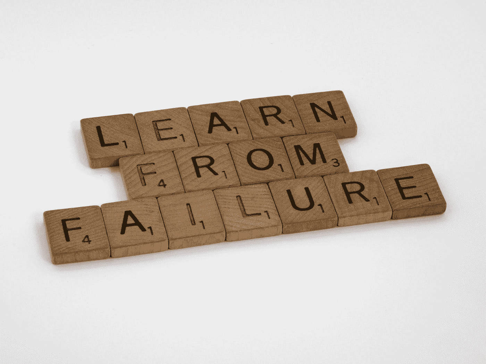

# 失败是你最好朋友的三个理由

> 原文：<https://towardsdatascience.com/3-reasons-why-failure-is-your-best-friend-281a9e54bcfa?source=collection_archive---------23----------------------->

## 当我们在学习的时候，我们在成长



布雷特·乔丹在 [Unsplash](https://unsplash.com?utm_source=medium&utm_medium=referral) 上的照片

在成长过程中，我认为失败是一件坏事。我在一个班表现很差——这是一次失败。我在一项活动或一个项目中表现不佳——这是我的错误和我的过错。直到我长大了，我才意识到失败并不总是坏事，错误可以成为发现经验教训的工具。回顾这些事例，那次失败教会了我什么？我该如何接受失败并改进，以便下次做得更好？我可以做哪些改变？在软件和数据科学中，失败有多种形式。有时失败是错过了最后期限。其他时候，失败是解决一个你自己无法解决的错误。

## 代码评审——每个人都有学习的机会

开发人员可能感到失败或犯了错误的一个常见领域是代码审查。让另一个软件工程师、数据科学家或一般的开发人员查看您的代码可能会很伤脑筋。在过去的工作中，我有一个初级开发人员在代码评审后找到我，说他在参与其他人的代码评审中感觉轻松多了。看到高级团队成员的代码因小错误、最佳实践和一般代码改进而受到批评，令人大开眼界。他再也不用担心他的代码没有堆叠起来，因为他不是唯一一个得到这种评论的人。他还能够参与这些评审，向这些高级成员提供反馈。以下是我在代码评审中获得反馈时喜欢考虑的一些关键问题:

```
1\. Based on your feedback, what are the key takeaways? What can you learn from your coworkers?
2\. Is there a typical pattern that emerges in your code reviews that you need to look further into? For example, do you often receive feedback that the features you have engineered are too valuable for your analysis or overly complex? If so, how can you learn and grow from this? 
3\. Did anyone mention resources that would be good to look into? If not, could you ask them for recommendations or look into documentation that may be available based on the changes they recommended?
```

## Bug 修复—需要帮助吗？自讨苦吃！

有时候失败是一种感觉。一种感觉，认为自己不够好或能力不足以让事情运转起来。有多少次你发现了一个 bug，花了几个小时调试你的代码，但还是找不到修复方法？但是当你让另一个人看你的代码时，他们可以在几秒钟内发现它！这种感觉可能会令人沮丧，但它可以带来许多经验教训。

第一课是，知道何时寻求帮助。我花了一段时间才意识到这一点，但从那时起它就变得非常有价值。如果你被困在一个问题上，试图修复一个错误，用尽了你所有的资源，寻求帮助。就像前面提到的，帮助可以来自任何人，不仅仅是你的上级。甚至你的下级也可以看待一个问题并提供他们的见解。所以在我寻求帮助之前，我会问自己以下问题:

```
4\. Did you read all the team documentation and find an answer there? 
5\. If you couldn't find your answer there, did you read the documentation available for the tool, code, algorithm, or other that is publicly available? Does this documentation make sense, and could it help you solve your problem? 
6\. Are there any other resources, such as Stack Overflow, a Google search, a Medium article, or other open community forums that you can leverage that may give you insight into your issue? 
```

如果你已经用尽了所有的选择，并且试图解决你的问题花费了太长的时间，寻求帮助。不要浪费太多时间试图自己修复。这是一个向你的同事学习并找出如何解决同样问题的绝佳机会。

## 错过了你的截止日期——为什么？

在我最近工作过的团队中，最短的期限是两周或更短的冲刺周期，最长的期限是你的团队、部门和组织的全年目标和期望。尽管我们在做项目时尽了一切努力来计划和赶上最后期限，但我们有时会错过或达不到目标。因此，与其把这当成一次失败，不如花点时间反思一下为什么错过了截止日期。发生这种情况时，我会考虑以下几个关键问题:

```
7\. Was the original deadline and work estimation accurately representing what was required for this project? 
8\. Were there major hurdles or blockers that caused the project to be delayed? Did you make this clear to your team, and if not, why not? 
9\. What could you or your team have done differently to keep the project on track? 
10\. Was the work deprioritized in favor of other work? If so, were the roadmap and deadlines updated to reflect such? 
11\. What areas of improvement are essential to note before taking on a similar project? What best practices or process improvements could you implement next time?
```

## 最后的想法

也许并不总是这样，但失败是你最好的朋友。失败让你重新评估形势，并从中吸取教训。当我们在学习的时候，我们在成长。一些关注学习而不是失败的好领域包括代码审查、bug 修复和面临最后期限。

**你经常在哪些领域看到失败，你如何从中吸取教训？**

感谢阅读！我希望你喜欢阅读我所学到的东西。[如果你愿意，你可以通过这个链接成为一名灵媒来支持我的写作。](https://rjday.medium.com/membership)