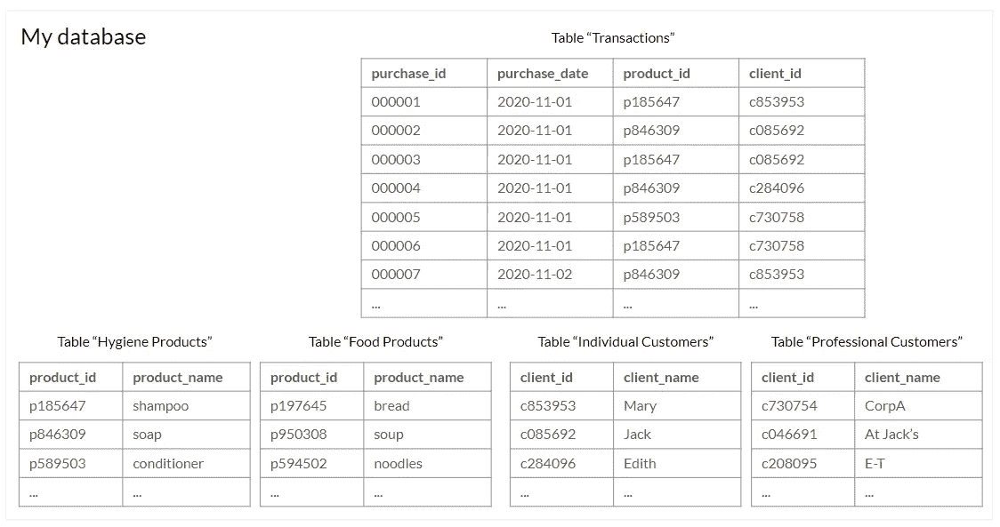
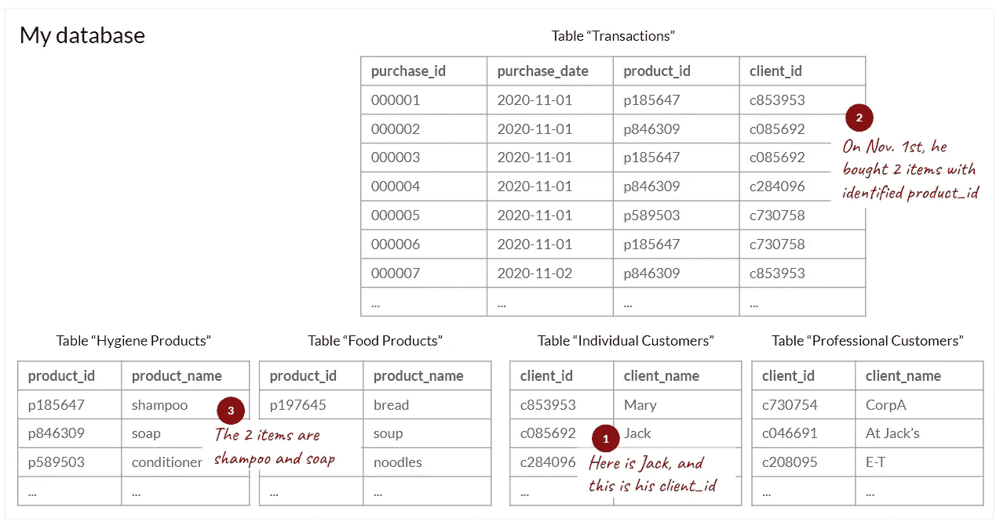
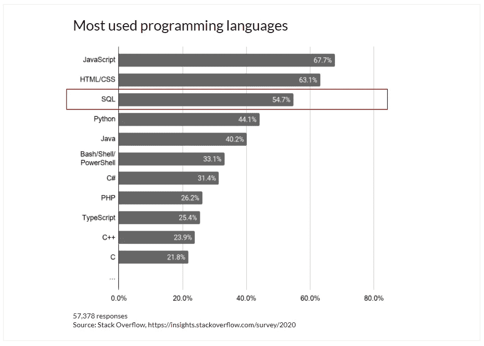

# 即使你不是技术团队的一员，你也应该学习 SQL 的 3 个理由

> 原文：<https://towardsdatascience.com/3-reasons-why-you-should-learn-sql-even-if-you-are-not-part-of-a-tech-team-232be317b9d7?source=collection_archive---------22----------------------->

约翰·施诺布里奇在 [Unsplash](https://unsplash.com/?utm_source=unsplash&utm_medium=referral&utm_content=creditCopyText) 上的照片

作为一名数据分析师，我整天都在写 SQL 查询。我的任务之一是**在我公司的数据库和需要获得现成数据的同事**之间充当 **翻译。提取的数据适合他们的需求，然后他们能够进行自己的分析，并得出面向业务的结论。与对数据库管理知之甚少甚至一无所知的同事一起工作时，我发现他们通常会受益于 SQL 的基本知识——或者在工作中获得这些知识。**

如果你处于类似的位置，即与处理公司数据库的数据分析师或技术团队互动，或者如果你认识这样的人，欢迎你！如果您想更多地了解什么是 SQL 以及为什么它在数据处理方面如此重要，那么这篇文章就是为您而写的。

# 简介:SQ-什么？

SQL 代表**结构化查询语言**。它是一种编程语言，用于管理存储在关系数据库管理系统(RDBMS)中的数据。在本文中，我将重点关注**查询**，这是 SQL 中最常见的操作。他们的角色是翻译指令，如“您能给我看一下昨天与这位客户的交易吗？”从(可能非常大的)数据库中提取。

这里有一个例子。假设我公司的数据库由 5 个表组成:

*   “交易”记录了我的公司每天进行的所有交易
*   “卫生产品”和“食品”列出了我们销售的产品
*   “个人客户”和“专业客户”是客户注册

来回答问题*“2020 年 11 月杰克买了什么？”我需要通过组合这五个表格来找到所需的信息。*

玛丽·勒费夫尔

> 那么，为什么要学习 SQL 呢？

# 1.在数据分析方面变得更加自主

虽然使用 Microsoft Excel 或 Google Sheets 对于有限大小的数据来说已经足够了，但是您可能已经遇到过由于处理的数据量过大而导致电子表格软件死机的情况。事实上，SQL 的第一个优势是，它可以从数据库中提取和处理大量数据，而不必通过逐个打开每个 Excel 表来浏览数据库。很实用，不是吗？

回到前面的例子，你有两个选择来回答这个问题:

1.  转到每个表，查看可用的字段。为了明确地找到 Jack 和他购买的商品，您可以从这些表中筛选摘录，以找到 Jack 对应的 client_id，以及他购买的商品对应的产品。
2.  编写一个 SQL 查询(或者使用您最喜欢的数据分析师编写的模板)将所有五个表直接链接在一起。然后在 WHERE 子句中指定搜索条件。

这里的 SQL 查询如下所示:

# 2.更好地组织你的思想

即使你自己不打算成为一名数据分析师，学习 SQL 也是一个很好的练习，可以**更好地理解你公司的数据是如何构成的**，以及通过组合各种数据源你可以实现什么。SQL 有一个相当简单的结构(至少与其他编程语言相比)，但它可以执行复杂的查询。通过自己编写查询，您将能够检索更多的信息，最重要的是，这些信息将以一种您可以立即用来回答您的问题的方式进行组织。

在你与数据分析师或技术团队的互动中，更好地理解数据库的架构和 SQL 查询背后的逻辑将使你**节省宝贵的时间**。当表达对数据提取的特定需求时，如果您已经知道您需要什么类型的数据，您将会赢得时间。

以我之前的例子为例，有两种方法可以让你的同事检索你分析所需的数据:

1.  “我需要关于某个杰克的信息，他在 2020 年 11 月购买了一些产品:您能把他所有的购买清单发给我吗？”
2.  “我需要关于个人客户 Jack 的信息，他在 2020 年 11 月购买了卫生用品:您能给我他的购买清单吗？”

你可以想象第二个选项可能会帮助你的同事更快找到答案。为了说明我的例子，这是你得到这个答案的思维过程:

玛丽·勒费夫尔

# 3.发展新的专业技能

根据[Stack Overflow](https://insights.stackoverflow.com/survey/2020#most-popular-technologies)2020 年的一项调查， **SQL 位列第三大最常用编程语言**。也就是说，SQL 已经被广泛传播，而且很可能会继续传播，因为它是用于数据库管理的头号语言。不管你的公司使用什么样的数据库技术(MySQL、PostgreSQL、Microsoft SQL Server……)，它们都使用 SQL 或这种语言的衍生物。

正如 [Dataquest](https://www.dataquest.io/blog/why-sql-is-the-most-important-language-to-learn/) 解释的那样，根据 2021 年 1 月在 Indeed job portal 上进行的一项分析，SQL 是数据工作中**最受欢迎的技能。即使你不打算将职业重点转向全职数据角色，更好地了解这些工作背后的东西也只会有好处，而且它为数据世界或周围的未来机会打开了一扇门。**

玛丽·勒费夫尔

# 结论:开始吧！

为了结束这篇文章，我想补充最后一个论点(和一些好消息):**学习 SQL 是免费的**。

其中，MySQL 是一个开源的 RDBMS(见简介)，你可以免费下载和安装。然后，您可以开始参加在线课程，或者请您的数据分析师同事就该主题为您提供一个快速入门课程！学习 SQL 有大量免费的在线资源:

*   在线课程(例如在 [Coursera](https://www.coursera.org/) 或 Udemy 上)
*   从[到数据科学](https://towardsdatascience.com/tagged/sql)的文章
*   博客
*   等等。

现在全靠你了。快乐学习！

你喜欢读这篇文章吗？ [*成为会员*](https://marie-lefevre.medium.com/membership) *加入一个不断成长的充满好奇心的社区吧！*

<https://marie-lefevre.medium.com/membership> 