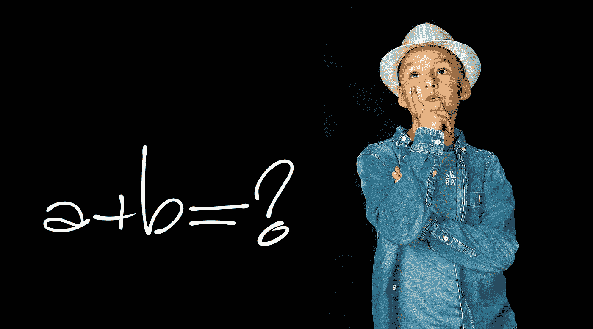

# 你不应该为你的机器学习之旅担心数学的 3 个理由

> 原文：<https://towardsdatascience.com/3-reasons-why-you-shouldnt-worry-about-math-for-your-machine-learning-journey-e06dff6528d1?source=collection_archive---------48----------------------->

## 以及如何取得成功

图片由[标记 _ 摄影](https://pixabay.com/users/marker_photography-4171480/)来自【Pixabal.com 的

# 这一切都始于我个人的奋斗

到说实话，从我开始机器学习之旅的第一天起，对数学不够好的恐惧就一直困扰着我。当我在做神经网络的反向传播时试图应用链式法则时，它第一次打动了我。在任务截止日期前，我花了好几天时间才最终弄明白如何计算梯度。伙计，那感觉很难！我几乎还能尝到嘴里的苦涩和艰辛。我不知道，这可能是最简单的部分。当我第一次尝试阅读机器学习论文时，真正的噩梦开始了…🤮

如果你能理解我的经历，那你就去过那里。我今天想告诉你的是:不需要那样，你可以有一个完全不同的角度来接近你的机器学习之旅，而不用太担心数学。让我解释一下。

# 应用深度学习所需的数学非常有限

在机器学习中，太多人患有冒名顶替综合症，无法弄清模型背后的数学真相。这是可以理解的，当我们知道我们在控制时，我们对自己感到安全和自信。但是不能完全理解数学是一个严酷的提醒，提醒我们还不够。

这在 90%的情况下可能是不必要的，尤其是对于深度学习。还记得我上面提到的反向传播链规则地狱吗？它追逐了我太久，直到有一天，当我在学习 PyTorch 时，我发现了一个叫做' [auto-grad](https://pytorch.org/tutorials/beginner/blitz/autograd_tutorial.html) '的东西它让我大吃一惊。这基本上意味着无论你想出什么损失函数，框架都会跟踪它，并自动为你计算梯度。什么？！那为什么我需要手工计算所有的反向链规则呢？

由 [Kelly Sikkema](https://unsplash.com/@kellysikkema?utm_source=medium&utm_medium=referral) 在 [Unsplash](https://unsplash.com?utm_source=medium&utm_medium=referral) 上拍摄的照片

而且即使你必须手工完成这些，深度学习所需的基本数学是矩阵乘法和导数微积分。一旦你掌握了这两点(这绝对不难)，你在面对大部分挑战时应该会感到自信。其余的更多的是试验什么可行，什么不可行——比如 AutoML 和网格搜索。

# 🧗Two 语言，山的两边，同一个 Peak🧗‍♀️

照片由来自 [Pixabay](https://pixabay.com/photos/adventure-climb-grass-high-hike-1850205/) 的 [Pexels](https://pixabay.com/users/pexels-2286921/) 拍摄

答关于机器学习的另一件事是，它要求你会两种语言:**编程语言**如 Python、R 和**数学**。有时候，要解决一个挑战，你需要综合的力量，掌握一个肯定会帮助另一个。因此，如果你不是“数学头脑”，所有的希望都不会失去，因为你仍然可以尝试用代码来做它，它一点也不含糊，而且非常“可修补”。不像数学，你总是可以做更多的实验并得到反馈。

在编码领域，当教授递归算法时，最大的障碍是要'**信任**'简单的递归代码，它们实际上可以解决看似困难的问题。这叫做‘信念的递归跳跃’<https://baeddavid.medium.com/taking-the-first-recursive-leap-of-faith-ea5cd9582d94>**。第一次递归学习通常很难克服不舒服的感觉，即仍然缺少解决问题的代码。这有点不自然，但你只要相信代码，相信算法，让它以优雅的方式展开问题。只有在实践之后，你才能轻松自信地使用递归解决问题。**

**我感觉深度学习也有类似的东西。大多数框架和一些语言拥有的“自动渐变”特性就是其中之一。你不需要知道如何计算你的损失函数的梯度，只需要相信框架/语言可以做到。也许它应该被称为“信念的自动毕业生飞跃”。不会用汇编写你的 Python 代码你也不会烦恼吧？所以当你不能用手做渐变的时候，为什么要小题大做呢？**

# **你不应该让自己陷入困境🚦**

****

**照片由 [schroederhund](https://pixabay.com/users/schroederhund-189068/) 从 [Pixabay](https://pixabay.com/photos/autumn-walk-autumn-fall-foliage-1792812/) 拍摄**

**另一个值得注意的点与一般的学习和教育有关。我想把它叫做“**不要卡住**”当遇到一个问题或挑战时，也许是一个数学方程式，也许是一个 bug，不要让自己陷入其中，把所有的时间都投入到解决它上。相反，后退一步，深呼吸，休息一下，[走开](https://www.quora.com/Why-do-I-always-find-a-solution-to-a-programming-problem-when-I-start-walking-away-from-the-PC)，找些方法绕过去。或者暂时忽略它，稍后再回来。你会发现，有了更多的背景，更好的休息，更清晰的观点，问题会看起来不同，解决方案通常会自己出现。所以不要纠结于数学或者其他什么，真的。退一步，看大局。🥾**

# **你应该怎么做？**

**说了这么多，我想澄清一下，我并不反对学习数学，也不是说数学对你的机器学习之旅不重要。数学无疑是大多数新的有影响力的机器学习研究进展的核心。我刚才说的是不要让对数学的痴迷或对数学的恐惧阻碍你的学习。**跟着学习，如果遇到困难就尝试代码，先获得一些直觉**。随着时间的推移，你会逐渐理解机器学习的数学部分。数学的学习是必要的，但额外的担心不是。👨‍💻**

# **结论**

**希望这些提示能帮助你的深度学习之旅，无论是学习新东西还是解决一些棘手的问题。谁知道呢，在解决了一些挑战并看到它的美丽后，你可能会爱上数学，这对你来说永远都不是问题！祝好运，学习愉快！**

**觉得这篇文章有用？在 Medium 上关注我([李立伟](https://medium.com/u/72c98619a048?source=post_page-----dbe7106145f5----------------------))，或者你可以在 Twitter [@lymenlee](https://twitter.com/lymenlee) 或我的博客网站[wayofnumbers.com](https://wayofnumbers.com/)上找到我。你也可以看看我下面最受欢迎的文章！**

**</this-is-cs50-a-pleasant-way-to-kick-off-your-data-science-education-d6075a6e761a>  </two-sides-of-the-same-coin-fast-ai-vs-deeplearning-ai-b67e9ec32133>  </what-you-need-to-know-about-netflixs-jupyter-killer-polynote-dbe7106145f5> **