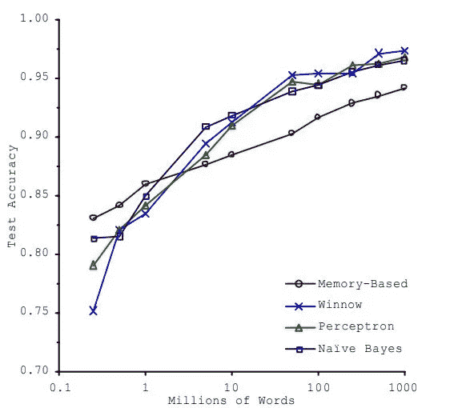

# 你的机器学习模型表现不佳的 4 个原因

> 原文：<https://towardsdatascience.com/3-reasons-why-your-machine-learning-model-is-garbage-d643e6f0661?source=collection_archive---------18----------------------->

## 建立更好的 ML 模型的图解方法

作为一名数据科学家，用数据创造影响是你获得报酬的原因，但对于新手来说，抓住创建有影响的机器学习模型的问题似乎有点太令人生畏了。将它们归类到某个总括模式中，可以帮助有效地将优化模型的零碎内容联系起来，并理解真正的瓶颈出现在哪里。分为四个想法，示意图方法应该提供一个更清晰的步骤，以获得一个有影响力的模型。

肖恩·朗斯在 [Unsplash](https://unsplash.com?utm_source=medium&utm_medium=referral) 上拍摄的照片

# 培训数据的质量

大多数 ML 工程师都熟悉这句名言，“垃圾进，垃圾出”。当您的模型所训练的数据不能很好地代表实际情况时，您的模型只能执行这么多。我说的“代表”是什么意思？它指的是训练数据群体模拟目标群体的程度；不同类别的比例，或点估计(如均值或中值)，以及训练和目标人群的可变性(如方差、标准差或四分位间距)。

一般来说，数据越大，越有可能代表您想要归纳的目标人群。但情况可能并不总是如此，尤其是在抽样方法有缺陷的情况下。例如，假设您想要对从第一标准到第十标准的整个学校的学生群体进行概化，但是 80%的训练数据包含第二标准的学生。如果学校的学生分布与第二标准中的 80%不对应，并且您想要预测的数据实际上很大程度上受不同班级中人口特征的自然差异的影响，则您的模型将偏向第二标准。

为了设计正确的数据收集技术，很好地了解目标人群的分布是至关重要的。一旦有了数据，就要研究数据(探索性数据分析阶段)，以确定其分布和代表性。

离群值、缺失值以及完全错误或虚假的数据是您可能需要考虑的一些其他因素。您应该将异常值限制在某个值吗？还是完全移除它们？价值观正常化怎么样？您是否应该包含一些缺失值的数据？还是用平均值或中值代替缺失值？数据收集方法是否支持数据的完整性？这些是在考虑模型之前必须评估的一些问题。数据清理可能是数据收集后最重要的步骤。

# 无关的特征

“垃圾进，垃圾出”这句话也适用于特性工程。一些特征对预测的权重(影响)会比其他特征大。

相关系数、方差、离差率等度量被广泛用于对每个特征的重要性进行排序。数据科学家新手常犯的一个错误是，他们使用主成分分析来减少内在不连续的维度。我的意思是，技术上你*可以*，但理想情况下，你*不应该*。这通常导致假设可变性最高的特性就是影响最大的特性，当然，这不一定是真的。人工编码的特征原本在本质上是分类的，但当编码时，通常不会像连续的特征那样高度可变，因此它们的相关性被低估了。

有时，使用其他已知要素创建新要素比将它们分开会产生更大的影响。通常，具有太多相关性低的特征会导致过度拟合，而具有太少的特征会导致拟合不足。找到特性的最佳组合需要领域的经验和知识。这可能是一个不错的模型和一个近乎完美的模型之间的区别，并且，推而广之，一个不错的 ML 工程师和一个相当好的 ML 工程师之间的区别。

# 过度拟合和欠拟合

与我们关注数据的前几个问题不同，这一个问题实际上归结为模型使用的算法，尽管通过考虑上面讨论的问题，这些影响仍然可以在一定程度上得到缓解。

过度拟合是指模型与训练数据过于接近，无法推广到目标人群。一般来说，模型越复杂，就越能更好地检测训练数据集中的细微模式。收集的数据可能不总是完全代表目标人群，因此使用更复杂的算法(如深度神经网络)而不是较简单的低阶多项式算法可能是区别所在。*但是*，对问题使用太简单的模型，模型将不能很好地学习和检测潜在的模式。当然，这被称为欠拟合。

补偿过度拟合的一种方法是施加惩罚，这取决于模型赋予特征的权重与我们在训练前设置的值之间的差异(如果我们希望模型完全忽略该特征，该值也可以为零)。这有效地允许我们在更精细的尺度上控制算法的复杂性，并帮助找到过拟合和欠拟合之间的最佳点。这就是我们所说的模型的*正则化*，惩罚是一个*超参数*。它不是模型的一部分，但是影响模型的概括能力，并且在训练之前设置。还有其他方法来找到甜蜜点，如装袋(主要用于随机森林)和助推。

但这并没有结束。在对超参数进行大量调整后，您可能会发现您的模型对测试数据集的预测准确率为 95%。但是现在你冒着过度适应*的风险，即*组测试数据和模型在部署时可能无法推广到真实世界的数据。对此的常见解决方案是从训练数据集中分割出另一组数据，并在使用不同超参数调整的第一个测试数据集上测试模型后，将其用作验证模型的另一层。三轮拟合通常会产生一个效果很好的模型，但这最终取决于你所拥有的数据的大小和质量，以及手头问题的复杂程度。

# 缺乏足够的数据

大多数 ML 模型需要 sh*t 色调的数据。除非你有一个只需要一些微调的预训练模型，否则你必须找到一种方法为你的模型提供足够的数据。即使对于像识别橙子和香蕉这样的简单任务，也应该有至少几千个示例图像供模型学习。这是管道中的一个巨大瓶颈。比任何其他因素更重要的是，由于缺乏足够的数据，今天的 ML 模型的效率及其应用的功效被大大抑制了。

这就是为什么像脸书、谷歌和苹果这样的公司如此热衷于从他们的用户那里收集尽可能多的数据(这里不讨论这种做法的道德问题)。裁剪、填充和水平翻转等数据扩充技术对于从可用数据集挤出尽可能多的训练潜力至关重要，但这些技术只能做到这么多。[这项来自微软的](https://dl.acm.org/doi/pdf/10.3115/1073012.1073017)研究说明了非常多样的 ML 模型如何表现相似，并且与训练数据的大小(字数)有非常强的正相关性。

图 1 来自，Banko，m .，& Brill，e .缩放到用于自然语言消歧的非常非常大的语料库。检索时间 2021 年 2 月 16 日。

当然，这并不适用于所有情况，但公司应该重新考虑花费数百万用于模型算法开发和收集越来越多数据之间的权衡。

最终目标是能够:

我)拥有尽可能完美地代表目标人群的数据(又名。更大的数据量和更高的数据质量)

**ii)在现实中使用实际影响预测的特征**

**iii)使用适当复杂程度的模型(又名。它能够学习的详细程度)**

**iv)微调模型，以匹配或减少问题的实际复杂性和模型复杂性之间的差距**

 [## Python 与 R 在数据科学中的对比

### 为什么你在浪费时间

towardsdatascience.com](/python-vs-r-for-data-science-cf2699dfff4b)  [## 学习数据科学的 5 个阶段

### 以及如何战胜它们

towardsdatascience.com](/5-stages-of-learning-data-science-40bca61f11b1)  [## 理解数据库管理系统的关系模型

### 以及为什么它在整个行业如此受欢迎

towardsdatascience.com](/understanding-the-relational-model-of-database-management-systems-56f17db99f56) 

> 附言:更多关于数据科学、编程以及生物学家如何在数据革命中导航的简明扼要的文章，请关注我的[博客](https://sukanta-saha.medium.com/)。
> 
> 每分钟都有成千上万的视频被上传，过滤掉它们是很重要的，这样你就只消费高质量的数据。我亲自挑选的，我会把你感兴趣的主题的教育视频发邮件给你。报名[这里](https://docs.google.com/forms/d/e/1FAIpQLScO4RtaXjJjYDdnEFyI3l73tcj59OGdY_cRnPGV-wsAEMhVwg/viewform)。
> 
> 感谢您的阅读！