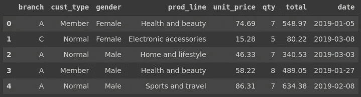
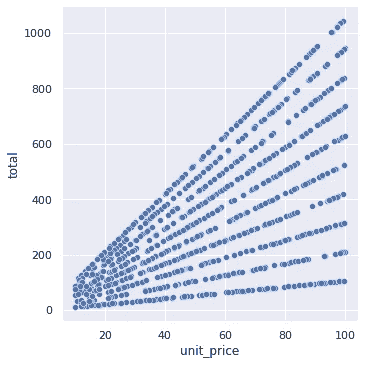
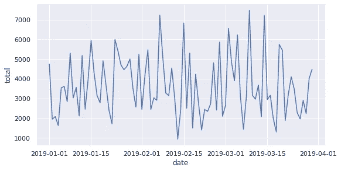
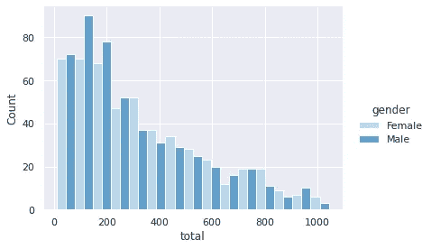
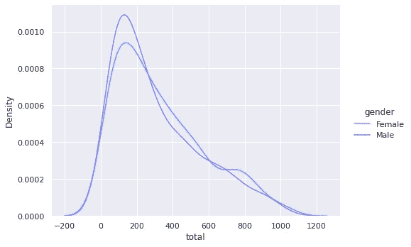
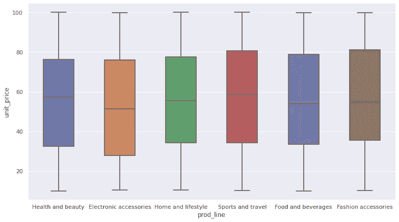
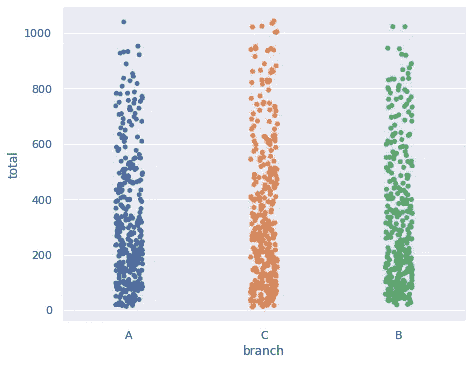
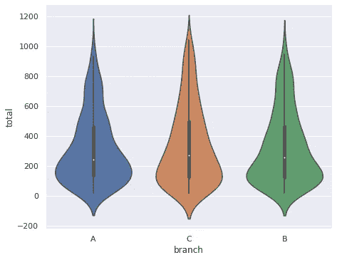

# 3 个 Seaborn 函数覆盖了(几乎)所有的可视化任务

> 原文：<https://towardsdatascience.com/3-seaborn-functions-that-cover-almost-all-your-visualization-tasks-793f76510ac3?source=collection_archive---------20----------------------->

## 综合实践指南


卢克·切瑟在 [Unsplash](https://unsplash.com/s/photos/data-visualization?utm_source=unsplash&utm_medium=referral&utm_content=creditCopyText) 上的照片

数据可视化是数据科学不可或缺的一部分。它帮助我们探索和理解数据。数据可视化也是传递信息和交付结果的重要工具。

由于其重要性，在数据科学生态系统中有许多数据可视化库和框架。其中一个流行的是 Seaborn，这是一个用于 Python 的统计数据可视化库。

我最喜欢 Seaborn 的是它巧妙的语法和易用性。它允许创建只有 3 个功能的公共图。

*   Relplot:用于创建关系图
*   分配图:用于创建分配图
*   Catplot:用于创建分类图

这 3 个功能为创建和定制不同类型的图提供了图形级界面。我们将通过几个例子来理解这些函数的用法。

这些例子将基于一个超市[数据集](https://www.kaggle.com/aungpyaeap/supermarket-sales)。以下是对它的概述。我已经在 Kaggle 上排除了它的原始版本中的一些列。我们从导入库和读取数据集开始。

```
import numpy as np
import pandas as pd
import seaborn as sns
sns.set(style='darkgrid')df = pd.read_csv("/content/supermarket.csv", parse_dates=['date'])df.head()
```



(图片由作者提供)

该数据集包含零售企业的销售数据。

## 重新绘图

relplot 函数用于创建关系图，即线形图和散点图。这些图提供了变量之间关系的概述。

让我们首先创建单价和总价列的散点图。我们指定数据帧和列名。种类参数用于选择绘图类型。

```
sns.relplot(data=df, x='unit_price', y='total', kind='scatter')
```



(图片由作者提供)

它是一串直线，因为总价等于单价乘以决定直线斜率的数量。

让我们也使用 relplot 函数创建一个线图。我们可以画出每天的总销售额。第一步是按日期对销售额进行分组，然后计算总和。

```
df_sub = df[['total','date']].groupby('date').sum().reset_index()df_sub.head()
```


(图片由作者提供)

我们现在可以创建线图。

```
sns.relplot(data=df_sub, x='date', y='total', kind='line',
            height=4, aspect=2)
```



(图片由作者提供)

我们使用高度和纵横比参数来调整绘图的大小。aspect 参数设置宽高比。

## 显示

displot 函数创建分布图，这些分布图为我们提供了数字变量分布的概况。我们可以用 displot 函数创建直方图、kde 图、ecdf 图和 rug 图。

直方图将数值变量的值域划分为离散的区间，并计算每个区间中数据点(即行)的数量。让我们创建一个总销售额的直方图。

```
sns.displot(data=df, x='total', hue='gender', kind='hist',
            multiple='dodge', palette='Blues', height=4, aspect=1.4)
```



(图片由作者提供)

hue 参数根据给定列中的不同值来分隔行。我们已经将性别列传递给了色调参数，因此我们可以分别看到女性和男性的分布。

multiple 参数决定不同类别的条形如何显示(“减淡”表示并排)。使用色调变量时，调色板参数用于选择调色板。

这些函数的一个优点是参数基本相同。例如，它们都使用色调、高度和外观参数。这使得学习语法更容易。

kde 图创建了给定变量(即列)的核密度估计，因此我们得到了概率分布的估计。我们可以通过将 kind 参数设置为“kde”来创建 kde 图。

```
sns.displot(data=df, x='total', hue='gender', kind='kde',
            palette='cool', height=5, aspect=1.4)
```



(图片由作者提供)

## 猫图

catplot 函数用于创建分类图，如箱形图、条形图、条形图、小提琴图等。使用 catplot 函数总共可以生成 8 个不同的分类图。

箱线图显示了变量在中位数和四分位数方面的分布。这是每个产品线的单价列的方框图。

```
sns.catplot(data=df, x='prod_line', y='unit_price', kind='box',
            height=6, aspect=1.8, width=0.5)
```



(图片由作者提供)

宽度参数调整框的宽度。

以下是箱线图的结构:


箱线图的结构([图像源](https://en.wikipedia.org/wiki/Box_plot))

Median 是对所有点进行排序时位于中间的点。Q1(第一或下四分位数)是下半部分的中位数，Q3(第三或上四分位数)是上半部分的中位数。

我们还可以创建一个带状图来检查不同产品线的单价。带状图不使用方框，而是用点来表示每个数据点。因此，它就像一个数字和分类变量的散点图。

让我们为分支和总计列创建一个带状图。

```
sns.catplot(data=df, x='branch', y='total', kind='strip',
            height=5, aspect=1.3)
```



(图片由作者提供)

点的密度让我们对分布有一个大致的概念。看起来分支 C 在顶部区域有更多的数据点。我们可以通过检查每个分支的平均总额来证实我们的直觉。

```
df[['branch','total']].groupby('branch').mean() total     
branch
--------------------                              
  A       312.354029                 
  B       319.872711                 
  C       337.099726
```

C 的平均值高于其他两个分支的平均值。

catplot 函数下的另一种绘图类型是小提琴绘图。这是 plto 和 kde 图的结合。因此，它提供了一个变量分布的概况。

例如，我们可以创建一个 violin 图，该图包含上一个示例中用于带状图的列。我们需要做的就是改变 kind 参数。

```
sns.catplot(data=df, x='branch', y='total', kind='violin',
            height=5, aspect=1.3)
```



(图片由作者提供)

C 支的小提琴比上面的另外两把粗一点。

## 结论

relplot、displot 和 catplot 函数可用于生成 14 个不同的图，这些图几乎涵盖了我们通常在数据分析和探索中使用的所有可视化类型。

这些函数提供了一个标准的语法，使得理解它们变得非常容易。在大多数情况下，我们只需要改变 kind 参数的值。此外，定制图的参数也是相同的。

有些情况下，我们需要使用不同类型的地块。但是，我们需要的大部分都在这三个函数的范围内。

感谢您的阅读。如果您有任何反馈，请告诉我。