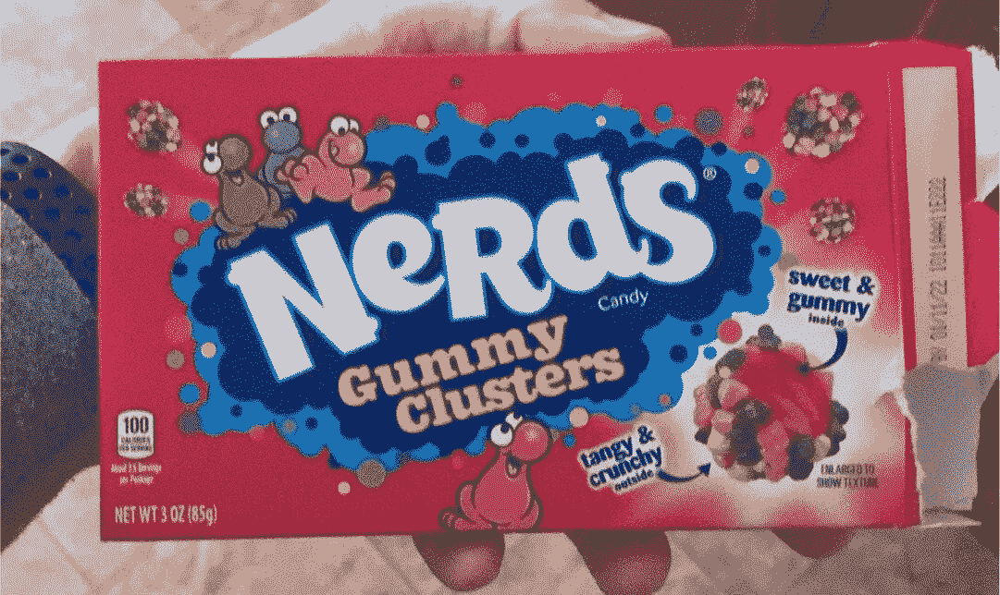

# 你的人工智能项目注定要失败的 3 个迹象

> 原文：<https://towardsdatascience.com/3-signs-that-your-ai-project-is-doomed-9e3ab82d9425?source=collection_archive---------5----------------------->

## 你知道机器学习的开始并不顺利，当…

改编自[维基百科](https://en.wikipedia.org/wiki/Facepalm#/media/File:Paris_Tuileries_Garden_Facepalm_statue.jpg)。

> “在你做过的机器学习战略咨询中，与哪种产品团队合作最具挑战性？”

在咨询了数百个[机器学习](http://bit.ly/quaesita_simplest)项目后，我学会了关注客户有搬起石头砸自己脚危险的早期预警信号。以下是我最喜欢的三个:

1.  **他们是抱有不切实际期望的营销受害者**
    **特例:愿意不惜一切代价推出
    *特例:无数据(及其他基本要求)*
2.  **缺乏对技能多样性的尊重**
    **特例:有毒势利*
3.  **团队不知道谁是负责人**
    **特例:尖头发老板*

详情如下。(如果你觉得我写的东西有用，最完美的感谢是转发。)

# 不切实际期望的头号营销受害者

有很多关于人工智能的炒作和胡说八道，所以当团队从最新的电视节目中直接来找我时(*)“…但是如果你现在打电话，我们会提供 50 个免费的深度神经网络，你可以组成一个邪恶的组合！”我知道我必须打消各种不切实际的期望。*

> 科幻小说是一个糟糕的老师…但却是销售高手。

如果你认为 [ML/AI](http://bit.ly/quaesita_simplest) 很神奇，你做出的项目决策就有不系安全带等同于超速行驶的危险。所有人深呼吸！

ML/AI 更多的是给你的团队一个[编程](http://bit.ly/quaesita_sbucks)的替代方法，这适合[的一部分(不是全部！)任务](http://bit.ly/quaesita_realitycheck)比传统方法好得多。这既无聊又非常有用…这正是我喜欢它的原因。一个冷静的团队，呃，我的意思是，由价值而不是炫目所驱动的团队更有可能在人工智能领域取得成功。

## 特例:愿意不惜一切代价发射

有时候，团队并不关心用 ML/AI 解决[真实的业务问题](http://bit.ly/quaesita_island)。相反，他们是为了视觉:他们希望能够谈论他们的“人工智能业务”他们没有任何标准，也不在乎是否可行。他们只是想推出一些热门的 AI。

图片:[来源](https://pixabay.com/photos/rocket-toy-playmobil-the-ship-630461/)。

问题是，他们对自己的目标不诚实。如果他们是，我会帮他们找一个简单的玩具应用，不碰任何太重要的东西，垃圾的话也不会伤害任何人。本质上是成人学生的家庭作业。我甚至会提出一些想法，告诉你如何挑选一个听起来令人印象深刻但又无害的。每个人都会是赢家。

> 本质上是成人学生的家庭作业。

唉，以我的经验来看，这样的团队很少承认，直到为时已晚。有时候他们自己都不承认。相反，他们选择了一个任务关键型(令人印象深刻)的应用程序，但故意忽略了任何关于确保他们的系统高性能和[可靠的谈论。(*“哎呀，让它正常工作太繁琐了。我就*](http://bit.ly/quaesita_aiparadox) [*在事后*](http://bit.ly/quaesita_dmguide)**[*设置性能栏吧。”*)](http://bit.ly/quaesita_default)**

*如果团队诚实地(至少对自己)说出他们对于 ML/AI 项目的[真正目标](http://bit.ly/quaesita_dmguide)，并围绕这些目标构建他们的策略，一切都会变得更好。稍后添加营销亮点。*

## *特殊情况:无数据(和其他基本要求)*

*既然机器学习是神奇的，每个人都在做，你也可以！即使你没有数据！对吗？不对。*

*你的项目需要满足一堆条件，你才能认真考虑 ML/AI。仔细检查这份包含 22 个项目的清单，看看你的项目是否没有成功的可能。把它想象成你的免费人工智能战略顾问盒。*

* [## 你的人工智能项目没戏吗？

### 这里有一个现实清单，可以帮助你避免痛苦的学习

bit.ly](http://bit.ly/quaesita_realitycheck) 

# #2 不尊重技能多样性

项目头疼的另一个迹象是缺乏对技能多样性的尊重。事实上，让我告诉你我最不喜欢的问题。而是:“你会如何描述理想的人工智能人？”

> 不要陷入过度关注在过程中间发挥作用的角色的陷阱。

我非常不喜欢这个问题，因为它假设应用人工智能是一个单人牛仔的游戏，而实际上它是一项团队运动。没有一个员工具备成功所需的所有技能。创建人工智能解决方案需要一个村庄(特别是如果我们谈论的是大规模的任务关键型解决方案)，如果你的团队缺少任何所需的技能，整个事情都会崩溃。如果你没有能力与跨学科团队合作，你会在应用人工智能方面遇到问题……因为这是完成工作所需要的。

> 如果你一直试图雇佣一个人做所有的事情，难怪你会抱怨人才短缺！

我发现，要给那些认为像他们一样的工人是最好的、最聪明的(其他人都是白痴)的人提建议，需要花费我更多的耐心和精力。我遇到过人工智能研究人员，他们似乎认为，我所说的技能多样的工人是指从不同顾问那里获得计算机科学/人工智能博士学位的人。我遇到过完全由工程师组成的团队，他们不知道为什么如果用户体验设计部分由一个 [UX 的专业人士](http://bit.ly/quaesita_ux)处理会更好。(你以为会编码就懂设计？这是什么年代，90 年代？)

迷因:[来源](https://giphy.com/explore/its-the-90s-go-for-it)。

一定要赞美你的专家的技能多样性，并确保团队中的每个人至少对团队中其他人的工作有所了解。在这里了解更多关于典型 AI 项目的角色:[ [1](http://bit.ly/quaesita_roles) ，[ [2](http://bit.ly/quaesita_universe) ，[ [3](http://bit.ly/quaesita_12steps) ，[ [4](http://bit.ly/quaesita_dmguide) 。

## 特例:有毒势利

人工智能行业充斥着一种特殊的坏苹果，这种恶霸将人工智能工作者分成两类:*合法的*喜欢自己的人工智能参与者和几乎不必要的附属品。是的，我在看着你们，AI 研究人员和工程师。你们中的许多人都是可爱的人，他们渴望接受背景不同于自己的同事的不同贡献(如果你花时间指导他们，让他们跟上他们正在努力解决的问题，这是加分的)，但你们中的一些人坐在那里抱怨说，没有博士学位的人应该离开你的人工智能草坪。

请停下来。

一个更好的策略是拥抱技能多样性，教会每个人欣赏不同的[角色](http://bit.ly/quaesita_roles)，有效地合作，并鼓励相互尊重。学会欣赏你同事擅长的事情，即使这些事情与你自己的技能不相干。如果你不是为了做一个好人而做，那就为了项目成功而做。与那些与我们不同的人合作会让我们更加强大。如果这听起来像是一派胡言，那就让我把你引向无情理性最冷酷的堡垒:你的经济学教科书。翻开关于[比较优势](http://bit.ly/comparativeadvantagewiki)的那一章，开始阅读……它会说完全相同的事情(数学方面，因为常识似乎对你不起作用)。

巨美的书呆子群很少对你有好处。图片:[来源](https://world.openfoodfacts.org/cgi/product_image.pl?code=0079200049034&id=front_en)。

在应用人工智能领域有许多不同种类的合法参与者，根据其难度，你的项目可能需要他们。即使你找到一个神奇的独角兽，他拥有所有技能(同时是完美的工程师、完美的机器学习研究员、完美的 UX 设计师、完美的统计学家、完美的产品经理、完美的团队领导、完美的分析师、完美的领域专家、完美的商业决策者，以及所有其他人……集于一身),也会有[太多的工作让他们独自去做](http://bit.ly/quaesita_universe),他们将被迫专业化。所以马上接受专家吧！你不会坚持雇佣奥运金牌选手帮你搬家具，对吧？好吧，不要做科技等价物。拒绝尊重伦理学家关于伦理的观点，除非他们有第二个计算机科学博士学位(真实故事)是愚蠢的，克服你自己。

> 不要试图自己做所有的事情，要学会如何检查接力棒是否在你的队友之间正确传递。

要从事应用 ML 工作，你不需要成为机器学习教授。你只需要在你的部分成为一个向导，并且很好地理解你的团队成员做什么(尽管不是你自己如何做)。例如，你的机器学习工程师需要能够理解来自业务领导的请求，他们需要能够评估这些人何时正确地完成了他们的工作，如果有糟糕的请求进来，他们应该阻塞流程。他们不应该屈服于不明智的，冲动的胡说八道。

> 当劳动力短缺时，人们会挺身而出去填补空缺。花点时间想想什么样的性格不太可能被有毒的势利感所吓倒。

哦，当我谈到这个话题时，有毒的欺凌和势利还有另一个影响:理智的新手被赶出去——被瘫痪的骗子综合症击垮，而不是被你辅导——而无耻的新手却没有被吓住。这就是我和我的朋友们开玩笑地称之为人工智能的第二种冒名顶替综合症(生存偏爱真正的冒名顶替者，所以留在游戏中的人不成比例地是时髦的骗子，他们甚至不明白他们不明白的东西)。邓宁-克鲁格变得如此丑陋，就像 T2 的弗雷迪·克鲁格。我还大胆猜测，这对该领域的多样性努力没有任何好处。

# #3 团队不知道谁是负责人

当项目缺少一个熟练的领导者、发起人和决策者时，团队的努力很有可能被浪费掉…或者更糟。

[这里谁说了算？](http://bit.ly/quaesita_first)"图像:[来源](https://pixabay.com/photos/confused-hands-up-unsure-perplexed-2681507/)。

*“你们大人呢？”*是当除了产品负责人/ [决策者](http://bit.ly/quaesita_di)之外的所有人都出席第一次会议时，每个优秀的人工智能战略顾问都在内心尖叫的东西。

如果谁说了算，我们就走运了。也许那些把老板留在家里的人正在做一些[探索/原型制作](http://bit.ly/quaesita_universe)来节省决策者的时间(值得称赞！)或者也许团队已经进展[过了第 1 步](http://bit.ly/quaesita_12steps)(甚至更好)并且正在寻求高级建议。

不幸的是，经常向我寻求建议的人没有考虑到谁将负责项目中决策者的角色。他们希望在他们的作品上洒一些机器学习[魔法](http://bit.ly/quaesita_fad)精灵粉，因为他们所有的朋友都在这么做。啊哦！事实证明，决策者在项目中起着最重要的作用——在此了解更多——所以你不应该在没有决策者的情况下开始。即使你想出了很棒的东西，你的努力也很有可能会白费。

图片:[来源](https://tvtropes.org/pmwiki/pmwiki.php/Main/PointyHairedBoss)。

## 特例:头发尖尖的老板

这种情况的一个特例是“领导者”不称职。这种情况有缺席决策者设置的所有乐趣，还有囚犯试图欺骗精神病院给他们钥匙的额外奖励。熟练的领导在 ML/AI 中甚至比在传统软件项目中更重要。想了解更多，请看[文章](http://bit.ly/quaesita_genie)，在这篇文章中，我称 AI 中的尖头发老板为“天启四骑士之一”

# 感谢阅读！喜欢作者？

如果你渴望阅读更多我的作品，这篇文章中的大部分链接会带你去我的其他思考。不能选择？试试这个:

 [## AI 入门？从这里开始！

### 深入项目所需了解的一切

medium.com](https://medium.com/hackernoon/the-decision-makers-guide-to-starting-ai-72ee0d7044df) 

一如既往，您的所作所为决定了您的社区将会听到谁的声音。请[在社交媒体上分享](https://twitter.com/quaesita/status/1390793663966597126)好的、有用的文章，这样它就能超越垃圾。无为是杀死一篇文章的最好方法。(哦，你知道 Medium 允许你点击赞按钮 50 次来获得起立鼓掌吗？)

# 人工智能课程怎么样？

如果你在这里玩得开心，并且你正在寻找一个为初学者和专家设计的有趣的应用人工智能课程，这里有一个我为你制作的娱乐课程:

在这里欣赏整个课程播放列表:[bit.ly/machinefriend](http://bit.ly/machinefriend)

# 与凯西·科兹尔科夫联系

让我们做朋友吧！你可以在 [Twitter](https://twitter.com/quaesita) 、 [YouTube](https://www.youtube.com/channel/UCbOX--VOebPe-MMRkatFRxw) 、 [Substack](http://decision.substack.com) 和 [LinkedIn](https://www.linkedin.com/in/kozyrkov/) 上找到我。有兴趣让我在你的活动上发言吗？使用[表格](http://bit.ly/makecassietalk)联系。*