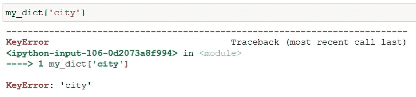
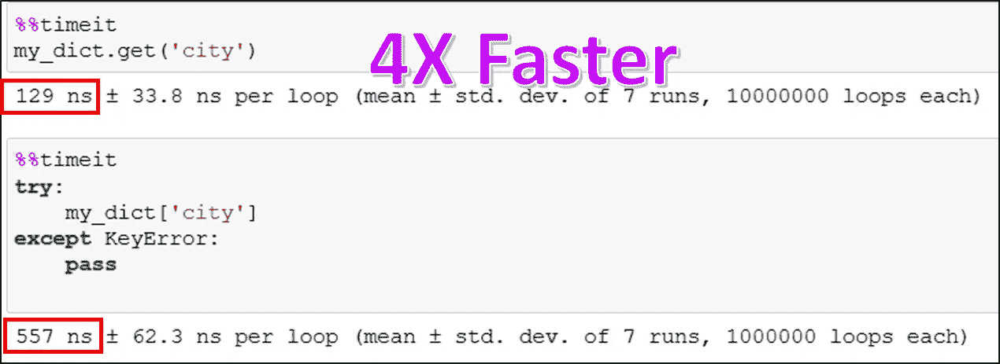
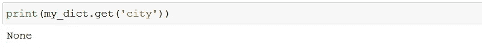
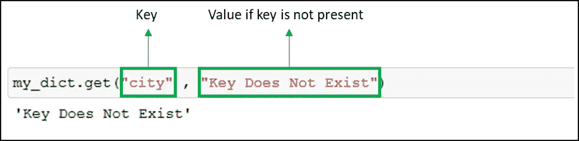
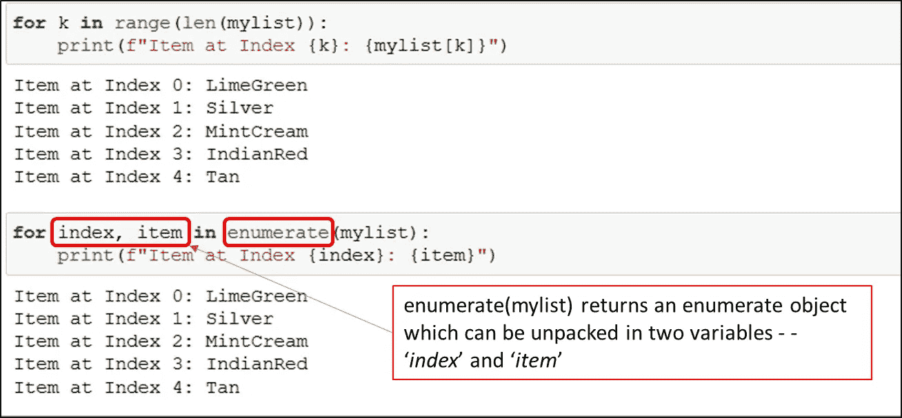
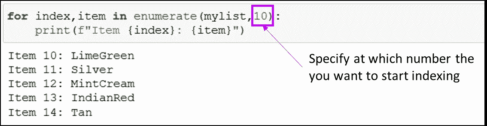
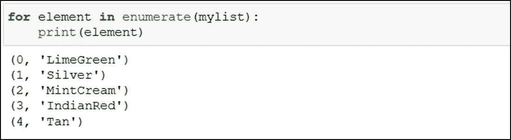
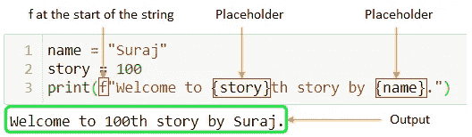

# 增强 Python 代码能力的 3 种简单方法

> 原文：<https://towardsdatascience.com/3-simple-ways-to-empower-your-python-code-5897b42dbf28?source=collection_archive---------29----------------------->

## 编程；编排

## 让你的 Python 代码简洁高效的简单技巧！


由 [SpaceX](https://unsplash.com/@spacex?utm_source=unsplash&utm_medium=referral&utm_content=creditCopyText) 在 [Unsplash](https://unsplash.com/s/photos/booster?utm_source=unsplash&utm_medium=referral&utm_content=creditCopyText) 上拍摄的照片

**Python 内置方法永远是最好的！**

Python 程序员使用它们快速编写干净高效的代码。以一种更具 Pythonic 风格的方式。

在这里，我将讨论我在 1 分钟或更短时间内掌握的 3 个最强大(但很少使用)的技巧。

> 我说的***干净高效的代码*** *是什么意思？？*

易于理解、易于修改、灵活处理错误和执行速度更快的代码！⚡️

让我们跳进来吧！

# 。get()获取 Python 字典项

停止⚠️现在使用方括号，以访问字典项目。

假设，你有一本如下的字典。

```
my_dict = {'first_name': 'Michaela',
           'last_name': 'Kraushaar',
           'age': 36,
           'job': 'Pfleger',
           'country': 'Antarktis'}
```

而且你想访问键的值——*country*， `my_dict[‘country’]`会工作的最好。

但是，如果你提到的键在字典里不存在呢？？



字典中的关键字错误|按作者排序的图像

就像上面的例子一样，试图访问键的值— *city，*将抛出一个`KeyError`并中断程序的执行。

当然，这可以使用`try — except`语句来处理，但是看你自己如何快速的使用*`**.get()**`方法。*

**

*dictionary.get(key)与 dictionary[key]在 Python | Image by Author 中*

> *。得到(钥匙)才是金科玉律！🏆*

*如果字典中没有这个键，这个字典方法将简单地返回`None`。*

**

*Python 中的 dictionary . get(key )|作者图片*

*`**.get()**`方法不仅保持代码整洁、易于理解，还能随时处理`KeyError`！*

*最重要的是，如果字典中没有这个键，方法`.get()`允许您自由设置要返回的*值*。*

**

*如果字典|按作者排序的图像中不存在关键字，则获取所需的值*

*这个值不仅限于字符串或数字，你还可以使用一个函数作为默认值。*

# *在 for 循环中枚举()*

*通常，我们需要迭代一个范围或 iterable，比如 list、dictionary，同时处理每个条目的索引。*

*根据我的观察，人们倾向于在 for 循环中使用`range(len(iterable))`。*

*然而，使用`enumerate(iterable)`非常有效，因为它跟踪 iterable 的每一项及其索引。♻️*

*下面是如何使用这两者的快速概述！*

**

*如何在 Python | Image by Author 中迭代范围*

*`range(len(mylist))`和`enumerate(mylist)`产生完全相同的结果，但是后者使代码更加简单。*

> *E 代表列举，E 代表优雅！！！🏆*

*使用`enumerate(mylist)`的另一个好处是，你可以完全自由地决定何时开始索引！*

**

*从特定编号开始索引|按作者排序的图片*

*此外，`enumerate()`还可以用来生成索引和项目元组，如下所示。*

**

*按作者在 Python 循环|图像中生成索引项元组*

# *f-strings 来连接和打印字符串*

*f-string 或*格式化的* *字符串文字*是 [*format()*](/five-must-know-string-methods-in-python-e97925d12eec) 方法的更简单实现。🏆*

*这种 f 字符串在要格式化的字符串的开头有一个字母`***f***` ,在字符串中有多个占位符`***{}***` 。看看下面，*

**

*Python 中的 f 字符串|作者图片*

*这里有一些用 Pythonic 方式编写代码的奇妙的字符串方法。*

*</five-must-know-string-methods-in-python-e97925d12eec> [## Python 中五个必须知道的字符串方法

towardsdatascience.com](/five-must-know-string-methods-in-python-e97925d12eec)* 

*总结一下，*

*这些都是小事，但是可以让你的代码干净、易于修改并且高效运行。此外，这些技巧通过轻松处理错误来避免意外的代码中断。*

*现在，你可以通过 [***在这里报名***](https://medium.com/@17.rsuraj/membership) 成为媒介会员，阅读我和其他作家发表的所有故事。如果你这样做，我会得到一小部分你的费用，没有额外的费用给你。欢迎加入我的电子邮件列表，了解我写作的最新进展。*

*📚我这里有更多有用的文章→*

```
*1\. [5 Most Powerful One-Liners You Should Know in Python Programming](/5-most-powerful-one-liners-you-should-know-in-python-programming-c9d49a89b7f3?source=your_stories_page----------------------------------------)
2\. [4 Awesome Pandas Methods To Quickly Analyze Any Dataset](/4-awesome-pandas-methods-to-quickly-analyze-any-dataset-65d2252af6e8?source=your_stories_page----------------------------------------)
3\. [3 (and Half) Powerful Tricks To Effectively Read CSV Data In Python](/3-and-half-powerful-tricks-to-effectively-read-csv-data-in-python-c4699a4f9d07?source=your_stories_page----------------------------------------)
4\. [3 Time-Saving Python Tricks](/3-time-saving-python-tricks-a017f4215aeb?source=your_stories_page----------------------------------------)*
```

***感谢您的阅读和投入时间！***