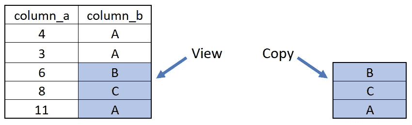
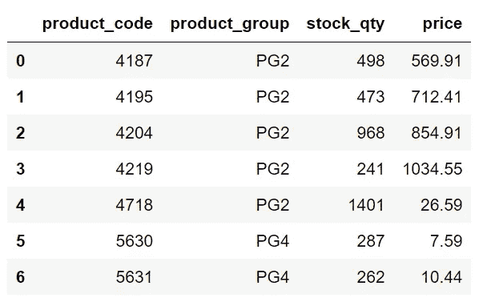
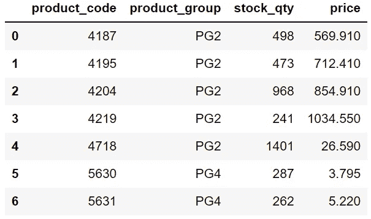
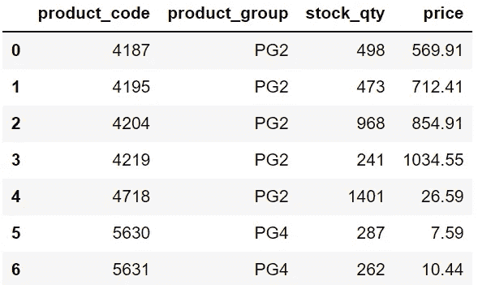
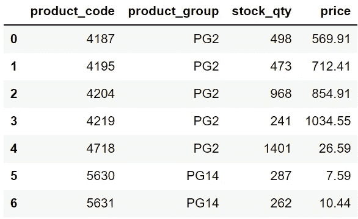
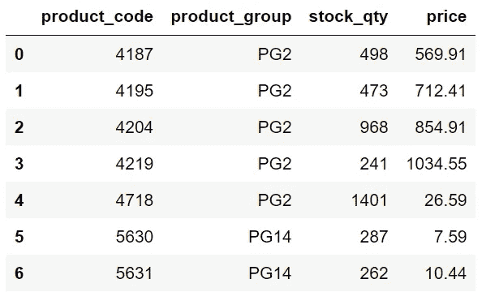

# Python 熊猫复制警告设置的 3 种解决方案

> 原文：<https://towardsdatascience.com/3-solutions-for-the-setting-with-copy-warning-of-python-pandas-dfe15d62de08?source=collection_archive---------3----------------------->

## 永远不要忽略警告。


照片由 [NeONBRAND](https://unsplash.com/@neonbrand?utm_source=unsplash&utm_medium=referral&utm_content=creditCopyText) 在 [Unsplash](https://unsplash.com/s/photos/solution?utm_source=unsplash&utm_medium=referral&utm_content=creditCopyText) 拍摄

如果你曾经对熊猫进行过数据分析或操作，你很有可能至少遇到一次`SettingWithCopy`警告。

当我们尝试使用链式索引进行赋值时，会出现此警告，因为链式索引具有固有的不可预测的结果。

以下是链式索引的样子:

```
df[df["column_a" > 5]["column_b"]
```

第一部分筛选 a 列中的值大于 5 的行，第二部分从筛选的数据框中选择 b 列。

问题是这种链式索引可能会返回一个视图或副本。

如果是视图，那么我们所做的更改也会反映在原始数据框中。例如，以下代码将更新原始数据框。

```
df[df["column_a" > 5]["column_b"] = 5
```

但是，如果返回的是副本，则不会在原始数据框中进行更改。



查看与复制(图片由作者提供)

这就是熊猫在出现这种暧昧情况时会警告我们的原因。

在这篇文章中，我们将讨论导致`SettingWithCopy`警告的 3 种解决方案。

先来看一个给我们警示的真实案例。我创建了一个包含 7 行 4 列的样本数据框。



df(作者图片)

我想将不在产品组 PG2 中的产品价格降低 50%。这是我想到的第一个解决方案。

```
df[df["product_group"]!="PG2"]["price"] = df[df["product_group"]!="PG2"]["price"] * 0.5SettingWithCopyWarning: 
A value is trying to be set on a copy of a slice from a DataFrame.
```


df(作者图片)

由于链式索引和所选产品的价格没有变化，我们收到了一个警告。

# 解决方案 1

第一种选择是使用 loc 方法。

```
df.loc[df["product_group"]!="PG2", "price"] = df.loc[df["product_group"]!="PG2", "price"] * 0.5df
```



df(作者图片)

我们现在可以看到数据框中的价格变化。

loc 方法允许在单个步骤中进行筛选和选择，因此不会出现链式索引。

# 解决方案 2

另一种方法是 where 函数，它可用于根据条件更新值。

where 函数的工作方式如下:

*   它接受条件和值
*   当条件为真时，它保持原始值
*   当条件不成立时，它用给定值更新原始值

下面的代码片段没有改变产品组 PG2 中产品的价格，但是将其他产品的价格减半。

为了保存数据框中的更改，将 inplace 参数设置为 true。

```
df["price"].where(
   df["product_group"]=="PG2", df["price"] * 0.5, inplace=True
)df
```


df(作者图片)

# 解决方案 3

我们还可以使用替换功能来更新数据框中的值，而不会出现`SettingWithCopy`警告。

假设我们需要将产品组 PG4 更改为 PG14。这是一个给我们警告的解决方案。

```
df[df["product_group"]=="PG4"]["product_group"] = "PG14"dfSettingWithCopyWarning: 
A value is trying to be set on a copy of a slice from a DataFrame.
```



df(作者图片)

我们收到了警告，而且值也没有更新。

以下是应用于列而不是数据框的略有不同的版本。

```
df["product_group"][df["product_group"]=="PG4"] = "PG14"dfSettingWithCopyWarning: 
A value is trying to be set on a copy of a slice from a DataFrame.
```



df(作者图片)

我们仍然得到警告，但是值被更新了。这就是为什么我们不应该相信链式索引并且永远不要忽略这些警告的原因。

以下代码片段使用 replace 函数执行此任务。

```
df.replace({"product_group" : "PG4"}, "PG14", inplace=True)df
```



df(作者图片)

任务完成，没有任何错误！

# 结论

警告可能没有错误那么重要，因为它们不会停止代码的执行。您可以选择忽略错误并继续。

然而，你可能会得到意想不到的结果。因此，了解警告的根本原因并解决它是非常重要的。

如果你还不是[中级会员](https://sonery.medium.com/membership)并计划成为其中一员，我恳请你使用以下链接。我将收取你的一部分会员费，不增加你的额外费用。

<https://sonery.medium.com/membership>  

感谢您的阅读。如果您有任何反馈，请告诉我。