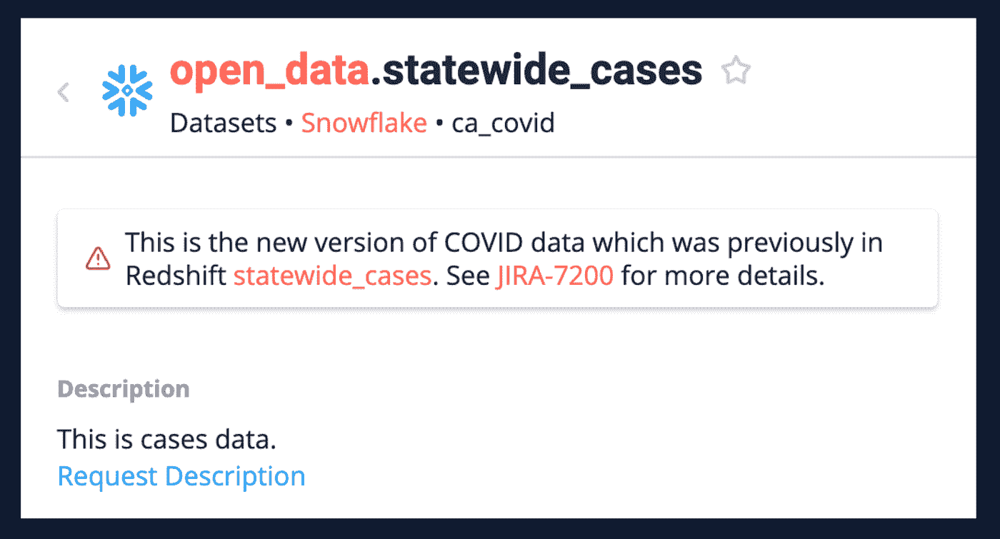

# 成功数据迁移的 3 个步骤

> 原文：<https://towardsdatascience.com/3-steps-for-a-successful-data-migration-9de8e7f1671c?source=collection_archive---------17----------------------->

## [行业笔记](https://towardsdatascience.com/tagged/notes-from-industry)

由 [Patrick Fore](https://unsplash.com/@patrickian4?utm_source=unsplash&utm_medium=referral&utm_content=creditCopyText) 在 [Unsplash](https://unsplash.com/?utm_source=unsplash&utm_medium=referral&utm_content=creditCopyText) 上拍摄

迁移是数据团队最常见的计划之一。但殊不知，它们是*复杂兽*。他们总是比他们需要的时间更长，涉及许多不同的团队，并且他们是超级可见的——不仅对用户，对高管也是如此。当迁移正在进行时，每个人都很焦虑。而且，总有一个正在进行或即将开始。

在我的职业生涯中，我自己就是一名数据工程师，与数百名数据工程师合作过。我学到的与数据工程团队质量相关的一件事是*他们在迁移方面做得有多好*。

**我发现*数据工程团队如何处理迁移可以很好地代表数据工程团队的质量。***我将深入探讨我见过的优秀数据工程团队为确保成功迁移而采取的 3 个关键步骤:

1.  确定迁移的复杂性和顺序
2.  迁移和测试 1 级表
3.  为下游所有者提供工具并启动涟漪迁移

这些步骤中的每一步都可以是一篇独立的博文，但是为了保持连贯性，我试图在一篇博文中解决它们。

迁移通常基于推动他们进行迁移的公司内部或外部发生的事情。迁移是彻底的，因为成功是与消灭某些东西联系在一起的，而不仅仅是移动某些东西。**在大多数迁移中，完成 90%是不够的，甚至 100%也是不够的，为了迁移成功，你真的必须淘汰一些旧的东西。**

以下是数据团队迁移的一些常见原因，以及每种情况下的成功表现:

1.  从一个数据仓库到另一个数据仓库的大规模迁移，通常是为了降低成本、整合、提高可伸缩性或可靠性。成功:上一个仓库没有活动。
2.  由于“上游”决策，从一个数据源迁移到另一个数据源。一个常见的例子是，一家公司从 Hubspot 迁移到 Salesforce，因为他们的 CRM 和所有下游销售分析渠道、仪表盘和指标都需要更新。另一个常见的例子是将上游服务从一个整体“分解”为多个微服务。这些微服务最终拥有自己的数据库，这导致了新的分解数据源，数据仓库 ETL 需要在这些数据源上重建，当然。成功:对旧数据的零查询。

事实证明，杀死一个东西比树立一个新的东西要难得多。这正是迁移如此困难和复杂的原因。

这是我见过的伟大的数据工程团队在进行迁移时采取的 3 个步骤。

# 步骤 1 —确定迁移的复杂性和顺序

## **迁移的复杂性**

任何迁移的第一步都是了解它有多复杂。是 2 周、2 个月还是 2 年的迁移？与迁移复杂性最接近的代理由所讨论的数据源的两个因素决定:

1.  您拥有多少级别的数据资产？
2.  总共有多少数据资产是建立在数据源上的？

数据资产可以是表格、仪表板等。

换个角度来看，如果你有一个类似下面的谱系图，这些因素是:

1.  图表的深度是多少？
2.  图中有多少个节点？

作者图片:谱系图

## **迁徙顺序**

优秀的数据工程团队对于他们选择的迁移顺序是深思熟虑的。在上面这样的谱系图中，您仍然必须选择首先迁移哪个“分支”。

在决定首先选择哪个分支的顺序时，伟大的团队会考虑以下三个最常见的类别:

1.  **成本** —我们将首先迁移最昂贵的数据。
2.  **使用影响** —我们将最后迁移最常用的数据集，以减少对用户的影响。
3.  **风险** —我们将首先迁移风险最小的数据。例如，让我们保存最后迁移的核心财务指标，因为它们是从外部报告的。

**迁移很容易，只要你不用担心依赖性。**

这让我想到了迁移中最困难的部分。一旦选择了要迁移的分支，就必须确定现有数据的使用方式。

**Level-1** 用法意味着只有数据的叶级消费者，如仪表板、表上的即席查询。 **Level-2** 用法意味着在该表上构建了其他表，这些表具有仪表板和正在其上运行的即席查询。

作者图片:数据使用水平

一个捕获数据谱系的自动化数据目录可以帮助您更好地了解您的使用级别。

呈现该谱系图的数据目录至少应该能够自动捕获这三种关系:

1.  表级沿袭
2.  基于表格构建的仪表板/报告
3.  过去 30 天内用户的名称以及他们运行的条件查询的数量

很高兴拥有(不是必须拥有):

*   列级沿袭——这很难以高粒度和高精度来捕获，并且许多迁移都不需要。
*   关于使用什么过程/ETL 来生成下游表的更多信息。

列级沿袭还有其他的用例，比如满足监管需求或取消列。然而，对于本文开头描述的大型迁移，我发现表级别的沿袭已经足够了。

# 步骤 2 —迁移和测试 1 级表

在大多数组织中，您将有不止一个级别的使用。第一步总是首先迁移这些一级表。在一些组织中，没有进行真正的 ETL/ELT。在这种情况下，这一步是不行的。

这里有两种常见的情况:

1.  上游变化被“吸收”，或者
2.  上游的变化被“泄露”

## 测试

如果新表应该等同于旧表，那么进行数据测试就很重要。一个好的数据质量产品能够描述旧数据和新数据，突出行数、分布、最小值、最大值、平均值等方面的差异。您通常希望并行运行这两个作业(至少 2 周),以确保配置文件在这段时间内处于某个上限内。

# 步骤 3 —为下游所有者提供工具，并启动涟漪迁移

移民会产生连锁反应。优秀的数据工程团队对此有着清晰的理解，并且能够在两个方向上构建反馈循环来协调迁移。

一旦完成了 1 级表的迁移，就该通知下游用户数据了。有 3 种可能的下游消费者:

1.  桌子上的仪表板
2.  数据的特殊查询程序
3.  派生的下游表

对于每一类下游消费者，您正在将下游迁移的责任传递给他们。这意味着:

*   下游仪表板所有者需要迁移他们的仪表板，以使用新的数据源。
*   数据的特别查询者将需要查询新的数据源，而不是旧的数据源。
*   下游表所有者需要迁移他们的 ETL 作业，以便从新的数据源读取数据。

下游表所有者的最后一种情况是最有趣的，因为要么他们的表将吸收这种变化，而不需要通知他们下游的任何人。或者，他们的 ETL 作业或表将无法吸收这种变化，他们将触发自己的连锁反应，要求他们的数据消费者进行迁移。

优秀的数据工程团队为下游消费者提供工具，让他们知道他们的数据的用途，这样他们就可以执行他们的部分迁移。

## 下游表格和仪表板

通常，数据工程团队将归档一个 JIRA，它与他们的数据目录集成在一起。这将为下游表或仪表板所有者归档票证。

如果需要，仪表板所有者可以更新他们的仪表板。由于不再需要它们，他们最终往往会弃用它们。

下游表所有者必须做与 1 级所有者相同的事情。他们要么吸收变化，要么泄漏变化。如果他们吸收了变化，他们关闭票。如果他们泄露了零钱，他们就为他们的下游消费者创造了门票。他们可以使用相同的目录和 JIRA 集成为下游用户创建票证。

## **临时查询器**

虽然 JIRA 票对下游的仪表板和表所有者很有效，但对那些专门查询数据的人就不太有效了。即使新的数据用户通过空闲消息或电子邮件得到通知，他们也很容易错过这些细节。

记录迁移的状态很重要，这样那些错误地使用错误数据的人可以被礼貌地重定向到新的数据。

做到这一点的一个好方法是在您的数据目录工具中放置一个横幅，如下所示:

作者图片:表格上的横幅，宣布已迁移的表格

例如，**如果一个新用户在他们的数据目录中偶然发现了一个旧表及其过时的文档，他们将通过横幅通知新版本的表存在，并被重定向到使用该表。**类似于亚马逊在产品新版本上市时通过横幅通知用户的方式。

# 驯服野兽

迁徙不必像它们看起来那样复杂。有许多方法可以确保顺利迁移，它们只需要一点额外的爱和关心。上面的四个步骤是我见过的数据工程团队驯服迁移这头野兽的最常见的方法，其核心是血统的力量以及它如何转变您团队的方法。因为在 it 的核心，拥有快速了解数据中上游和下游依赖性的能力是成功迁移的最重要的方面之一。

**要阅读更多类似的帖子并保持联系，请在** [**Twitter 上关注我**](https://twitter.com/mark_grover) **或通过订阅** [**这里**](https://www.stemma.ai/blog) **接收每月简讯。**