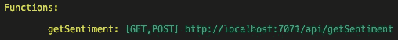
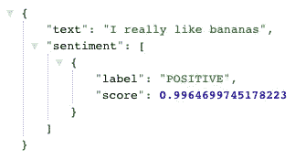
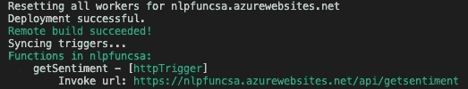

# 在 Azure 上构建和部署 NLP 模型作为微服务的 3 个步骤

> 原文：<https://towardsdatascience.com/3-steps-to-build-and-deploy-your-nlp-model-as-a-microservice-on-azure-426ca77c66df?source=collection_archive---------25----------------------->

## 在 Azure 上部署 ML 模型最简单最便宜的方法


布鲁斯·马斯在 [Unsplash](https://unsplash.com?utm_source=medium&utm_medium=referral) 上的照片

在花费无数时间训练您的模型之后，您现在需要使它可用于其他应用程序或服务。

根据您部署到云的方式，这个过程可能需要几个小时或几分钟。更重要的是，您的部署选择应该基于您的可伸缩性和预算需求。

在这里，我将展示一种直接使用 Python 代码(而不是构建容器)将 NLP 模型作为微服务部署到 Azure 的快速方法。

> 本教程适用于任何 ML 模型，而不仅仅是 NLP。

我将展示的设置可能是现有的最简单的设置之一，并且维护这些设置的**成本最小**。

开始之前，请确保做好以下准备:

1.  **创建一个有效订阅的 Azure 帐户**:如果你还没有一个有效订阅的帐户，你可以为 Azure 创建一个新帐户，并获得两周的试用期。
2.  **安装 Azure CLI** :我们将使用*命令*在 Azure 上创建资源(而不是使用 Azure Portal UI)。这种方法具有最强的可维护性，因为我们为自己创建的每个资源都编写了脚本，这使得进化和复制变得更加容易。[点击此处](https://docs.microsoft.com/en-us/cli/azure/install-azure-cli)查看如何安装 Azure CLI。
3.  **安装 Azure Functions 核心工具**:在将我们的微服务部署到 Azure 之前，我们将**在本地创建和测试一切，而不花一分钱**。Azure Functions 核心工具将为设计、开发、测试、运行和调试 Azure 功能提供本地开发体验。[点击此处](https://github.com/Azure/azure-functions-core-tools)查看如何安装。

下面我们将经历以下三个步骤:

```
1\. Create and test an Azure function locally
2\. Create the resources on Azure
3\. Deploy the function to Azure
```

# 1.在本地创建并测试 Azure 函数

理想情况下，我们希望在部署到 Azure 之前在本地测试所有东西。本地测试让我们确保一切正常，不会花不必要的钱在线调试。尽管如此，使用 Azure 上的“应用洞察”等监控工具仍然是值得的，也是必要的，以确保你的应用程序平稳运行。但是这超出了本文的范围。

下面，首先，我们使用终端创建并激活 python 环境。然后我们在本地创建一个 FunctionApp 项目，将多个函数组织在一起。最后，我们创建由 HTTP 请求触发的函数`getSentiment`。

```
*# Create and activate an environment*
python3 -m venv .venv
source .venv/bin/activate*# Create a FunctionApp Project Locally*
func init --worker-runtime python*# Create a Function*
func new --name getSentiment --template "HTTP trigger" --authlevel anonymous
```

现在，我们可以编辑文件`getSentiment\__init__.py`中的函数，添加以下代码(针对您的型号进行修改):

上面创建的函数将接收一个`text`参数，并返回从拥抱脸的模型“[DistilBERT base uncase fine tuned SST-2](https://huggingface.co/distilbert-base-uncased-finetuned-sst-2-english)”获得的相应情感分析的输入文本。

由于我们已经为上面的代码添加了几个库，请确保按如下方式更新您的`requirements.txt`文件:

然后，在我们上面创建的环境中安装库:

```
pip install -r requirements.txt
```

现在我们已经准备好在本地测试这个功能了。为此，您需要运行:

```
func start
```

您应该在终端中得到类似这样的输出:



“func start”命令的输出示例。图片由作者提供。

所以我们可以访问上面列出的 URL，传递参数`text`来测试模型。例如:

```
[http://localhost:7071/api/getSentiment](http://localhost:7071/api/getSentiment)?text=I%20really%20like%20bananas
```

输出应该是:



本地函数的输出示例。图片由作者提供。

现在一切都按预期在本地运行，我们可以在 Azure 上创建所需的资源并部署我们的微服务。

# 2.在 Azure 上创建资源

您可以通过 Azure 门户点击每个资源并选择设置来完成以下步骤。但这很难维持。所以，一般来说，建议使用脚本。

因此，下面，我们在终端中运行几个命令来创建以下资源，这是在 Azure 上部署功能所需的最少资源:

*   **资源组**:资源组只是为 Azure 解决方案保存多个相关资源的一种方式。
*   存储帐户:Azure 存储帐户集中了数据对象，比如 blobs、文件共享、队列、表和磁盘。它为存储提供了一个独特的命名空间。我们将使用标准类型(最便宜的)，主要推荐用于文件、blobs 和表。
*   **function app**:function app 是一种资源，它将各种功能组合成一个逻辑单元，便于管理、部署、扩展和资源共享。我们将使用最基本的消费计划来托管功能 app，并指定创建的存储帐户。

```
*# Login to your Azure Account from the Command Line*
az login*# Create a Resource Group*
az group create --name rgSENT --location westus*# Create a Storage Account*
az storage account create --name stracc2sent --location westus --resource-group rgSENT --sku Standard_LRS*# Create a FunctionApp*
az functionapp create --name **nlpfuncsa** --resource-group rgSENT --os-type linux --consumption-plan-location westus --storage-account stracc2sent --functions-version 3 --runtime python --runtime-version 3.9
```

请注意，我使用了`**nlpfuncsa**`作为 FunctionApp 的名称。此名称在 Azure 上必须是唯一的，因此请为你的应用使用不同的名称。如果上面的命令返回`Operation returned an invalid status ‘Conflict’`，这可能就是原因。**所以请确保为您的 FunctionApp **使用不同的(且唯一的)名称**。**

# 3.将功能部署到 Azure

最后，我们可以使用以下命令将本地项目的代码部署到在 Azure 上创建的 FunctionApp:

```
func azure functionapp publish **nlpfuncsa**
```

由于距离较远，此过程需要一段时间。最终，您应该会得到以下结果:



将功能部署到 Azure 后的输出示例。图片由作者提供。

现在你可以访问上面列出的 URL，传递参数`text`来测试你的模型。例如:

```
[https://nlpfuncsa.azurewebsites.net/api/getsentiment](https://nlpfuncsa.azurewebsites.net/api/getsentiment)?text=I%20really%20like%20bananas
```

输出应该与我们在本地看到的一样:


已经部署在 Azure 上的函数的输出示例。图片由作者提供。

就是这样。现在您已经将 NLP 模型部署到 Azure 上了。这里是 [Github 仓库](https://github.com/ricardocarvalhods/azure-app-nlp)，所有代码都提交给 Azure。

如果你想**删除你创建的所有东西**，去 Azure 门户，找到“资源组”，点击创建的资源组(如果你完全按照这个帖子，应该是“rgSENT”)，然后点击“删除资源组”。由于所有创建的资源都在同一个资源组下，执行上述操作将删除所有内容。

如果你喜欢阅读这样的故事，并想支持我成为一名作家，可以考虑[注册成为一名媒体会员](https://medium.com/@ricardocarvalhods/membership)。每月 5 美元，你可以无限制地阅读媒体上的故事。如果你用我的链接注册，我会赚一点佣金。