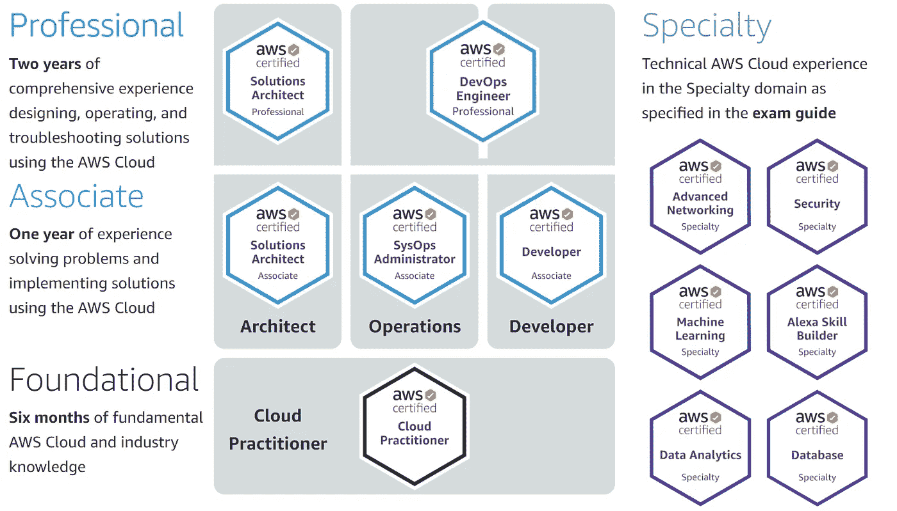

# 2 周内获得 AWS 云从业者认证的 3 个步骤

> 原文：<https://towardsdatascience.com/3-steps-to-get-aws-cloud-practitioner-certified-in-2-weeks-or-less-772178f48249?source=collection_archive---------4----------------------->

## 通过 AWS 认证验证您的云计算专业知识

[JESHOOTS.COM](https://unsplash.com/@jeshoots?utm_source=medium&utm_medium=referral)在 [Unsplash](https://unsplash.com?utm_source=medium&utm_medium=referral) 上拍照

# 内容

> [AWS 认证简介](#f369)
> [第一步:AWS 电子学习模块](#8866)
> [第二步:AWS 白皮书和网站](#df5d)
> [第三步:YouTube 练习题](#7056)
> [可选资源](#8361)
> [关于考试](#8710)

# **AWS 认证简介**

亚马逊网络服务(AWS)是最受欢迎的云平台之一，他们从全球数据中心提供一套广泛的全功能服务。根据这些服务，AWS 提供认证来帮助专业人员验证这些按需云计算技能。

AWS 提供的认证类型|亚马逊网络服务标志是 Amazon.com 公司或其附属公司在美国和/或其他国家的商标|来源: [AWS 认证](https://aws.amazon.com/certification/)

千里之行始于足下，本指南介绍了如何迈出 AWS 认证之旅的第一步，从基础云从业者考试开始。

AWS 认证云从业者( **CLF-C01** )考试的目的是验证个人对 AWS 平台的理解和知识，包括云架构原则、云经济学、可用的产品和服务以及其他方面，如安全性和价值主张。记住所有这些，让我们开始管理考试的**3–2–1****计划**:**3**关键步骤， **≤2** 周， **1** 考试尝试。

# 步骤 1 — AWS 电子学习模块

— — — —
所需时间:**6–7**天 **|** 费用:**免费** — — — —

AWS 自己提供的在线电子学习模块经过精心规划和交付，使概念易于理解。内容被组织成小块，涵盖云计算和 AWS 提供的服务背后的关键思想。最棒的是，它是免费的！

我喜欢他们用咖啡店作为所有模块的简单类比，因为这使得理论更容易理解和可视化。

泰勒·尼克斯在 [Unsplash](https://unsplash.com?utm_source=medium&utm_medium=referral) 上的照片

转到 [AWS 云从业者基础在线学习](https://www.aws.training/Details/eLearning?id=60697)页面，访问在线学习内容。如果您之前没有创建个人亚马逊帐户，您需要创建一个。

第一步的游戏计划是按顺序完成每一课，如果可能的话做笔记。虽然视频播放时间总共是 6 个小时，但你至少要花两倍的时间。这是考虑到反复观看和复习课程的因素。

对于完全不熟悉云计算的人来说，我认为你应该在 6 天内每天花 2-3 个小时来很好地理解内容。如果你已经对云计算概念有了一些基本的了解(比如接触过 GCP 等其他服务)，那么所需的时间会更短。

另一个技巧是以更快的速度观看视频(例如 1.5-2 倍)，这样可以优化花费的时间。

作为对阅读这篇文章的感谢，我分享我根据课程和文字记录整理的笔记。你可以在我的 GitHub 页面 **这里找到笔记 [**。**](https://github.com/kennethleungty/AWS-Certified-Cloud-Practitioner-Notes)**

# 步骤 2 — AWS 白皮书和网站

— —
所需时间:**2–3**天 **|** 费用:**免费**
—————

在从步骤 1 中获得 AWS 服务的主要概念的良好基础之后，是时候接触 AWS 必须提供的更多产品和服务了。我发现这一点很重要，因为考试倾向于测试你的 AWS 产品的功能。通过 AWS 提供的白皮书，您可以很好地了解这套服务。以下是推荐阅读的白皮书:

*   [亚马逊网络服务概述](https://d1.awsstatic.com/whitepapers/aws-overview.pdf)
*   [AWS 定价的工作原理](http://d1.awsstatic.com/whitepapers/aws_pricing_overview.pdf)

白皮书可能会很长，所以我实际上并没有全部读完，因为它对我来说太乏味和耗时了。我认为最重要的是快速浏览一下，找出您以前在电子学习模块中没有遇到过的服务(步骤 1)。对于您不熟悉的服务，请简要阅读白皮书中相应的章节，对它们的功能有一个基本的了解。

如果您想对 AWS 平台有更深入的了解，请随意完整阅读文档，以便进一步增加您的信心和第一次尝试通过考试的机会。

让你熟悉各种产品的另一个资源是浏览官方的 AWS 网站。通过这样做，您应该能够很好地了解可用的服务。

# 步骤 3 — YouTube 练习题

— — — —
所需时间:**2–3**天 **|** 费用:**免费**
— — — —

现在是检验你的知识的时候了。有几个资源提供收费的练习题，但我避开了它们，因为 YouTube 上已经有很多免费的练习题。这是我在准备过程中观看的 4 个视频(以 2 倍的速度观看):

1.  [我的训练](https://www.youtube.com/watch?v=FXKE1SfityA&ab_channel=MyresTraining)
2.  [测试准备训练](https://www.youtube.com/watch?v=V2x9f3GizOw&ab_channel=TestPrepTraining)
3.  [免费云培训](https://www.youtube.com/watch?v=YQjgampYzsw&ab_channel=FreeCloudTraining)
4.  [数字云培训](https://www.youtube.com/watch?v=ki0b5THoAvw&feature=youtu.be&ab_channel=DigitalCloudTraining)

照片由[克里斯蒂安·威迪格](https://unsplash.com/@christianw?utm_source=medium&utm_medium=referral)在 [Unsplash](https://unsplash.com?utm_source=medium&utm_medium=referral) 上拍摄

请确保在查看答案之前尝试了这些问题。如果你在 YouTube 上进一步浏览，你肯定会遇到更多这样的视频，所以也可以随意观看。此外，请点击查看 AWS [的官方样题。](https://d1.awsstatic.com/training-and-certification/docs-cloud-practitioner/AWS-Certified-Cloud-Practitioner_Sample-Questions.pdf)

# 可选资源

如果你想要一个有指导的在线课程，让你以一种系统的方式完全准备好，你可以在 Udemy 上查看一些付费课程。我并没有报名参加这些课程，但是我在 Udemy 上看了一下，觉得这些课程看起来结构良好，并且有额外的练习题。

*   [终极 AWS 认证云从业者— 2021 年](https://www.udemy.com/course/aws-certified-cloud-practitioner-new/)
*   [AWS 认证云从业者考试培训 2021](https://www.udemy.com/course/aws-certified-cloud-practitioner-training-course/)
*   [AWS 认证云从业者:2021 年 6 次全实践考试](https://www.udemy.com/course/aws-certified-cloud-practitioner-practice-test/)

完成这些课程可能会使准备过程比两周稍长，但是，嘿，这不是一场比赛，所以如果你需要的话，花更多的时间。

# 关于考试

已经有很多资源描述了考试过程，所以我就不深究了。您可以查看以下内容，了解更多信息:

*   [https://aws.amazon.com/certification/certification-prep/](https://aws.amazon.com/certification/certification-prep/)
*   [https://www.aws.training/certification](https://www.aws.training/certification)
*   [https://D1 . AWS static . com/training-and-certification/docs-Cloud-practicer/AWS-Certified-Cloud-practicert _ Exam-guide . pdf](https://d1.awsstatic.com/training-and-certification/docs-cloud-practitioner/AWS-Certified-Cloud-Practitioner_Exam-Guide.pdf)

相反，我将分享一些基于我个人经验的技巧。

*   请确保至少提前 40 分钟，因为监考服务的设置可能需要一段时间才能完成。
*   90 分钟内要回答 65 个问题。这实际上是足够的时间让你完成考试。因此，一定要花时间仔细阅读问题，避免匆忙通过考试。你也应该有足够的时间再次浏览(和编辑)你所有的答案，所以请在提交之前这样做。
*   如果你在家参加考试，确保没有持续的(或潜在的)干扰。例如，让你的家人/室友知道你将参加监考，并提醒他们在 90 分钟的时间内不要干涉。

# 结论

在本指南中，我分享了如何准备 AWS 认证云从业者考试的 3 个步骤。由于每个人都有不同的学习偏好，这里的建议既不确定也不详尽。尽管如此，它仍然应该为你参加考试提供坚实的准备，并在你第一次尝试时通过考试。凭借本指南中列出的资源(即步骤 1-3)，我第一次尝试就获得了 920/1000 分(及格分数为 700/1000 分)。我非常有信心你也能做到。

再一次，请不要介意我从 AWS 课程和抄本中收集的笔记。

# 在你走之前

欢迎您来到**，与我一起踏上数据科学学习之旅！**点击此[媒体](https://kennethleungty.medium.com/)页面，查看我的 [GitHub](https://github.com/kennethleungty) ，了解更多令人兴奋的数据科学内容。同时，祝你考试顺利！

 [## 通过 AWS 认证机器学习专业考试的简明指南

### 获得亚马逊网络服务(AWS)机器学习专业认证的高效方法

towardsdatascience.com](/no-frills-guide-to-passing-the-aws-certified-machine-learning-specialty-exam-55624579353f)  [## 两周内获得 Tableau 桌面认证的 3 个步骤

### 获得 Tableau 专家认证，展示您的数据可视化技能和产品知识

towardsdatascience.com](/3-steps-to-get-tableau-desktop-specialist-certified-in-2-weeks-abbef25778de)  [## 新冠肺炎疫苗——公众情绪如何？

### 使用 NLP (Stanza、NLTK Vader 和 TextBlob)对新冠肺炎疫苗推文进行逐步情感分析

towardsdatascience.com](/covid-19-vaccine-whats-the-public-sentiment-7149c9b42b99)