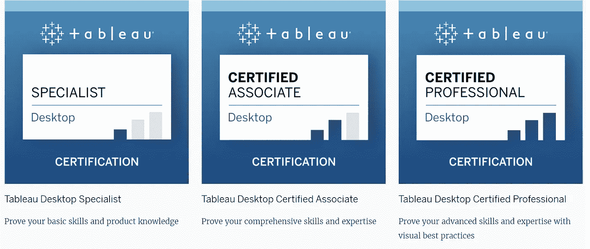
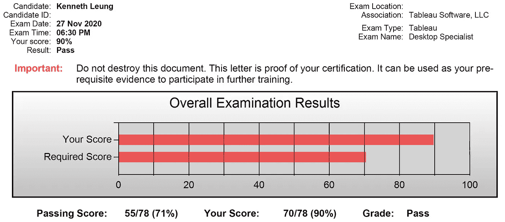

# 两周内获得 Tableau 桌面认证的 3 个步骤

> 原文：<https://towardsdatascience.com/3-steps-to-get-tableau-desktop-specialist-certified-in-2-weeks-abbef25778de?source=collection_archive---------6----------------------->

## 获得 Tableau 专家认证，展示您的数据可视化技能和产品知识

威廉·艾文在 [Unsplash](https://unsplash.com?utm_source=medium&utm_medium=referral) 上的照片

# 内容

> ——[Tableau 认证简介](#3544)
> ——[Tableau 桌面设置](#e0dd)
> ——[第一步:Tableau 免费培训视频](#1f2c)
> ——[第二步:Tableau 白皮书](#e3b3)
> ——[第三步:在线练习](#fd71)
> ——[关于考试](#1ee8)

# Tableau 认证简介

[Tableau](https://www.tableau.com/) 软件是市场上最受欢迎的视觉分析平台之一。Tableau 专注于商业智能，使用户能够轻松探索和管理数据，并快速发现和分享见解。鉴于它在各行各业的广泛应用，获得 Tableau 认证肯定会帮助你脱颖而出。

前端用户很可能会在工作中使用 **Tableau Desktop** ，所以我将重点讨论桌面认证。特别是，我将深入研究**基础**认证，即所谓的 [**Tableau 专家认证**](https://www.tableau.com/learn/certification/desktop-specialist) 。

3 个 Tableau 桌面认证可用|图片来源:Tableau 网站(经许可使用)

记住所有这些，让我们开始管理考试的学习计划: **3** 关键步骤， **2** 周， **1** 考试尝试。

# Tableau 桌面设置

为了最好的准备(如果你没有付费的 Tableau 订阅)，我建议你使用 14 天试用版的 **Tableau Desktop** (从[这里](https://www.tableau.com/products/desktop/download)下载)而不是 Tableau Public。

如果您已经用完了试用期，请考虑使用其他电子邮件地址再次注册。只有当你准备好执行这个为期两周的学习计划时，安装试用版才是最理想的。

*注意*:如果你碰巧是学生，Tableau 通过[Tableau for Students program](https://www.tableau.com/academic/students)向认证机构的学生提供为期一年的免费许可证。

# 步骤 1: Tableau 免费培训视频

— —
所需时间:**8–9**天 **|** 费用:**免费** — — — —

首先，为了高效备考，了解专科考试考的都是哪些概念很重要。考试中测试的技能列表可以在[考试准备指南](https://mkt.tableau.com/files/DesktopSpecialist_ExamGuide.pdf)中找到。

Tableau 提供了一系列广泛的 [**免费培训视频**](https://www.tableau.com/learn/training) ，这些视频将构成步骤 1 的基础。这些小视频是解决技能测试的绝佳课程，最棒的是，它是免费的！

这一步是最重要的(也是最密集的)，因为它涉及从基础开始的在线课程和实践。幸运的是，为了通过考试，你不需要完成[培训页面](https://www.tableau.com/learn/training)上的所有章节。以下是你需要关注的 7 个章节:

1.  **入门** (3 个视频— 34 分钟)
2.  **连接数据** (11 段视频— 72 分钟)
3.  **视觉分析** (26 个视频— 144 分钟)
4.  **仪表盘和故事** (8 个视频—40 分钟)
5.  **计算** (16 个视频— 65 分钟)
6.  Tableau 为什么要这么做？ (4 段视频— 22 分钟)
7.  **如何进行** (10 个视频— 39 分钟)

为了充分利用这一点，我强烈建议你在整个课程中自己练习重新制作图表，而不是被动地观看视频。**动手实践绝对是关键**！

由[布雷特·乔丹](https://unsplash.com/@brett_jordan?utm_source=medium&utm_medium=referral)在 [Unsplash](https://unsplash.com?utm_source=medium&utm_medium=referral) 上拍摄的照片

虽然总的视频播放时间是 7 个小时，但我会加倍时间，因为你需要花时间练习你所学的。通过每天分配 2 个小时来学习这些课程，你应该能够在 9 天的时间内完成 7 个章节。

完成所有课程后，务必再次参考[考试准备指南](https://mkt.tableau.com/files/DesktopSpecialist_ExamGuide.pdf)的“技能测试”部分，以检查您是否熟悉考试中测试的概念。

# 步骤 2: Tableau 白皮书

— —
所需时间:**1–2**天 **|** 费用:**免费** — — — —

完成第一步后，我们现在可以花些时间做些更简单的阅读。针对该考试的白皮书是[可视化分析最佳实践——指南](https://www.tableau.com/learn/whitepapers/tableau-visual-guidebook?signin=c6cf87638b3864d1c393ffafb79ae10c#form)。可以直接从 [**这个链接**](https://drive.google.com/file/d/1r1oGSXRShUBfMcZMhA5mzerrQba_FstC/view) 下载。

因为考试包括与可视化最佳实践相关的多项选择题(MCQ ),所以快速阅读本白皮书将有助于解决这些问题。

这里有一个如何阅读冗长文件的提示。当您浏览白皮书时，请关注文档左侧**栏**中以*蓝色斜体*显示的**部分标题和副标题**以及**总结要点**。如果你有兴趣了解某个特定主题的更多信息，你可以继续阅读该特定部分的全文。

# **第三步:在线练习(Udemy)**

— —
所需时间:**2–3**天 **|** 费用:~ **$14** — — — — —

现在是时候接触真正的考试问题了。虽然有几个 YouTube 视频和网站提供免费的样题，但我没有发现它们的质量令人满意。为了找到练习题的好资源，我花了一点钱进入了这个 Udemy 课程: [Tableau 专家认证准备](https://www.udemy.com/course/tableau-specialist-certification-prep/) *(注意:这个帖子不是赞助的)。*

本课程的关键是获得**3**40】自评分 全程练习考试(附带解答)。虽然本课程确实有关于 Tableau 概念的视频，但我发现[步骤 1](#1f2c) 中的免费视频质量更好。尽管如此，我还是以两倍的速度观看了 Udemy 视频，作为一种有效的修订。

在完成这三次模拟考试后，你会对自己在哪些概念上有所欠缺有一个更好的认识。这些模拟练习考试也有助于模拟考试环境，让您更好地准备参加实际考试。我强烈建议你参加 3 个模拟考试中的每一个，就像它们是真正的交易一样，即不要分心，全神贯注，在时间限制内工作。

埃弗里·埃文斯在 [Unsplash](https://unsplash.com?utm_source=medium&utm_medium=referral) 上拍摄的照片

最后，官方的[备考指南](https://mkt.tableau.com/files/DesktopSpecialist_ExamGuide.pdf)也附带了一些样题，所以你也可以看看。

# 关于考试

[Tableau 网站](https://www.tableau.com/learn/certification/desktop-specialist)和[备考指南](https://mkt.tableau.com/files/DesktopSpecialist_ExamGuide.pdf)提供了大量关于考试的信息，所以请务必参考它们了解详情。一般来说，60 分钟内要完成 30 个 mcq，及格分数为 70%，费用为 100 美元。它将在已经安装了 Tableau 软件的虚拟机中进行。请点击查看[考试设置。](https://mkt.tableau.com/files/Tableau-Certification-4-steps-to-exam-success.pdf)

我想分享一些考试的小技巧:

*   确保您的互联网连接处于最佳状态。尽管我的连接通过了[考试设置](https://mkt.tableau.com/files/Tableau-Certification-4-steps-to-exam-success.pdf)的基本要求，但我发现虚拟化的 Tableau 软件相对滞后，这使我在参加考试时感到相当困难。
*   确保在房间内参加考试时没有干扰(即通知你的家人/室友避免在考试期间进入房间)
*   60 分钟将很可能是绰绰有余的时间来完成考试，所以没有必要慌张，当你遇到一个困难的问题。在回到之前难倒你的那个问题之前，你总是可以转移到其他问题上。
*   尽早参加考试，因为连接监考人的时间可能会比预期的长

# 结论

在这篇文章中，我分享了通过 Tableau 桌面专家考试的 3 步学习计划。仅用上面 3 个步骤中列出的资源，我就能在第一次尝试中获得 90%的分数。我非常有信心你也能做到。

作者图片

# 在你走之前

欢迎您**加入我的数据科学学习之旅！**点击此[媒体](https://kennethleungty.medium.com/)页面，查看我的 [GitHub](https://github.com/kennethleungty) ，了解更多精彩的数据科学内容。同时，祝你考试顺利！

</3-steps-to-get-aws-cloud-practitioner-certified-in-2-weeks-or-less-772178f48249>  </covid-19-vaccine-whats-the-public-sentiment-7149c9b42b99>  <https://medium.com/datadriveninvestor/using-ensemble-regressors-to-predict-condo-rental-prices-47eb7c3d5cd9> 