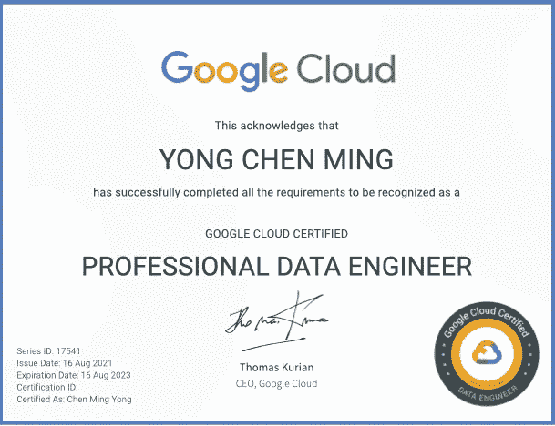
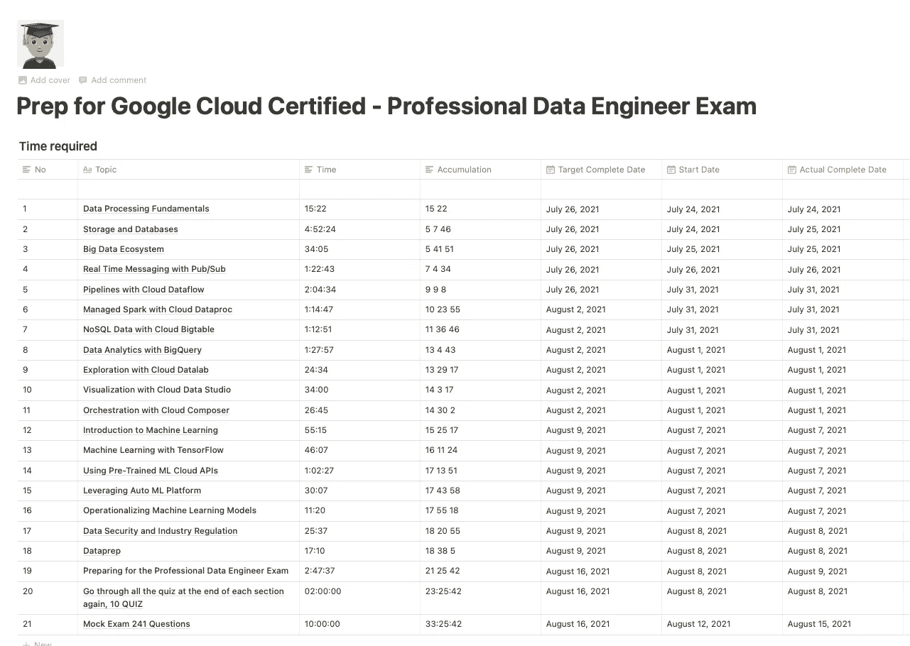
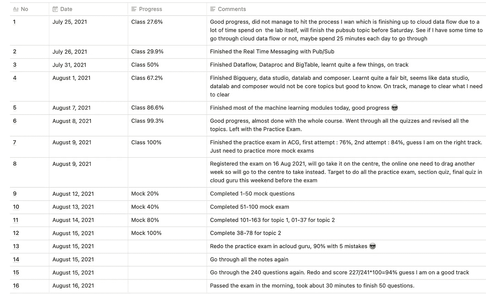
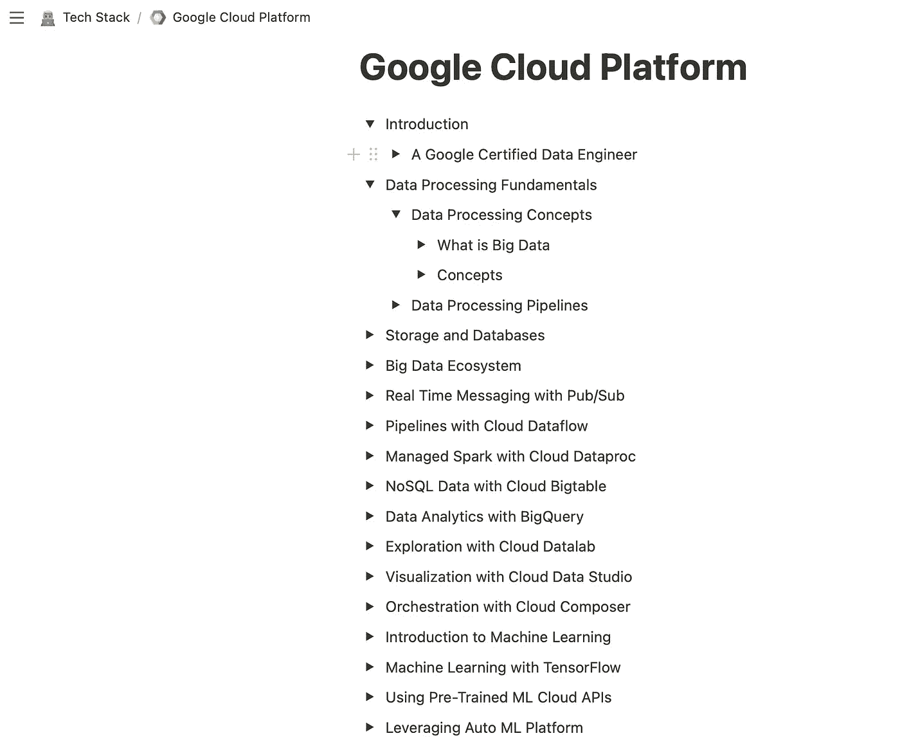
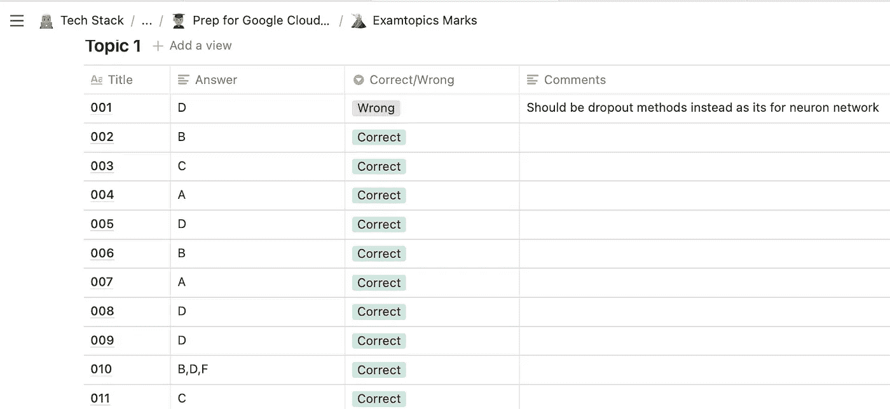

# 通过谷歌云专业数据工程师考试的 3 个步骤

> 原文：<https://towardsdatascience.com/3-steps-to-pass-google-cloud-professional-data-engineer-exam-83a312788452?source=collection_archive---------2----------------------->

## 在 1 个月内通过考试，提高您在谷歌云平台(GCP)的技术专长

图片由[专业数据工程师认证](https://www.credential.net/c6f72a23-5c89-48d6-b641-dd0b97a5d52b)上的作者提供

# 问题陈述

有不少关于如何通过上述考试的指南，但它们要么是**过时的**，要么是**有太多的步骤和建议**要遵循。我想我会分享我通过这个考试的 3 个步骤，以帮助那些和我处境相同的人。这些步骤对我来说非常有效，我确信它非常适用于你，无论你是刚刚开始学习谷歌云平台中的数据工程，还是因为专业原因想要获得这个证书。在我们开始之前，这是我在 1 个月前开始准备工作之前真正想要完成的两件事:

1.  **在准备的 **1 个月**内通过考试** (duh)。(我全职工作，所以 1 个月对我来说是一个合理的时期)
2.  **记录并重复使用**的知识，以应用于工作或其他项目。(这一点很重要，因为我在空闲时间会上很多在线课程，过一段时间后，我往往很难记起在哪里学了什么)

# 工具和成本

这些是我使用的工具，其中大部分是免费的，但这些类不是。你可能会说，有其他免费或更便宜的方法，但我个人更喜欢为更好的服务支付一点溢价，有时以节省我的一些时间。

## 工具:

1.  笔记 app : [**观念**](https://www.notion.so) 。我一直在使用很多记笔记的应用程序，如 EverNote、OneNote 和 Confluence，直到今年我发现了 concept，从那以后再也没有回头看。
    费用:**免费**
2.  学习平台: [**谷歌认证专业数据工程师，由蒂姆·贝瑞**云大师](https://acloudguru.com/course/google-certified-professional-data-engineer)担任。我选择了一个云专家平台，因为我通过了 AWS 云从业者考试，之前使用了那里的课程之一，我发现那些课程真的很有帮助。我也用 Coursera 做了不少 Google 云平台相关的数据工程的课程，但是我觉得都没有这个有效。费用取决于你需要多长时间，但让我们根据 1 个月的时间来估计。
    费用:**每月 35 美元，新注册 7 天免费试用**
3.  **考试本身: [**Google 专业数据工程师**](https://cloud.google.com/certification/data-engineer) 。它由 50 道选择题组成，总时长 2 小时。根据你所在的位置，你可以在网上或考试中心进行考试。谷歌不会告诉你与 AWS 相比你得了多少分，所以你只知道你要么通过，要么失败。我真的希望这里的所有读者都能获得通行证，不管你是按照我的步骤还是按照你自己的方式来做:)
    费用: **$200 美元****
4.  **模拟考试: [**Google 专业数据工程师考试 by ExamTopics**](https://www.examtopics.com/exams/google/professional-data-engineer/view/) 。模拟考试与实际考试非常相似，所以强烈建议任何人都来做，尤其是当你快没时间的时候！它实际上是免费的，但我最终支付了贡献者访问权，因为免费版本将要求机器人每 10 个问题左右检查一次，这对我来说有点烦人，它分散了我对考试问题本身的注意力。
    费用:**免费或 16.99 美元/月或 23.99 美元/年。****

**如果你排除 200 美元的考试费，总成本加起来只有 35 美元，因为总成本=免费(概念)+ 35 美元(1 个月+ 7 天的云专家)+免费(如果你不介意机器人检查的考试题目)= 35 美元。这是基于我们将在 1 个月零 7 天内完成课程的假设。**

**我相信，基于上面的工具，你们中的大多数人现在已经知道这三个步骤是什么了，但是让我来详细地介绍一下每一个步骤。**

****

**图片由[memegenerator.net](https://memegenerator.net/instance/49557790/drunk-baby-1-yes-man-youre-right)**

# **3 个步骤**

## **第一步:制定系统的训练计划**

**作为一名工程出身的人，我喜欢以非常系统和结构化的方式做事，尽管我的思维倾向于以其他方式行事，所以有一个结构化的计划对我来说是实现上述目标所必需的。就我个人而言，我发现获得所有这些认证最困难的部分，无论是 AWS、GCP、Azure 还是任何其他专业认证，都是学科。我们周围不断的干扰，如社交媒体或频繁的通知，真的阻止了我以我希望的速度前进。为了消除我的分心，我为我生活中做的许多事情设定了一个**想象的时间表**，这总是让我感到有点压力，这样我就可以减少社交媒体消费，并将我的注意力转移到需要我立即关注的事情上。我在这次考试中使用了同样的策略，记得我们的目标是在准备的 1 个月内完成这次考试吗？因此，我查阅了上面提到的[课程](https://acloudguru.com/course/google-certified-professional-data-engineer)的所有教学大纲。根据教学大纲，我**为每周**计划我的想象目标，这样我就可以在目标时间内完成它。我是全职工作，我的大脑通常在每个工作日结束时完成，所以如果可能的话，我只计划在周末学习这个认证，除非我不能在之前的周末达到目标时间表。我的目标是每周 8 小时**，**周六 4 小时，周日 4 小时**。为什么是 4 个小时？这只是我每天可以做的深度专注的小时数，你可以根据自己的情况做相应的调整，但相信我，周末 3-4 小时的深度专注确实需要一定程度的纪律，以免分心去做其他事情，所以我建议你从合理的小时数开始。让我们来看看我的实际认证时间表:****

********

****作者在准备时间表上的图片****

****我在 idea 中创建了一个时间表来预测和跟踪我的进展。基本上时间表是**基于上面介绍的课程中的所有课 ExamTopics 的模拟考试。**如你所见，总时间略多于 32 小时，这与我在 1 个月内每周工作 8 小时的目标相符。**时间**栏是学习程序本身估计的时间，我通常以 1.5 或 2 倍的速度播放视频，所以我倾向于花费比估计时间更少的时间，有时我会坚持一些实用教程，所以时间结果大致相等。**目标完成日期**是最重要的一栏，确保你在开始学习之前填满它，因为想象中的时间表将确保你始终在正确的轨道上。我会努力在目标完成日期前完成这些课程，如果我的大脑允许我“说服”自己，我会提前完成这些课程，这会让你感觉良好，并大大提高你的士气:)****

****我还在下面创建了一个进度表，因为在线课程确实显示了你已经完成了多少，我也根据我的进展写了一些评论，以保持我自己的进步，而不是半途而废。****

********

****作者关于进度跟踪的图片****

******一个快速提示**:如果你像我一样有时喜欢拖延，但决心在 1 个月内完成认证，只需**通过尽早支付 200 美元来预订和锁定考试日期。为了确保我能按时完成，我比想象的截止日期提前一周预定了考试日期。如果你愿意，你可以提前一个月做:)你会惊讶地发现，你仍然能够在自己设定的紧张的最后期限内完成并通过考试。******

## ****步骤 2:使用概念作为文档门户****

****还记得我们的第二个目标吗，那就是**记录下我们学到的东西，并在必要时重复使用**？idea 非常方便地记录下我从课程中学到的所有知识，而无需从头再看一遍视频。由于我在公司也是一名专业的数据工程师，**当我不得不做出设计选择或偶然发现我记得从视频课程中学到的东西时，这些笔记非常方便**。我的团队不到 6 个月前才开始使用谷歌云平台，这些课程帮助我加快了学习速度。你可能会和我争论**记录我从视频**中学到的东西是浪费时间，因为我们总是可以稍后重放视频，理论上你可以以两倍的速度浏览视频并做模拟考试。然后，你仍然会用最少的努力和时间通过考试。你是绝对正确的，但就我个人而言，我不想为了获得认证而支付 200 美元，忘记所有事情，比如说 6 个月。我不得不再次浏览所有的视频来回忆我的学习。在概念中，有一个功能叫做 [**切换**](https://www.notion.so/Toggles-c720af26b4bd4789b736c140b2dc73fe) ，这是我一直以来最喜欢的功能！它使我能够在一页中压缩大量信息，也迫使我的大脑在我点击切换按钮浏览内容之前进行一些主动回忆。让我们看看我是如何组织所有内容的:****

********

****作者在课程内容上的图片****

****你可以看到，我在笔记中大量使用切换，我会将笔记分成不同的部分，并在中途暂停课程视频，以便写下笔记或捕捉视频截图来节省时间。不幸的是，我不会在随后的切换中显示实际内容本身，因为我不希望一个云专家团队在我未经他们同意的情况下分享课程内容。****

****在观念中整理了所有这些帮助我在考试前有效地复习了所有重要的主题，建立了我的信心，也帮助我专业地完成了实际工作！****

## ****第三步:做两次模拟考试****

****我强烈建议任何计划参加该认证的人参加[考试主题](https://www.examtopics.com/exams/google/professional-data-engineer/view/)的模拟考试。我在考试前一周开始练习。它分为两个主题，即主题 1 和主题 2。**话题 1 有 163 个问题**，而**话题 2 有 78 个问题**。与主题 2 相比，实际考试中的大多数问题与主题 1 中的问题非常相似。如果时间不够，您可以跳过主题 2，只关注主题 1。实际考试中不再有**案例研究问题**，所以你也可以跳过这些问题。就我个人而言，我完成了主题 1 和主题 2，因为主题 2 中的问题通常更简单，我可以在练习中很快回答它们。顺便说一下，**不要完全相信 exam topics**提供的解决方案，因为一些官方答案是错误的，请**看看讨论**以更好地了解实际答案和背后的推理。我通读了所有的讨论，更好地理解了为什么某些答案没有多大意义。****

****像往常一样，当我做模拟考试时，我使用我最喜欢的概念应用程序，因为我想把我所有的进步都放在一个地方。我一次做了 50 个问题，浏览了所有的讨论，标记了我的问题并理解了哪里出错了，然后重复直到我完成了所有的 241 个问题。****

********

****模拟考试中作者的图片****

****在实际考试的前一天，我**重新做了 241 道题**每轮 50 道题，并找出了我第二次仍做错的题！幸运的是，在第二次尝试时，我能够答对 227/241 道题，所以这些知识确实深入我的脑海。****

# ****结论****

****我花了很多时间浏览不同的在线课程，有时还努力回忆一些知识。这些是我如何在通过认证的同时加强学习的方法。你可以运用同样的策略，不仅仅是在 GCP 认证上，而是在你计划将来要做的任何认证上！这是我在 1 个月内获得认证的 3 件事:****

1.  ****制定系统的训练计划****
2.  ****使用概念作为文档门户****
3.  ****做两次模拟考试****

****你可以根据你的时间和你真正想从认证中得到的东西做相应的调整。我真诚地希望你能够用这些技巧**通过考试**并且**将这些知识**应用到你的工作或副业项目中！如果你采纳了上面列出的一些建议并最终通过了考试，请随意**评论**！我还在 Youtube 上做了一个视频**[这里](https://youtu.be/kTerCjwtn80)是对上面概述的每一个步骤的更深入的探讨，如果你有时间的话，请随意观看。祝你好运，万事如意！我将用一句我非常喜欢的话来结束这篇文章:******

> ******为了实现任何值得拥有的东西，你必须全心全意地去做。弗兰克·劳埃德·赖特******