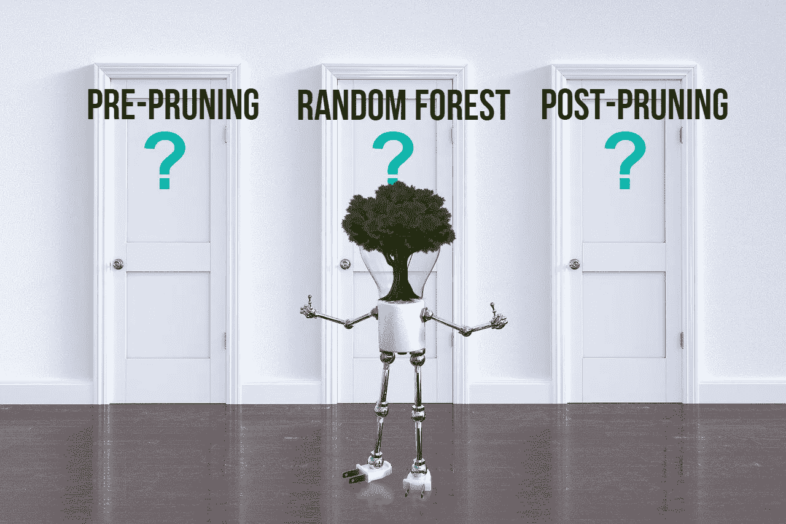
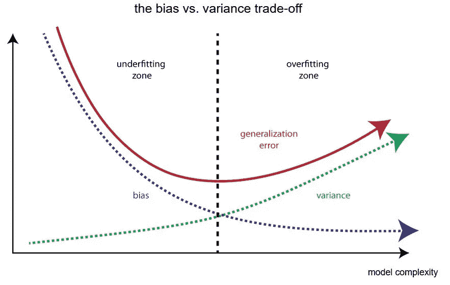
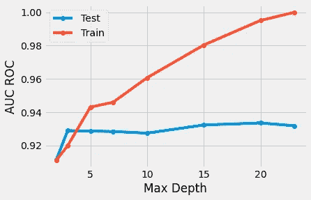
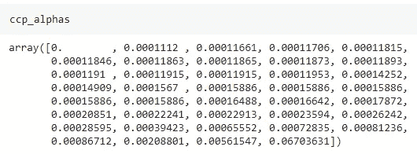
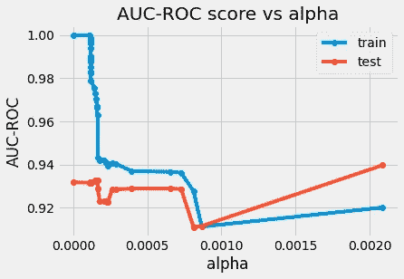
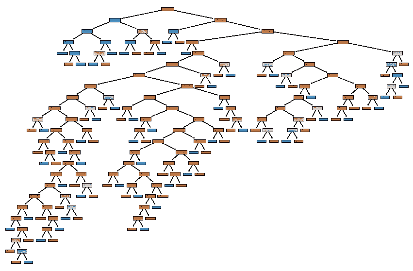
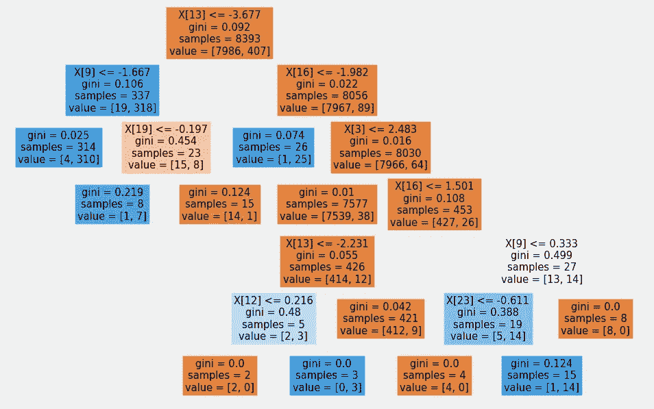

# 避免决策树过度拟合的 3 个技巧

> 原文：<https://towardsdatascience.com/3-techniques-to-avoid-overfitting-of-decision-trees-1e7d3d985a09?source=collection_archive---------0----------------------->

## 决策树的预剪枝、后剪枝和集成的实际实现



图片由来自[皮克斯拜](https://pixabay.com/?utm_source=link-attribution&amp;utm_medium=referral&amp;utm_campaign=image&amp;utm_content=3839456)的[皮特·林福思](https://pixabay.com/users/thedigitalartist-202249/?utm_source=link-attribution&amp;utm_medium=referral&amp;utm_campaign=image&amp;utm_content=3839456)拍摄

决策树是一种用于分类和回归任务的非参数监督机器学习方法。过度拟合是一个常见的问题，数据科学家在训练决策树模型时需要处理这个问题。与其他机器学习算法相比，决策树很容易过拟合。

## 你的决策树是否过拟合？

过度拟合是指模型完全符合训练数据，但无法概括测试中未发现的数据的情况。当模型记忆了训练数据的噪声并且未能捕获重要的模式时，过拟合情况出现。完美匹配的决策树对训练数据表现良好，但对看不见的测试数据表现不佳。



([来源](https://www.google.com/url?sa=i&url=https%3A%2F%2Ftowardsdatascience.com%2Fbias-and-variance-but-what-are-they-really-ac539817e171&psig=AOvVaw3D08-zRrjLyyleDVGes2WR&ust=1622541865558000&source=images&cd=vfe&ved=0CAIQjRxqFwoTCOC8rI3V8_ACFQAAAAAdAAAAABAP))，偏差-方差权衡

如果允许决策树训练到最大强度，模型将会过度拟合训练数据。有多种技术可以防止决策树模型过度拟合。在本文中，我们将讨论 3 种这样的技术。

```
***Technique to discuss in this article:* Pruning
** Pre-pruning
* Post-pruning*
Ensemble
** Random Forest***
```

# 什么是修剪？

默认情况下，决策树模型可以增长到其最大深度。修剪指的是一种删除决策树的部分以防止增长到其全部深度的技术。通过调整决策树模型的超参数，可以修剪树并防止它们过度拟合。

有两种类型的修剪:修剪前和修剪后。现在让我们来讨论对每种修剪技术的深入理解和实际操作。

# 预修剪:

预修剪技术指的是提前停止决策树的生长。预修剪技术包括在训练流水线之前调整决策树模型的超参数。决策树的超参数包括`**max_depth**`、`**min_samples_leaf**`、`**min_samples_split**` 可以被调整，以提前停止树的生长，防止模型过拟合。



(图片由作者提供)，AUC-ROC 分数与最大深度

从上面的图中观察到，随着 max_depth 训练的增加，AUC-ROC 分数连续增加，但是在 max depth 的值之后，测试 AUC 分数保持恒定。最佳决策树的最大深度值为 5。进一步增加最大深度值会导致过度拟合问题。

`**max_depth**`、`**min_samples_leaf**`、`**min_samples_split**`是决策树算法的其他超参数，它们可以被调整以获得健壮的模型。可以使用 GridSearchCV 技术的 sklearn 实现来为决策树模型找到最佳的超参数集。

(作者代码)

# 后期修剪:

后剪枝技术允许决策树模型增长到其最大深度，然后移除树分支以防止模型过度拟合。 ***成本复杂度剪枝(ccp)*** 是后剪枝技术的一种。在成本复杂性修剪的情况下，可以调整`**ccp_alpha**` 以获得最佳拟合模型。

Scikit-learn 包附带了使用函数`**cost_complexity_pruning_path()**`计算决策树的`**ccp_alpha**` 值的实现。随着`**ccp_apha**` 值的增加，树的更多节点被修剪。

成本复杂性削减(后期削减)的步骤如下:

*   将决策树分类器训练到其最大深度(默认超参数)。
*   使用函数`**cost_complexity_pruning_path().**`计算 ccp 阿尔法值



(图片由作者提供)，ccp 阿尔法值

*   用不同的`**ccp_alphas**` 值训练决策树分类器，并计算训练和测试性能得分。
*   绘制训练和测试分数的每个值为`**ccp_alphas**` 值。



(图片由作者提供)，AUC-ROC 评分 vs CCP _ 阿尔法斯

> 从上面的图中，CCPα= 0.000179 可以被认为是最佳参数，因为训练和测试的 AUC-ROC 分数分别为 0.94 和 0.92。

(作者代码)，后期修剪



(图片由作者提供)，**左:**未修剪的决策树，**右:**修剪后的决策树

# 集合—随机森林:

随机森林是通过引导多个决策树进行分类和回归的集成技术。随机森林遵循引导抽样和聚集技术，以防止过度拟合。

> 阅读下面提到的文章中的[，深入了解随机森林和其他合奏技术。](/improving-the-performance-of-machine-learning-model-using-bagging-534cf4a076a7)

[](/improving-the-performance-of-machine-learning-model-using-bagging-534cf4a076a7) [## 使用 Bagging 提高机器学习模型的性能

### 了解 Bootstrap Aggregation (Bagging)集成学习的工作原理，并实现随机森林 Bagging 模型…

towardsdatascience.com](/improving-the-performance-of-machine-learning-model-using-bagging-534cf4a076a7) 

可以使用 Scikit-Learn 库实现随机森林。您可以进一步调整随机森林算法的超参数，以提高模型的性能。`**n_estimator**`可以调整参数以减少模型的过拟合。

# 结论:

在本文中，我们讨论了防止决策树模型过度拟合的技术。预修剪和后修剪技术可以用来处理过拟合的问题。仅通过训练，具有默认超参数的随机森林模型不能完全减轻过度拟合的问题，因此需要进一步调整它。

# 参考资料:

[1] Scikit-Learn 文档:[https://sci kit-Learn . org/stable/auto _ examples/tree/plot _ cost _ complexity _ pruning . html](https://scikit-learn.org/stable/auto_examples/tree/plot_cost_complexity_pruning.html)

*喜欢这篇文章吗？成为* [*中等会员*](https://satyam-kumar.medium.com/membership) *继续无限制学习。如果你使用下面的链接，我会收到你的一小部分会员费，不需要你额外付费。*

[](https://satyam-kumar.medium.com/membership) [## 加入我的推荐链接-萨蒂扬库马尔媒体

### 作为一个媒体会员，你的会员费的一部分会给你阅读的作家，你可以完全接触到每一个故事…

satyam-kumar.medium.com](https://satyam-kumar.medium.com/membership) 

> 感谢您的阅读