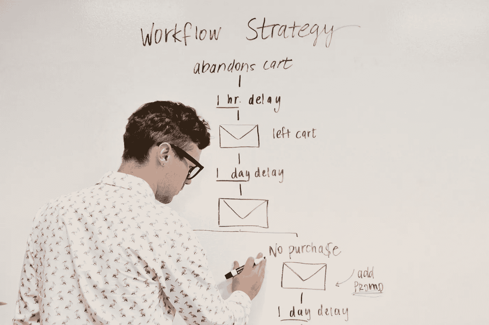

# 我成为数据科学家的三件事

> 原文：<https://towardsdatascience.com/3-things-i-did-to-become-a-data-scientist-87a57a14de5d?source=collection_archive---------5----------------------->

## 意见

## …在成为数据分析师的时候


内森·杜姆劳在[Unsplash](https://unsplash.com/s/photos/working?utm_source=unsplash&utm_medium=referral&utm_content=creditCopyText)【1】上拍摄的照片。

# 目录

1.  介绍
2.  掌握流行的机器学习算法
3.  执行端到端案例研究
4.  使用数据分析来掌握数据处理
5.  摘要
6.  参考

# 介绍

这篇文章是写给那些目前是数据分析师，并且希望转行从事数据科学的人的。从局外人的角度来看，有些人会说这两个角色很相似，但正如我们所知，除了一些相似之处，他们还需要非常不同的技能。那么，如何才能弥合这些角色之间的差距呢？这就是我将在这里解释的。虽然有一些资料通常会推荐研究生院、在线课程和教程，但我想重点介绍一些更具体和独特的事情，让你从最初的数据分析师过渡到现在的专业数据科学家。如果你想知道成为数据科学家 ***你*** 能做的三件事，请继续阅读。

# 掌握流行的机器学习算法


由 [Markus Spiske](https://unsplash.com/@markusspiske?utm_source=unsplash&utm_medium=referral&utm_content=creditCopyText) 在[Unsplash](https://unsplash.com/s/photos/algorithms?utm_source=unsplash&utm_medium=referral&utm_content=creditCopyText)【2】上拍摄的照片。

虽然这个主题看起来很明显，但实际上我发现自己首先学习的是逻辑回归、回归和决策树。我之所以说“*流行*”，是因为每隔一年左右，就会有一种新的算法，课程创建者还没有开发出可供你在学校学习的材料，因此，你需要自己去学习最新、最新、最好的算法和库。这个题目有两面，一面是掌握代码，一面是掌握理论。通常，在接受一些教育后，你会越来越深入地钻研代码，努力远离真正让算法工作的东西。因此，知道如何用描述性的方式，而不仅仅是编程性的方式来解释几乎前 10-20 个算法是很重要的。当你继续成为一名数据科学家时，你会意识到大多数算法库都以相同的方式工作，它们的实际代码相当简单，你开始*试错*，然后意识到你已经忘记了一些算法与另一个算法不同背后的理论，以及它在概念层面上的实际工作方式。

也就是说，这里有一些方法可以让你掌握这些算法。

*   ***作为一个行动项目*** ，我个人认为在卡片的正面写下算法名称，然后描述它如何工作，以及你将如何向自己和其他人解释它。
*   同样， ***作为下一个动作项*** ，你甚至可以画出算法是如何工作的，比如像决策树。当你实际写下并画出一些东西时，这种方法会让你更好地记住这些材料。
*   在编程方面，一个在比较几乎所有机器学习算法方面特别有用的库是 ***PyCaret*** ，作者是 [Moez Ali](https://medium.com/u/fba05660b60f?source=post_page-----87a57a14de5d--------------------------------) 。

因此，在你学会了基本算法之后，你会意识到一旦你成为一名专业的数据科学家，还有很多东西需要练习。所以，作为一个数据分析师，最好现在就去研究它们。更深入地说，许多课程、教程和教育材料将从相同的几个基本算法开始，但通常情况下，统计书籍或初学者的机器学习课程不会阐述更新和更受欢迎的算法，如 ***XGBoost*** 和 ***CatBoost*** 。

# 执行端到端案例研究



[活动发起人](https://unsplash.com/@campaign_creators?utm_source=unsplash&utm_medium=referral&utm_content=creditCopyText)在[Unsplash](https://unsplash.com/s/photos/project?utm_source=unsplash&utm_medium=referral&utm_content=creditCopyText)【3】上的照片。

对于这种体验，我们的目标不仅是执行一个端到端的流程，以模拟你获得工作后的正常流程，而且还要分享你的案例研究，以便招聘经理、招聘人员和未来的同事能够看到你的一些能力。作为一名数据分析师，您可能已经熟悉了定义业务问题和调查相关数据的过程。也就是说，你会比那些不习惯这个过程的人占优势。

> 你需要做的是:

*   找到一个共同的问题，比如预测股市
*   获取一些免费的模拟数据
*   确定您认为在模型中包含的重要特性
*   在相同的数据上测试大约 10 种算法，并比较每种算法的性能
*   用可视化来总结你的结果，这是你在专业环境中要做的

这个过程可以用多种方式展示。你可以在你的 ***Jupyter 笔记本*** 或类似的工具中展示这一切，并在笔记本的 markdown 中保存你的情节和讨论，或者在 Tableau、Excel 或 Google Data Studio 中创建单独的摘要视觉效果。展示您的案例研究的最常见方式是将其发布在 GitHub 上，大多数工程师、科学家和经理都习惯于这种格式和工具，因此在这里分享是首选。作为一名数据分析师，您可能会在组织数据、确定业务指标或 KPI(*关键绩效指标*)以及可视化结果方面有所帮助。

# 使用数据分析来掌握数据处理


照片由 [Myriam Jessier](https://unsplash.com/@mjessier?utm_source=unsplash&utm_medium=referral&utm_content=creditCopyText) 在[Unsplash](https://unsplash.com/s/photos/analytics?utm_source=unsplash&utm_medium=referral&utm_content=creditCopyText)【4】上拍摄。

数据科学最大的痛点可能就是数据的预处理或处理。这一步通常也需要最长的时间。作为数据分析师，您可以利用您的数据技能来确保用于模型的数据集处于最佳状态。正如我们上面讨论的那样，知道使用哪些算法可以节省您很多时间，因为例如，有时丢失数据可能会很麻烦，而一些算法会自动处理它。

> 以下是您可以在数据科学预处理步骤中利用数据分析技能的一些方法:

*   以多种方式输入缺失数据，如`mean`、`min`或`max`
*   将 CSV 文件合并在一起以创建最终数据集
*   利用 ***SQL*** 查询贵公司的表格，包括分组、案例和过滤器
*   将数据类型重新分配给某些特征(`‘object’`、`int`、`float`、`‘category’`等)。)

正如你所看到的，现在成为一名数据分析师，会让你在追求数据科学时获得一定的优势。人们常说，数据科学的大部分困难和压力实际上是数据处理，所以如果你能首先掌握它，或者至少熟悉它，你可能在成为数据科学家方面具有优势。

# 摘要

如果你想成为一名数据科学家，请确保你知道自己在做什么。虽然构建算法是更有趣的部分，但通常要记住的是，数据分析也是该过程的一个重要部分。我为了获得一份数据科学家的工作而做的另一件事是研究机器学习算法的理论——不仅仅是旧教科书和课程中列举的那些常见算法。当你探索最新的算法时，你也可能有优势，因为最有可能的是，它们正在改进以前的算法做得不好的地方，比如速度、准确性、数据类型、缺失值等等。最后，拥有一两个案例研究的作品集不仅对你自己有利，而且对更多的招聘经理和招聘人员更有吸引力。

> 总而言之，以下是我成为数据科学家所做的三件事，**希望你也能运用这些行动**:

```
* Master Popular Machine Learning Algorithms* Perform An End-to-End Case Study* Use Data Analytics to Master Data Processing
```

我希望你觉得我的文章既有趣又有用！如果您在成为数据科学家时利用了您的任何数据分析技能，请随时在下面发表评论— ***哪些技能？*** 。这对你现在的数据科学事业有帮助吗？你同意还是不同意，为什么？

请随时查看我的个人资料和其他文章，也可以通过 LinkedIn 联系我。我没有从属关系。

感谢您的阅读！

# 参考

[1]照片由[内森·杜姆劳](https://unsplash.com/@nate_dumlao?utm_source=unsplash&utm_medium=referral&utm_content=creditCopyText)在 [Unsplash](https://unsplash.com/s/photos/working?utm_source=unsplash&utm_medium=referral&utm_content=creditCopyText) 上拍摄，(2018)

[2]2016 年[马库斯·斯皮斯克](https://unsplash.com/@markusspiske?utm_source=unsplash&utm_medium=referral&utm_content=creditCopyText)在 [Unsplash](https://unsplash.com/s/photos/algorithms?utm_source=unsplash&utm_medium=referral&utm_content=creditCopyText) 上拍摄的照片

[3]2018 年[活动创作者](https://unsplash.com/@campaign_creators?utm_source=unsplash&utm_medium=referral&utm_content=creditCopyText)在 [Unsplash](https://unsplash.com/s/photos/project?utm_source=unsplash&utm_medium=referral&utm_content=creditCopyText) 上的照片

[4]照片由 [Myriam Jessier](https://unsplash.com/@mjessier?utm_source=unsplash&utm_medium=referral&utm_content=creditCopyText) 在[Unsplash](https://unsplash.com/s/photos/analytics?utm_source=unsplash&utm_medium=referral&utm_content=creditCopyText)(2020)上拍摄