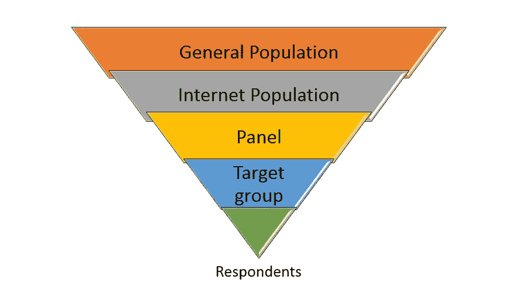

# 定量研究中影响数据质量的 3 件事

> 原文：<https://towardsdatascience.com/3-things-that-influence-your-data-quality-in-quantitative-research-c86c675aa4e9?source=collection_archive---------26----------------------->

## 市场研究中的常见限制—样本、数据收集和问卷调查

图片由 Emilian Vittoriosi 在 Unsplash 上提供

市场调研收集和分析数据和意见。有定量和定性技术。定量通常有问卷。

例如，意见池、消费者研究、品牌跟踪和长期行为研究。定性的是焦点小组、聊天室、深度访谈、演示或拼贴画。

定量研究的好处是相对快速客观。你选择你的目标人群，收集数据，处理数字，你就有了答案。

然而，需要注意一些质量限制:样本、数据收集方法和问卷。

# 1.样品

任何研究都需要一个样本定义。按样本是你要检查的总体的一部分。以下是在线调查的人口漏斗示例:

Ivona Fikejzlova 提供

在一个国家或市场中，有一个与每个人都相关的普通人群。然后，我们有了互联网人口，或者现在更确切地说是智能手机人口。

这些人一定在某个在线小组或数据库中。然后，我们有类别用户成为我们的受访者。

样本定义非常重要。它影响着你要为定量研究支付多少钱，以及你得到的数据质量如何。

根据你的业务，你可以在更广或更窄的范围内捕鱼。代表性的研究将复制人口景观。

你会有一个男女老少的样本。但是在商业上，你只关心你的品类用户或者潜在消费者。您有三个与样本相关的问题:样本定义过宽或过窄，以及样本大小。

## 1.定义过宽

*   否定:结果不能很好地反映你的消费群体。你会有很多不相关的数据。
*   正:可用于对比。如果你的目标人群是 18-25 岁的人，而你收集的是 26-35 岁的人的数据，你就能发现是否还有瞄准其他人群的潜力。如果您的样本范围更广，收集速度会更快。

## 2.太狭隘的定义

*   负面:很难快速收集这样的样本(例如，使用奥迪智能手机应用程序并计划在未来 12 个月内购买新奥迪汽车的 70 岁以上的人)。也比较贵。你可以过分限制你的目标群体。如果这个品牌是为年轻人(20-30 岁)设计的，但是感觉年轻的人(50 岁以上)会购买它，那么你的数据就不完全相关。
*   正面:狭义的定义应该会很好地击中类别用户。因此，他们的观点可以给你带来很多有用的见解，因为他们是从自己的经历中说出来的。

## 3.样本量

尺寸很重要。10 个人、100 个人或 1000 个人之间是有区别的。你无法避免数据差异。

如果你有足够的预算，去大样本量。数据越多对数据处理越好。可以做更精确的分割和统计操作。

小样本的一个问题是，如果你对一个相似的群体重复调查，你不一定会得到相同的结果。样本越大，数据越可靠。

# 2.数据收集

如果您决定需要收集一些数据，您可以选择如何收集。最常见的方法是在线调查。

它既便宜又容易。但是你也可以采用更老派的方法，比如纸笔、电话采访或平板电脑采访。

## 1.在线调查

*   否定:他们的限制是，他们相对较短，以防止人们放弃调查。所以，你只能问几个问题。数据质量取决于在线面板的质量。有些情况下，你想只问年轻女性，但男性以虚假的个人资料进入你的调查。
*   正面:回答者自己填。不应该有任何其他人的偏见。在线调查针对智能手机进行了优化，因此人们可以快速填写。您可以实时浏览回复。

## 2.离线调查

他们有点老派，但当你想检查整个人口时，他们仍然被认为是最有代表性的。

*   否定:它们很贵，而且要花很多时间。你需要一个面试官来填写调查问卷。面试官可能会偏向答案，填错答案，或者完全作弊。所以，你需要监督员来检查初始质量。
*   正面:你不依赖网络。您可以完全随机地收集数据。您可以控制收集数据的位置。

机构和小组经常声称他们有高质量的回答者和经验丰富的面试官。

但是你应该总是询问质量检查的方法。这两种数据收集方法都有其局限性和偏见，但质量检查对清理数据和获得可靠的结果有很大帮助。

# 3.调查表

最后，但同样重要的是，问卷会影响数据质量。它的结构带领受访者踏上旅程。

他们能立即感受到积极或消极。很多人不会起草中性问题。他们还经常询问不必要的个人信息，如收入、婚姻状况或宗教信仰。以下是一些良好问卷调查实践的提示:

问题应该:

*   容易理解
*   问一件事，不要一句话问多个问题
*   不冒犯
*   按逻辑顺序
*   仅询问必要的个人信息

对问题的回答应该:

*   有一个中间选择“既不是，也不是”
*   知识问题有“我不知道”选项
*   始终如一
*   回答问题，不要回答其他问题

一份糟糕的问卷会给你错误的数据。所以，保持简单，简短，有条理。

如果需要的话，在问题前面加上额外的解释文字。这将有助于人们理解你的意图。如果你进行线下数据收集，你必须向面试官简要说明他们应该如何提问。

# 最终想法

一切都从商业问题开始。

定量研究可以为你提供答案。但重要的是要有相关和高质量的数据。并非收集的每个数据都具有相同的商业价值。

数据告诉你一个故事，描述行为和观点。所以，一定要想好样本和收集方法。

然后你拿到漂亮的问卷，你就有了你需要的一切。

*附注:你应该会收到我的邮件。* [***在这里做！***](https://ivonahirschi.medium.com/subscribe)**如果你喜欢体验媒介的自己，可以考虑通过注册会员 ***来支持我和其他成千上万的作家* [**。每月只需 5 美元。**](https://ivonahirschi.medium.com/membership)****