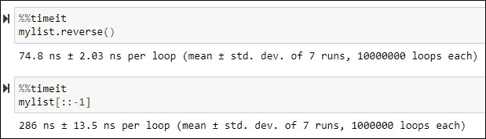
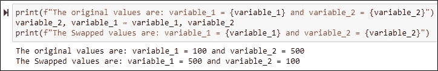
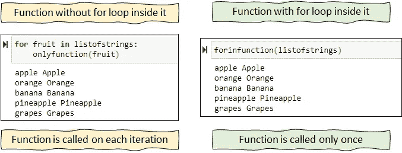
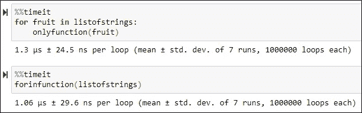
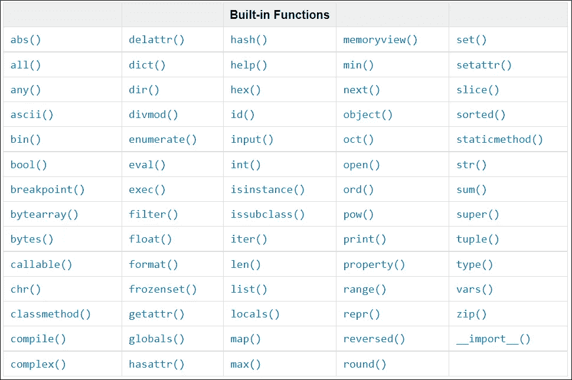

# 3 个节省时间的 Python 技巧

> 原文：<https://towardsdatascience.com/3-time-saving-python-tricks-a017f4215aeb?source=collection_archive---------3----------------------->

## 编程；编排

## ..这在我最近的项目中节省了 40%的时间！


由[贾斯汀·维内玛](https://unsplash.com/@justinveenema?utm_source=medium&utm_medium=referral)在 [Unsplash](https://unsplash.com?utm_source=medium&utm_medium=referral) 拍摄的照片

用 pythonic 的方式编程让我比别人快了⚡***1.8x***。

我最近的项目是一个系统的自动移动，图像处理和数据清理的结合。使用 Python 的内置函数和本文中的方法，我保持了代码的整洁和易于理解。

我在接下来的 3 分钟里解释的 3 个技巧将会大大节省你的宝贵时间⏳。

🎁一份 ***免费*** 机器学习认证可以额外外卖🏆来自这个故事！📚最后别忘了检查一下！

# 反转列表

在 python 中使用内置的`reverse()`方法来反转列表，而不是通过切片来完成。让我们从创建一个列表开始

```
# Create a list
mylist = list(np.arange(0,100))
```

颠倒列表的方法有:

```
# Reverse a list using built-in reverse()
mylist.reverse()# Reverse a list using slicing
newlist = mylist[::-1]
```

以上两种方法返回相同的输出，只是略有不同。内置方法`reverse()`改变了原来的列表，然而，列表的切片创建了一个新的列表。

我们来谈谈执行时间⏳。



reverse()和 list slicing | Image(按作者)的执行时间

显然，内置方法`reverse()`比列表切片的*快 3 倍。*

*在我的项目中，对于系统的自动移动，我有一个位置值的列表，并不是每次都有用。每次都需要列表开头的几个值和列表结尾的几个值。早期的程序是使用列表切片编写的，然而，我使用`reverse()`重写了它，以实现程序的更快执行。*

# *使用一行代码交换两个值*

*使用一行代码交换两个数字是一种真正的大技巧💡方式。与其他编程语言不同，Python 不需要使用临时变量来交换两个数字或值。*

*我举个简单的例子。*

```
*# Create two variables
variable_1 = 100
variable_2 = 500*
```

*要交换 variable_1 和 variable_2 的值，只需使用一行代码。*

```
*variable_2, variable_1 = variable_1, variable_2*
```

*所以，整个场景看起来像，*

**

*使用一行代码交换两个值|作者图片*

*我的项目并不简单。*

*我有一个字典，即键-值对，每个键都有一个值列表。因此，这个技巧节省了我工作中的多次迭代和复杂的数据转换，最终有助于减少执行时间。*

*在键-值对的情况下，不能直接使用键作为变量的名称。因此，这就是我在🛠️.所做的*

*只是为了简单起见，假设我的项目中的一个字典的名称为`md`。*

```
*md[key_2],md[key_1] = md[key_1],md[key_2]*
```

# *函数内部的 Use -for- loop*

*创建用户定义的函数是为了执行特定的任务。然而，我观察到，很多时候用户使用 for 循环多次迭代这些函数来执行特定的任务。*

*但是，在 for 循环中使用函数需要较长的执行时间，因为每次迭代都会调用函数。相反，如果 for 循环是在函数内部实现的，那么该函数将只被调用一次💡。*

*为了让文字更清晰，这里举个例子。让我们创建一个简单的字符串列表。*

```
*listofstrings = ["apple", "orange", "banana", "pineapple", "grapes"]*
```

*现在，创建两个函数，从简单的开始。*

```
*# Create a function without for loop inside the function
def onlyfunction(inputstring):
    newstring = inputstring.capitalize()
    outputstring = inputstring+" "+newstring*
```

*以及一个内部有一个`for`循环的函数。*

```
*# Create a function where for loop is inside the function
def forinfunction(listofstrings):
    for inputstring in listofstrings:
        newstring = inputstring.capitalize()
        outputstring = inputstring+" "+newstring*
```

*让我们使用这些函数，看看输出。*

**

*作者对两种功能|图像的使用*

*两个函数的输出是相同的🆒。*

*但是，故事并没有到此结束。是时候检查一下，哪一个更快⏰。*

**

*用于函数内部的循环|作者图片*

*当然，与没有 for 循环的函数相比，在函数中使用`for`循环会稍微快一些。*

*对于我的项目，我正在处理许多复杂的图像处理任务，在函数中使用 For 循环几乎比在每次迭代中调用相同的函数快 *1.5 倍* ⚡。*

*当然，这些都是从我的经验中得到的提示，但是对每个有类似情况的人都有用。*

*使用 Python 的内置函数将会提高程序的速度，同时保持代码的整洁和易于理解。*

***❓** 想了解更多关于**内置函数**？？*

*检查这个完整的列表。*

**

*[Python 内置函数](https://docs.python.org/3/library/functions.html) |图片作者*

*感谢您的宝贵时间！*

*您可以随时联系我，获得建设性的反馈或关于数据分析的精彩讨论。📈📊 📉*

***❓ *对通过项目学习感兴趣？？****

*在我的[***Github***](https://github.com/17rsuraj)回购上查了一堆项目。📚📚*

# *如何看完所有的中篇文章？*

*今天成为媒体会员&让⚡ ***无限制*** ⚡访问所有媒体故事。*

> *[在这里注册](https://medium.com/@17.rsuraj/membership)和[加入我的电子邮件订阅](https://medium.com/subscribe/@17.rsuraj)*

*当你在这里注册并选择成为付费媒介会员，我会从你的会员费中获得一部分作为奖励。*

# *如何获得免费的机器学习认证？*

*看看这个。*

*[](https://medium.com/analytics-vidhya/best-machine-learning-certification-for-free-b0984efc7303) [## 免费获得最佳机器学习认证

### 只投入 2 小时/天学习 Python，获得机器学习认证！

medium.com](https://medium.com/analytics-vidhya/best-machine-learning-certification-for-free-b0984efc7303)* 

*感谢您的阅读！投入你宝贵的时间！*