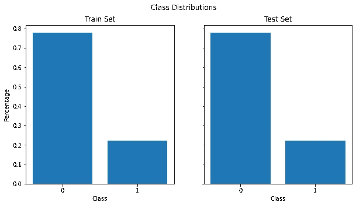

# 处理不平衡数据集的 3 个技巧

> 原文：<https://towardsdatascience.com/3-tips-for-working-with-imbalanced-datasets-a765a0f3a0d0?source=collection_archive---------23----------------------->

## 一些鲜为人知的处理那些讨厌的偏斜类分布的方法

来源( [Unsplash](https://unsplash.com/) )

真实世界的数据集有各种形状和大小。在某些时候，您会遇到目标类不平衡的数据集。这到底是什么意思？让我们来看一个来自 Kaggle 的[例子。该数据集包含信用卡客户及其付款违约的详细信息。](https://www.kaggle.com/uciml/default-of-credit-card-clients-dataset)

我们这里的目标变量是`default.payment.next.month`，一个二进制变量，如果客户没有违约，它的类是`0`，如果客户违约，它的类是`1`。首先，我们将检查每个类有多少条目。

绘制我们的阶级分布

我们的目标变量的类分布

我们从上图中看到，几乎 80%的目标变量都有一个类`0`。这就是所谓的不平衡数据集。一个类别的条目比另一个类别的条目多得多，导致类别分布不均匀。你可能会想，为什么这会是一个问题，为什么我们必须以不同的方式处理这个数据集？

想象一下，我们有一个非常简单的数据集分类器，不管我们传递给它什么数据，它总是能预测`0`。通过使用原始准确度作为我们的度量，我们将得到接近 80%的准确度。对于分类器来说，这似乎是一个不错的分数，但实际上它会产生很大的误导。我们根本无法预测什么时候有人拖欠他们的付款！让我们创建这个简单的分类器和一个随机森林分类器作为基线模型。

检查虚拟分类器和随机森林分类器的准确性

1.  **选择正确的指标**

这让我们确保使用合适的指标来衡量模型的性能。从我们前面看到的，准确性对于这个用例来说并不是一个合适的度量标准，因为我们的许多数据集条目都属于一个类。我们来看看几个备选方案。

**Precision —** Precision 是正确分类的阳性(`1`)样本数除以被分类为阳性(`1`)的样本总数。如果我们使用总是预测`0`的分类器，我们的精度也将是 0，因为我们没有将任何例子分类为阳性。

检查精确度分数

**召回—** 召回，也称为“敏感度”，是被正确分类的正例数除以正例总数。在我们的例子中，这将是我们的模型正确识别的值为`1`的条目的数量。使用我们的虚拟分类器，我们的召回率也将是 0。这个度量将帮助我们确定我们的模型是否正确地获得了数据集中的`1`条目，但是它仍然有一个主要的缺陷。如果我们的分类器总是预测每个例子的`1`，我们就能得到完美的回忆！另一方面，我们的精确度不会很高。我们需要这些指标之间的某种平衡来合理地评估我们的模型。

检查回忆分数

**F1 分数—**F1 分数是精确度和召回率之间的平衡。它由公式(2 *精度*召回)/(精度+召回)给出。该度量被证明适用于不平衡数据集，消除了普通精度度量的缺点。通过这个，我们应该能够以更好的方式评估我们的任何模型。

检查 F1 分数

**2。建立交叉验证策略**

我们不应该使用 scikit-learn 提供的默认 [train_test_split](https://scikit-learn.org/stable/modules/generated/sklearn.model_selection.train_test_split.html) ,而是应该尝试确保我们的分割准确地代表我们的目标变量的分布。一个非常简单的方法是在调用 train_test_split 函数时使用`stratify`参数。

绘制分割后数据的分布图

分成训练集和测试集后的类分布

进行这一小小的更改可以确保训练集和测试集遵循与原始数据集相同的分布。

另一种使交叉验证策略对类别不平衡更加稳健的方法是使用多个折叠或对数据的不同子集进行训练。为此，我们可以使用 [StratifiedKFold](https://scikit-learn.org/stable/modules/generated/sklearn.model_selection.StratifiedKFold.html) 和 [StratifiedShuffleSplit](https://scikit-learn.org/stable/modules/generated/sklearn.model_selection.StratifiedShuffleSplit.html#sklearn.model_selection.StratifiedShuffleSplit) 来确保我们仍然遵循目标变量的分布。

StratifiedKFold 会将我们的原始数据集分割成几个折叠，每个折叠都具有与原始数据集相似的分布。这意味着我们可以在每个褶皱上训练一个模型，同时仍然确保我们的分布保持一致。StratifiedShuffleSplit 还保留了我们的目标变量的分布，但在每次迭代中使用整个数据集，并且不将其拆分成折叠。

使用 StratifiedKFold 评估模型

**3。更改模型中的目标重量**

默认情况下，模型将为我们的目标变量中的每个类分配相同的权重。如果我们的数据集在其目标类中有一个相对均匀的分布，这就很好了。在我们的例子中，我们希望根据数据集的偏斜程度对每个类使用不同的权重。

我们应该如何确定每个类使用什么权重？许多分类器都有一个`class_weight`参数，你可以在这里传入一个类似`balanced`的字符串。这应该会为您传入的数据计算出适当的权重。如果没有，scikit-learn 还有一个[函数](https://scikit-learn.org/stable/modules/generated/sklearn.utils.class_weight.compute_class_weight.html)可以为我们计算这个。让我们看看如何在我们的模型中使用 class_weight。

训练模型时使用 class_weight

**结论**

我们看了 3 种不同的方法来帮助我们处理不平衡的数据集。

1.  为我们的任务选择合适的指标。我们已经看到，有时候，在评估一个模型时，像准确性这样的度量标准可能会非常误导人。
2.  使用良好的交叉验证策略。我们可以使用 StratifiedKFold 和 StratifiedShuffleSplit 等方法来确保我们的训练集和测试集遵循类似的分布。
3.  为你的目标类设置类权重，给少数类更多的权重。使用这种策略使我们的模型更加重视少数民族，可能有助于更好地对其进行分类。

有了这些策略，您应该能够在未来轻松处理不平衡的数据集。

感谢您的阅读！

您可以通过以下渠道与我联系:

*   [中等](https://zito-relova.medium.com/)
*   [领英](https://www.linkedin.com/in/zrelova/)。
*   [Github](https://github.com/zitorelova)
*   [卡格尔](https://www.kaggle.com/zitorelova)