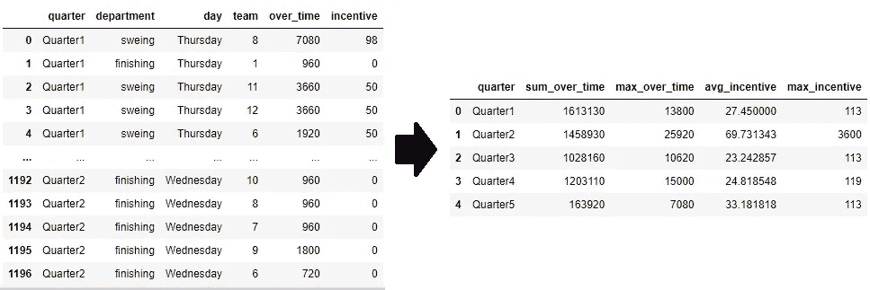

# 关于 Pandas Groupby Aggregation (vs SQL)的 3 个提示

> 原文：<https://towardsdatascience.com/3-tips-on-pandas-groupby-vs-sql-e6f85b07d6f0?source=collection_archive---------31----------------------->

## 如何在 Pandas groupby 和 aggregation 中生成与 SQL 相同的输出

**目录**

*   [按每列汇总](#5510)
*   [按 DataFrame.agg](#7d8b) 聚合**(推荐)**
*   [按字典和 DataFrame.agg](#1551) **(推荐)**

# 1.介绍

**“创世纪做了任天堂做不到的事情”**是 20 世纪 90 年代早期视频游戏市场上最经典但也是最有力的广告词之一。同样，**“SQL 做了熊猫做不到的事情”**每当我面对熊猫的任何数据争论问题时，这一直困扰着我，而这些问题可以通过简单的 SQL 轻松解决。

作为一名仍在学习 SQL 和 Python ML 包的数据分析师新手，我一直在寻找一些方法来从一种语言到另一种语言产生相同的输出。我希望这篇文章可以至少在聚合函数方面证明上述断言是错误的，表明**“Pandas 做 SQL 所做的事情(在某些时候)”。**

这篇文章的目标是**通过只使用 Pandas** 来获得相同的 SQL 输出结果。我们将使用一个名为`garments_simple`的简化数据集。原始数据集可以在 UCI 机器学习资源库( [**链接**](https://archive-beta.ics.uci.edu/ml/datasets/597) )找到。

```
**SELECT** team, sum(over_time) AS sum_over_time, max(over_time) AS max_over_time, mean(incentive) AS avg_incentive, max(incentive) AS max_incentive
**FROM** garments_simple
**GROUPBY** team
```

输出包含`over_time`的`sum` 和`max` 以及每个`quarter`分组的`incentive`的`mean` 和`max` 。



Raw 'garment_simple '(左)-> Output 'garment_agg '(右)

# 2.每列合计

这是聚合列的最简单和最容易的方法。

*   优点:容易、简单、易读
*   缺点:可能会很冗长

```
**# Make empty dataframe and groupby by quarter**
garment_agg = pd.DataFrame()
garment_group = garments_simple.groupby('quarter')**# Aggregate per column**
garment_agg['sum_over_time'] = garment_group['over_time'].sum()
garment_agg['max_over_time'] = garment_group['over_time'].max()
garment_agg['avg_incentive'] = garment_group['incentive'].mean()
garment_agg['max_incentive'] = garment_group['incentive'].max()**# Reset Index**
garment_agg = garment_agg.reset_index()
garment_agg
```

# 3.通过 DataFrame.agg 方法聚合

第二种方法可能更适合聚合，因为它通过对象列包装聚合。

*   优点:比第一种方法更简洁
*   **缺点:**如果列太多，可能会很冗长

```
**# Make empty dataframe and groupby by quarter**
garment_agg = pd.DataFrame()
garment_group = garments_simple.groupby('quarter')**# Add new columns by using .agg method**
garment_agg[['sum_over_time', 'max_over_time']] = garment_group['over_time'].agg(['sum','max'])garment_agg[['avg_incentive','max_incentive']] = garment_group['incentive'].agg(['mean','max'])**# Reset Index**
garment_agg = garment_agg.reset_index()
garment_agg
```

# 4.按字典和 DataFrame.agg 聚合

最后一个方法是创建包含所有聚合对象列和函数的`agg_dict`。您将能够根据`agg_dict`立即执行聚合。

*   **优点:**简洁，可读性强
*   **缺点:**需要额外的一行来替换多索引列名

```
**# Make empty dataframe and groupby by quarter**
garment_agg = pd.DataFrame()
garment_group = garments_simple.groupby('quarter')# Using dictionary to represent all the aggregation
agg_dict = {
    'over_time':['sum','max'],
    'incentive':['mean','max']
}**# Aggregate all at once**
garment_agg = garment_group.agg(agg_dict)
garment_agg**# Replace multi-index to singular index**
garment_agg.columns = [('_').join(column) for column in garment_agg.columns]
garment_agg = garment_agg.reset_index()
garment_agg
```

# 5.结论

熊猫`groupby`和集合函数在特征工程中经常使用。考虑到其简单性，推荐使用最后两种`DataFrame.agg`方法。希望这篇文章能帮助那些正在学习熊猫的人。

**完整的源代码可以在 这里找到 [**。**](https://github.com/brandon-park/medium_article/tree/main/pandas_groupby_vs_sql)