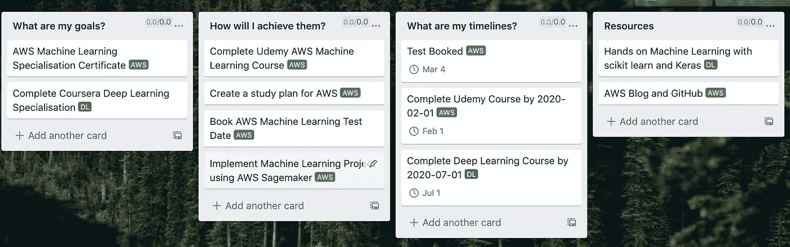

# 成为数据科学家的 3 个秘诀

> 原文：<https://towardsdatascience.com/3-tips-to-succeed-as-a-data-scientist-3f2c3c48555f?source=collection_archive---------31----------------------->

## [办公时间](https://towardsdatascience.com/tagged/office-hours)


由[Patrik gothe](https://unsplash.com/@p?utm_source=unsplash&utm_medium=referral&utm_content=creditCopyText)在 [Unsplash](https://unsplash.com/s/photos/education?utm_source=unsplash&utm_medium=referral&utm_content=creditCopyText) 上拍摄

我之所以想写这篇博文，是因为我非常清楚，作为一名数据科学家开始一份新工作可能会非常具有挑战性，尤其是如果你像我一样来自另一个行业，或者如果这是你的第一份工作。在这篇文章中，我想讨论一些我面临的主要困难，以及一些通用的提示和建议，让那些刚开始从事这一工作的人生活得更轻松。显然，这完全是基于我自己的经验，其他人可能面临不同的挑战，但我认为这些技巧足够通用，至少其中一些适用于开始从事数据科学工作的人。

有几件事我想特别谈谈，我认为它们非常重要。这些是:

*   **与利益相关方合作**
*   **分析工作流程**
*   **持续学习和发展**

## 与利益相关者合作

其中第一点可能是最重要的，并真正影响到后面的几点。与利益相关者一起工作是我最初挣扎的事情，我相信其他数据科学家也面临这个问题。它实际上源于数据科学家和利益相关者之间的知识不匹配，这是双向的。通常，利益相关者不具备深入的编码、分析或机器学习知识，数据科学家，特别是如果他们是业务新手，缺乏业务或特定领域的知识。简而言之，他们说的不是同一种语言。那么这有什么样的含义呢？

往好里说，它会导致一些令人困惑的对话，往坏里说，它会导致在错误的问题上浪费大量的时间。我一般会说，这取决于数据科学家，以确保他们了解利益相关者，特别是他们的目标和他们试图实现的目标。根据我的经验，来自涉众的疑问或问题通常会非常模糊，很难转化为一个分析性的问题或模型。好消息是，随着时间的推移，这变得越来越容易。

**我学到的东西**

*   ***试着用他们的语言说话*** 。我的意思是试着把你的解决方案框定在他们能理解的范围内。你可以实现一个具有 99%准确率的奇特模型，但这在商业术语中实际上意味着什么呢？尝试将您的分析解决方案与他们关心的 KPI 联系起来，或者表达收入方面的预期影响，每个人都理解金钱。[这里的](http://people.stern.nyu.edu/padamopo/blog/DataScienceTeaching/Lecture%206%20-%20Decision%20Analytic%20Thinking.pdf)就是这样做的一个例子。
*   ***使用简单的观想。*** 小提琴情节并不简单，即使它们看起来很棒，可以告诉你很多关于你的数据。(如果你的数据不符合正态分布，它们可能会让人们特别困惑，去做一个箱线图，甚至一个条形图，把更复杂的东西放在附录里。如果人们想了解更多细节，请指引他们到这里。)

**我的建议**

*   如果你认为项目不太可能成功，你可以说不:你总是可以考虑如何将原来的目标重新定义为一个相关的、可实现的目标，或者转移到一个新的问题上。如果你对你的角色不熟悉，问问你的团队成员他们是怎么想的。他们通常会建议你什么问题是可行的。当然，可能以前没有人研究过这个问题，所以有很大的不确定性。在这种情况下，我建议定义一些初步的探索性目标，如果结果看起来不乐观，愿意继续前进。这有助于避免在错误的问题上浪费太多资源。
*   ***定期与你的利益相关者交谈。你的工作是了解你的利益相关者想要什么，并确定它是否可行。你应该定期向你的利益相关者更新你工作的进展和可能的方向。他们可能会给你一些有用的见解和建议，让你理解你的结果。***
*   ***学会用非技术的方式解释事物。当你对利益相关者说话时，这是非常重要的。你需要考虑你的听众，他们是技术人员还是非技术人员？这适用于任何类型的交流，无论是演示、会议还是电子邮件。如果可能的话，提前知道这一点是很重要的，因为这可以帮助你设定你的解释水平。如果你不能让人们相信你所做的事情是有价值的，它很可能不会被实施。我仍然努力做到这一点，有时不用行话，但我想熟能生巧。使用良好的观想往往比书面或口头解释更有影响力。***
*   尝试围绕你的分析或结果展开一个故事。 这与上面的观点密切相关，但如果你能围绕这个问题编一个故事，这将是给你的作品留下持久印象的非常有效的工具。试着思考以下问题。你想解决的问题是什么？为什么重要？您的解决方案会对业务产生什么影响？
*   ***方案很少完美*** 。大多数时候，你无法实现一个完美的解决方案。您通常必须做出权衡，最终的解决方案也不是没有限制。很难决定哪种方法是正确的，但一般来说，我更喜欢最简单的解决方案(奥卡姆剃刀)。例如，如果你正在建模，至少在开始的时候坚持像逻辑回归这样简单的东西。根据我的经验，人们通常不愿意使用黑盒解决方案。您还可以利用 SHAP 或 LIME 等工具来提高模型的可解释性。最近，我一直在玩一个名为 [explainerdashboard](https://explainerdashboard.readthedocs.io/en/latest/) 的库，试图让我的模型更加透明。

## 分析工作流程

在本节中，我想描述一些分析工作的一般原则，以及我们如何设计可重复且更高效的工作流程。我使用的工具和工作流程会因任务的不同而稍有不同，但我将通过一个我处理过的问题类型的例子和一些我认为非常有用的工具来介绍。

这是一个轻微的题外话，但是对于任何希望成为数据科学家的人来说，第一个建议就是要擅长 SQL 。哪种风格并不重要，但精通 SQL 非常重要。我在目前职位上参与的所有项目都有一个共同点，那就是 SQL。我团队中的所有数据科学家每天都使用 SQL 进行分析工作。我们还试图提升技能并鼓励非数据科学家使用它，即使非常简单的查询也能提供强大的洞察力。好消息是学习 SQL 的基础知识非常容易。对于更高级的查询，我们通常只是建立在基本概念的基础上。当我提高 SQL 技能时，我发现一门课程非常有用，那就是关于 [Udacity](https://www.udacity.com/course/sql-for-data-analysis--ud198) 的这门课程。它涵盖了基础知识，并通过一个实际的案例研究进入了更高级的主题。我向任何想提高 SQL 技能的人强烈推荐它。我还会建议你仔细研究一下这些问题中的一些问题，因为它们在复杂性上可能更接近你在现实世界中会发现的问题。

我认为值得一提的另一点是，花一些时间去真正理解你公司的数据。如果你足够幸运，在一家拥有优秀数据工程师和数据基础设施的公司，那么这一步会容易得多。一般来说，回答下面的一些问题会使查询的构建变得更加容易，并且减少出错的机会。(如果您对数据仓库有一个良好的 [ERD](https://www.guru99.com/er-diagram-tutorial-dbms.html) ，那么许多问题都可以得到解答)。

*   ***你有可能用到的关键表有哪些？***
*   ***表格是如何构成的？即列的数据类型是什么？***
*   ***表格之间是如何关联的？即一对一、一对多的关系(对于 joins 很重要:我以前被这个刺痛过)***
*   ***缺失值是如何记录的？例如，如果用户今天没有付款，记录为空还是 0？***
*   表格是如何以及何时更新的？

好了，我们已经谈了一点 SQL 的重要性。在我们开始分析并开始用 SQL 或 Python 编码之前，写下我们需要做什么的**高级计划**是一个非常好的主意。当开始一个项目时，这是必须的，因为它可以防止你偏离项目的主要目标。为此我一般用[特雷罗 。当开始一个新项目时，我会创建一个白板，通常会有一个 ***背景列表、一个待办事项列表、一个正在进行的列表和一个已完成列表*** 。然后，我会制作几张卡片，概括介绍问题、目标和可交付成果。让你的利益相关者也加入这个讨论板通常是一个好主意，这可以为会议上的讨论点提供基础。现在，您也可以使用另一个工具来完成这项工作，但要点是，我们已经清楚地列出了项目的一些关键信息。](https://trello.com/danielfoley15/recommend)

我们举一个项目的例子，说说工作流程和我用的一些工具。假设我有一个需要做一些探索性建模的项目，这个工作流程会是什么样子？

假设我已经在 Trello 创建了一个高级计划。开始分析时，我要做的下一件事是创建一个 **git repo** 。我确信我不需要向你们任何人解释版本控制的重要性，但是这是分析项目的一个重要组成部分。同样，我通常用我最常用的库创建一个新的 **Conda 环境**。你可以更进一步，使用一个 **docker 容器。**为了保持一致的项目结构，我们还可以使用**[**cookiecutter**](https://drivendata.github.io/cookiecutter-data-science/)**来创建典型数据科学项目的模板。创建一个像这样的标准化项目模板对你自己和团队中的其他人都很有帮助，尤其是当他们要审查你的工作时。我做大部分的编码工作，特别是在 J **upyter 笔记本或 Jupyter 实验室**中的探索性分析。您还可以为 Jupyter 笔记本电脑添加不同的 Conda 环境，这使得在多种环境之间切换变得非常简单。下面的代码展示了如何创建一个新的 Conda 环境，将其添加到 Jupyterlab，并设置 cookiecutter 数据科学模板。如果您的基础环境中安装了 Jupyterlab，那么您可以启动 Jupyterlab 并在 conda 环境之间轻松切换。****

```
**conda create --name ds_env python=3.7
conda activate ds_envconda install -c conda-forge cookiecutter
cookiecutter https://github.com/drivendata/cookiecutter-data-scienceconda install -c anaconda ipykernel
python -m ipykernal install --user --name=ds_env**
```

****如果我处理大量数据或需要更多计算，我倾向于使用 AWS Sagemaker，而不是在本地工作。 如果您正在开发的模型将在 AWS 上投入生产，这将特别有用。和同事分享笔记本也很容易。AWS 上有很多很好的机器学习功能，例如各种内置模型、自动超参数调整和与 git 的集成，但我不会在这篇文章中深入讨论这些，但如果你感兴趣，AWS 有一个很棒的[博客](https://aws.amazon.com/blogs/machine-learning/category/artificial-intelligence/sagemaker/)，它详细描述了其中一些功能。****

****如果我正在做的项目更多地与 ETL 相关或者涉及到改变生产代码，我倾向于使用 [**VScode**](https://code.visualstudio.com/) 。我是这个 IDE 的忠实粉丝，你可以添加许多扩展，让你的生活更轻松。添加 python 扩展后，我们获得了一些真正有用的功能，如调试器(非常有用)、语法高亮、自动完成和智能感知。您还可以直接从 IDE 中使用 Jupyter 笔记本，这是一个额外的好处。****

****我最近开始使用的另一个工具是 [**MLflow**](https://mlflow.org/) 。它是管理机器学习生命周期的工具。总的来说，它使跟踪您的模型实验更加容易，提高了可重复性，并使部署更加容易。****

****我经常使用的最后一个工具是[C**on flow**。你可以在这里使用任何你想要的东西，只要你在记录你的工作。这不仅对我们自己很重要，对向团队成员和其他同事展示我们的工作方法和成果也很重要。拥有这个团队已经完成的工作的中央存储库是非常有用的，并且可以非常容易地共享团队正在进行的不同项目的见解和结果。我建议的另一件事是大量记录你的代码，不管是 SQL，R，Python，还是其他。我不知道有多少次我回头看一个查询或一段代码，不知道我到底在做什么。写注释，特别是对于复杂的逻辑。以后你会感谢自己的，我保证。](https://www.atlassian.com/software/confluence)****

******我使用的主要工具汇总******

*   *******特雷罗*******
*   *******Git*******

*   ********康达环境/ Docker。********
*   ********Jupyter 实验室/ Sagemaker / VSCode********
*   ********合流********

## *****持续学习和发展*****

*****我想讨论的最后一个话题是，数据科学家需要不断学习。作为一名数据科学家，渴望并愿意获取知识是非常重要的。数据科学是一个新兴的广阔领域，几乎不可能知道所有的事情，但随着时间的推移逐渐获得越来越多的知识对你的职业生涯将是无价的。我看到一些文章推荐数据科学家专攻某个特定领域，以确保他们对雇主来说是一个有吸引力的潜在客户。虽然我不一定不同意这一点，但我确实认为，在专注于一个领域之前，先在几个不同的领域获得经验可能更重要，尤其是在你的公司内部。为了发展你的技能，我建议做的一件事是制定一个 ***发展计划*** 。*****

*****列出你想学习或改进的领域或工具是帮助你提高技能的好方法。我建议为自己制定一个高水平的发展计划，列出你希望在未来 6 个月到 1 年内实现的目标。在我的公司，我们被鼓励制定发展计划，但这是你可以自己做的事情。但是，与您的经理分享这一点可能是个好主意，因为他们可能会为您提供培训和项目来帮助您实现这些目标。如果你想进入数据科学领域，这也是一个很好的练习，可以帮助你确定你需要努力的领域。*****

*****例如，对我个人来说，在接下来的一年里，我希望提高我对云基础架构的了解，特别是 AWS。我想努力获得 **AWS 机器学习专业证书**。我也想提高我的深度学习知识。我是在线课程的忠实粉丝，正计划参加 Coursera 的**深度学习专业课程。通常，在完成课程后，我喜欢尝试并创建一个个人项目来巩固我所学的主题。陷入一个项目是测试你理解能力的一个很好的方式，并且会帮助你更长时间地记住信息。*******

*****例如，我的高级发展计划中的这两个目标如下图所示。我制定了我的高层次目标，列出了我计划如何实现它们，我的关键时间表是什么，以及我认为会在这个过程中帮助我的任何资源。*****

**********

*****示例:高级发展计划*****

*****除了发展计划之外，当我试图学习新的东西时，我通常还会做一些事情。希望你也能发现其中一些有用的提示。*****

*****包括我在内，人们最纠结的一件事就是如何开始。即坐下来研究或解决问题。这些事情很难，总的来说，我们的大脑很懒，他们不喜欢做需要努力的事情。为了克服这一点，我经常尝试让 ***给自己做工作的*** 某种奖励。这可能就像工作一小时后喝杯咖啡或看一段 youtube 视频一样简单。这听起来很傻，但它通常会让开始变得容易一点。*****

*****这似乎是显而易见的，但是要找到与你所学的和你个人兴趣相关的 ***项目。*** 例如，如果你正在学习随机森林，并且你喜欢篮球，使用随机森林来预测篮球比赛结果。这给你一个更好的机会坚持下去，因为你会更喜欢它。你也可能对数据有一些很好的见解，因为你已经有了一些领域知识。*****

*****我最喜欢的学习方式一直是在线课程、书籍和个人项目的结合。以下是我过去使用过的资源列表，我发现这些资源对于学习与机器学习、数据科学和编程相关的主题特别有用。*****

*******书籍*******

*   *****Aurelien Geron***:****这本书到处都值得推荐。它包含理论和代码的完美结合，让你用 python 估算算法。我还没有看完深度学习部分，但期待着阅读它。******
*   *****Christopher Bishop 著 [***模式识别和机器学习***](https://www.amazon.co.uk/gp/product/0387310738/ref=as_li_tl?ie=UTF8&camp=1634&creative=6738&creativeASIN=0387310738&linkCode=as2&tag=mediumdannyf1-21&linkId=9fde0d314e134f9c89a46f9264704c98)***:****这本书并不容易阅读，但它包含了你将会遇到的主要机器学习算法的真正深入的推导和解释。当我学习 k-means 和高斯混合模型时，这本书很有帮助。******
*   *****[***商业数据科学***](https://www.amazon.co.uk/gp/product/1449361323/ref=as_li_tl?ie=UTF8&camp=1634&creative=6738&creativeASIN=1449361323&linkCode=as2&tag=mediumdannyf1-21&linkId=1948816046ea758068cb647fe639873c)***:****这是一本开发商业数据科学直觉的好书。它还讨论了机器学习背景下的期望值框架，我发现这非常有用。******
*   *****[***数据科学家实用统计学作者 Peter Bruce:***](https://www.amazon.co.uk/gp/product/149207294X/ref=as_li_tl?ie=UTF8&camp=1634&creative=6738&creativeASIN=149207294X&linkCode=as2&tag=mediumdannyf1-21&linkId=9061a9c6b82d1ff79d24b1d68ecbfd4b) *作为数据科学中主要统计概念的修正，确实有用。我用这个来修改数据科学面试。******
*   *****[***数理经济学的基本方法***](https://www.amazon.co.uk/gp/product/0071238239/ref=as_li_tl?ie=UTF8&camp=1634&creative=6738&creativeASIN=0071238239&linkCode=as2&tag=mediumdannyf1-21&linkId=c2c0e7ca952f42655f42c2a91ab79339)***:****虽然这本书有经济学的一面，但它包含了几乎所有你在数据科学中会遇到的数学，除了真正高级的东西。如果你想重温你的线性代数，微积分和最优化，我不能推荐这本书。它帮助我通过了硕士考试。******

*******在线课程*******

*   *****[***【data camp】***](https://www.datacamp.com?tap_a=5644-dce66f&tap_s=1342609-b18109&utm_medium=affiliate&utm_source=danielfoley)***:****我在这里上过很多课程，特别喜欢视频和编码练习的结合。他们也有一些非常有趣的项目，你可以尝试一下。******
*   *****[***贝叶斯机器学习方法***](https://click.linksynergy.com/link?id=z2stMJEP3T4&offerid=759505.11503135374&type=2&murl=https%3A%2F%2Fwww.coursera.org%2Flearn%2Fbayesian-methods-in-machine-learning)***:****贝叶斯机器学习不同应用的绝佳课程。它是上述模式识别和机器学习的良好补充，因为它们涵盖了一些相同的主题。******
*   *****[***机器学习专用数学***](https://click.linksynergy.com/link?id=z2stMJEP3T4&offerid=759505.11973317664&type=2&murl=https%3A%2F%2Fwww.coursera.org%2Fspecializations%2Fmathematics-machine-learning)***:****如果你的数学有点生疏，我会去看看这个课程。它们涵盖了你在开始进入机器学习算法之前需要知道的一些主要话题。******
*   *******Udacity:** [**用于数据分析的 SQL**](https://www.udacity.com/course/sql-for-data-analysis--ud198)**:***一个关于 SQL 的很棒的课程，介绍更高级的东西。******

*****注意:这篇文章中的一些链接是附属链接。*****

*****好了，这就是我对成功成为一名数据科学家的提示和建议。希望您发现这很有用，它们可以帮助您提高作为数据科学家的技能。请随意查看下面我的个人网站或在 Linkedin 上联系。*****

*****<https://www.datascientistguide.com/> *****