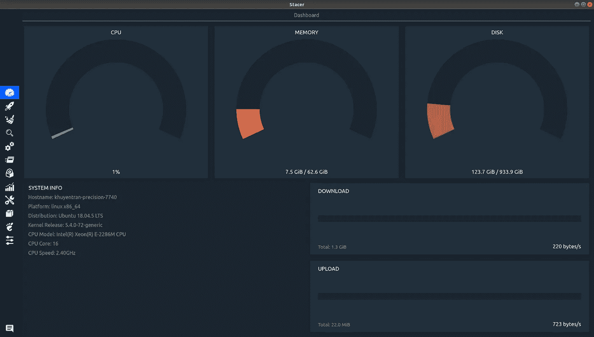
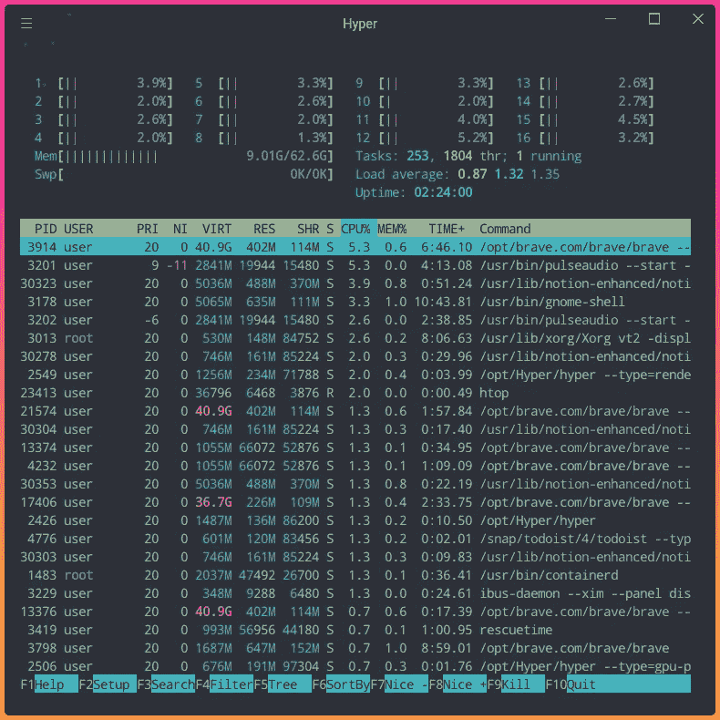
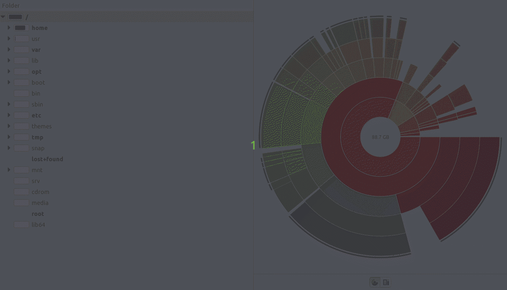
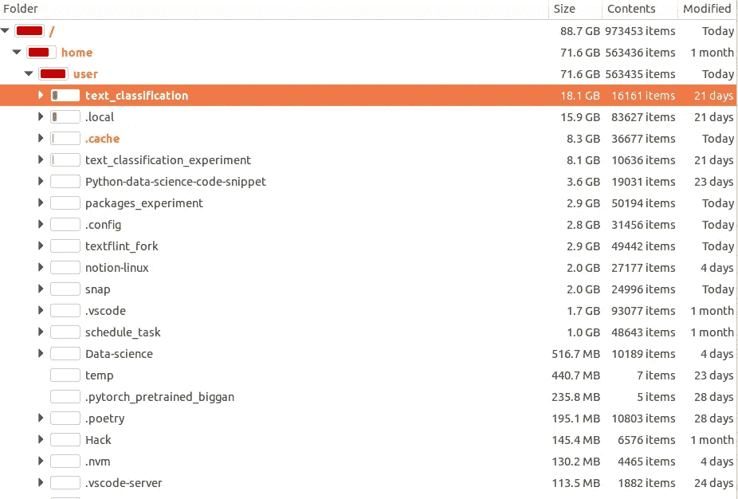
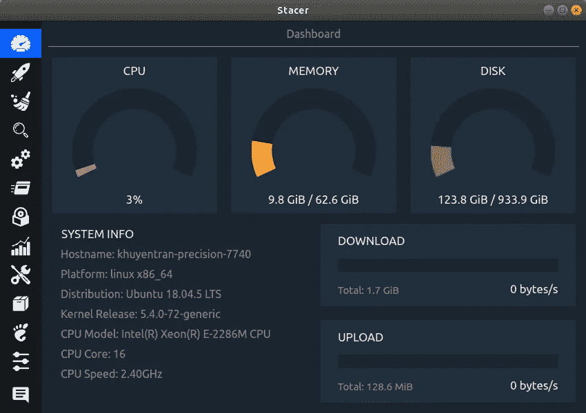
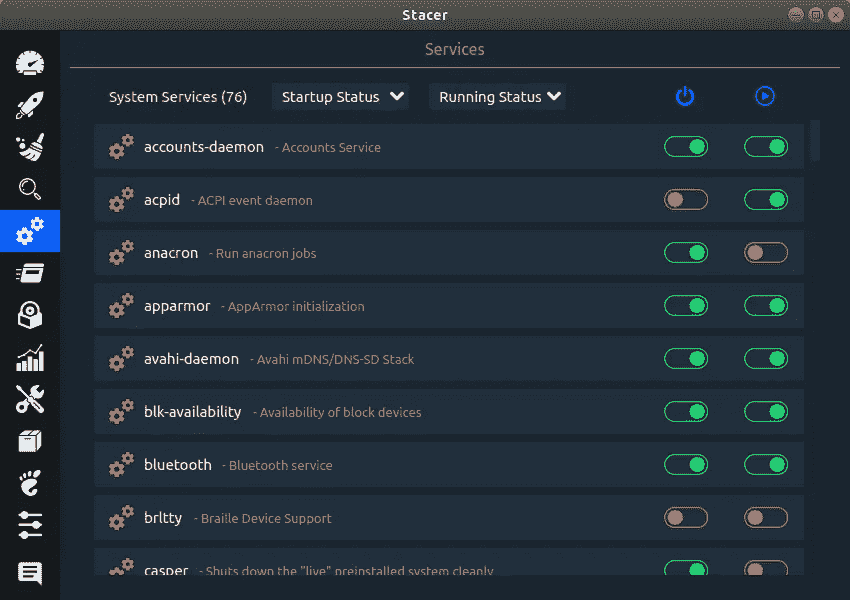
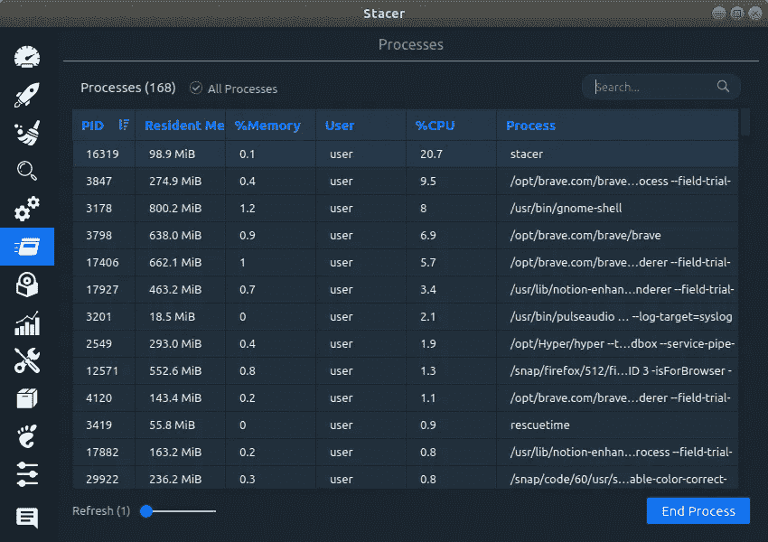
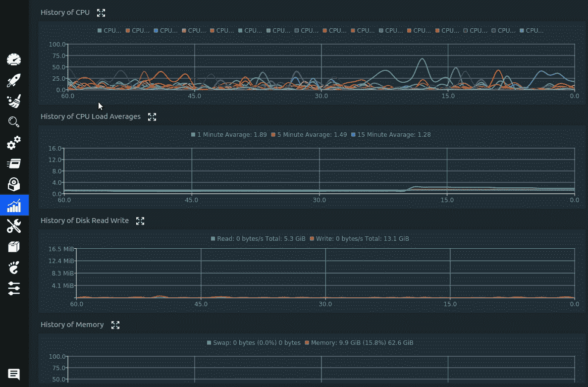
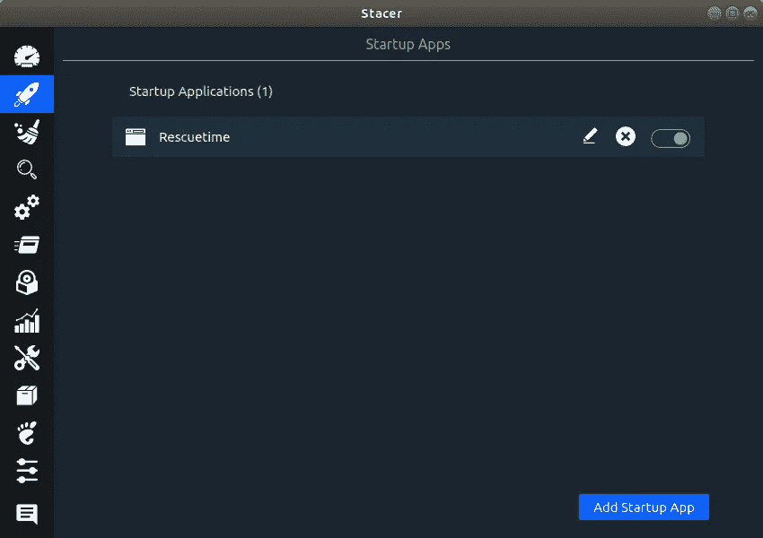
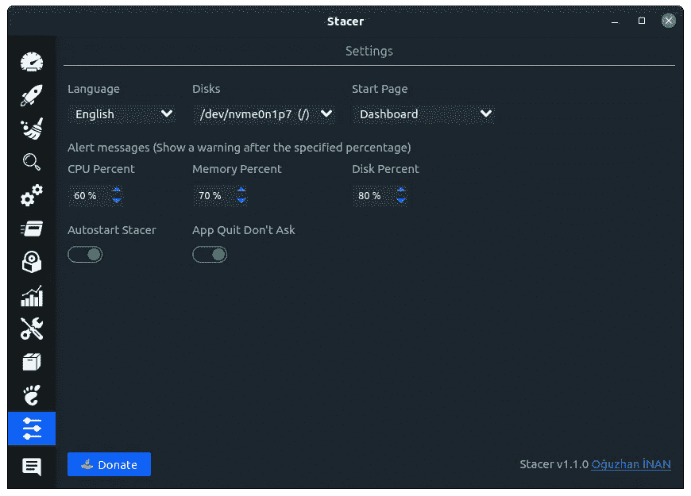

# 监控和优化您的 Linux 系统的 3 个工具

> 原文：<https://towardsdatascience.com/3-tools-to-monitor-and-optimize-your-linux-system-c8a46c18d692?source=collection_archive---------4----------------------->

## 用这三个工具控制你的机器



作者图片

# 动机

如果您是 Linux 用户，您可能想知道一些关于您的计算机的重要信息，例如:

*   系统的 CPU 使用率、内存使用率和磁盘使用率
*   系统信息
*   每个文件夹或文件的磁盘使用情况，以及上次使用它们的时间。
*   正在运行的进程的内存和 CPU 消耗
*   启动应用程序

了解这些信息将使您能够优化您的系统。

在这篇文章中，我将向你展示 3 个工具，它们可以让你做上面所有的事情，甚至更多！

# htop -一个交互式进程查看器

htop 是一个交互式流程查看器。htop 允许您查看与命令行相关的信息，例如内存、CPU 消耗以及它已经运行了多长时间。

每当我注意到我的计算机速度变慢，并想找出哪些进程对速度有重大影响时，我经常使用这种方法。我还使用它来监控运行程序或训练模型时使用了多少内核和多少内存。

大多数发行版中都有 htop 的软件包。要运行 htop，请键入

```
htop
```

您应该会看到类似下面的内容:



作者图片

在上图中，命令按 CPU%排序。似乎进程`/opt/brave,com/brave/brave`在所有正在运行的进程中占用了最多的 CPU 资源。

可以尝试几种快捷方式:

*   `F4`:仅显示名称与输入文本匹配的进程
*   `F5`:把流程之间的关系布置成一棵树。键入`+`或`-`展开或折叠子树。
*   `F6`:在排序视图上，选择一个字段进行排序。
*   `Home`:滚动到进程列表的顶部，选择第一个进程。
*   `End`:滚动到进程列表底部，选择最后一个进程。

点击查看所有快捷方式[列表。](https://manpages.debian.org/testing/htop/htop.1.en.html)

# Baobab —磁盘使用分析器

如果你想得到你的磁盘使用情况的图形展示，试试 [Baobab](http://www.marzocca.net/linux/baobab/) 。我经常使用这个工具来找出哪些应用程序占用了大量磁盘空间，但已经有一段时间没有使用了。了解这一点有助于我清理不再需要的文件或文件夹。

和 htop 一样，Baobab 也可以在大多数发行版中获得。要运行 Baobab，请键入

```
baobab
```

您应该会看到如下所示的内容:

通过使用图表来可视化每个文件夹和文件的磁盘使用情况，我们可以更好地了解计算机中哪些文件夹或文件占用了最多的磁盘空间。



作者 GIF

我们还可以看到文件夹或文件的大小，它们有多少个文件，以及它们最后一次被修改是什么时候。



作者图片

# Stacer —系统监视器和优化器

[Stacer](https://github.com/oguzhaninan/Stacer) 是目前为止我介绍的三个工具中最让我兴奋的一个。它允许您监控许多重要信息，例如:

*   系统信息
*   下载和上传速度



作者图片

*   搜索
*   系统服务



作者图片

*   流程。你可以把这看作是`htop`的简单版本。即使它没有像`htop`给你那么多的选择，但它更容易使用和理解。



作者图片

*   已安装的软件包
*   CPU 和内存的历史



作者 GIF

Stacer 还允许您通过以下方式优化您的计算机:

*   指定电脑唤醒时要启动的应用程序



作者图片

*   清洁系统
*   在 CPU 百分比、内存百分比和磁盘百分比低于特定百分比后发送警报消息



作者图片

还有更多！

你可以在这里找到如何安装堆垛机。

# 结论

恭喜你！您刚刚学习了如何使用 htop、Baobab 和 Stacer 来监控和优化您的 Linux 机器。对您的机器有更多的控制将使您能够优先运行哪些任务，并删除不必要的应用程序或进程。

我喜欢写一些基本的数据科学概念，并尝试不同的算法和数据科学工具。你可以在 LinkedIn 和 Twitter 上与我联系。

如果你想查看我写的所有文章的代码，请点击这里。在 Medium 上关注我，了解我的最新数据科学文章，例如:

</rich-generate-rich-and-beautiful-text-in-the-terminal-with-python-541f39abf32e>  </create-a-beautiful-dashboard-in-your-terminal-with-wtfutil-573424fe3684>  </understand-your-csv-files-from-your-terminal-with-xsv-65255ae67293>  </how-to-create-and-view-interactive-cheatsheets-on-the-command-line-6578641039ff> 