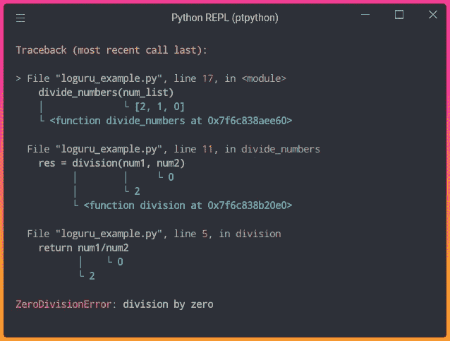
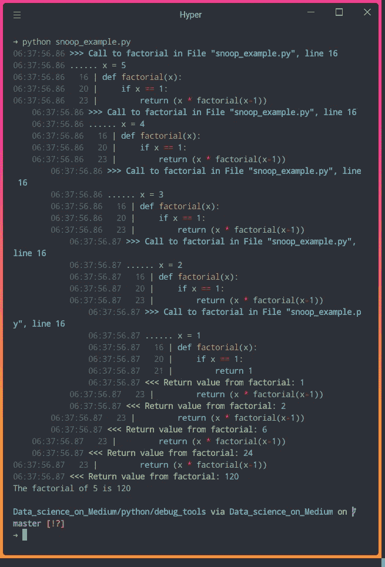
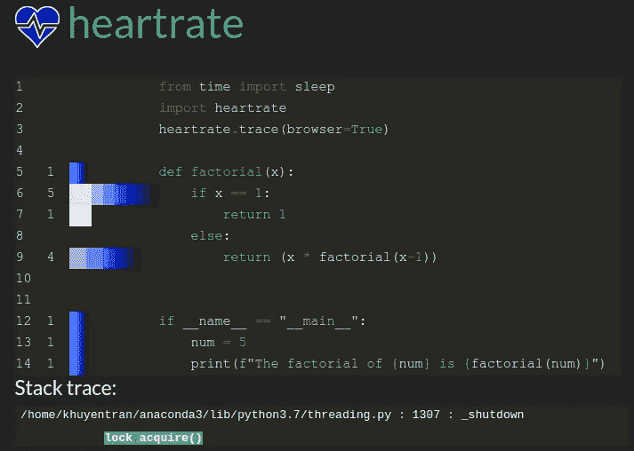

# 3 个跟踪和可视化 Python 代码执行的工具

> 原文：<https://towardsdatascience.com/3-tools-to-track-and-visualize-the-execution-of-your-python-code-666a153e435e?source=collection_archive---------0----------------------->

## 避免在一行代码中调试时的麻烦

# 动机

您是否见过如下所示的错误输出:

```
2 divided by 1 is equal to 2.0.
Traceback (most recent call last):
  File "loguru_example.py", line 17, in <module>
    divide_numbers(num_list)
  File "loguru_example.py", line 11, in divide_numbers
    res = division(num1, num2)
  File "loguru_example.py", line 5, in division
    return num1/num2
ZeroDivisionError: division by zero
```

并希望输出能更容易理解，如这里所示？



作者图片

您可能还想实时可视化哪些代码行正在执行以及它们执行了多少次:


作者 GIF

如果是这样的话，这篇文章将为你提供实现上述目标的工具。这三个工具是:

*   Loguru —打印更好的异常
*   snoop —打印函数中正在执行的代码行
*   心率-实时可视化 Python 程序的执行

使用这些工具只需要一行代码！

# Loguru —打印更好的异常

Loguru 是一个旨在让用 Python 登录变得有趣的库。Loguru 提供了许多有趣的功能，但我发现最有用的一个功能是能够**捕捉意外错误**和**显示哪个变量值导致代码失败**。

要安装 Loguru，请键入

```
pip install loguru
```

为了理解 Loguru 是如何有用的，想象你有两个函数`division`和`divide_numbers`，函数`divide_numbers`被执行。

注意`combinations([2,1,0], 2)`返回`[(2, 1), (2, 0), (1, 0)]`。运行上面的代码后，我们得到了这个错误:

```
2 divided by 1 is equal to 2.0.
Traceback (most recent call last):
  File "loguru_example.py", line 17, in <module>
    divide_numbers(num_list)
  File "loguru_example.py", line 11, in divide_numbers
    res = division(num1, num2)
  File "loguru_example.py", line 5, in division
    return num1/num2
ZeroDivisionError: division by zero
```

从输出中，我们知道行`return num1/num2`是错误发生的地方，但是我们不知道`num1`和`num2`的哪个值导致了错误。幸运的是，这可以通过添加 Loguru 的`logger.catch`装饰器来轻松跟踪:

输出:


作者图片

加上`logger.catch`，异常就好理解多了！原来误差发生在用`2`除以`0`的时候。

# snoop —打印函数中正在执行的代码行

如果代码中没有错误，但我们想弄清楚代码中发生了什么，该怎么办？这时 snoop 就派上了用场。

[snoop](https://github.com/alexmojaki/snoop) 是一个 Python 包，它通过只添加一个装饰器来打印正在执行的代码行以及每个变量的值。

要安装 snoop，请键入:

```
pip install snoop
```

让我们假设我们有一个名为`factorial`的函数，其中[寻找一个整数](https://www.programiz.com/python-programming/recursion)的阶乘。

输出:

```
The factorial of 5 is 120
```

为了理解为什么`factorial(5)`的输出是`20`，我们可以在函数`factorial`中添加`snoop` decorator。

输出:



作者图片

在上面的输出中，我们可以查看变量的值以及执行了哪一行代码。现在我们可以更好地理解递归是如何工作的了！

# 心率-实时可视化 Python 程序的执行

如果你想直观的看到哪些行被执行了，执行了多少次，试试 heartrate。

[心率](https://github.com/alexmojaki/heartrate)也是 snoop 的创作者创作的。要安装心率，请键入:

```
pip install heartrate
```

现在让我们在之前的代码中添加`heartrate.trace(browser=True)`。这将打开一个浏览器窗口，显示调用过`trace()`的文件的可视化。

当您运行上面的代码时，应该会弹出一个新的浏览器。如果没有，去 [http://localhost:9999](http://localhost:9999/file/?filename=heartrate_example.py) 。您应该会看到如下所示的输出:



作者图片

酷！条形图显示被点击的线路。越长的条形意味着点击次数越多，越浅的颜色意味着越新。

从上面的输出中，我们可以看到程序执行了:

*   `if x==1` 5 次
*   `return 1`曾经
*   `return (x * factorial(x-1))` 4 次

输出是有意义的，因为`x`的初始值是 5，并且该函数被重复调用，直到`x`等于`1`。

现在让我们看看使用心率实时可视化 Python 程序的执行是什么样子的。让我们添加`sleep(0.5)`以便程序运行得慢一点，并将`num`增加到`20`。


作者 GIF

厉害！我们可以实时看到哪些代码行正在执行，以及每一行执行了多少次。

# 结论

恭喜你！您刚刚学习了 3 种工具来跟踪和可视化 Python 代码的执行。我希望在使用这三个工具时，调试对你来说不会那么痛苦。既然这些工具只需要一行代码，为什么不试试看它们有多大帮助呢？

随意发挥，并在这里叉这篇文章的源代码:

<https://github.com/khuyentran1401/Data-science/tree/master/python/debug_tools>  

我喜欢写一些基本的数据科学概念，并尝试不同的算法和数据科学工具。你可以在 LinkedIn 和 T2 Twitter 上与我联系。

星[这个回购](https://github.com/khuyentran1401/Data-science)如果你想检查我写的所有文章的代码。在 Medium 上关注我，了解我的最新数据科学文章，例如:

</3-tools-to-monitor-and-optimize-your-linux-system-c8a46c18d692>  </3-advance-techniques-to-effortlessly-import-and-execute-your-python-modules-ccdcba017b0c>  </3-python-tricks-to-read-create-and-run-multiple-files-automatically-5221ebaad2ba>  </python-clean-code-6-best-practices-to-make-your-python-functions-more-readable-7ea4c6171d60> 