# 3 面向初级程序员的顶级 Python IDE

> 原文：<https://towardsdatascience.com/3-top-python-ide-for-beginner-programmer-5606d6c1af79?source=collection_archive---------14----------------------->

## 完美的 IDE 可以让你从头开始学习编程

作者图片

> 如果您喜欢我的内容，并希望获得更多关于数据或数据科学家日常生活的深入知识，请考虑在此订阅我的[简讯。](https://cornellius.substack.com/welcome)

IDE 或**集成开发环境**是一个代码编程工具，用于编写、测试、调试和直观地编译代码。IDE 是任何编程活动的必备工具，正因为如此，开发了许多种类的 IDE——包括 Python 的 IDE。

虽然有许多选择，但并不是每个 IDE 都为您提供了学习 Python 编程语言的材料。因此，您可能希望研究另一种 IDE，它可以为任何初级程序员提供学习能力——特别是对于那些想要开始 Python 之旅的人。

在本文中，我想概述一下我认为适合任何初学者的 3 大 Python IDE。让我们开始吧。

# 1.代码 Skulptor

[CodeSkulptor](https://py3.codeskulptor.org/) 是一个**浏览器内置集成开发环境**，专门为初学者开发的 Python 教学软件。它于 2012 年开发，供教室中的学生一起学习，无需安装任何特定的 IDE，并确保所有 Python 环境都是相似的。因为是针对学生开发的，所以非常适合初学者学习 Python。

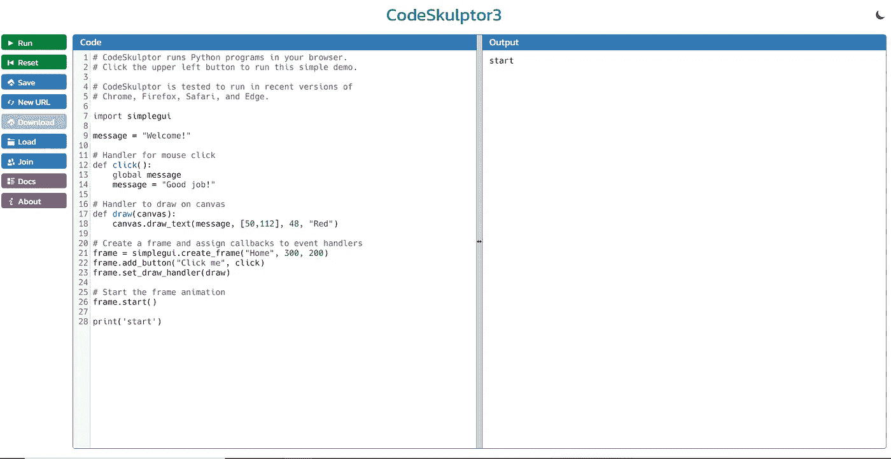

CodeSkulptor3 IDE(图片由作者提供)

上图是 CodeSkulptor 的 IDE 接口，专门针对 Python 3。CodeSkulpor Python 2 有一个版本，但是在撰写本文时，Python 2 在当前的 data professional 工作流中已经过时了。

IDE 很简单；你只需要在左边写你的代码(code)，在右边显示结果(Output)。但是，因为 CodeSkulptor 是为学习目的而开发的，所以您不能在环境中下载调试过程或额外的扩展。

虽然，你可能想看的是 CodeSkulpor [文档](https://py3.codeskulptor.org/docs.html)。我会在下图中向你展示。

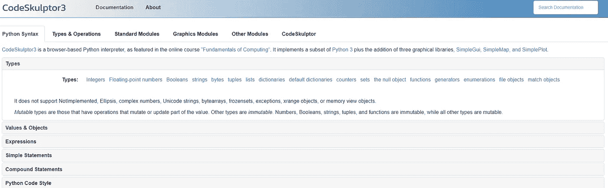

CodeSkulptor3 文档(图片由作者提供)

对于以前不了解 Python 的人来说，该文档是一个完整的学习材料。它的编写和构造方式对于任何初学者来说都是完美的，可以让他们学习许多你以前不知道的术语。这就是 CodeSkulptor 非常适合开始 Python 之旅并了解更多编程语言的初学者的原因。

# 2.托尼

Thonny 是塔尔图大学为学习和教授编程而开发的 IDE，你可以在 T2 的 Bitbucket repository 免费下载。

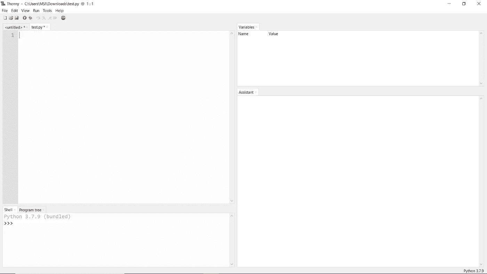

作者图片

Thonny 对初学者来说非常好，因为它可以在**助手页面**的帮助下向你展示一步一步的语句和表达式。Thonny 提供了一个很棒的编辑功能，可以用局部变量打开一个新窗口，代码与主代码分开显示。

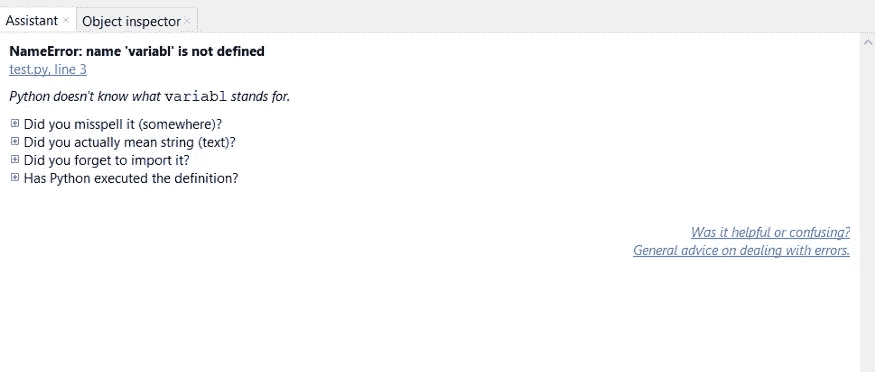

助手选项卡(按作者分类的图像)

此外，Thonny 通过突出显示任何出错的行来帮助您的编码过程。例如，当你忘记了一个括号或者打错了一个错别字，如下图所示。

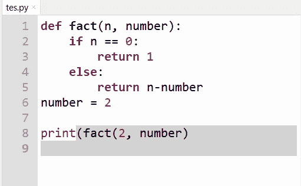

Thonny highlight(图片由作者提供)

当你的脚本中有一个错误时，代码块会从你开始出错的那一行到最后一行用灰色突出显示。这样，您可以指出代码中的任何错误。

Thonny 还为您提供了 Python 脚本调试过程，运行起来非常灵活。您需要按 Ctrl + F5，调试过程会自动开始。我将通过调试上面的代码向您展示这个例子。

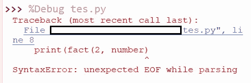

Thonny 调试(图片由作者提供)

结果如上图所示；我有一个语法错误，因为我没有正确地关闭解析。

如果您想探索更多，您可以探索的所有工具都可以在下面显示的视图选项卡中找到。

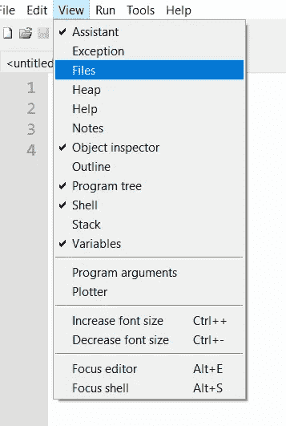

Thonny 视图选项卡(图片由作者提供)

总的来说，Thonny 的目的是让您很好地理解 Python 是如何工作的，并帮助您简化编码过程。在我看来，Thonny 适合一个想要学习更多 Python 语言的初学者。

# 3.翼

[Wing](https://wingware.com/) 是一个极简的 Python IDE，是为教授初学者编程而开发的。开发人员已经编写了[配套书籍和视频记录](https://kentdlee.github.io/CS1/build/html/index.html)，您可以密切关注使用 Wing IDE 学习 Python。让我们看看下图中的 Wing IDE。

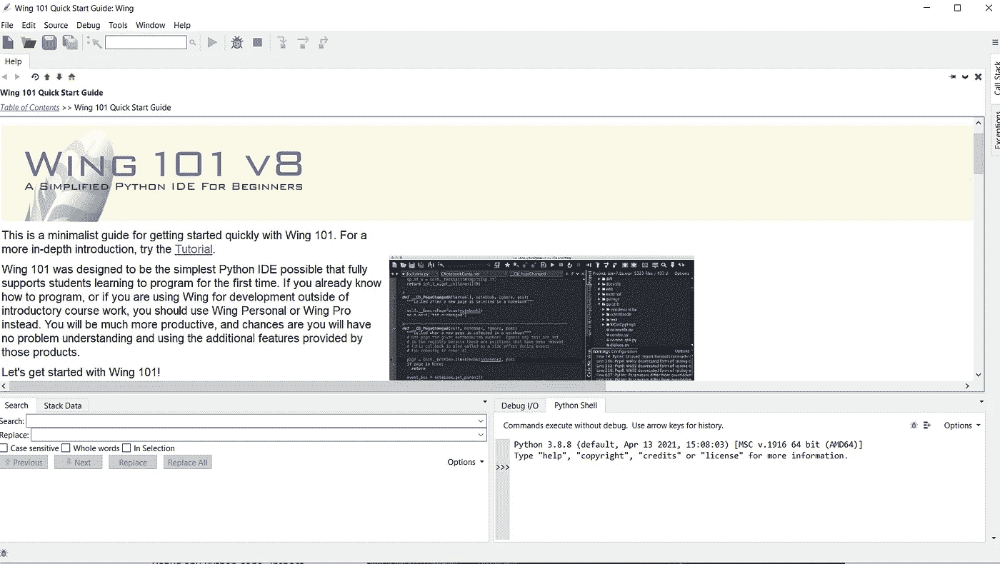

Wing IDE(图片由作者提供)

正如你在上面的图片中看到的，IDE 已经包含了一个 IDE 和 Python 的教程，你可以跟随。这些材料对任何初学者来说都很容易理解，IDE 对任何人来说都很简单。让我们来看看 Wing 的一些特性，您可以用它们来学习。

首先，我们有自动完成功能。当你想有一个更快的方法来编写脚本时，这是很有用的。

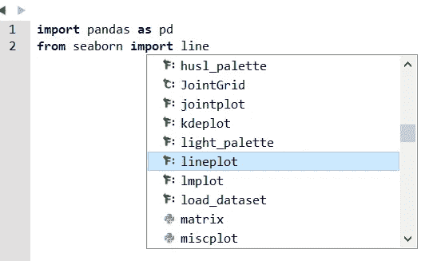

自动完成(图片由作者提供)

接下来，我们将重点介绍 Wing 中的功能。在编码过程中，你最终会得到一堆代码。有时候很乱，特别是对于编码初学者。在这种情况下，突出显示功能是非常有用的，因为它可以帮助您确定您在编码过程中的位置或者错误在哪里。让我们以下图为例。

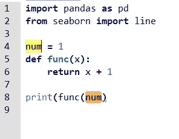

作者图片

在上面的图片中，你可以看到我的变量和另一个同名的变量是如何突出显示的。然后你会看到一条指示错误的红线。如果我们将光标移到那里，我们可以突出显示错误的原因。

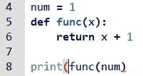

作者图片

另一个我觉得对初学者有用的特性是调试特性。当运行调试功能时，该进程将尝试查找您的编码错误以及导致错误的原因。下图显示了调试示例过程。

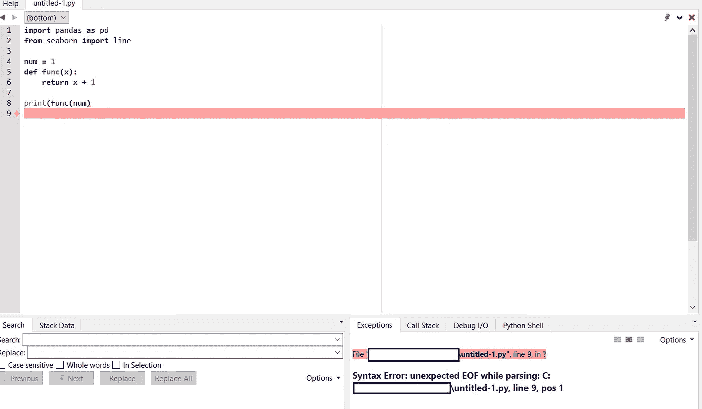

作者图片

最后，我喜欢 Wing 的一个功能是搜索栏，任何人都可以方便地使用。当我写代码时，我个人很难跟踪所有的变量和某些代码行的位置。有了搜索栏，这个过程变得更加容易。

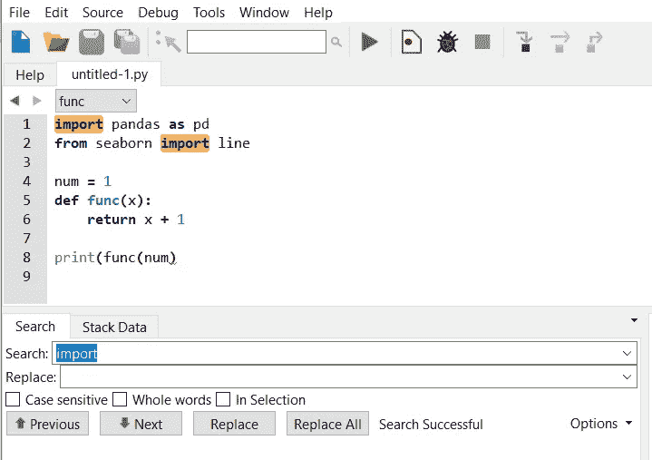

作者图片

正如你从上面的图片中看到的，我可以试着使用 search 按钮，所有我想找到的代码都被高亮显示。这听起来并不令人惊讶，但它的用处是巨大的，尤其是如果你还在学习的话。

总的来说，Wing 对于初学者来说是易于使用的 IDE，因为它提供了许多有助于编码过程的学习材料和功能。

# 结论

Python 是许多数据专业人员使用的编程语言。Python 语言在许多领域变得越来越重要，因为它容易学习，并且有很多社区支持。然而，学习 Python 编程语言对一些人来说仍然是一个挑战。

在本文中，我概述了初学编程的 3 个顶级 Python IDE。它们是:

1.  **CodeSkulptor**
2.  **托恩尼**
3.  **翼**

希望有帮助！

> 如果你没有订阅成为媒体会员，请考虑通过[我的推荐](https://cornelliusyudhawijaya.medium.com/membership)订阅来支持我的写作。

在我的[**LinkedIn**](https://www.linkedin.com/in/cornellius-yudha-wijaya/)**或 [**Twitter**](https://twitter.com/CornelliusYW) **上访问我。****