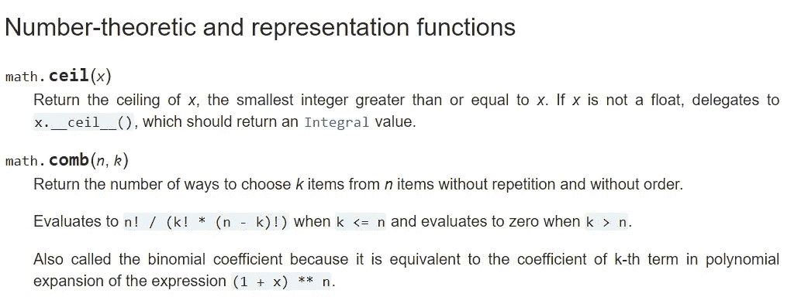
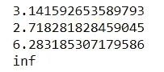
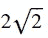
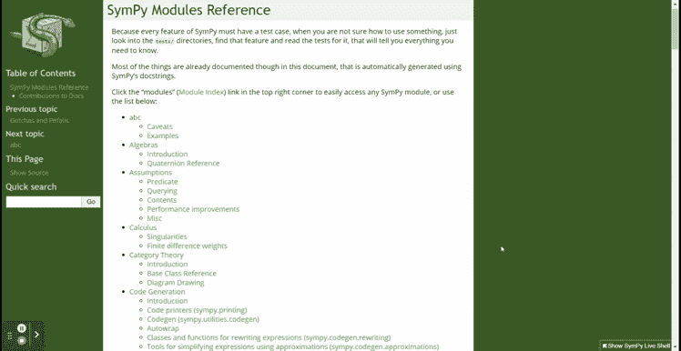
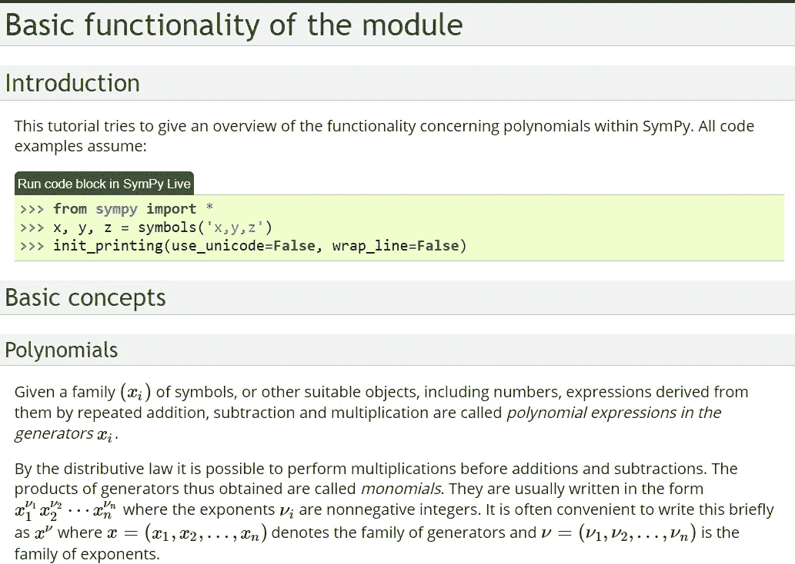
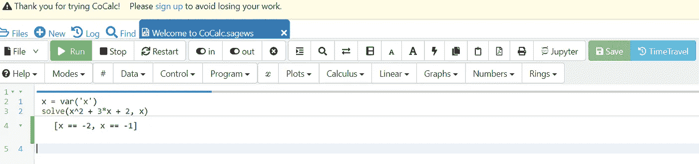
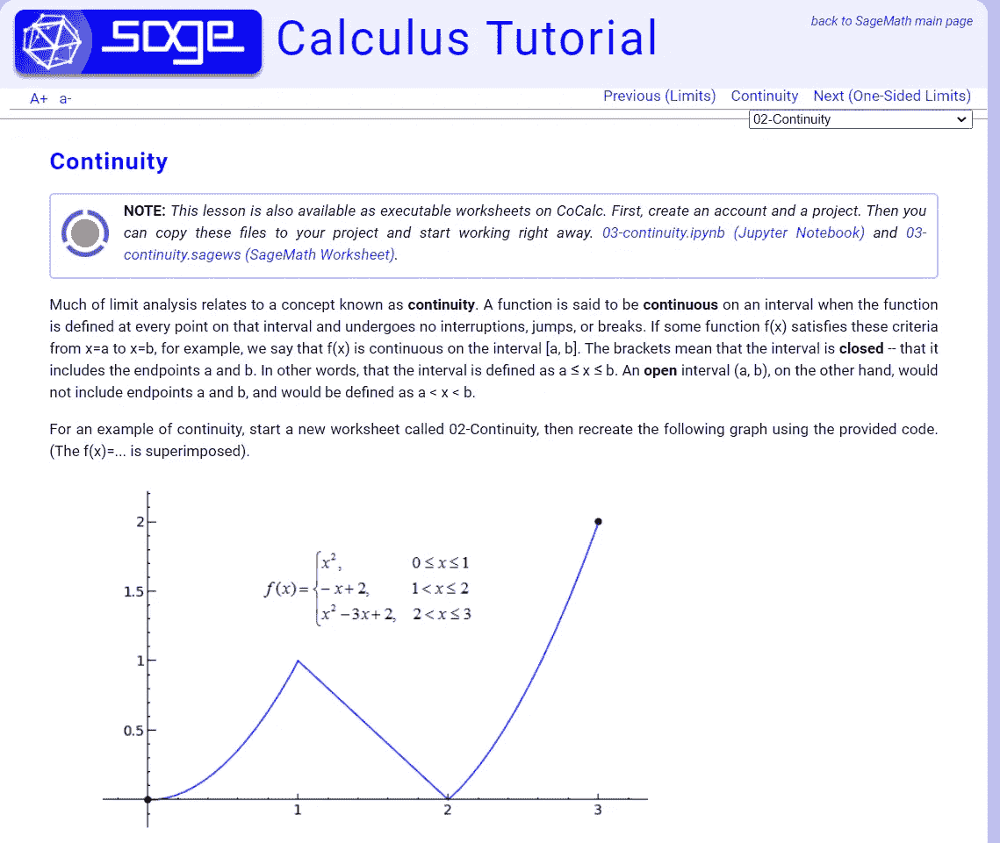

# 3 个顶级 Python 包，帮助数据科学家学习数学

> 原文：<https://towardsdatascience.com/3-top-python-package-to-learn-math-for-data-scientist-8e3482e7e79d?source=collection_archive---------3----------------------->

## 从这些 Python 包中学习数学


由[杰斯温·托马斯](https://unsplash.com/@jeswinthomas?utm_source=medium&utm_medium=referral)在 [Unsplash](https://unsplash.com?utm_source=medium&utm_medium=referral) 上拍摄的照片

> 如果您喜欢我的内容，并希望获得更多关于数据或数据科学家日常生活的深入知识，请考虑在此订阅我的[简讯。](https://cornellius.substack.com/welcome)

作为数据科学家，我们不断被告知我们需要理解机器学习，因为它是我们完成工作的工具之一。我知道该领域的许多新手正在学习机器学习，而没有对概念和方程有更深入的理解——仅仅依赖于使用算法。

理解机器学习最重要的基础是数学知识。当你听到数学时，它会让你想起高中一天的课程——难，令人困惑，理论性强。机器学习数学当然是相似的，但在现代不同于旧时代；Python 可以帮助你学习数学。

我之前已经写了[统计 Python 包](/3-top-python-packages-to-learn-statistic-for-data-scientist-d753b76e6099?sk=9b2d538bb068a25c21b09bf42bb97ee5)，你可以用它来学习统计学，现在，我想写一下数学包。这里是我为数据科学家学习数学的前 3 个 Python 包。

# 1.数字和数学模块

嗯，从技术上讲，我在这一点上想要概述的包不仅仅是一个单独的包，而是由几个包组成，这些包交织在一起，被称为**数字和数学模块**。

这些模块在 Python 主页上有文档记录，我们得到了关于这个包的完整解释。摘自 [Python 文档](https://docs.python.org/3/library/numeric.html)，模块中列出的包有:

*   `[numbers](https://docs.python.org/3/library/numbers.html)` [—数字抽象基类](https://docs.python.org/3/library/numbers.html)
*   `[math](https://docs.python.org/3/library/math.html)` [—数学函数](https://docs.python.org/3/library/math.html)
*   `[cmath](https://docs.python.org/3/library/cmath.html)` [—复数的数学函数](https://docs.python.org/3/library/cmath.html)
*   `[decimal](https://docs.python.org/3/library/decimal.html)` [—十进制定点和浮点运算](https://docs.python.org/3/library/decimal.html)
*   `[fractions](https://docs.python.org/3/library/fractions.html)` [—有理数](https://docs.python.org/3/library/fractions.html)
*   `[random](https://docs.python.org/3/library/random.html)` [—生成伪随机数](https://docs.python.org/3/library/random.html)
*   `[statistics](https://docs.python.org/3/library/statistics.html)` [—数理统计函数](https://docs.python.org/3/library/statistics.html)

我喜欢这些模块的文档，它用通俗的语言解释了基本的数学概念。对于一个不太了解数学术语的初学者来说，这些模块真的很适合你。让我们以“数学”Python 包文档为例。



数学包文档(来源:[https://docs . python . org/3/library/math . html # number-theory-and-representation-functions](https://docs.python.org/3/library/math.html#number-theoretic-and-representation-functions))

文档解释了软件包上可用的功能足够简单(尽管您仍然需要集中精力)；您可以将此文档作为学习的基础。

让我们尝试使用其中一个软件包。我想用数学软件包来得到可用的特殊常数。为此，我只需键入以下代码:

```
import math#Getting the mathematical constant ***π***
print(math.pi)#Getting the mathematical constant ***e***
print(math.e)#Getting the mathematical constant **tau**
print(math.tau)#Getting the **floating-point positive infinity**
print(math.inf)
```



作者图片

如果你想知道它们所显示的常数，你可以参考现有的文档。

# 2.交响乐

什么是[症状](https://www.sympy.org/en/index.html)？这是一个符号数学的 Python 库。那么，什么是符号计算呢？[SymPy 文档中给出的教程页面](https://docs.sympy.org/latest/tutorial/intro.html#what-is-symbolic-computation)解释了符号计算是一个用符号处理数学对象的计算问题。简单地说，符号数学精确地而不是近似地表示了数学对象。如果数学表达式是未赋值的变量，那么它就留在符号形式中。

也许我们可以用一些例子来更好地解释这个概念。例如，当我们计算平方根时，我们可以这样做。

```
math.sqrt(16)Output: 4.0
```

使用数学软件包，如果我们取 16 的平方根，我们将得到值 4。如果我们这样做。

```
math.sqrt(8)Output: 2.8284271247461903
```

8 的平方根的结果将是近似值，而不是精确的数字。这就是为什么我们会使用 SymPy 来创建一个精确的数学对象，将近似值表示为符号形式。

首先，我们需要使用下面的代码安装 SymPy 包。

```
pip install sympy
```

那我们试试用 SymPy 包吧。

```
import sympysympy.sqrt(8)
```



作者图片

结果将在符号表示中。尽管 SymPy main 函数处理的是符号数学，但他们关于数学概念的文档总体来说还是相当不错的。



作者创建的 GIF

看看[的 SymPy 文档](https://docs.sympy.org/latest/index.html)，列表很广泛，并且提供了许多数学学习材料。让我们看看其中一个文档页面。



来源:[https://docs . sympy . org/latest/modules/polys/basics . html # basic-concepts](https://docs.sympy.org/latest/modules/polys/basics.html#basic-concepts)

给我们数学基本概念的文档写得很好，任何初学者都能理解。尝试自己探索 Python 包。

# 3.明智的

Sage 是运行在 Python 编程语言之上的开源数学软件。从技术上讲，Sage 不是 Python 包，而是软件。如果你已经知道 Python 语言，用法是简单的，所以你在使用软件时不会感到太难。

Sage 本身支持代数、几何、数论、密码学、数值计算和相关领域的研究和教学。Sage 中包含了许多一般和特定的主题，包括:

*   [基础代数和微积分](https://doc.sagemath.org/html/en/tutorial/tour_algebra.html)
*   [绘图](https://doc.sagemath.org/html/en/tutorial/tour_plotting.html)
*   [基本环](https://doc.sagemath.org/html/en/tutorial/tour_rings.html)
*   [线性代数](https://doc.sagemath.org/html/en/tutorial/tour_linalg.html)
*   [多项式](https://doc.sagemath.org/html/en/tutorial/tour_polynomial.html)
*   [父母、皈依和胁迫](https://doc.sagemath.org/html/en/tutorial/tour_coercion.html)
*   [有限群，阿贝尔群](https://doc.sagemath.org/html/en/tutorial/tour_groups.html)
*   [数论](https://doc.sagemath.org/html/en/tutorial/tour_numtheory.html)
*   [一些更高级的数学](https://doc.sagemath.org/html/en/tutorial/tour_advanced.html)

当然，你可以随意访问[教程](https://doc.sagemath.org/pdf/en/thematic_tutorials/thematic_tutorials.pdf)来获取更多关于你想要学习的数学概念的信息。

要安装 Sage，你可以遵循[文档](https://doc.sagemath.org/html/en/tutorial/introduction.html#installation)中的步骤，但如果你不想在你的电脑上安装它，你可以使用 [Sage web 界面](https://sagecell.sagemath.org/)或 [CoCalc 界面](https://cocalc.com/?utm_source=sagemath.org&utm_medium=icon)。



作者创建的图像

Sage 教程文档也很丰富，您可以从中获得完整的学习资料。让我们举一个微积分教程中的例子。



来源:[https://www.sagemath.org/calctut/continuity.html](https://www.sagemath.org/calctut/continuity.html)

他们很好地解释了这个概念，甚至提供了用于学习的可执行代码。你可以下载笔记本作为你的学习材料。

# **结论**

作为一名数据科学家，我们对机器学习并不陌生——然而，许多人并不熟悉 ML 的数学方面。为了学习更多的数学知识，我们可以使用 Python 编程语言来帮助我们学习。

以下是我最喜欢的 3 个帮助我们使用 Python 学习数学的包，它们是:

1.  **数字和数学模块**
2.  **症状**
3.  **贤者**

希望有帮助！

访问我的 [**LinkedIn**](https://www.linkedin.com/in/cornellius-yudha-wijaya/) 或 [**Twitter**](https://twitter.com/CornelliusYW)

> 如果您没有订阅为中等会员，请考虑通过[我的推荐](https://cornelliusyudhawijaya.medium.com/membership)订阅。