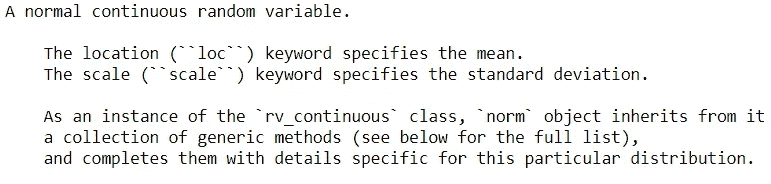
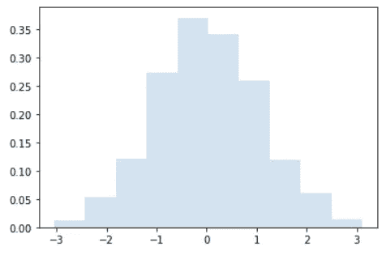
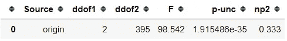
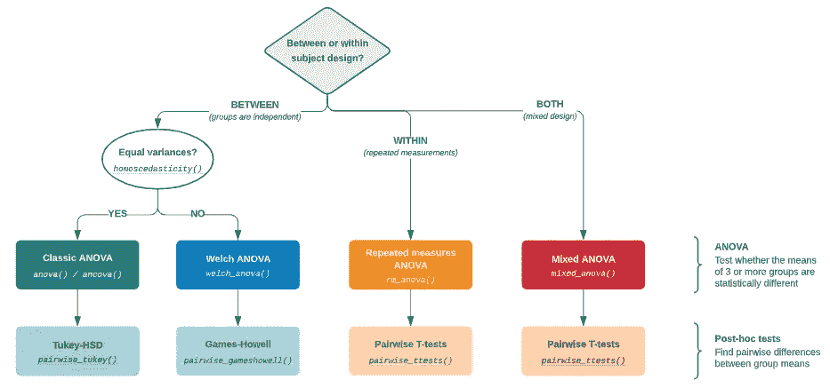
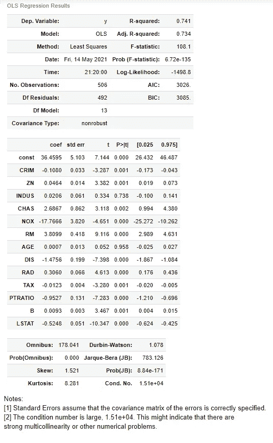

# 数据科学家学习统计学的 3 个顶级 Python 包

> 原文：<https://towardsdatascience.com/3-top-python-packages-to-learn-statistic-for-data-scientist-d753b76e6099?source=collection_archive---------8----------------------->

## 使用这些软件包增强您的统计技能


露丝·齐默曼在 [Unsplash](https://unsplash.com?utm_source=medium&utm_medium=referral) 上拍摄的照片

> 如果你喜欢我的内容，并想获得更多关于数据或作为数据科学家的日常生活的深入知识，请考虑在这里订阅我的[时事通讯。](https://cornellius.substack.com/welcome)

众所周知，数据科学家比统计学家有更好的编程技能，比程序员有更好的统计知识。虽然学习编程技能不是一件容易的事，但有时新数据人员会忘记统计技能。

我知道统计学很难学，尤其是对于那些没有受过正规统计学教育的人来说。然而，在现代技术的帮助下，从零开始学习统计学是可能的。有了这些用编程语言开发的统计软件包，学习统计变得比以前更容易。

我知道如果你想学统计学，很多人会反对。你应该用 R 语言而不是 Python 但是，我想通过使用 Python 包提供一种替代方案，因为许多人都是通过学习 Python 语言开始他们的数据科学之旅的。

在本文中，我想向您展示学习统计的 3 个顶级 Python 包以及如何使用该包的示例——记住，**用于学习**。让我们开始吧！

# 1.Scipy。统计数据

[SciPy](https://www.scipy.org/about.html) (读作“叹息派”)是一个开源的包计算工具，用于在 Python 环境中执行科学方法。Scipy 本身也是许多数学、工程和数据研究中使用的数字算法和特定领域工具箱的集合。

Scipy 中可用的 API 之一是名为 Stats 的统计 API。根据 [Scipy 主页](https://docs.scipy.org/doc/scipy/reference/stats.html)显示，Scipy。Stats 是一个包含大量概率分布和不断增长的统计函数库的模块，特别适用于**概率函数研究**。

在寒风中。Stats 模块中，有很多统计函数 API，你可以参考进一步学习。它们是:

*   [连续分布](https://docs.scipy.org/doc/scipy/reference/stats.html#continuous-distributions)
*   [多元分布](https://docs.scipy.org/doc/scipy/reference/stats.html#multivariate-distributions)
*   [离散分布](https://docs.scipy.org/doc/scipy/reference/stats.html#discrete-distributions)
*   [汇总统计](https://docs.scipy.org/doc/scipy/reference/stats.html#summary-statistics)
*   [频率统计](https://docs.scipy.org/doc/scipy/reference/stats.html#frequency-statistics)
*   [相关函数](https://docs.scipy.org/doc/scipy/reference/stats.html#correlation-functions)
*   [统计测试](https://docs.scipy.org/doc/scipy/reference/stats.html#statistical-tests)
*   [转换](https://docs.scipy.org/doc/scipy/reference/stats.html#transformations)
*   [统计距离](https://docs.scipy.org/doc/scipy/reference/stats.html#statistical-distances)
*   [随机变量生成](https://docs.scipy.org/doc/scipy/reference/stats.html#random-variate-generation)
*   [循环统计功能](https://docs.scipy.org/doc/scipy/reference/stats.html#circular-statistical-functions)
*   [列联表功能](https://docs.scipy.org/doc/scipy/reference/stats.html#contingency-table-functions)
*   [小区测试](https://docs.scipy.org/doc/scipy/reference/stats.html#plot-tests)
*   [屏蔽统计功能](https://docs.scipy.org/doc/scipy/reference/stats.html#masked-statistics-functions)
*   [单变量和多变量核密度估计](https://docs.scipy.org/doc/scipy/reference/stats.html#univariate-and-multivariate-kernel-density-estimation)

为了更好地理解统计工作函数。统计还提供了一个你可以尝试的教程。该教程是全面的，许多新手可以遵循；你用一个笔记对统计术语有一点了解。让我们试着用 Scipy.Stats 学习一些统计学。

如果您使用的是 Anaconda 发行版中的 Python，那么环境中已经内置了 Scipy 包。如果您选择独立安装 Scipy，您需要安装依赖包。您可以通过 pip 执行下面这一行来实现。

```
python -m pip install --user numpy scipy matplotlib ipython jupyter pandas sympy nose
```

让我们试着学习概率分布上最简单的概念，那就是正态分布。首先，我们将必要的包导入到环境中。

```
#Import statistical package from Scipy
from scipy import stats#Import the normal distribution class
from scipy.stats import norm
```

我们导入的范数类将成为一个概率函数，产生一个服从正态分布的随机变量。为了获得更多关于这个类的信息，我们可以试着打印文档。

```
print(stats.norm.__doc__)
```



作者创建的图像

文档将为您提供理解对象、可用方法和类应用程序示例所需的所有基本信息。

范数类用于产生一个服从正态分布的随机变量。该软件包已经为您提供了学习它的所有解释，您只需要执行几行代码来生成概念示例。让我们用这个例子来制作一个正态分布图。

```
import matplotlib.pyplot as plt#Produce 1000 Random Variable following normal distribution
r = norm.rvs(size=1000)#Plotting the distribution
fig, ax = plt.subplots(1, 1)
ax.hist(r, density=True, histtype='stepfilled', alpha=0.2)
ax.legend(loc='best', frameon=False)
plt.show()
```



作者图片

有这么多你可以探索这个包。我建议你花点时间研究一下[统计教程](https://docs.scipy.org/doc/scipy/reference/tutorial/stats.html)来理解这个包，并且理解这个定理。

# 2.平古因

[Pingouin](https://pingouin-stats.org/) 是一个开源的统计软件包，主要用于统计。这个包给了你许多类和函数来学习基本的统计学和假设检验。据开发者称，Pingouin 是为那些想要**简单而详尽的统计功能**的用户设计的。

Pingouin 简单但详尽，因为这个包为您提供了关于数据的更多解释。在科学频道。Stats，它们只返回 T 值和 p 值，有时我们需要更多关于数据的解释。

在 Pingouin 包中，计算是在上面几个步骤中进行的。例如，除了仅返回 T 值和 p 值之外，来自 Pingouin 的 T 测试还返回测试的自由度、效应大小(Cohen 的 d)、均值差异的 95%置信区间、统计功效和贝叶斯因子(BF10)。

目前，Pingouin 包提供了一个可以用于统计测试的 API 函数。它们是:

*   [方差分析和 T 检验](https://pingouin-stats.org/api.html#anova-and-t-test)
*   [贝叶斯](https://pingouin-stats.org/api.html#bayesian)
*   [圆形](https://pingouin-stats.org/api.html#circular)
*   [偶然性](https://pingouin-stats.org/api.html#contingency)
*   [相关和回归](https://pingouin-stats.org/api.html#correlation-and-regression)
*   [发行](https://pingouin-stats.org/api.html#distribution)
*   [效果尺寸](https://pingouin-stats.org/api.html#effect-sizes)
*   [多重比较和事后测试](https://pingouin-stats.org/api.html#multiple-comparisons-and-post-hoc-tests)
*   [多元测试](https://pingouin-stats.org/api.html#multivariate-tests)
*   [非参数化](https://pingouin-stats.org/api.html#non-parametric)
*   [其他](https://pingouin-stats.org/api.html#others)
*   [绘图](https://pingouin-stats.org/api.html#plotting)
*   [功率分析](https://pingouin-stats.org/api.html#power-analysis)
*   [可靠性和一致性](https://pingouin-stats.org/api.html#reliability-and-consistency)

Pingouin APIs 文档本身非常适合学习。我已经研究了这个文件，发现它真的很有见地。例如，我们来探讨一下 [ANOVA](https://pingouin-stats.org/generated/pingouin.anova.html#pingouin.anova) 函数。首先，您需要安装 Pingouin 包。

```
pip install pingouin
```

安装应该只需要几秒钟。之后，我们将使用一个 mpg 数据集示例，用 Pingouin 进行 ANOVA 统计假设测试。

```
#Import necessary package
import seaborn as sns
import pingouin as pgmpg = sns.load_dataset('mpg')
pg.anova(data = mpg, dv = 'mpg', between = 'origin')
```



作者图片

示例统计测试为您提供了您期望从测试中获得的所有必要分数。对于结果的进一步解释，你应该在这里查阅 API 文档[。](https://pingouin-stats.org/generated/pingouin.anova.html#pingouin.anova)

Pingouin 指南也为你提供了一个学习指南[来使用一些测试包函数。其中一个是单向方差分析测试。](https://pingouin-stats.org/guidelines.html)



方差分析测试指南(来源:[https://pingouin-stats.org/guidelines.html#anova](https://pingouin-stats.org/guidelines.html#anova)

如果您想了解关于 Pingouin 包的更多信息，我已经写了一篇关于该包的更深入的解释。

</accelerate-complicated-statistical-test-for-data-scientist-with-pingouin-f98f29184400>  

# 3.统计模型

[Statsmodels](https://www.statsmodels.org/stable/about.html#about-statsmodels) 是一个统计模型 python 包，它提供了许多类和函数来创建统计估计。Statsmodel 包曾经是 Scipy 模块的一部分，但是目前 statsmodel 包是单独开发的。

Scipy 和。Stats 和 statsmodel？这个 **Scipy。Stats 模块侧重于概率函数和分布等统计定理**，而 **statsmodel 包侧重于基于数据的** **统计估计**。

Statsmodel 提供了统计建模中经常使用的 API。Statsmodel 包将 API 分成 3 个主要模型:

*   其中提供了许多横截面模型和方法，包括回归和 GLM。
*   `[statsmodels.tsa.api](https://www.statsmodels.org/stable/api.html#statsmodels-tsa-api)`提供时间序列模型和方法。
*   `[statsmodels.formula.api](https://www.statsmodels.org/stable/api.html#statsmodels-formula-api)` 它提供了一个使用公式字符串和数据框架指定模型的接口——简单地说，您可以创建自己的模型。

对于任何想要**更深入地理解统计建模的人来说，Statsmodel 是一个很好的入门包**。[用户指南](https://www.statsmodels.org/stable/user-guide.html)深入解释了理解统计估计所需的概念。例如，摘自 Statsmodel 用户指南的内生和外生术语在以下段落中进行了解释:

这些术语的一些非正式定义如下

**内生**:体制内因素导致

**外源性**:系统外因素引起

*内生变量指经济/计量经济学模型中的变量，这些变量由该模型解释或预测。*http://stats.oecd.org/glossary/detail.asp?ID=794

*外生变量指出现在经济/计量经济学模型中，但该模型无法解释的变量(即，它们被认为是模型给定的)。http://stats.oecd.org/glossary/detail.asp?ID=890*T2

让我们尝试使用 Statsmodel 软件包学习 OLS(普通最小二乘)建模。如果您没有使用 Anaconda 发行版中的 Python 或者没有安装 Statsmodel 包，您可以使用下面的代码行来完成。

```
pip install statsmodels
```

继续这些步骤，让我们通过导入包和数据集来开发模型。

```
#Importing the necessary package
from sklearn.datasets import load_boston
import statsmodels.api as sm
from statsmodels.api import OLS#import the data
boston = load_boston()
data = pd.DataFrame(data = boston['data'], columns = boston['feature_names'])
target = pd.Series(boston['target'])#Develop the model
sm_lm = OLS(target, sm.add_constant(data))
result = sm_lm.fit()
result.summary()
```



图片来自作者

您使用 Statsmodel 软件包开发的 OLS 模型将具有您期望的模型估计的所有必要结果。关于结果的进一步解释，你可以访问主页上的 [OLS 的例子](https://www.statsmodels.org/stable/examples/notebooks/generated/ols.html)。

# 结论

作为一名数据科学家，你应该具备足够的统计学知识。问题是，很多数据爱好者只专注于学习编程语言，尤其是 Python。为了帮助统计研究，我想介绍我学习统计的前 3 个 Python 包。它们是:

1.  Scipy。统计数据
2.  平古因
3.  统计模型

访问我的[**LinkedIn**](https://www.linkedin.com/in/cornellius-yudha-wijaya/)**或 [**Twitter**](https://twitter.com/CornelliusYW)**

> **如果您没有订阅为中等会员，请考虑通过[我的推荐](https://cornelliusyudhawijaya.medium.com/membership)订阅。**