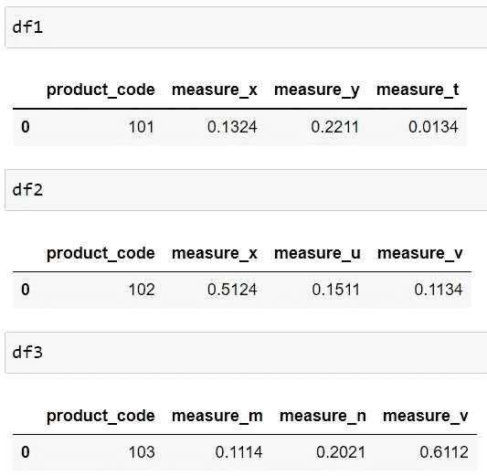
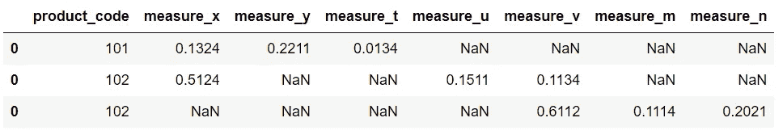
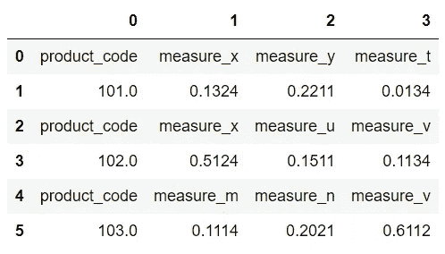
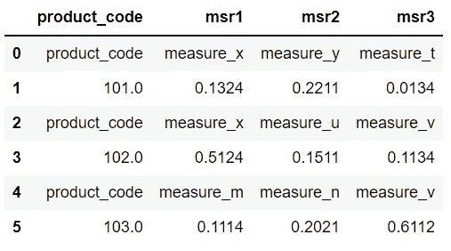
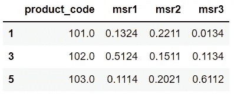
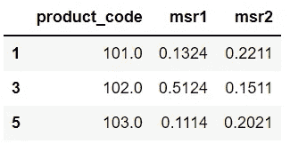
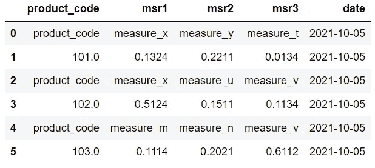
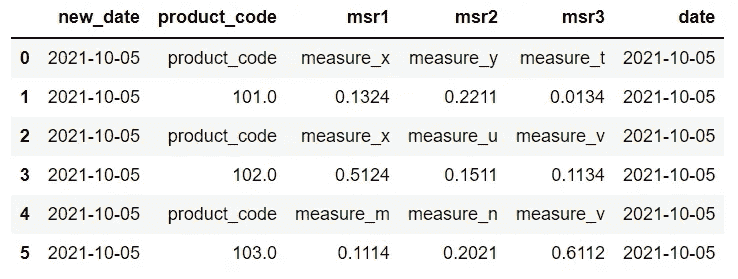

# 操纵熊猫数据帧的 3 个技巧

> 原文：<https://towardsdatascience.com/3-tricks-for-manipulating-pandas-dataframes-c7933a56b6e0?source=collection_archive---------24----------------------->

## 发掘熊猫的全部潜力


照片由[维托达·克莱恩](https://unsplash.com/@little_klein?utm_source=unsplash&utm_medium=referral&utm_content=creditCopyText)在 [Unsplash](https://unsplash.com/s/photos/trick?utm_source=unsplash&utm_medium=referral&utm_content=creditCopyText) 上拍摄

Pandas 是数据科学生态系统中使用最广泛的库之一。它为有效的数据分析和操作提供了许多功能和方法。

阅读整个文档并试图一次了解所有的功能和方法并不是掌握 Pandas 的明智方法。相反，通过解决任务和问题来学习效率要高得多。

在本文中，我们将解决 3 个涉及操作数据框的任务。用于解决这些任务的方法也将有助于其他一些任务。

我们将利用 NumPy 函数，所以让我们从导入两个库开始。

```
import numpy as np
import pandas as pd
```

# 堆叠数据框

假设我们有以下数据帧。



(图片由作者提供)

我们需要将它们组合成一个数据框。一种方法是使用熊猫的`concat`功能。但是，它将为两个数据框中的每个列名创建一个单独的列。

```
pd.concat([df1, df2, df3])
```



(图片由作者提供)

如果我们用这种方法组合几个数据框，我们最终会得到一个包含太多列的数据框。相反，我们想要的是:



(图片由作者提供)

我们可以通过使用 NumPy 的`vstack`函数来创建它。以下代码片段生成了上述数据框。

```
pd.DataFrame(np.vstack([
    df1.columns, df1, 
    df2.columns, df2, 
    df3.columns, df3]))
```

我们也可以用`columns`参数指定列名。

```
df = pd.DataFrame(
    np.vstack([df1.columns, df1, 
               df2.columns, df2,
               df3.columns, df3]),
    columns = ["product_code","msr1","msr2","msr3"]
)df
```



(图片由作者提供)

# 选择每隔一行

让我们看一下刚刚创建的数据框。第一、第三和第五行不包含数值。它们表示测量的种类。

出于某种原因，我们希望只选择包含数值的行。因此，从第二行开始，我们需要每隔一行。

Pandas 的`iloc`方法在如何从数据帧中选择行和列方面非常灵活。我们可以指定起始和结束索引以及步长。

```
df.iloc[1::2]
```



(图片由作者提供)

第一个和第二个数字分别是起始和结束索引。因为我们想一直走到最后一行，所以我们不必指定结束索引，所以它保留为空。最后一个数字是步长。如果我们需要选择每第三行，步长变为 3，依此类推。

`iloc`方法还允许使用列索引来选择列。

```
df.iloc[1::2, :3]
```



(图片由作者提供)

逗号后面的数字指定要选择的列。“:3”表达式表示从开头开始选择第三列。我们也没有指明步长，所以使用默认值 1。

# 在特定位置创建新列

向数据框添加新列是一种常见的操作。Pandas 使得创建新列变得非常简单。

一种方法是写一个列名并分配一个常数值。让我们在数据框中添加一个日期列。

```
df["date"] = "2021-10-05"df
```



(图片由作者提供)

默认情况下，新列添加在末尾。如果我们想在特定的列索引处添加一个新列，我们应该使用`insert`函数。

以下代码片段在数据框的开头创建了一个新的日期列。

```
df.insert(0, "new_date", "2021-10-05")df
```



(图片由作者提供)

第一个参数是新列的索引。第二个参数是列名，最后一个参数定义列值。

# 结论

在处理表格数据时，Pandas 很有可能为您的任务或问题提供解决方案。当你练习和解决熊猫的问题时，你会发现这个神奇图书馆的伟大之处。

和其他软件工具一样，学习熊猫的最好方法是练习。阅读整个文档而不做任何练习只能让你达到一定的水平。你应该通过大量的练习来支持它。

感谢您的阅读。如果您有任何反馈，请告诉我。