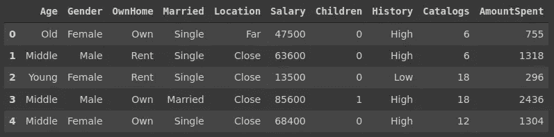
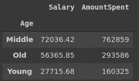
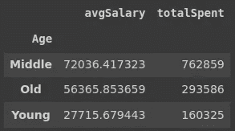
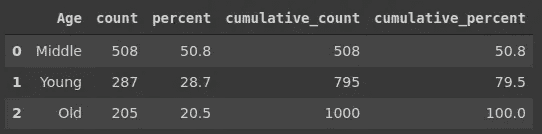
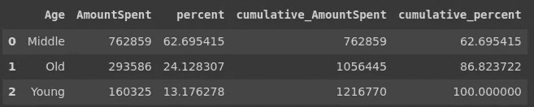

# 提高熊猫技能的 3 个技巧

> 原文：<https://towardsdatascience.com/3-tricks-to-sharpen-your-pandas-skills-ce63356890d7?source=collection_archive---------28----------------------->

## 让数据分析更进一步


照片由 [Unsplash](https://unsplash.com/s/photos/magic?utm_source=unsplash&utm_medium=referral&utm_content=creditCopyText) 上的 [Aziz Acharki](https://unsplash.com/@acharki95?utm_source=unsplash&utm_medium=referral&utm_content=creditCopyText) 拍摄

Pandas 是使用最广泛的数据分析和操作库之一。它提供了许多功能和方法来加快和简化数据分析过程。

本文我们的重点不是熊猫的常用功能。相反，我们将介绍 3 个不常见但非常有用的技巧或技术。

我们将使用 Kaggle 上的[营销](https://www.kaggle.com/yoghurtpatil/direct-marketing)数据集。让我们从导入库和读取数据集开始。

```
import numpy as np
import pandas as pddf = pd.read_csv("/content/DirectMarketing.csv")
df.head()
```



(图片由作者提供)

## 1.NamedAgg

第一个技巧是 NamedAgg 方法，它通常与 groupby 函数一起使用。

假设我们要计算年龄列中每个类别的平均工资和总支出。下面是我们如何使用 groupby 函数来实现的。

```
df[['Age','Salary','AmountSpent']].groupby('Age')\
.agg({'Salary':'mean', 'AmountSpent':'sum'}).round(2)
```



(图片由作者提供)

我们已经完成了预期的计算，但是有一个小问题。我们无法真正区分哪个聚合函数应用于哪个列。一种解决方案是事后重命名这些列。例如，我们可以将它们重命名为“avgSalary”和“totalSpent”。

有一个更实际的解决方案，我们称之为 dAgg 技巧。它允许定制聚合列的名称。下面是我们如何在 agg 函数中实现它。

```
df[['Age','Salary','AmountSpent']].groupby('Age')\
.agg(
   avgSalary = pd.NamedAgg('Salary','mean'),
   totalSpent = pd.NamedAgg('AmountSpent','sum')
)
```



(图片由作者提供)

## 2.侧桌

第二个技巧涉及一个名为 [Sidetable](https://github.com/chris1610/sidetable) 的第三方包，它是由 [Chris Moffitt](https://twitter.com/chris1610) 创建的。

我们首先需要安装它。

```
$  python -m pip install -U sidetable #from terminal!pip install sidetable #jupyter notebook
```

我们现在可以导入并开始使用它。一旦导入，它就可以像 str 和 dt 访问器一样用作数据帧的访问器。

```
import sidetable
```

Sidetable 有 4 个不同的函数，其中一个是 freq 函数。它返回关于给定列的三条信息:

*   列中每个值的观察值(即行数)(value_counts())。
*   整列中每个值的百分比(value_counts(normalize=True))。
*   以上两个的累积版本。

让我们把它应用在年龄栏上。

```
import sidetabledf.stb.freq(['Age'])
```



(图片由作者提供)

默认情况下，freq 函数计算行数。如果我们使用 value 参数传递另一列，它将返回该列中值的总和。

```
df.stb.freq(['Age'], value = 'AmountSpent')
```



(图片由作者提供)

Sidetable 提供了另外三个功能。如果你想进一步阅读，这里有一篇关于 [sidetable](/pandas-sidetable-a-smarter-way-of-using-pandas-96fa7c61e514) 的更详细的文章。

## 3.询问

过滤值是数据分析中的典型操作。Pandas 在如何过滤数据帧方面非常灵活。

第三个技巧是允许通过将条件作为字符串传递来过滤数据帧的方法。

假设我们要过滤工资高于 60000 且子代数量为 2 的行。一种过滤方法如下。

```
df[(df.Salary > 60000) & (df.Children == 2)].shape
(68, 10)
```

使用查询方法，我们可以将条件作为字符串传递。

```
df.query('Salary > 60000 and Children == 2').shape
(68, 10)
```

在某些情况下，使用查询方法键入多个条件会更简单。

## 结论

随着你不断练习，熊猫会变得更有用。它提供了各种各样的技术来完成一个典型的数据分析和处理过程中的几乎任何操作。

我们在本文中所举的例子可能并不常用，但在某些情况下肯定是有用的。

我最喜欢熊猫的一点是，完成一项既定任务几乎总是有不止一种方法。随着你对熊猫的了解越来越多，你开始适应自己的做事方式。

感谢您的阅读。如果您有任何反馈，请告诉我。