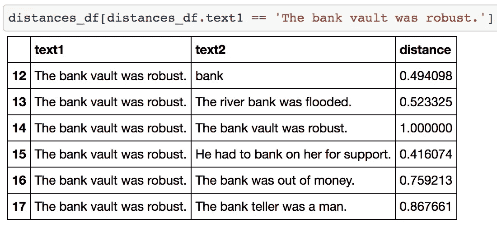

# 基于迁移学习的伯特语境化词汇嵌入的三种类型

> 原文：<https://towardsdatascience.com/3-types-of-contextualized-word-embeddings-from-bert-using-transfer-learning-81fcefe3fe6d?source=collection_archive---------2----------------------->

## [实践教程](https://towardsdatascience.com/tagged/hands-on-tutorials)

## *使用 python、pytorch 和 pytorch-transformers 从 BERT 中提取上下文化单词嵌入的教程，以获得三种类型的上下文化表示。*


作者图片

# 动机

**自谷歌在 2018 年推出 BERT 模型以来，该模型及其功能已经在许多领域激发了数据科学家的想象力。**该模型适用于不同的领域，如用于科学文本的 [SciBERT](https://arxiv.org/pdf/1903.10676.pdf) ，用于生物医学文本的 [bioBERT](https://arxiv.org/abs/1901.08746) ，以及用于临床文本的 [clinicalBERT](https://www.aclweb.org/anthology/W19-1909/) 。拥有 1.1 亿个参数的 lofty 模型也进行了压缩，以便于使用，如 [ALBERT](https://ai.googleblog.com/2019/12/albert-lite-bert-for-self-supervised.html) (90%压缩)和 [DistillBERT](https://arxiv.org/pdf/1910.01108.pdf) (40%压缩)。最初的 BERT 模型及其改进已经被用于提高搜索引擎的性能、内容调节、情感分析、命名实体识别等等。

# 文章结构

在本文中，我将展示使用 python、pytorch 和 transformers 从 BERT 获得上下文化单词嵌入的三种方法。

**文章分为以下几个部分:**

*   什么是迁移学习？
*   BERT 嵌入是如何用于迁移学习的？
*   设置 PyTorch 以获得 BERT 嵌入
*   **提取单词嵌入**(“上下文无关”预训练嵌入，“基于上下文”预训练嵌入，“上下文平均”预训练嵌入)
*   结论

# 什么是迁移学习？

**在迁移学习中，嵌入预训练机器学习模型中的知识被用作为不同任务建立模型的起点。**迁移学习应用在计算机视觉和自然语言处理领域已经爆炸式增长，因为它需要少得多的数据和计算资源来开发有用的模型。它被称为机器学习的下一个前沿领域。

# BERT 嵌入是如何用于迁移学习的？

BERT 已经在几个自然语言处理应用中用于迁移学习。最近的例子包括[检测仇恨言论](https://link.springer.com/chapter/10.1007/978-3-030-36687-2_77)，[分类健康相关的推文](https://www.aclweb.org/anthology/W19-3212.pdf)，以及[孟加拉语情感分析](https://arxiv.org/abs/2012.07538)。

# 设置 PyTorch 以获得 BERT 嵌入

*查看* [*我的 Jupyter 笔记本*](https://github.com/arushiprakash/MachineLearning/blob/main/BERT%20Word%20Embeddings.ipynb) *获取完整代码*

```
# Importing the relevant modulesfrom transformers import BertTokenizer, BertModel
import pandas as pd
import numpy as np
import torch# Loading the pre-trained BERT model
###################################
# Embeddings will be derived from
# the outputs of this modelmodel = BertModel.from_pretrained(‘bert-base-uncased’,
           output_hidden_states = True,)# Setting up the tokenizer
###################################
# This is the same tokenizer that
# was used in the model to generate
# embeddings to ensure consistencytokenizer = BertTokenizer.from_pretrained(‘bert-base-uncased’)
```

我们还需要一些函数将输入转换成正确的形式

```
**def** bert_text_preparation(text, tokenizer):
    *"""Preparing the input for BERT*

 *Takes a string argument and performs*
 *pre-processing like adding special tokens,*
 *tokenization, tokens to ids, and tokens to*
 *segment ids. All tokens are mapped to seg-*
 *ment id = 1.*

 *Args:*
 *text (str): Text to be converted*
 *tokenizer (obj): Tokenizer object*
 *to convert text into BERT-re-*
 *adable tokens and ids*

 *Returns:*
 *list: List of BERT-readable tokens*
 *obj: Torch tensor with token ids*
 *obj: Torch tensor segment ids*

 *"""*
    marked_text = "[CLS] " + text + " [SEP]"
    tokenized_text = tokenizer.tokenize(marked_text)
    indexed_tokens = tokenizer.convert_tokens_to_ids(tokenized_text)
    segments_ids = [1]*len(indexed_tokens)

    *# Convert inputs to PyTorch tensors*
    tokens_tensor = torch.tensor([indexed_tokens])
    segments_tensors = torch.tensor([segments_ids])

    **return** tokenized_text, tokens_tensor, segments_tensors
```

另一个功能是将输入转换成嵌入

```
**def** get_bert_embeddings(tokens_tensor, segments_tensors, model):
    *"""Get embeddings from an embedding model*

 *Args:*
 *tokens_tensor (obj): Torch tensor size [n_tokens]*
 *with token ids for each token in text*
 *segments_tensors (obj): Torch tensor size [n_tokens]*
 *with segment ids for each token in text*
 *model (obj): Embedding model to generate embeddings*
 *from token and segment ids*

 *Returns:*
 *list: List of list of floats of size*
 *[n_tokens, n_embedding_dimensions]*
 *containing embeddings for each token*

 *"""*

    *# Gradient calculation id disabled*
    *# Model is in inference mode*
    **with** torch.no_grad():
        outputs = model(tokens_tensor, segments_tensors)
        *# Removing the first hidden state*
        *# The first state is the input state*
        hidden_states = outputs[2][1:]

    *# Getting embeddings from the final BERT layer*
    token_embeddings = hidden_states[-1]
    *# Collapsing the tensor into 1-dimension*
    token_embeddings = torch.squeeze(token_embeddings, dim=0)
    *# Converting torchtensors to lists*
    list_token_embeddings = [token_embed.tolist() **for** token_embed **in** token_embeddings]

    **return** list_token_embeddings
```

# 提取单词嵌入

我们将为以下文本生成嵌入

```
*# Text corpus*
*##############*
*# These sentences show the different*
*# forms of the word 'bank' to show the*
*# value of contextualized embeddings*

texts = ["bank",
         "The river bank was flooded.",
         "The bank vault was robust.",
         "He had to bank on her for support.",
         "The bank was out of money.",
         "The bank teller was a man."]
```

嵌入以下列方式生成

```
*# Getting embeddings for the target*
*# word in all given contexts*
target_word_embeddings = []

**for** text **in** texts:
    tokenized_text, tokens_tensor, segments_tensors = bert_text_preparation(text, tokenizer)
    list_token_embeddings = get_bert_embeddings(tokens_tensor, segments_tensors, model)

    *# Find the position 'bank' in list of tokens*
    word_index = tokenized_text.index('bank')
    *# Get the embedding for bank*
    word_embedding = list_token_embeddings[word_index]

    target_word_embeddings.append(word_embedding)
```

最后，使用该代码计算不同上下文中单词库的嵌入之间的距离

```
**from** **scipy.spatial.distance** **import** cosine

*# Calculating the distance between the*
*# embeddings of 'bank' in all the*
*# given contexts of the word*

list_of_distances = []
**for** text1, embed1 **in** zip(texts, target_word_embeddings):
    **for** text2, embed2 **in** zip(texts, target_word_embeddings):
        cos_dist = 1 - cosine(embed1, embed2)
        list_of_distances.append([text1, text2, cos_dist])

distances_df = pd.DataFrame(list_of_distances, columns=['text1', 'text2', 'distance'])
```

我们创建了一个熊猫数据框架来存储所有的距离。

*查看* [*我的 Jupyter 笔记本*](https://github.com/arushiprakash/MachineLearning/blob/main/BERT%20Word%20Embeddings.ipynb) *获取完整代码*

# 1.“上下文无关”的预训练嵌入

**第一个文本(“银行”)生成一个上下文无关的文本嵌入。**这是与上下文无关的，因为没有伴随的单词为“bank”的含义提供上下文。在某种程度上，这是单词“bank”所有嵌入的平均值。

可以理解的是，这种上下文无关的嵌入看起来不像是单词“bank”的一种用法。这在上下文无关的嵌入和单词的所有其他版本之间的余弦距离中是明显的。


# 2.“基于上下文”的预训练嵌入

**从带有单词“bank”的每个句子中为单词“bank”生成的嵌入创建了基于上下文的嵌入。这些嵌入是迁移学习最常见的形式，显示了这种方法的真正威力。**

在这个例子中，单词“bank”在表示金融机构时的嵌入与它在表示河岸或单词的动词形式时的嵌入相去甚远。



# 3.“上下文平均”预训练嵌入

当所有嵌入被平均在一起时，它们创建一个上下文平均嵌入。这种嵌入方式在某些需要获得单词平均含义的应用程序中可能很有用。

令人惊讶的是，该词的上下文无关版本和上下文平均版本并不相同，如它们之间的余弦距离 0.65 所示。


# 结论

迁移学习方法可以给自然语言处理项目带来价值。在本文中，我通过在不同的上下文中为单词“bank”生成上下文化的 BERT 嵌入，展示了迁移学习的一个版本。我还展示了如何提取三种类型的单词嵌入——上下文无关的、基于上下文的和平均上下文的。**理解这些嵌入之间的区别并为您的应用使用正确的嵌入是很重要的。**

*查看* [*我的 Jupyter 笔记本*](https://github.com/arushiprakash/MachineLearning/blob/main/BERT%20Word%20Embeddings.ipynb) *获取完整代码*