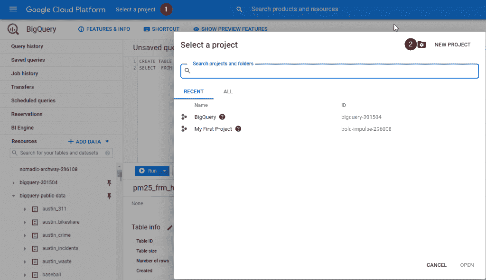
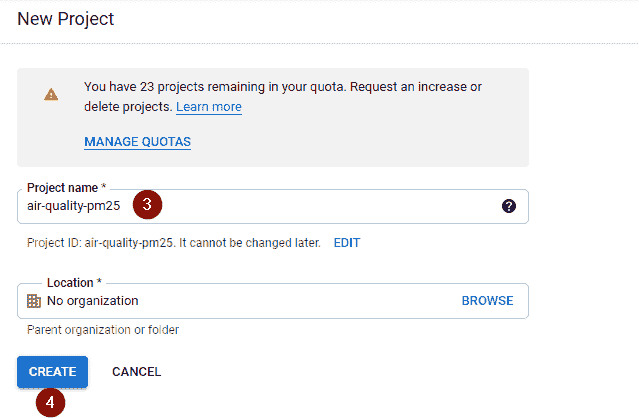
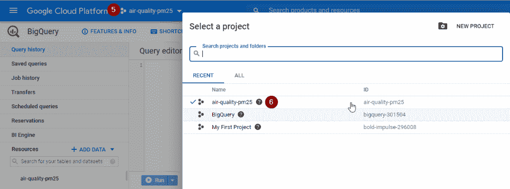
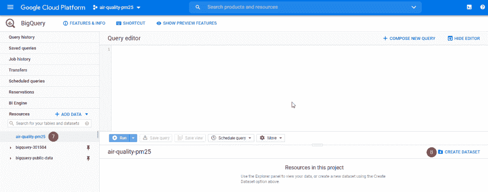
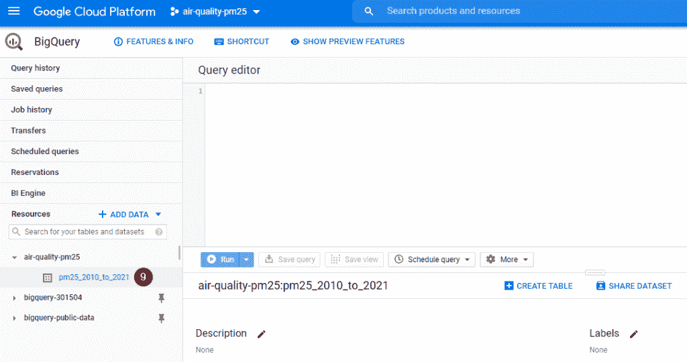
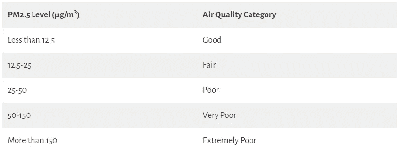
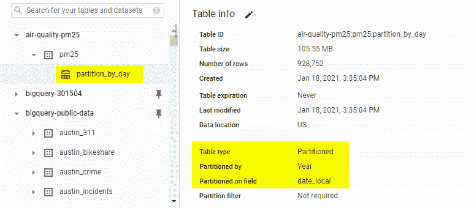
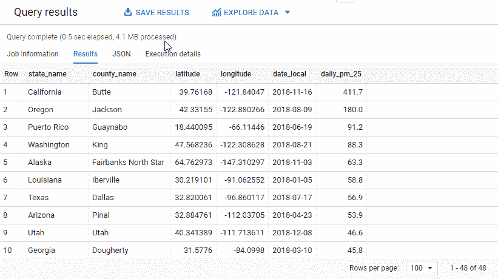
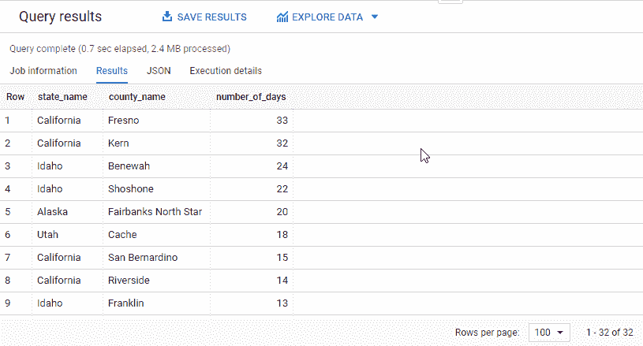
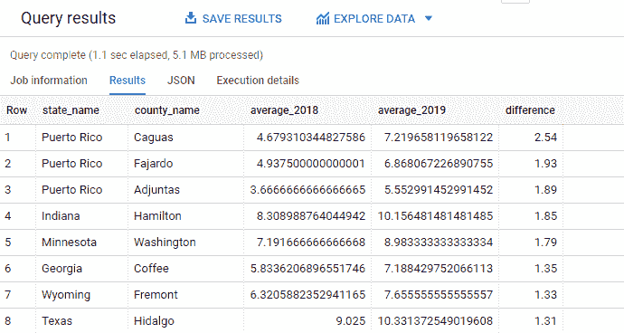

# 你应该在 2021 年开始使用的 3 个有用的 SQL 特性

> 原文：<https://towardsdatascience.com/3-useful-sql-features-you-should-start-using-in-2021-4346c7ffdc55?source=collection_archive---------52----------------------->

## 是时候使用日期分区、分析窗口函数和 with 子句将您的查询提升一个档次了

由 [Unsplash](https://unsplash.com/s/photos/data?utm_source=unsplash&utm_medium=referral&utm_content=creditCopyText) 上的 [Pietro Jeng](https://unsplash.com/@pietrozj?utm_source=unsplash&utm_medium=referral&utm_content=creditCopyText) 拍摄

我将带着一个重要的新年决心开始 2021 年:**练习更复杂的 SQL 查询。**如果你也在这条船上，和我一起探索 Google BigQuery 的 3 个有用的 SQL 特性。

**你将学习如何:**

1.  创建带有日期分区的表
2.  使用(分析)窗口函数对一组行进行聚合
3.  使用 WITH 子句分解复杂的查询

根据您的背景，这些可能看起来像出现在其他关系数据库中的基本特性，或者它们可能看起来很奇特。无论哪种方式，我都包含了详细的例子和解决每个问题的方法。所以让我们跳进舒适的地方，开始吧！

# 开始之前

在 Google BigQuery 中，您需要了解以下层次结构:项目—数据集—表/视图

*   一个**项目**组织所有资源(例如数据、存储、计算引擎等。)待用。一个项目可以包含一个或多个数据集。
*   **数据集**是一个容器，用于组织和控制对表和视图的访问。数据集可以包括一个或多个表和/或视图。

在分析任何数据之前，我们必须创建一个项目和一个数据集。以下是如何在不到 3 分钟的时间内做到的。

## 创建项目

点击**选择一个项目**并选择**新项目**

作者照片

看到下面的屏幕后，指定您选择的项目名称，然后单击**创建**。

作者照片

完成项目创建大约需要 10-20 秒。关于完成状态的通知可以通过点击位于屏幕右上角的钟形图标来查看。

## 创建数据集

接下来，您将创建一个数据集来存储新表。

检查 Google Cloud Platform 旁边顶部菜单中显示的项目名称。如果不是新创建的项目，点击**选择项目**切换到正确的项目。

作者照片

选择项目名称，然后点击**创建数据集**

作者照片

当看到新项目下的新数据集时(如下所示)，您已经准备好开始了。

作者照片

# 创建带有日期分区的表

**目标**

创建一个新的表格，包括从 2010 年起空气中 PM2.5 颗粒的所有日平均水平。

此外，在新表格中，包括一个新列，以表明基于 PM2.5 水平的空气质量类别。

作者照片(信息改编自[澳大利亚维多利亚环境保护局](https://www.epa.vic.gov.au/for-community/environmental-information/air-quality/pm25-particles-in-the-air)

> *PM2.5 颗粒是一种常见的空气污染物，通常存在于烟雾中。它们小到足以让人类深深地吸入我们的肺部或进入我们的血液。当 PM2.5 水平较高时，对空气污染敏感的人可能会出现胸闷、呼吸困难、哮喘加重或心律不齐。*
> 
> 来自[澳大利亚维多利亚州环境保护局](https://www.epa.vic.gov.au/for-community/environmental-information/air-quality/pm25-particles-in-the-air)

**接近**

1.  创建一个新的永久表，将 2010 年以后的 PM2.5 水平隔离出来供后续查询，从而跳过 2020 年以前的所有历史记录(假设我们只对 2010 年以后感兴趣)。
2.  仅从原始数据集中选择必要的列，以避免在扫描不相关的列时浪费时间和成本。
3.  将 year of date_local 列绑定为一个分区，以便将新表划分为更小的分区，从而通过减少查询读取的字节数来提高查询性能和控制成本。
4.  利用 CASE 语句创建一个新列，根据算术平均值映射空气质量类别

**查询**

作者照片

**十秒外卖**

如果您只关心特定时间段的记录(例如，去年，最近 7 天内)， ***创建日期分区表将允许我们完全忽略某些分区中与我们的查询无关的扫描记录，从而节省查询时间和成本*** 。

# 用窗口函数对一组行进行聚合

**目标**

对于每个州，确定哪个县在 2019 年 PM2.5 颗粒日水平最高的确切位置和日期

**接近**

1.  查看所有 2019 年的读数，按降序排列各州记录组的所有算术平均值
2.  包括州名、县名、纬度、经度、本地日期以及上述每个州的最高级别
3.  仅选择具有最高算术平均值(即等级= 1)的记录

**查询**

作者照片

还记得那些 SQL 刁钻的面试题找第二高，第三高等等吗？这个查询也工作得很好，因为您可以很容易地用 2、3 等替换 rank = 1 的 WHERE 子句。

**十秒外卖**

要计算一组行的聚合值(即按州/月/年计算的最高值)， ***选择(解析)*** [***窗口函数***](https://cloud.google.com/bigquery/docs/reference/standard-sql/analytic-function-concepts) ***，而不是使用昂贵的自联接*** 。

# 使用 WITH 子句分解复杂的查询

## 示例 1

**目标**

2019 年，哪些县至少有 5 天空气质量差(即 PM2.5 日均量达到 25 微克或以上)？对于每个县，总共有多少天空气质量较差？

**接近**

1.  计算 2019 年各县 PM2.5 水平日均值
2.  对于每个县，计算 PM2.5 达到 25 微克或以上的天数
3.  包括至少有 5 天的县，以及 PM2.5 达到 25 微克或以上的天数。按天数降序排列，以突出显示空气质量差的天数最多的县和州

**查询**

作者照片

**十秒外卖**

为了解决一个复杂的查询， ***使用***[***the WITH 子句(又称为通用表达式表)***](https://popsql.com/learn-sql/bigquery/how-to-write-a-common-table-expression-in-bigquery) ***将复杂的问题分解成许多更小的步骤*** 和表，而不是试图编写一个大规模的组合 SQL 语句。

*额外提示:* ***如果 WITH 子句中的表可以跨不同的查询重用，可以考虑创建一个永久表*** *来存储查询结果。这样做，可以避免在 WITH 子句中多次运行同一个查询。*

## 示例 2

**目标**

对于各州县来说，2018 年和 2019 年 PM2.5 年均水平相差多少？

**接近**

1.  对于每个州和县，计算 2018 年 PM2.5 的年平均水平
2.  对于每个州和县，计算 2019 年 PM2.5 的年平均水平
3.  将这 2 个结果合并成 1 个表，计算 2018 年和 2019 年 PM2.5 水平的差异。为了便于比较，将差值四舍五入到小数点后两位。

**查询**

作者照片

**十秒外卖**

为了使一个复杂的查询更具可读性， ***使用 WITH 子句创建多个表表达式，然后连接得到的表*** 。

尽管向您展示了很长的查询和对我的方法的简要解释，但本文只涵盖了使用 Google BigQuery 可以做的事情的一小部分。但是，我希望这已经为您将要编写的所有有见地的查询提供了一个良好的起点。不可避免地，你会遇到障碍或者被一个困难的 SQL 问题卡住。在这种情况下，记得深呼吸，拿点喝的，开始把大问题分解成小块，就像我在方法中做的那样。你就要成功了，你会征服它的！

谢谢你的阅读，如果你有任何反馈，请告诉我。祝你愉快！

*原载于 2021 年 1 月 18 日*[*【http://thedigitalskye.com】*](https://thedigitalskye.com/2021/01/19/3-useful-sql-features-you-should-start-using-in-2021/)*。*