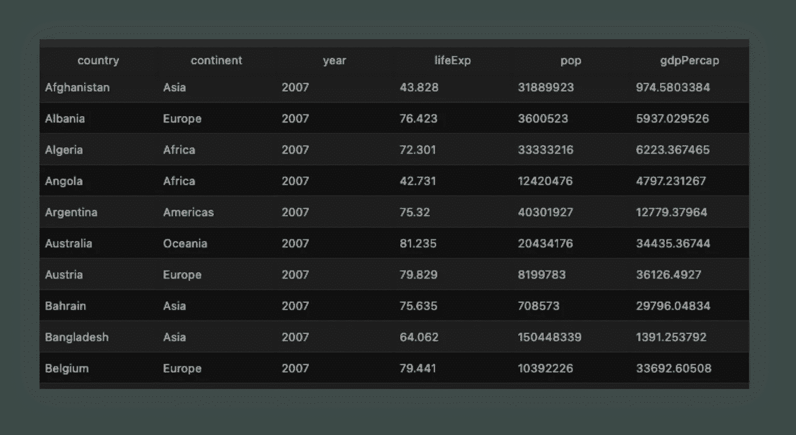
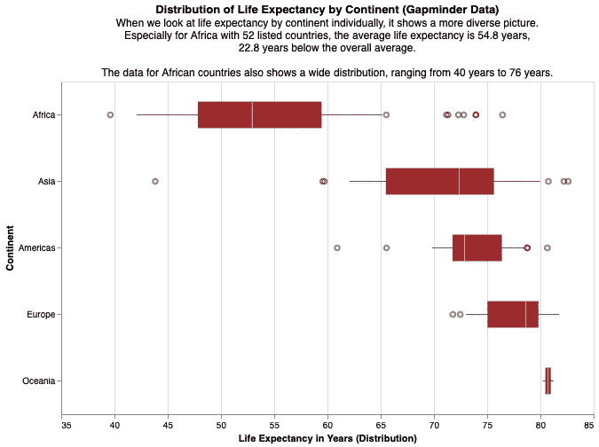
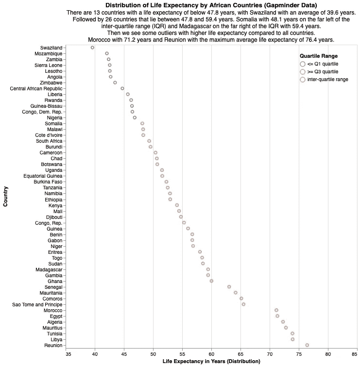

# 使用 Altair 和 Python 为信息丰富的图表提供 3 个可视化层

> 原文：<https://towardsdatascience.com/3-visualization-layers-for-information-rich-charts-with-altair-and-python-7a66c0cbdd39?source=collection_archive---------24----------------------->

图层概述(图片由作者提供)

## [*小技巧*](https://towardsdatascience.com/tagged/tips-and-tricks) ，教程— PYTHON —牛郎星

## 如何通过在图表上添加有用的信息来提高讲故事的水平

# 1.介绍

无论使用 R 还是 Python，从数据创建初始图表都很容易。创建一个令人愉快的、信息丰富的、可重复的、用清晰可维护的代码编写的图表需要付出更多的努力。

在这篇文章中，我将分享我的工作流程和结构来实现这一点。我将向您展示如何构建您的代码，以及我所依赖的构建模块。在下一节中，我将解释我在本文中使用的数据和可视化包。在第 3 节中，我将概述图表分层结构，而在第 4 节中，我将提供三个如何应用分层结构的示例。最后，在第五部分，我对本文进行了总结。

基于 Gapminder 数据的故事情节示例(图片由作者提供)

# 2.设置

为了展示这些功能，我将使用 **Gapminder 数据集**。Gapminder 数据集包含该国几十年来的预期寿命、人均 GDP 和人口数据。此外，我将 Jupyter 笔记本与熊猫结合使用。

如果你想知道我是如何构建我的代码的，它被称为**方法链**或管道(在 R 社区中)。我在我的另一篇文章中解释了[的基础知识。](/the-flawless-pipes-of-python-pandas-30f3ee4dffc2)

您可能知道，我使用 R 开始了我的数据科学生涯[，因此，我非常熟悉](/nine-years-on-linkedin-in-data-b34047c77223) [ggpot2](https://gscheithauer.medium.com/how-to-add-number-of-observations-to-a-ggplot2-boxplot-b22710f7ef80) 。随着我在客户项目中越来越频繁地使用 Python，我开始寻找类似的 Python 可视化包。我很高兴地说，有了[情节，就有了一个很好的选择。](/data-visualization-in-python-like-in-rs-ggplot2-bc62f8debbf5)

然而，由于我喜欢尝试新事物，特别是可视化软件包，我想尝试一下 [**牛郎星软件包**](https://altair-viz.github.io/) 。Altair 是一个 Python 数据可视化包，它遵循一种[声明式方法](https://codeburst.io/declarative-vs-imperative-programming-a8a7c93d9ad2)，就像 ggplot2 和 [Plotnine](/data-visualization-in-python-like-in-rs-ggplot2-bc62f8debbf5) 。

Gapminder 数据集(图片由作者提供)

# 3.可视化图层和工作流

在向您介绍这三个可视化层之前，我很快提到了数据框对于这个设置是必不可少的。

可视化层和相互依赖性(图片由作者提供)

**原始数据框**是您想要可视化的数据框。在第 4 节的运行示例中，我使用了 Gapminder 数据集。从原始数据帧，我生成了**汇总数据帧**。我称之为“汇总”，因为我经常从原始数据中计算汇总，即平均值、四分位数和计数。请参见下图中的示例。

**图表层**是指您想要准备的可视化，例如直方图、箱线图或箱线图。在下图中，它是一个直方图。**图形层**保存任何元素以向图表层添加更多信息。例如，统计汇总信息，如显示为水平线或垂直线的四分位数或平均值。我使用**文本层**来显示文本，比如解释、亮点和统计信息。

# 4.应用可视化层(运行示例)

## 4.1 预期寿命柱状图

对于**原始数据帧**，我使用 Gapminder 数据，但我将只使用 2007 年的数据。

对于**汇总数据框**，我按分位数 0.25、0.5(中值)、0.75 和均值(平均值)汇总数据。

Gapminder 数据集汇总(图片由作者提供)

为了创建**图表层**，我使用 Altair mark_bar()创建一个直方图。请注意，我还设置了图表的标题、副标题和宽度&高度。

图表层示例(图片由作者提供)

**图形层**我将基于*汇总数据框*和 Altair mark_rule()基于统计汇总创建垂直线。

图形图层示例(图片由作者提供)

**文本层**是*汇总数据帧的结果。*在 Altair 中，您可以使用 mark_text()函数添加文本注释。文本标签描述了来自*图形层*的元素。

文本层示例(图片由作者提供)

最后，我将所有的层放在彼此之上，并使用 configure_title()函数配置布局。

所有图层示例(图片由作者提供)

## 4.2 按大陆分列的预期寿命箱线图

**原始数据帧**没有变化。对于**汇总数据框**，我通过按*洲*分组并使用 describe()函数来汇总数据，然后只选择 *lifeExp* 变量，最后创建带有舍入值和文本标签的附加变量。

Gapminder 数据集汇总(图片由作者提供)

为了创建**图表层**，我使用 Altair mark_boxplot()来创建一个 boxplot。请注意，我还设置了图表的标题、副标题和宽度&高度。请注意 *alt。EncodingSortfield()* 对我不起作用。

图表层示例(图片由作者提供)

**图形层**我将基于*汇总数据框*和牛郎星 mark_tick()创建垂直线来显示每个大陆的平均值。

图形图层示例(图片由作者提供)

**文本层**是*汇总数据帧的结果。*在 Altair 中，您可以使用 mark_text()函数添加文本注释。文本标签描述了各大洲的国家计数以及来自*图层*的平均值。

文本层示例(图片由作者提供)

最后，我将所有的层放在彼此之上，并使用 configure_title()函数配置布局。

所有图层示例(图片由作者提供)

## 4.3 每个非洲国家预期寿命的散点图

为了这个可视化，我增强了原始数据帧。首先，我对非洲国家进行筛选，然后创建一个名为*四分位数范围*的变量，描述预期寿命是低于等于第一个四分位数，高于等于第三个四分位数，还是四分位数间范围的一部分。最后，我创建一个排序向量。该向量按预期寿命排列列出了所有非洲国家。

对于**汇总数据帧**，我通过使用 describe()函数来汇总数据，然后只选择 *lifeExp* 变量，最后创建带有舍入值和文本标签的附加变量。

Gapminder 数据汇总(图片由作者提供)

为了创建**图表层**，我使用 Altair mark_point()创建一个散点图。请注意，我还设置了图表的标题、副标题和宽度&高度。

图表层示例(图片由作者提供)

**图层**我将基于*汇总数据帧*和牛郎星 mark_rule()来创建基于统计汇总的垂直线。

图形图层示例(图片由作者提供)

**文本层**是*汇总数据帧的结果。*在 Altair 中，您可以使用 mark_text()函数添加文本注释。文本标签描述了来自*图形层*的元素。

文本层示例(图片由作者提供)

最后，我将所有的层放在彼此之上，并使用 configure_title()函数配置布局。

所有图层示例(图片由作者提供)

# 5.结论

创建和维护可再现的数据可视化并不是一项简单的任务。在这篇文章中，我分享了我的工作流程和结构来实现这个目标。我向您展示了如何构建您的代码，以及我所依赖的构建块。在前面的小节中，我解释了我使用的数据和可视化包。我概述了图表分层结构，并提供了三个如何应用分层结构的例子。

如果有任何问题、意见和反馈，请随时联系我。谢谢你。