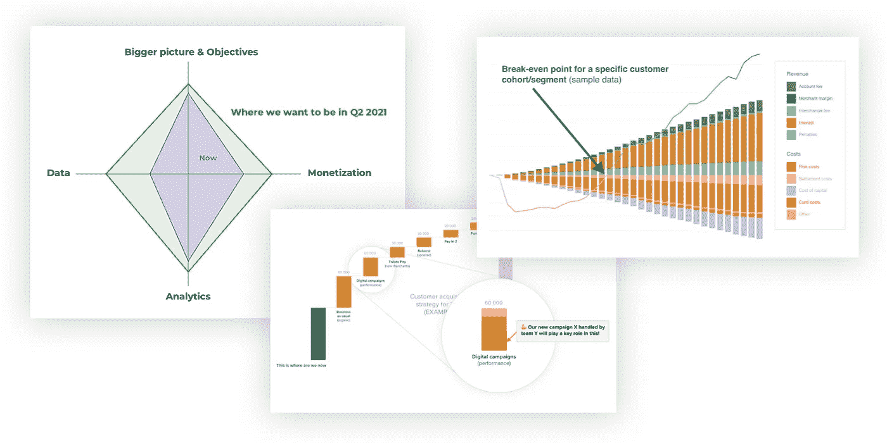
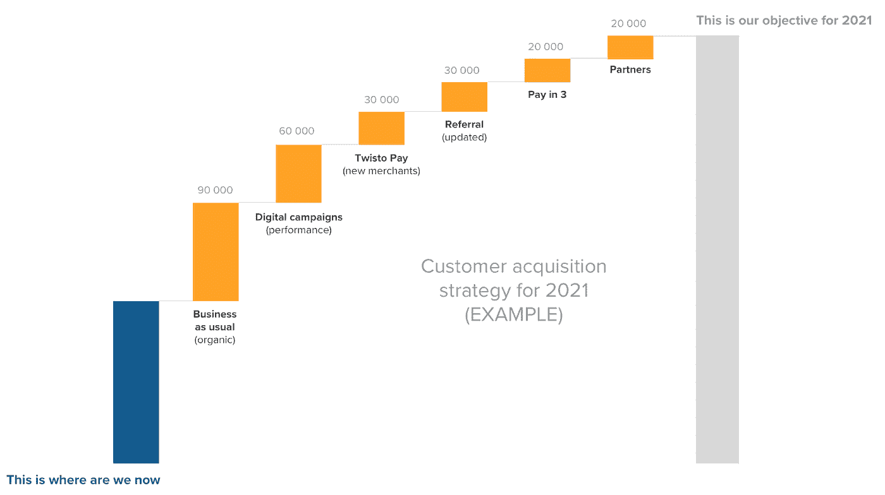
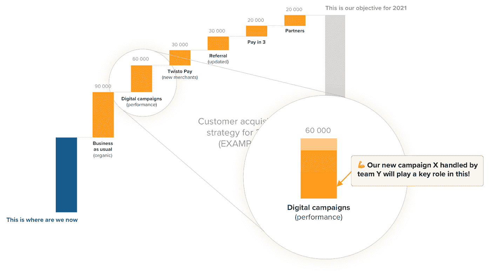
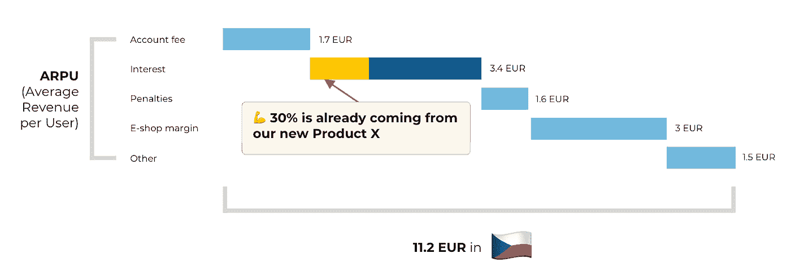
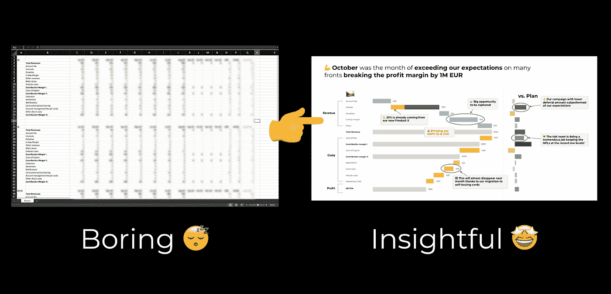
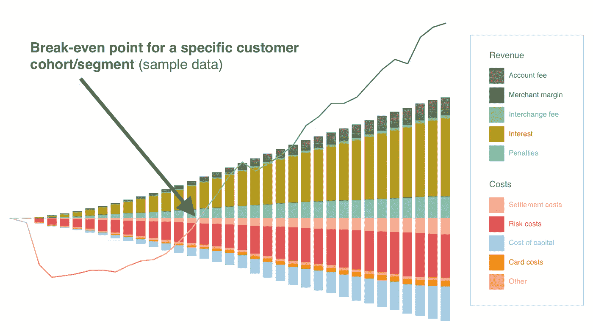
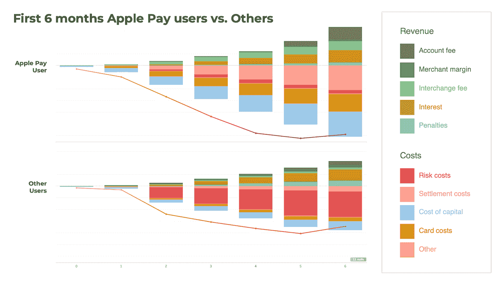
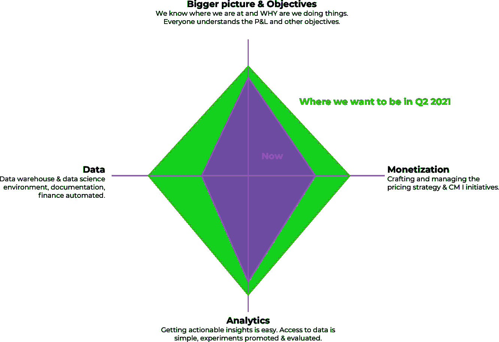
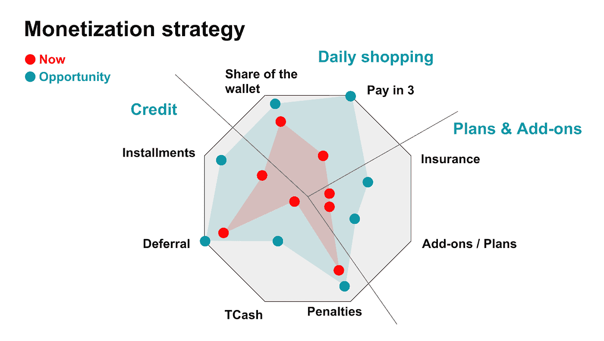

# 改变我生活的三个可视化

> 原文：<https://towardsdatascience.com/3-visualizations-that-changed-my-life-554b7f83e473?source=collection_archive---------0----------------------->

作者图片

我想和你分享三个故事。3 次相遇改变了我的生活，感谢简单的可视化帮助我每天讲述更好的故事。这些年来，我很幸运地遇到了许多鼓舞人心的领导者，我一直在偷偷观察他们如何做事，如何制定战略，以及如何用数据讲述故事。以下是我可能每周至少使用一次的三样东西。

请不要忘记，这些提示只是冰山一角。有几次我听到类似“让我们基于原始广告印象数据训练一个神经网络模型，它将自动创建智能…”这样的话，你就明白了要点。但是如果你问 CLV(客户终身价值)、ARPU(每用户平均收入)、CAC(客户获取成本)与 CLV 以及其他一些指标，没有人知道他们做得怎么样。我相信一切都应该从基础开始，如关键指标、单位经济、目标，一旦你有了一个强大的核心，你就可以在此基础上进行构建。

让我们开始吧。

# 我喜欢瀑布

图片由 [Patrick T'Kindt](https://unsplash.com/@patricktkindt) 在 [Unsplash](https://unsplash.com/photos/vzIjllDiXFQ) 上拍摄

嗯，也有像约塞米蒂瀑布那样的(我们和我的伙伴在美国公路旅行时去过)，但是今天我要给你看一种不同的。

过去，当我们(向投资者)展示我们的目标以及我们将如何实现这些目标时，它更像是一些零碎的东西。这里一个倡议，那里一个倡议。我相信用一个简单的瀑布图来展示它能帮助你讲述一个强有力的故事——我们在哪里，我们想去哪里，以及我们将如何到达那里。你在一张简单的图片里看到了这一切，每个人都明白，你只需要更多地关注为什么。

作者图片

有了这个视觉，我们面前就有了一个清晰的目标，我们也可以看到我们的进步，同样地，也可以定期检查我们一路上的表现。当我们埋头于日常事务时，我们可以回到这张图片来刷新我们的思维，看到一个更大的图片。

我真的很喜欢它如何把事情放在一个角度，你可以用简短的笔记/亮点来添加更多的背景。你也可以通过展示特定团队或个人对目标的贡献来很好地塑造视角。

作者图片

另一个用例可能是单位经济学，你可以非常清楚地显示收入是如何很好地增加的，成本是如何降低的。在下面的例子中，只显示了收入(ARPU)部分。

作者图片

你也可以在另一篇文章中阅读更多关于我们整个 [P & L 的信息。](/does-your-income-statement-p-l-have-to-bore-people-to-death-1c967317ecc6)

作者图片

我必须感谢 Renata Salata，在我遇到她之前，我从未用它来以这种简单而有力的方式表达目标或单位经济。我还要感谢[ondřej·维多维克](https://cz.linkedin.com/in/ond%C5%99ej-vejdovec-7835252)对它们进行了润色，让它们在任何场合都能讲述一个更好的故事。

# **它会融合，嗯，盈亏平衡吗？**

从 [Giphy](https://giphy.com/gifs/live-presents-dsd-i29DtU2PMkzsI) 嵌入的图像

这个群体(或客户群)什么时候能达到收支平衡？这是一个棘手的问题，我们通常用一个包含客户群数据的电子表格来回答。直到有一天我第一次看到这个可爱的形象。

作者图片

它告诉你收入和成本(累计)是如何逐月发展的，中间有一条线，它告诉你什么时候收支平衡。在上面的例子中，您可以看到 2017 年获得的所有客户的行为。我相信它可以帮助你更好地理解你的客户终身价值，并以故事的形式呈现出来。

您还可以比较不同的客户群、群组、活动或您喜欢的任何内容。它还可以很好地显示单位经济随时间的发展。

这是一个直接从我们的 Tableau 中摘录的稍加编辑的版本，它向您展示了我们的 Apple Pay 用户与其他产品组合的不同之处。它讲述了一个有趣的故事。

作者图片

为了这个简单的视觉效果，我必须感谢来自 [Enern](https://enern.eu/) ，现在是 [KAYA 风投](https://www.kaya.vc/) ( [托马什帕欣达](https://cz.linkedin.com/in/tomaspacinda) & [雅各布·斯特拉奇纳](https://cz.linkedin.com/in/jakubstracina))的家伙们。

# 你的策略是什么？

作者图片

这是我的团队下个季度的战略。你可以直接看到我们的 4 个组成部分是什么，我们认为我们现在做得怎么样，以及我们想要达到的目标。这看起来似乎很简单，但它实际上总结了我们的许多想法，我们可以用一种简单的方式与 Twisto 的其他团队进行交流。我认为，当你处理许多不同的项目和优先事项时，很容易迷失在细节中，但这个视觉迫使我理清思路，使它们更加简洁。

至于“我们做得怎么样”的规模，我只是简单地将不同的领域评定为“我们做得像 6/10，我们想移动到 8/10”，这里没有火箭(或数据)科学。您可以看到该策略所有方面的一些基础领域(如数据仓库、文档等。)我也会单独评分以获得最终分数。

第二个例子来自我们的货币化战略。同样，您可以看到构建模块/驱动因素、我们现在所处的位置以及最大的机会在哪里。我觉得这个可能会成为 NFT 艺术作品，开个玩笑(如果你感兴趣的话，也可以不开)。这有点复杂，但它总结了许多不同的商业案例和机会。

作者图片

至于这最后一个视频，我要感谢博纳米的首席执行官帕维尔·vopařil。看到整个公司的长期战略可以如此简单地描述出来，令人印象深刻。

# **权力越大，责任越大**

我要说的是，这三个形象化的最重要的事情是，它们迫使我清理我的思想，逃离日常项目和所有的优先事项。它们迫使我提炼我的想法，从 30 个并行的计划中得到 3 或 5 个积木。这是我可以随时回到过去，看到更大的画面。

也许，有时我会花太多时间去考虑选择哪种视觉效果，但在一天结束时，我相信这个选择很重要，因为它有助于你与周围的人清楚地交流。这也适用于所有的视觉化任务，我总是四处玩耍，看看什么能最好地描绘出我想讲述的故事。

当然，基础是良好和可靠的数据、架构和工具(按此顺序)。如果没有这些东西，你可能会因为传播基于错误见解的东西而造成大破坏。

正如蜘蛛侠曾经说过的:

> 简单而强大的可视化带来了巨大的责任

(或者类似的东西，对吗？).良好的可视化需要高质量的数据/见解，噪音和偏差有限。在 100%的情况下，你无法避免偏见和杂乱的数据，我相信你有责任将数据与你试图讲述的愿景/故事联系起来。

今天就到这里，谢谢你读到这里！我希望它能帮助你讲述更有力的故事，并为你的幻灯片添加背景。感谢过去几年来为我的工具箱做出贡献的所有人(不仅仅是这里提到的那些人)。

请告诉我，如果你觉得这些建议有用，我下次应该写些什么！你也有一些常用的工具吗？我超级好奇想看到/听到更多关于他们的事，请在评论里或在一个 DM 里 ping 我(me@lukashurych.cz)。下次见。