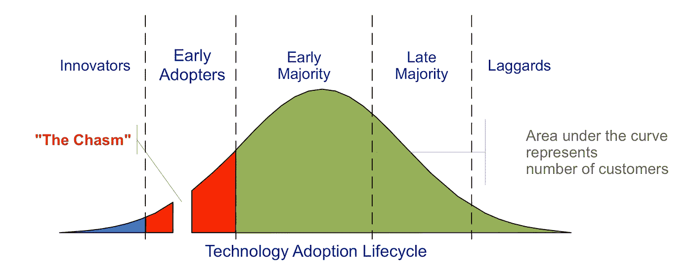

# 领导者失败人工智能项目的 3 种方式

> 原文：<https://towardsdatascience.com/3-ways-leaders-fail-their-ai-projects-fcaf98e9bb8a?source=collection_archive---------50----------------------->

汉娜·塔斯克在 [Unsplash](https://unsplash.com/s/photos/eggs?utm_source=unsplash&utm_medium=referral&utm_content=creditCopyText) 上的照片

## 为什么这么多 AI 项目失败，领导如何避免这种情况？

*更新:你可以在* [*日文*](https://ainow.ai/2021/04/30/253741/) *阅读这篇文章(感谢 Koki Yoshimoto！)*

大多数组织如何开始他们的[人工智能](https://enterprisersproject.com/tags/artificial-intelligence) (AI)之旅？

让我们看看一些大企业的领导人是如何计划他们进军人工智能的。以下是麦肯锡最近的几个例子:

*   一家大型组织的领导花了两年时间和数亿美元在全公司范围的数据清理计划上。目的是在开始任何人工智能计划之前有一个数据元模型。
*   一家大型金融服务公司的首席执行官雇佣了 1000 名数据科学家，每人平均花费 25 万美元，以释放人工智能的力量。

这是我亲眼目睹的一个例子。

*   一家大型制造商的首席执行官安排了一系列使用非结构化数据的雄心勃勃的项目，因为人工智能技术对文本、图像和视频数据非常有效。

所有这些计划有什么共同点？都失败了。

> 麦肯锡的人工智能状况调查发现，只有 22%使用人工智能的公司报告了相当大的底线影响。

除了这些项目遭受的巨大沉没成本之外，它们还导致了组织对高级分析的幻灭。

这种情况并不少见。麦肯锡的人工智能状况调查发现，只有 22%使用人工智能的公司报告了相当大的底线影响。为什么这么多项目失败，领导如何避免这种情况？

大多数追求人工智能的领导者错过了三个所有权领域。这些责任在你计划你的人工智能项目之前就已经开始了，并且在你的项目上线之后还会延续很久。

以下是让你的人工智能计划失败的三种方式:

# 错误 1:开始与公司愿景不一致的人工智能项目

Photo by [青 晨](https://unsplash.com/@jiangxulei1990?utm_source=unsplash&utm_medium=referral&utm_content=creditCopyText) on [Unsplash](https://unsplash.com/s/photos/eggs?utm_source=unsplash&utm_medium=referral&utm_content=creditCopyText)

麦肯锡[发现](https://www.mckinsey.com/business-functions/mckinsey-analytics/our-insights/accelerating-analytics-to-navigate-covid-19-and-the-next-normal)只有 30%的组织将他们的人工智能战略与公司战略保持一致。大部分领导都在以 AI 的名义烧钱，这难道不令人震惊吗？组织经常追求那些看起来有趣或者只是紧急的人工智能计划。

的确，您的项目必须解决业务难点。但是，更重要的是，这些[成果必须与你的公司战略相一致。从您的业务愿景开始，确定数据将如何实现它。阐明谁是你的目标利益相关者，并定义他们的成功是什么样的。](https://www.youtube.com/watch?v=Tdqen8IyDdk&list=PLrn2FHBzHtaOko55uPuAIjXL5pMQhm1pP&index=1)

> 组织经常追求那些看起来有趣或者只是紧急的人工智能计划。

然后，确定将授权给涉众并使他们更接近其业务目标的战略计划。现在，你已经准备好集思广益，列出一长串值得评估的人工智能项目。

在麻省理工学院斯隆管理评论的[报告](https://sloanreview.mit.edu/projects/winning-with-ai/)中，罗氏制药[的首席信息官史蒂夫吉斯](https://www.roche.com/about/business/pharmaceuticals.htm)解释了人工智能如何帮助转变公司的商业模式。罗氏致力于实现个性化医疗保健。吉斯指出，目前的药物输送模式不会帮助他们实现这一愿景。他们认为有必要加快药物研发的速度，从每年 3 种药物增加到 30 种。吉斯说，人工智能可以帮助他们获得这种指数级的改善。

罗氏正在通过建立筛查、诊断和治疗的能力，使人工智能成为组织内的主流。它通过[与追求人工智能驱动的药物发现的初创公司](https://www.roche.com/partnering/partnering-in-a-digital-era.htm)合作来加强这一点。由于这些努力，罗氏在乙肝和帕金森病等疾病的[治疗方面取得了重大突破。通过从他们的企业愿景开始，并使他们所有的人工智能计划与这一总体目标保持一致，罗氏的努力正在结出果实。](https://www.roche.com/about/priorities/personalised_healthcare/machine-learning.htm)

# 错误 2:在项目上线后等待投资回报计划

由 [KS KYUNG](https://unsplash.com/@mygallery?utm_source=unsplash&utm_medium=referral&utm_content=creditCopyText) 在 [Unsplash](https://unsplash.com/collections/10075660/funny?utm_source=unsplash&utm_medium=referral&utm_content=creditCopyText) 上拍摄的照片

你应该什么时候考虑你的人工智能项目的投资回报率？大多数组织在项目上线时都会犯跟踪 ROI 的错误。领导者满足于模糊的结果，如“效率提高”、“品牌价值”或“更快乐的顾客”，让事情变得更糟。

的确，量化结果的美元价值并不容易。但也不是不可能。你必须[要求量化](https://www.youtube.com/watch?v=nOvBXoWbJNg&list=PLrn2FHBzHtaOko55uPuAIjXL5pMQhm1pP&index=4)商业利益，甚至在批准一个项目之前。人工智能可以通过增加收入或降低支出来实现价值。两者都有价值。定义您的项目将实现哪些结果。

> 领导者犯了满足于模糊结果的错误。

确定有助于衡量这些结果的领先和滞后指标的组合。通过更新您的流程或创建新流程，收集计算指标所需的数据。最后，通过超越硬件、软件和技术团队成本来跟踪您的投资。包括你在采纳和变革管理项目上的花费。这个 ROI 度量应该是您项目批准决策中的一个关键因素。

德意志银行在德国推出了人工智能驱动的消费信贷产品。该解决方案甚至在客户填写贷款申请时就对贷款做出了实时决策。消费者担心贷款被拒会影响他们的信用评级。该产品通过告诉他们贷款是否会被批准，甚至在他们点击“申请”之前，就消除了这种风险

德意志银行[发现，在人工智能服务推出后的八个月里，T3 的贷款发放激增了 10 到 15 倍。收益是通过吸引那些原本不会申请的客户来实现的。这是人工智能帮助增加收入的一个明显例子。](https://sloanreview.mit.edu/projects/winning-with-ai/)

# 错误 3:期待人工智能驱动的转型，而不修复组织文化

照片由[腾雅特](https://unsplash.com/@tengyart?utm_source=unsplash&utm_medium=referral&utm_content=creditCopyText)在 [Unsplash](https://unsplash.com/s/photos/eggs?utm_source=unsplash&utm_medium=referral&utm_content=creditCopyText) 上拍摄

在 2019 年[年度调查](https://www.gartner.com/doc/3984520)中，Gartner 向首席数据官询问了他们从分析中获得价值的最大障碍。最大的挑战与数据或技术无关。这是文化。

正如彼得·德鲁克的名言，“组织文化早餐吃战略。”如果你不小心地塑造组织文化，即使是最好的人工智能战略也将毫无价值。文化变革必须从最高层开始。领导者必须利用讲故事来启发和展示人工智能如何帮助组织实现其愿景。

> 领导者必须解决围绕人工智能的恐惧，并提高所有员工的数据素养。

领导者必须解决围绕人工智能的恐惧，并提高所有员工的数据素养。他们必须以身作则，通过让各级数据冠军加入进来来维持变革。文化转变需要数年时间，领导者必须在项目上线后的很长一段时间内影响它。

想知道达美乐披萨的主要成分是什么吗？是数据！多米诺披萨是技术变革的典型代表。该组织生活在数据驱动的决策文化中，并在[销售](https://www.afr.com/technology/ai-tells-domino-s-when-you-will-want-a-pizza-with-uncanny-accuracy-20200826-p55pl5)、[客户体验](https://diginomica.com/ai-retail-big-investments-can-deliver-new-business-and-happy-customers)和[交付](https://www.infoworld.com/article/3535230/how-ai-helped-domino-s-improve-pizza-delivery.html)中使用人工智能。10 年前不是这样。

帕特里克·杜尔于 2010 年接任这家有 50 年历史的披萨制造商的首席执行官，当时这家公司受到了顾客和投资者的严厉批评。道尔迈出了大胆的一步，将收获评论公之于众。然后，他从内到外进行了一次全面的重新启动，使该组织走上了数字化转型的道路。他在技术上下了一些大胆的赌注，承担风险项目，授权给人们，并在内部开发了几项人工智能创新。

当道尔在 2018 年退休时，多米诺的销售额已经连续 28 个季度增长，其股票回报率超过了谷歌。这位即将离任的首席执行官总结得最好，“我们是一家碰巧卖披萨的科技公司。”通过领导多米诺骨牌内部的文化转型，Doyle 确保了向数据驱动型决策的转变，这种转变甚至在他过渡到新的首席执行官之后仍在持续。

# 你将如何让人工智能跨越你组织中的创新鸿沟？

克雷格·切利乌斯的照片来自[维基共享资源](https://commons.wikimedia.org/wiki/File:Technology-Adoption-Lifecycle.png)

采用技术创新从来都不容易。无论是人工智能等新技术在市场上的推出，还是在组织内的采用，挑战都是相似的。

创新者在组织内部播种这一旅程。由于他们最初的热情和对变化的开放态度，这种创新随后被早期采用者所接受。但是之后，速度慢了下来[进入了一个缺口](https://en.wikipedia.org/wiki/Crossing_the_Chasm)。往往缺乏可见性，结果不确定，对变革的阻力更大。

这是大多数倡议失败的地方。

像人工智能这样的创新要想跨越这个鸿沟，进入主流，需要领导层的介入。领导者必须通过将主动性与他们的企业愿景相结合来使 AI 取得成功。他们必须通过将有关 AI 投资回报的对话制度化来展示经济价值。最后，他们必须塑造组织文化，以促进变革，并让人工智能驱动的决策得到病毒式的应用。

佩奇科迪在 [Unsplash](https://unsplash.com/s/photos/eggs?utm_source=unsplash&utm_medium=referral&utm_content=creditCopyText) 上的照片

*本文最初是* [*发表*](https://enterprisersproject.com/article/2020/12/artificial-intelligence-ai-3-ways-leaders-fail-projects) *关于企业家项目。增加了插图。*