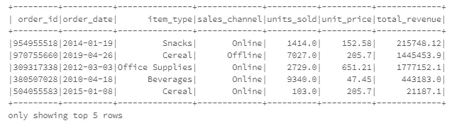
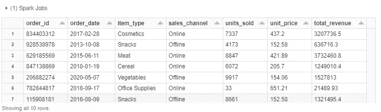
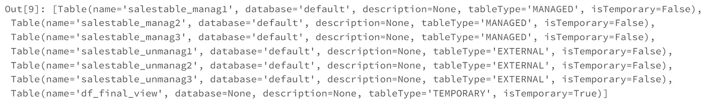

# 用 Apache Spark 创建表格的 3 种方法

> 原文：<https://towardsdatascience.com/3-ways-to-create-tables-with-apache-spark-32aed0f355ab?source=collection_archive---------1----------------------->

## [编程](https://towardsdatascience.com/tagged/programming) | [大数据](https://towardsdatascience.com/tagged/big-data) | [PySpark](https://towardsdatascience.com/tagged/pyspark)

## 在本实践教程中，学习如何使用 PySpark 构建托管和非托管表，以及如何在项目中有效地使用它们。

[](https://anbento4.medium.com/)

照片由 [Unsplash](https://unsplash.com?utm_source=medium&utm_medium=referral) 上的 [Jez Timms](https://unsplash.com/@jeztimms?utm_source=medium&utm_medium=referral) 拍摄

## 点播课程|推荐

*我的一些读者联系我，要求提供点播课程，以了解更多关于使用 Python 的****Apache Spark****。这是我推荐的 3 个很好的资源:*

*   [**用阿帕奇卡夫卡的数据流&阿帕奇火花纳米度(UDACITY)**](https://imp.i115008.net/zaX10r)
*   [**数据工程纳米学位(UDACITY)**](https://imp.i115008.net/zaX10r)
*   [**Spark 与 Python 对于大数据的配合**](https://click.linksynergy.com/deeplink?id=533LxfDBSaM&mid=39197&murl=https%3A%2F%2Fwww.udemy.com%2Fcourse%2Fspark-and-python-for-big-data-with-pyspark%2F)

*还不是中等会员？考虑与我的* [*推荐链接*](https://anbento4.medium.com/membership) *注册，以每月 5 美元的价格获得 Medium 提供的一切！*

# 介绍

[Apache Spark](https://databricks.com/spark/about) 是一个分布式数据处理引擎，允许您创建两种主要类型的表:

1.  **托管(或内部)表:**对于这些表，Spark 管理数据和元数据。特别是，数据通常保存在 Spark SQL warehouse 目录中——这是托管表的*默认设置*——而元数据保存在关系实体的元存储中(包括*数据库、表、临时视图*),可以通过一个称为“目录”的接口访问。
2.  **非托管(或外部)表:**对于这些表，Spark 只管理元数据，但是要求您指定保存表的确切位置，或者指定从中提取数据以创建表的源目录。

此外，由于它们的目的不同:

*   **如果您删除一个托管表**，Spark 将删除仓库中的表数据和元存储中的元数据，这意味着您既不能直接查询该表，也不能向其中检索数据。
*   **如果您删除一个非托管表**，Spark 将只删除元数据，这意味着您将无法再查询该表，因为您的查询将不会在执行分析阶段根据目录进行解析；但是您仍然可以在外部位置找到您创建的表。

在本教程中，我将分享三种创建托管表和非托管表的方法，并解释使用其中一种有意义的情况。

[](/3-ways-to-aggregate-data-in-pyspark-72209197c90) [## PySpark 中聚合数据的 3 种方法

### PySpark 用编码示例解释基本聚合。

towardsdatascience.com](/3-ways-to-aggregate-data-in-pyspark-72209197c90) 

# 初始数据集操作

如果您希望继续学习，但是对 Spark 相对陌生，并且没有更好的选择，我强烈建议您使用 [Databrick 的社区版](https://community.cloud.databricks.com/login.html)，因为它可以让您访问具有 15GB 内存和 2 个内核的集群来执行 Spark 代码。

我将要使用的`sales_redords`数据集相当大(600MB ),因为它包括 500 万行和 14 列——你可以在这里下载它[。我选择了一个相当大的数据集——至少部分地——来复制您在现实世界中必须处理的数据量。](http://eforexcel.com/wp/downloads-18-sample-csv-files-data-sets-for-testing-sales/)

因为数据集是半结构化的 CSV 格式，为了在 SparkSession 中创建 DataFrame，请确保首先上传 [DataBricks 文件系统(DBFS)](https://docs.databricks.com/data/databricks-file-system.html) 的`/FileStore/`目录中的原始文件，然后运行以下代码:

为了模拟原始数据作为日常 ETL 管道的一部分所经历的清理过程，我们假设您希望:

*   将原始列名转换为小写，并将空格“”替换为下划线“_”；
*   将原来的*【订单日期】*从`STRING`转换为`DATE`，将原来的*【售出单位】、* *【单价】*、*【总收入】*从`STRING`转换为`FLOAT`；
*   删除以下各列，因为您的利益相关方不需要这些列:[ *"地区"、"国家"、"订单优先级"、"发货日期"、"总利润"、"总成本"、"单位成本"*]；
*   删除原“*订单 ID* 字段中的重复项。

这可以通过执行下面的代码来实现，该代码创建了一个名为`df_final`的新数据帧，它只包含 7 列和 2M 行。(*前 5 行也显示*):



已经对`df_final`进行了处理，以获得想要的结果，现在可以将其用作创建表格的源了。

然而，为了向您展示所有 3 种不同的方法，我还必须将`df_final`作为**临时视图**和 DBFS 中的**拼花文件**(分成 2 个分区):

# 创建托管表

如上所述，当您创建一个由*管理的*表时，Spark 将管理表数据和元数据(*关于表本身的信息* f)。具体来说，数据被写入默认的配置单元仓库，即在`/user/hive/warehouse`位置设置的仓库。您可以改变这种行为，在生成`SparkSession`时使用`spark.sql.warehouse.dir`配置。

[](/3-nanodegrees-you-should-consider-to-advance-your-data-engineering-career-in-2021-baf597debc72) [## 3 门数据工程课程，在 2022 年推进您的职业发展

### 加入数据行业，改变角色或通过注册数据工程简单地学习前沿技术…

towardsdatascience.com](/3-nanodegrees-you-should-consider-to-advance-your-data-engineering-career-in-2021-baf597debc72) 

## 方法 1

创建托管表最直接的方法是通过结构化 API `saveAsTable()`方法编写`df_final`，而不指定任何路径:

您可以通过运行以下命令来检查该命令是否成功创建了一个名为`salesTable_manag1`且带有`tableType = 'MANAGED'`的永久表:

```
spark.catalog.listTables()Out[1]: [Table(name=’salestable_manag1', database=’default’, description=None, tableType=’MANAGED’, isTemporary=False)
```

在大多数情况下，您应该更喜欢使用这种方法，因为它的语法非常紧凑，可读性很强，并且避免了在内存中创建临时视图的额外步骤。

## 方法 2

创建托管表的另一种方法是运行 SQL 命令，查询 temp `df_final_View`中的所有记录:

在这种情况下，我使用 Databricks 中的`%sql`魔法直接运行一个 SQL 命令，而没有将它打包到`spark.sql()`中。但是，您可以使用以下语法获得完全相同的结果:

```
spark.sql(“CREATE TABLE IF NOT EXISTS salesTable_manag2 AS SELECT * FROM df_final_View”)
```

如果您有 SQL 背景，这种方法可能是最熟悉的，因为您不需要为“标准的”结构化 API 语法而烦恼，甚至可以动态地执行额外的操作。但是，在处理大数据时，您应该考虑在集群上创建临时视图所需的额外空间。

## 方法 3

您可以使用的最后一种方法与前一种类似，但它包括两个步骤，首先创建一个表`salesTable_manag3`，然后通过查询临时视图将数据插入其中:

当您希望更改列类型时，或者如果您已经创建了一个表，并且希望替换或追加数据，而不是删除它并从头开始时，您应该选择此方法。

# 创建非托管表

*非托管*表提供了更大的灵活性，因为表数据可以存储在您选择的位置，或者表可以直接构建在外部目录中的可用数据之上。反过来，这意味着在 Spark 中，对于外部表来说，位置是*强制的*。元数据再次保存在元存储中，并可通过目录访问。

> *非托管*表提供了更大的灵活性，因为表数据可以存储在您选择的位置，或者表可以直接构建在外部目录中的可用数据之上。

在下面的例子中，我将使用[*Databricks 文件系统*](https://docs.databricks.com/data/databricks-file-system.html) 来模拟一个关于默认 Spark SQL 仓库的外部位置，但是当然，可以保存非托管表(或者在与 Spark 兼容的每个文件系统之上创建它们)，包括 ***云数据仓库*** 。

## 方法 1

要创建一个非托管(外部)表，只需在`saveAsTable()`方法之前指定一个路径:

当您运行这段代码时，Spark 将:

*   打乱`df_final`数据帧中的数据，创建两个分区，并将它们写入`/FileStore/tables/salesTable_unmanag1`目录。
*   使用存储在该位置的分区创建一个名为`salesTable_unmanag1`的外部表，并将相关信息保存在元存储中。

## 方法 2

因为通过将位置指定为 SQL 查询的一部分可以获得类似的结果。在这种情况下，您需要使用临时视图作为数据源:

还要记住使用`CREATE EXTERNAL TABLE`语法，而不是`CREATE TABLE`。

## 方法 3

最后，如果您打算用来创建表的数据已经在一个外部位置可用，您可以通过使用`USING format OPTIONS (path 'path to location')`语法指向该位置，简单地在它的上面构建表:



在这种情况下，该表是在操作原始数据集后保存在`FileStore`中的`df_final.parquet`文件的顶部创建的。请注意，如果您使用这种方法，您将需要指定每一列的类型。

如果您尝试再次列出目录中的表:

```
spark.catalog.listTables()
```

您可以看到，现在输出包括 6 个表，其中 3 个是托管表，3 个是非托管表，以及在开始时创建的临时视图:



执行以下代码将只删除类型表中的元数据和托管表中的数据，而数据将保留在您指定的外部位置:

但是，删除元数据后，您将无法对任何表运行查询。

# 何时使用托管表或外部表？

到目前为止，您应该已经很好地理解了这两种类型的表之间的区别，并且应该准备好将上面的代码应用到您的特定用例中。然而，在一个真实的项目中，当你在两者之间选择一个的时候，也许你仍然有点困惑。

一般来说，你应该将数据存储在一个**托管表**中:

1.  **当您希望** [**使用 Spark 作为数据库**](https://blog.knoldus.com/apache-spark-sdsoh/) **执行特定或交互式查询以浏览和可视化数据集** **→** *例如，您可以在 Spark 中设计一个 ETL 管道，最终将数据存储在一个托管表中，然后使用 JDBC-ODBC 连接器通过 Looker、Tableau、Power BI 和其他 BI 工具来查询该表。*
2.  **当您正在处理一个项目，并希望在将数据写入最终位置之前，暂时将数据保存在 Spark 中以进行额外的操作或测试时** → *例如，在 Spark 中构建、训练和评估机器学习模型时，托管表可能会很方便，因为它们消除了对外部存储的需要，从而可以保存部分迭代。*
3.  **当您希望 Spark 处理包括删除在内的表数据的完整生命周期，或者担心外部文件系统的安全性** → *如果数据不需要立即与其他客户端共享，或者存在安全问题，那么将数据保存在 Spark warehouse 中可能是一个有效的临时解决方案。*
4.  **当您不担心数据的可再现性时** → *如果数据可以很容易地从其他来源检索到，或者转换数据所需的计算工作量不太大，那么错误删除受管表的风险就更小了。*

相反，您应该将数据存储在一个**外部**表中:

1.  **当您无法基于 SparkSession 中已经可用的现有数据框架或视图创建表格时，会附带一个推断模式** → *在这种情况下，您必须提供首选位置并指定正确的字段类型。*
2.  **当 Spark 主要用于并行处理大型数据集时，通过将它们分布在集群中，或者通过批处理或流实现端到端的数据管道** → *在这种情况下，Spark 通常用于繁重的计算，但数据最终会存储到外部数据湖或写入最终的云数据仓库。*
3.  **当数据需要保留在指定的外部位置时，即使在 Spark 中删除了非托管表** → *当有多个表或模式构建在相同数据之上，并且您不希望危及它们的完整性时，通常会出现这种情况。*
4.  **当 Spark 不应拥有数据生命周期时，例如控制设置、目录和模式** → *，您可能已经有了其他解决方案来完成这些任务。*

## 给我的读者一个提示

> 这个帖子包括附属链接，如果你购买的话，我可以免费给你一点佣金。

# 来源

*   [火花——权威指南——比尔·查姆&马泰·扎哈里亚](https://www.oreilly.com/library/view/spark-the-definitive/9781491912201/)
*   学习火花——帕特里克·温德尔著&马泰·扎哈里亚
*   [Apache Spark 表格和视图的类型| Subash 西瓦吉| Medium](https://medium.com/@subashsivaji/types-of-apache-spark-tables-and-views-f468e2e53af2)
*   [使用 Spark 作为数据库— Knoldus 博客](https://blog.knoldus.com/apache-spark-sdsoh/)
*   [内部&Hadoop-HIVE(大数据岛)中的外部表| LinkedIn](https://www.linkedin.com/pulse/internal-external-tables-hadoop-hive-big-data-island-amandeep-modgil/)