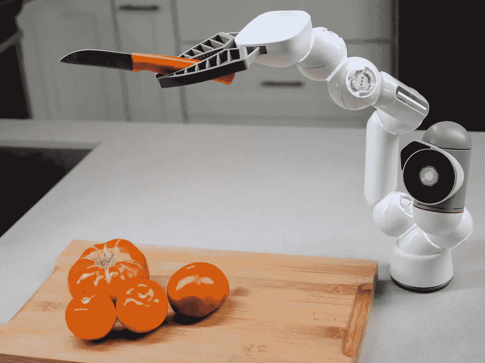

# 在生产中部署机器学习模型的 3 种方式

> 原文：<https://towardsdatascience.com/3-ways-to-deploy-machine-learning-models-in-production-cdba15b00e?source=collection_archive---------0----------------------->

## 部署 ML 模型，并使它们对用户或项目的其他组件可用。



将机器学习模型部署到生产中——来自 [Pexels](https://www.pexels.com/photo/food-wood-man-people-9028914/?utm_content=attributionCopyText&utm_medium=referral&utm_source=pexels) 的 [Kindel Media](https://www.pexels.com/@kindelmedia?utm_content=attributionCopyText&utm_medium=referral&utm_source=pexels) 摄影

处理数据是一回事，但将机器学习模型部署到生产中则是另一回事。

数据工程师总是在寻找新的方法来将他们的机器学习模型部署到生产中。他们想要最好的性能，他们关心它的价格。

现在你可以两者兼得了！

让我们来看看部署过程，看看我们如何才能成功！

[](/python-web-apps-for-machine-learning-e29d075e6459) [## 为 Python APIs 和 ML 模型创建 Web UIs

### 快速制作原型并与其他人共享 web 应用程序。收集关于预测的反馈，以提高 ML 模型的性能。

towardsdatascience.com](/python-web-apps-for-machine-learning-e29d075e6459) 

# 如何在生产中部署机器学习模型？

大多数数据科学项目将机器学习模型部署为**按需预测服务**或**批量预测**模式。一些现代应用在边缘和移动设备中部署**嵌入式模型**。

每种模式都有自己的优点。例如，在批处理场景中，优化是为了*最小化模型计算成本*。对外部数据源和云服务的依赖*更少*。本地处理能力有时足以计算算法复杂的模型。

当*发生故障*或*调整超参数*时，调试离线模型也很容易，因为它运行在强大的服务器上。

另一方面，网络服务可以提供*更便宜的*和*接近实时的预测*。如果模型运行在集群或云服务上，CPU 能力的可用性就不是问题。通过 API 调用等等，该模型可以很容易地用于其他应用程序。

嵌入式机器学习的一个主要好处是，我们可以根据特定设备的*要求对其进行定制。*

我们可以很容易地将模型部署到设备上，并且它的运行时环境不能被外部团体篡改。一个明显的缺点是设备需要有足够的计算能力和存储空间。

[](/secure-your-streamlit-app-with-django-bb0bee2a6519) [## 使用 Django 保护您的 Streamlit 应用

### 围绕你的机器学习 web 应用建立一个灵活的认证系统

towardsdatascience.com](/secure-your-streamlit-app-with-django-bb0bee2a6519) 

# 将机器学习模型部署为 web 服务。

部署机器学习模型的最简单方法是创建一个用于预测的 web 服务。在这个例子中，我们使用 [Flask web 框架](https://flask.palletsprojects.com/en/2.0.x/)来包装一个用 scikit-learn 构建的简单的[随机森林分类器](https://scikit-learn.org/stable/modules/generated/sklearn.ensemble.RandomForestClassifier.html)。

要创建机器学习 web 服务，至少需要三个步骤。

第一步是创建一个机器学习模型，训练它并验证它的性能。以下脚本将训练一个随机森林分类器。[为了简单起见，这里不包括模型测试和验证](https://machinelearningmastery.com/difference-test-validation-datasets/)。但是请记住，这些是任何机器学习项目不可或缺的一部分。

为部署构建一个简单的机器学习模型。

在下一步中，我们需要持久化模型。我们部署应用程序的环境通常与我们培训他们的环境不同。培训通常需要不同的资源。因此，这种分离有助于组织优化他们的预算和工作。

[Scikit-learn 提供了 python 特有的序列化](https://scikit-learn.org/stable/modules/model_persistence.html)，使得模型持久化和恢复变得毫不费力。下面是我们如何将训练好的模型存储在 pickle 文件中的一个例子。

使用 scikit-learn 的 joblib 实用程序将机器学习模型作为 pickle 文件持久化。

最后，我们可以使用 web 框架为持久模型提供服务。下面的代码使用 Flask 创建了一个 REST API。该文件托管在不同的环境中，通常是在云服务器中。

使用 Flask Python web 框架部署用于在线预测(预测服务)的机器学习模型。

上面的代码通过`[https://localhost:8080/predict](https://localhost:8080/predict)`接受 POST 请求中的输入，并在 JSON 响应中返回预测。

[](/the-quick-and-easy-guide-to-create-wordclouds-in-python-7a81813e4cd5) [## 用 Python 创建单词云的快速简单指南

### 创建不同形状的单词云，以更好地传达信息。

towardsdatascience.com](/the-quick-and-easy-guide-to-create-wordclouds-in-python-7a81813e4cd5) 

# 为批量预测部署机器学习模型。

虽然在线模型可以提供预测，但按需批量预测有时更可取。

离线模型可以进行优化，以处理大量的作业实例并运行更复杂的模型。在批量生产模式下，您也不需要担心扩展或管理服务器。

批量预测可以简单到用输入变量的数据集调用预测函数。下面的命令可以做到这一点。

```
prediction = classifier.predict(UNSEEN_DATASET)
```

有时，您必须在批处理方法中安排训练或预测。有几种方法可以做到这一点。我最喜欢的是使用气流或提督自动化任务。

使用 Prefect 调度用于批量预测的机器学习模型。

上述脚本计划从脚本执行后 5 秒开始每周进行预测。如果失败，提督将重试任务 3 次。

[](/the-prefect-way-to-automate-orchestrate-data-pipelines-d4465638bac2) [## 自动化和编排数据管道的完美方式

### 我正在将我所有的 ETL 工作从 Airflow 迁移到这个超级酷的框架中

towardsdatascience.com](/the-prefect-way-to-automate-orchestrate-data-pipelines-d4465638bac2) 

然而，构建模型可能需要批处理框架中的多个阶段。您需要决定需要什么特性，以及应该如何为每个阶段构建模型。

在具有适当批处理框架的高性能计算系统上训练模型。

通常，您将训练数据划分为一个接一个按顺序处理的数据段。您可以通过使用采样方案(例如，平衡采样、分层采样)或通过某种在线算法(例如，map-reduce)来分割数据集。

这些分区可以分布到多台机器上，但是它们必须装载相同的特性集。建议进行特征缩放。如果您对[迁移学习](/transfer-learning-in-deep-learning-641089950f5d)使用了无监督的预训练(例如，自动编码器)，您必须撤销每个分区。

在执行完所有阶段之后，您可以通过在分区上顺序迭代，用得到的模型预测看不见的数据。

# 在边缘设备上部署机器学习模型作为嵌入式模型。

近年来，在移动和物联网等边缘设备上进行计算变得非常流行。在边缘设备上部署机器学习模型的好处包括但不限于:

*   减少延迟，因为设备可能比远处的服务器更靠近用户。
*   减少数据带宽消耗，因为我们将处理后的结果而不是原始数据发送回云中，原始数据需要很大的数据量，最终需要更多的带宽。

移动和物联网设备等边缘设备由于其硬件的性质而具有有限的计算能力和存储容量。我们不能简单地将机器学习模型直接部署到这些设备上，特别是如果我们的模型很大或者需要大量计算来对它们进行推理。

相反，我们应该使用量化和聚合等技术来简化模型，同时保持准确性。这些简化的模型可以高效地部署在计算、内存和存储有限的边缘设备上。

我们可以使用 Android 上的 TensorFlow Lite 库来简化我们的 TensorFlow 模型。TensorFlow Lite 是一个面向移动和嵌入式设备的开源软件库，它试图做到顾名思义:在移动和嵌入式平台上运行 TensorFlow 模型。

以下示例转换 Keras TensorFlow 模型。

将 Keras 深度学习模型转换为 TensorFlow Lite 模型，以部署在边缘物联网和移动设备上。

你可以在你选择的任何平台上阅读新创建的`.tflite`文件。Tensorflow lite 支持 Android、iOS 和 Linux(包括 Raspberry Pi)。

有关在不同平台上部署的示例和教程，请查看 [TensorFlow Lite 文档](https://www.tensorflow.org/lite)。

# 最后的想法

训练机器学习模型只是数据科学项目的一个方面。数据科学家投入大量精力将它们部署到生产环境中。

我们已经讨论了部署机器学习模型的三种不同方法及其优点。根据您的应用，您可能需要选择一个可用的选项。

当然，这个帖子只是冰山一角。但是我相信它会给你一个进一步探索的起点。

生产中的 ML 模型有很多其他的善后工作，比如定期的模型评估。但它们是另一个职位的。

> 感谢阅读的朋友！在[**LinkedIn**](https://www.linkedin.com/in/thuwarakesh/)[**Twitter**](https://twitter.com/Thuwarakesh)[**Medium**](https://thuwarakesh.medium.com/)上跟我打招呼。
> 
> 还不是中等会员？请使用此链接[**成为会员**](https://thuwarakesh.medium.com/membership) 因为，在不为你额外付费的情况下，我为你引荐赚取一小笔佣金。