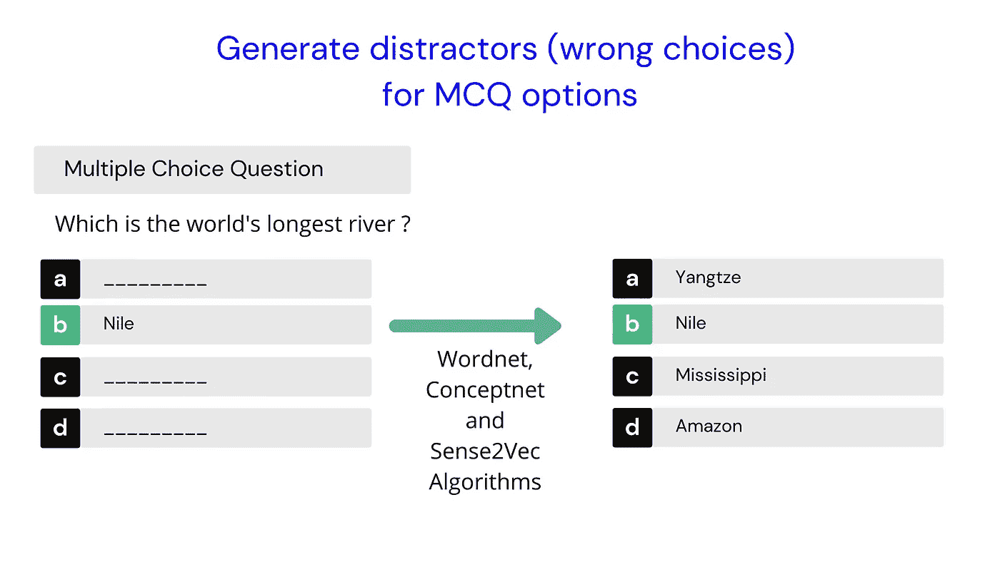
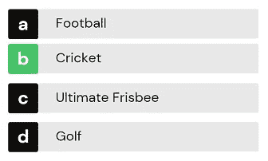
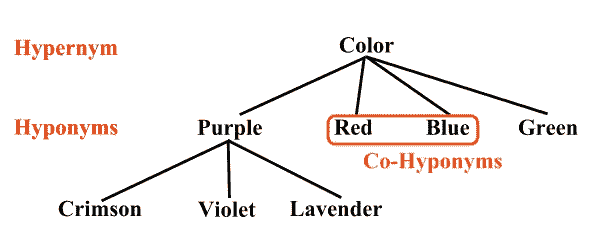
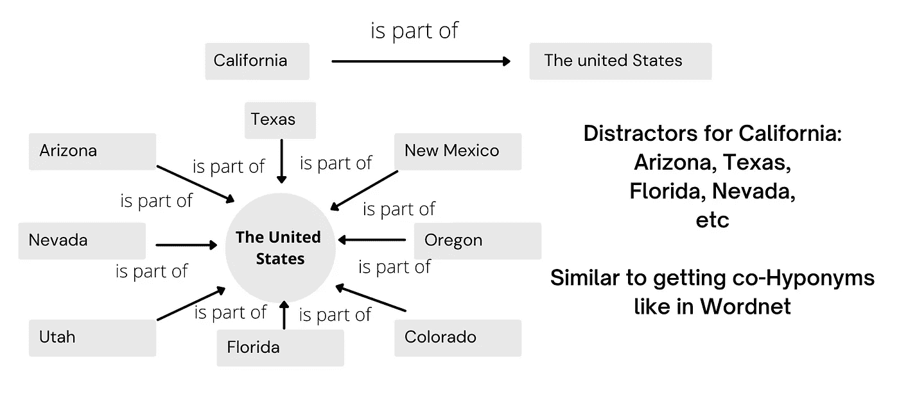
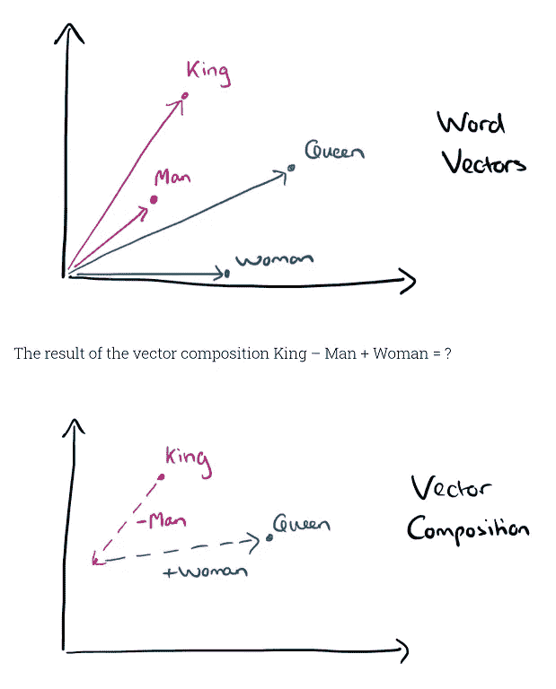

# 使用自然语言处理为 MCQs 生成干扰项(错误选择)的 3 种方法

> 原文：<https://towardsdatascience.com/3-ways-to-generate-distractors-wrong-choices-for-mcqs-using-natural-language-processing-d52477a56812?source=collection_archive---------23----------------------->

## 使用 Wordnet、Conceptnet 和 Sense2vec 算法生成干扰项



作者图片

# 什么是干扰物？

干扰物是选择题中的**错误答案**。

例如，如果一个给定的选择题有游戏**板球**作为正确答案，那么我们需要产生错误的选择(干扰物)，如**足球、高尔夫、极限飞盘**等。



作者图片

# 这方面的实际用例是什么？

选择题是最受欢迎的**评估**题，无论是为了学校考试还是研究生竞争考试。

对于问题作者/老师来说，为给定的问题想出有效的干扰物是一个非常耗时的过程。鉴于 Covid 导致教师/评估创建者的工作量增加，如果我们能够创建一个**自动化**系统来创建这些**干扰物**，将会非常有帮助。

在本文中，我们将看到如何使用自然语言处理技术来解决这个实际问题。

特别是，我们将看到如何使用 3 种不同的算法来产生干扰物-

1.  [WordNet](https://wordnet.princeton.edu/)
2.  [概念网](https://conceptnet.io/)
3.  [Sense2Vec](https://github.com/explosion/sense2vec)

# 设计干扰物时要记住的几点

干扰物不应该太相似或太不同。干扰物在内容上应该是同质的 T21。例:粉色、蓝色、手表、绿色表明手表可能就是答案。
干扰物应该是**互斥**。所以不应该包含同义词。

让我们开始吧。

# 1.Wordnet

*   WordNet 是一个大型的英语词汇数据库。
*   类似于同义词词典，但能捕捉单词之间更广泛的关系。
*   WordNet 也是免费的，可以公开下载。
*   WordNet 标注单词之间的语义关系。同义词——汽车和汽车
*   WordNet 也捕捉一个单词的不同意思。鼠标可以指动物或电脑鼠标。

## 使用 Wordnet 生成干扰项

如果我们有一句话**“蝙蝠飞入丛林，落在一棵树上”**和一个关键词**“蝙蝠”**，我们就自动知道，这里我们说的是有翅膀的哺乳动物蝙蝠，而不是板球拍或棒球棒。

虽然我们人类很擅长，但算法不太擅长区分这两者。这叫做**词义消歧** (WSD)。

在 Wordnet **中，“蝙蝠”**可能有几个**义项**(义项)一个表示板球拍，一个表示会飞的哺乳动物，等等。使用 NLP 的词义消歧本身是一个独立的主题，因此对于本教程，我们假设确切的**“sense”**是由用户手动识别的，或者是自动选择的顶级词义。

假设我们得到一个像" **Red** 这样的单词，并确定它的**义项**，然后我们使用 Wordnet 找到它的上位词。一个**上位词**是一个给定单词的更高层次的类别。在我们的例子中，**颜色**是**红色**的上位词。

然后我们去寻找所有属于颜色组的**颜色**的下位词(子类),可能是紫色、蓝色、绿色等。因此，我们可以使用紫色、蓝色、绿色作为给定 MCQ 的干扰物(错误答案选项)，该的正确答案是**红色**。紫色、蓝色、绿色也被称为红色的**同形异义词**。

所以使用 Wordnet，提取一个给定单词的**同音异义词**就能得到这个单词的**干扰词**。所以在下图中，红色的干扰物是蓝色、绿色和紫色。



来源:[https://en.wikipedia.org/wiki/Hyponymy_and_hypernymy](https://en.wikipedia.org/wiki/Hyponymy_and_hypernymy)

## Wordnet 代码

让我们从安装 NLTK 开始

```
!pip install nltk==3.5.0
```

导入 wordnet

```
import nltk
nltk.download('wordnet')
from nltk.corpus import wordnet as wn
```

获取单词“ **lion”的所有干扰项。**这里我们提取单词 **Lion** 的第一个**义项**，并提取单词 Lion 的同音异义词作为干扰词。

```
# Distractors from Wordnet
def **get_distractors_wordnet**(syn,word):
    distractors=[]
    word= word.lower()
    orig_word = word
    if len(word.split())>0:
        word = word.replace(" ","_")
    hypernym = syn.hypernyms()
    if len(hypernym) == 0: 
        return distractors
    for item in hypernym[0].hyponyms():
        name = item.lemmas()[0].name()
        #print ("name ",name, " word",orig_word)
        if name == orig_word:
            continue
        name = name.replace("_"," ")
        name = " ".join(w.capitalize() for w in name.split())
        if name is not None and name not in distractors:
            distractors.append(name)
    return distractorsoriginal_word = **"lion"**
synset_to_use = wn.synsets(original_word,'n')[0]
distractors_calculated = get_distractors_wordnet(synset_to_use,original_word)
```

上面的输出:

```
**original word:**  Lion 
**Distractors:** ['Cheetah', 'Jaguar', 'Leopard', 'Liger', 'Saber-toothed Tiger', 'Snow Leopard', 'Tiger', 'Tiglon']
```

同样，对于单词 **cricket** ，它有**两个意思**(一个代表昆虫，一个代表游戏)，我们根据使用哪一个意思得到不同的干扰物。

```
#  An example of a word with two different senses
original_word = **"cricket"**syns = wn.synsets(original_word,'n')for syn in syns:
  print (syn, ": ",syn.definition(),"\n" )synset_to_use = **wn.synsets(original_word,'n')[0]**
distractors_calculated = get_distractors_wordnet(synset_to_use,original_word)print ("\noriginal word: ",original_word.capitalize())
print (distractors_calculated)original_word = "cricket"
synset_to_use = **wn.synsets(original_word,'n')[1]**
distractors_calculated = get_distractors_wordnet(synset_to_use,original_word)print ("\noriginal word: ",original_word.capitalize())
print (distractors_calculated)
```

输出:

```
**Synset('cricket.n.01')** :  leaping insect; male makes chirping noises by rubbing the forewings together**Synset('cricket.n.02')** :  a game played with a ball and bat by two teams of 11 players; teams take turns trying to score runs**original word:**  Cricket
**distractors:** ['Grasshopper']**original word:**  Cricket
**distractors:** ['Ball Game', 'Field Hockey', 'Football', 'Hurling', 'Lacrosse', 'Polo', 'Pushball', 'Ultimate Frisbee']
```

# 2.概念网

*   [Conceptnet](https://conceptnet.io/) 是一个免费的多语言知识图谱。
*   它包括来自众包资源和专家创造的资源的知识。
*   与 WordNet 类似，Conceptnet 标记了单词之间的语义关系。它们比 Wordnet 更详细。是，是，的一部分，制成的，类似的，用于等词之间的关系被捕捉到了。

## 使用概念网生成干扰项

Conceptnet 适用于为位置、项目等具有 **"Partof"** 关系的事物生成干扰项。例如，像**【加州】**这样的州可能是**美国的一部分。**一个**“厨房”**可以是一个**房子**等的一部分。

Conceptnet 并没有像我们在上面讨论蝙蝠的例子时那样，对不同的词义进行区分。因此，当我们用一个给定的词进行查询时，我们需要继续使用 Conceptnet 给我们的任何意义。

让我们看看如何在我们的用例中使用 Conceptnet。我们不需要安装任何东西，因为我们可以直接使用 Conceptnet API。请注意，有一个每小时的 API 率限制，所以要小心。

给定一个像 **"California"** 这样的单词，我们用它查询 Conceptnet，并检索所有与它有" **Partof** "关系的单词。在我们的例子中，“加利福尼亚”是“美国”的一部分。

现在我们去**【美国】**看看它还和什么东西有**【部分】**关系。那将是其他州，如“得克萨斯”、“亚利桑那”、“西雅图”等。

类似于 Wordnet，我们使用查询词“California”的“partof”关系提取**同音异义词**，并获取干扰词“Texas”、“Arizona”等。



作者图片

## 概念网代码

## 输出:

```
**Original word:**  California**Distractors:**  ['Texas', 'Arizona', 'New Mexico', 'Nevada', 'Kansas', 'New England', 'Florida', 'Montana', 'Twin', 'Alabama', 'Yosemite', 'Connecticut', 'Mid-Atlantic states']
```

# 3.Sense2vec

与 Wordnet 和 Conceptnet 不同的是， [Sense2vec](https://github.com/explosion/sense2vec) 中单词之间的关系**不是人工策划的**，而是从文本语料库中自动生成的**。**

**一个**神经网络**算法用数百万个句子来训练，以在给定其他单词的情况下预测一个焦点单词，或者在给定一个焦点单词的情况下预测周围的单词。通过这样做，我们为每个单词生成一个固定大小的向量或数组表示。我们称这些为**单词向量。****

**有趣的事实是，这些向量捕捉不同种类的单词之间的关联。例如，现实世界中相似种类的单词在向量空间中落在更靠近的**处。****

**此外，不同单词之间的**关系**被保留。如果我们取国王这个词的向量，减去男人的向量，加上女人的向量，就得到王后的向量。**“国王之于男人，女王之于女人”的现实世界关系**得以保留。**

> ****国王——男人+女人=王后****

****

**来源:[https://blog . acolyer . org/2016/04/21/the-amazing-power-of-word-vectors/](https://blog.acolyer.org/2016/04/21/the-amazing-power-of-word-vectors/)**

**[Sense2vec](https://spacy.io/universe/project/sense2vec) 在 Reddit 评论上接受训练。名词短语和命名实体在训练期间被标注，因此像**“自然语言处理”**这样的**多词**短语也有一个条目，这与仅用**单个**词训练的一些词向量算法相反。**

**我们将使用 2015 年训练的 Reddit 向量，而不是 2019 年，因为在我的实验中结果略好。**

## **Sense2vec 的代码**

**从 pip 安装 sense2vec**

```
!pip install sense2vec==1.0.2
```

**下载并解压缩 Sense2vec 矢量**

**从磁盘上解压缩的文件夹中加载 sense2vec 矢量**

```
# load sense2vec vectors
from sense2vec import Sense2Vec
s2v = Sense2Vec().from_disk('s2v_old')
```

**获取给定单词的干扰项。**例如:自然语言处理****

**输出:**

```
**Distractors for  Natural Language processing  :** 
['Machine Learning', 'Computer Vision', 'Deep Learning', 'Data Analysis', 'Neural Nets', 'Relational Databases', 'Algorithms', 'Neural Networks', 'Data Processing', 'Image Recognition', 'Nlp', 'Big Data', 'Data Science', 'Big Data Analysis', 'Information Retrieval', 'Speech Recognition', 'Programming Languages']
```

# **使用自然语言处理的问题生成——教程**

**我推出了一个非常有趣的 Udemy 课程，名为“使用 NLP 生成问题”,扩展了这篇博文中讨论的一些技术。如果你想看一看，这里是[链接](https://www.udemy.com/course/question-generation-using-natural-language-processing/?referralCode=C8EA86A28F5398CBF763)。**

# **结论**

**希望你喜欢我们如何使用 NLP 解决 MCQs 中产生干扰物(错误选择)的现实问题。**

**祝 NLP 探索愉快，如果你喜欢它的内容，请随时在 Twitter 上找到我。**

**如果你想学习使用变形金刚的现代自然语言处理，看看我的课程[使用自然语言处理生成问题](https://www.udemy.com/course/question-generation-using-natural-language-processing/?referralCode=C8EA86A28F5398CBF763)**