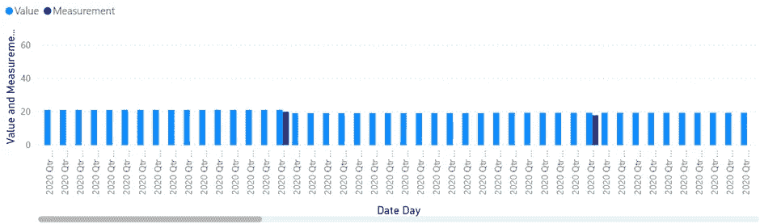
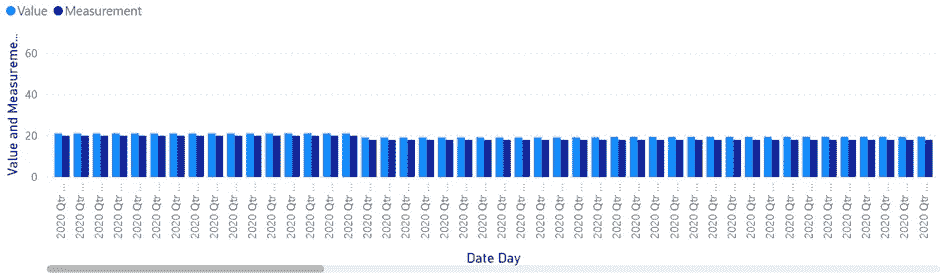
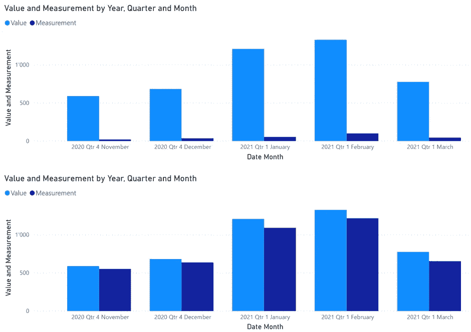
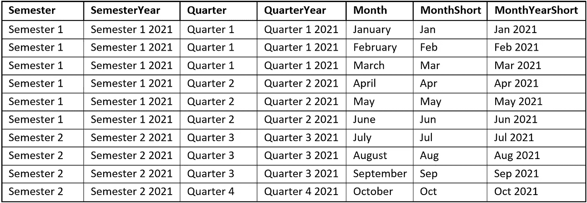
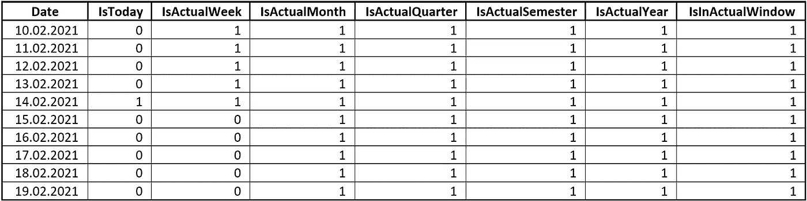
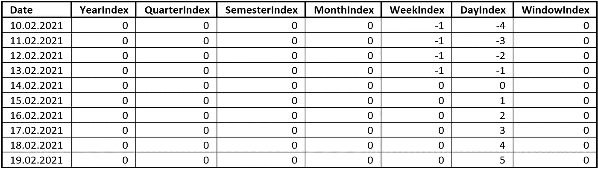

# 使用扩展的日期表格改进报告的 3 种方法

> 原文：<https://towardsdatascience.com/3-ways-to-improve-your-reporting-with-an-expanded-date-table-2d983d76cced?source=collection_archive---------44----------------------->

在大多数情况下，日期是最重要的报告维度。大多数情况下，您希望看到一个数字随时间的发展，例如，年、月和日的销售额。

*可以在数据中使用日期字段来创建报告。但是这种方法有一些缺点。*

*让我们来看看这个主题，以及如何使用扩展的日期表来提高您的报告能力。*


照片由 [Waldemar Brandt](https://unsplash.com/@waldemarbrandt67w?utm_source=medium&utm_medium=referral) 在 [Unsplash](https://unsplash.com?utm_source=medium&utm_medium=referral) 上拍摄

> 为什么我们首先需要一个日期表

如果您熟悉报告和日期(或时间)表的使用，可以跳过这一部分。

需要日期表有四个主要原因:

1.  您可以为数据和报告定义时间跨度。
    你需要知道，大多数报告工具都需要一个日期表，从 1 月 1 日开始，到 12 月 31 日结束。
2.  您将能够创建年、半年、季度、月、日或周的导航层次:
    有些报告工具支持自动日期层次的创建，但有些不支持。当你没有这个能力的时候，你需要一个专用的日期表。
3.  您可以在您的日期表中添加自定义列，因为您需要
    阅读下面关于此主题的更多信息。
4.  为了能够比较具有不同规律性的数据:
    这种情况需要一些更深入的解释。

假设你有有测量的数据，不是每天都测量的；对于这个例子，让我们用每天的能量消耗。

然后，你就有了关于每日发电量的数据，例如，来自太阳能电池板的数据。这个数据是每天测量的。

并列显示两种数据的图表如下所示:



图表来自作者

你可以看到测量中有间隙。

通过一个小技巧和使用日期表，我可以填补这些空白:



图表来自作者

我复制了从测量日期到下一次测量前一天的值。

在月视图中，这将类似于下图:



作者提供的并排图表

顶部的图表显示了有差距的数据。底部的图表显示了填补空白的数据。

在这种情况下，底部的图表是正确的，因为它总结了每天的能源消耗，而不是只总结了测量的消耗。

在日期表的帮助下，这个操作相对容易。
在我的例子中，我将数据存储在数据库中，并用 SQL 查询准备数据。

现在我们知道了为什么我们需要一个日期表的四个原因。但是有更多的理由需要一个日期表，我不能在这里解释。解释所有的原因会花费太多的时间。

现在让我们看看如何用更多的信息来扩展日期表。

> 1.添加自定义列

您应该向日期表中添加额外的列，以确保可以按照您需要的方式对数据进行切片。

例如:

*   短月份名称:一月、二月、三月等。
*   带有年份的短月份名称:2021 年 1 月、2021 年 2 月、2021 年 3 月等。
*   其他带年份的期间，例如，带年份的季度或学期。
*   工作日(长或短):星期一/月、星期二/月等。
    当然，只有当您需要在工作日创建报告时。
*   如果您需要按周报告，则需要计算周数。
    注意有两种不同的方法来计算周数(例如 ISO 8601 方法)
*   任何所需语言的多语言专栏

以下是一些例子:



作者自定义日期栏

> 2.添加标志列

有时您想只查看实际期间的数据。期间可以是:

*   实际的一周
*   实际月份
*   实际的季度或学期
*   实际年份
*   基于实际日期
    的任何特定时期，例如，过去六个月、实际月份和未来五个月，等于 12 个月。

这种标志列仅包含 1 或 0；一个用于实际期间的行，零个用于日期表中的所有其他行。

以下是一些例子:



按作者标记列

另一个标志栏是“工作日”。您可以使用 flag-column 标记所有工作日，排除周末。

您可以使用这样的标志列简化数据的过滤。

考虑一下这种情况:
您有项目信息，其中包含过去的数据和未来的规划数据。
现在您需要查看实际数据和实际月份的计划数据，包括过去和未来的几个月。

您可以使用复杂的日期计算来获得这一范围的数据。或者，您可以将该时间窗口配置到日期表的标志列中。然后，您只需要根据这个标志列过滤您的数据。

使用适当的标志列，这种方法更容易实现。此外，性能要高得多，因为不需要在报告中执行复杂的日期计算。

> 3.添加索引列

索引列是数字列，从今天开始计算周期。

像标志列一样，在日期表中可以有多个索引列:

*   DayIndex —从今天开始的天数
*   WeekIndex —实际周的周数
*   MonthIndex —实际月份的月数
*   YearIndex —距离实际年份的年数
*   WindowIndex —这是基于“IsInActualWindow”标志列，并显示实际的日期窗口位置。



按作者索引列

必须清楚地定义这些索引列的准备。

考虑 WeekIndex 列:

*   实际日期是 2 月 14 日。2021
*   今天是星期天。
*   根据地区的不同，星期日是一周的最后一天或第一天。
*   您需要了解您的受众，以确定需要应用哪个案例。

另一个例子:

*   实际日期是 2 月 10 日。2021
*   今天是星期三。
*   根据您的需要，您需要根据实际日期+/- 7 天或实际日历周来计算指数。

基于日历周，您可以使用如下公式(基于星期一作为一周的第一天和 ISO 8601 方法):

```
DATEDIFF(Now() — WEEKDAY ( Now(), 2 ) + 1, [Date] — WEEKDAY ( [Date], 2 ) + 1, WEEK)
```

我用了达克斯语这个公式。Microsoft Power BI 使用 DAX 来实现计算列。

您还需要考虑 MonthIndex 列的计算。您需要定义是基于日历月计算指数，例如，基于该月的最后一天或第一天，还是基于另一个基数。

在 DAX 中，我对 MonthIndex 列使用了这个公式:

```
DATEDIFF(EOMONTH(Now(), 0), EOMONTH([Date], 0), MONTH)
```

EOMONTH()函数返回实际月份的最后一天。这样，我总是用日历月来写这个专栏。

现在，您可以使用这些索引列来进一步简化您的报告，而不是依赖于基于日期的计算，这需要多次实现。

> 结论

当你开始构建一个数据表时，你需要意识到你的报告需求。

您可以开始向日期表添加额外的列，以提高报表的功能并简化时间计算的逻辑。

但是，在实现标志列和索引列时，需要注意使用正确的逻辑。

在你完成你的逻辑之后，你需要确保每天更新你的日期表。标志列和索引列只有在每天更新时才是正确的。

在日期表中使用附加列的最后一个好处是逻辑是集中的。

逻辑的集中化可能是一个优点，也可能是一个缺点。当逻辑正确的时候，就可以依靠，大家都开心。如果它是错的，那么它对所有人都是错的。

> 密码

因为我使用的是微软的产品，比如 SQL Server 和 Power BI，所以我只能为这两个产品提供代码。

你可以给我发信息，如果你想得到代码来准备这样的日期表。

给我发一封电子邮件，地址是[salvatorecagliari@gmail.com](mailto:salvatorecagliari@gmail.com)，要求提供密码。