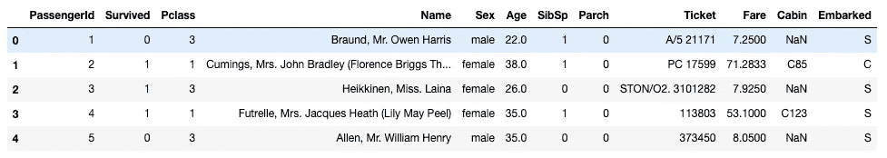
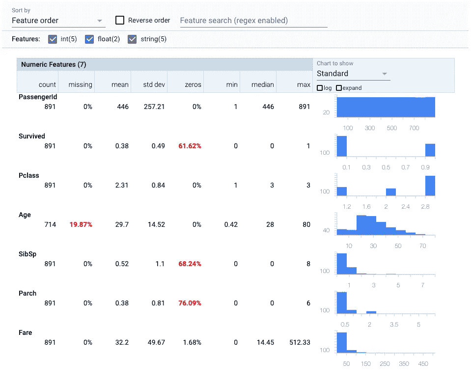
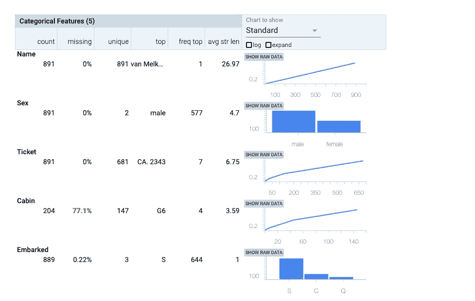
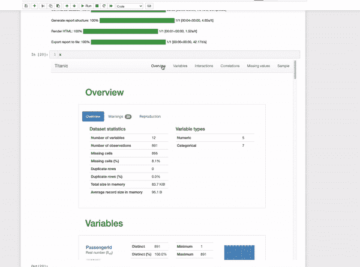
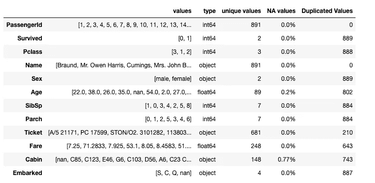

# 在 Python 中执行快速探索性数据分析的 3 种方法

> 原文：<https://towardsdatascience.com/3-ways-to-perform-quick-exploratory-data-analysis-in-python-fbdcba4c4996?source=collection_archive---------34----------------------->

## 更好地理解您的数据


[rishi](https://unsplash.com/@beingabstrac?utm_source=unsplash&utm_medium=referral&utm_content=creditCopyText) 在 [Unsplash](https://unsplash.com/?utm_source=unsplash&utm_medium=referral&utm_content=creditCopyText) 拍摄的照片

探索性数据分析是数据科学中一个非常重要的过程。无论我们想对数据做什么，我们都必须总结它们的主要特征，这样我们才能更好地理解它们。有时这可能很难做到，我们经常会以大而复杂的输出而告终。在这篇文章中，我们将向你展示 3 种以一种易读的格式进行快速探索性数据分析的方法。

我们将使用[泰坦尼克号数据集](https://www.kaggle.com/rashigoel/titanic-machine-learning-from-disaster?select=train.csv)。

```
import pandas as pd
import numpy as np

df=pd.read_csv(‘train.csv’)
df.head()
```



# 1.Tensorflow 数据验证

[TensorFlow 数据验证(TFDV)](https://www.tensorflow.org/tfx/data_validation/get_started) 是一个探索和验证机器学习数据的库。它包含一个非常有用的函数，只需一行代码就可以从数据框中生成统计数据。

```
import tensorflow_data_validation as tfdv

stats = tfdv.generate_statistics_from_dataframe(df)

tfdv.visualize_statistics(stats)
```



正如你所看到的，我们得到了一个很好的格式，一个很好的数字和分类特征的总结。

# 2.Quickda

Quickda 是一个惊人的库，能够产生专业的 HTML 交互输出。

```
import pandas as pd
from quickda.explore_data import *
from quickda.clean_data import *
from quickda.explore_numeric import *
from quickda.explore_categoric import *
from quickda.explore_numeric_categoric import *
from quickda.explore_time_series import *

explore(df, method='profile', report_name='Titanic')
```

[你可以在这里下载输出](https://predictivehacks.com/wp-content/uploads/2021/09/quickda_output.html)



输出是一个交互式报告，其中包含许多数据统计，如完整的变量分析以及它们之间的相关性。当我们想与他人分享分析时，Quickda 是一个很好的选择，因为我们可以将它保存为 HTML 文件。

# 3.熊猫

熊猫图书馆可能并不花哨，但却是数据科学中最强大和最有用的图书馆之一。我们将向您展示如何获得基本探索性数据分析所需的所有信息。pandas 的主要优势是可以处理其他图书馆无法处理的大数据。

```
pd.DataFrame({"values":{col:df[col].unique() for col in df},
              'type':{col:df[col].dtype for col in df},
              'unique values':{col:len(df[col].unique()) for col in df},
              'NA values':{col:str(round(sum(df[col].isna())/len(df),2))+'%' for col in df},
              'Duplicated Values':{col:sum(df[col].duplicated()) for col in df}
             })
```



这只是熊猫力量的一个例子。当然，你可以做很多事情，比如计算数值，绘制直方图等等。但有时像上面这样的数据帧是我们需要的唯一信息。

# 总结一下

Tensorflow 数据验证和 Quickda 可以自动为我们提供数据特征的出色展示。我们鼓励您仔细看看它们，因为它们都是具有许多功能的强大库。然而，它们无法处理大数据，当您只想对数据有一个基本的了解时，使用它们将是大材小用。另一方面，熊猫又轻又快，可以轻松处理大数据。如果你正确地使用它，你可以得到很好的结果。

*最初发表于 https://predictivehacks.com*[*。*](https://predictivehacks.com/3-ways-to-perform-quick-exploratory-data-analysis-in-python/)