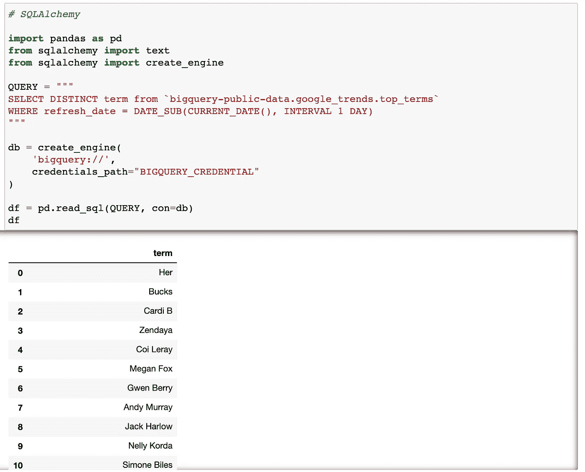
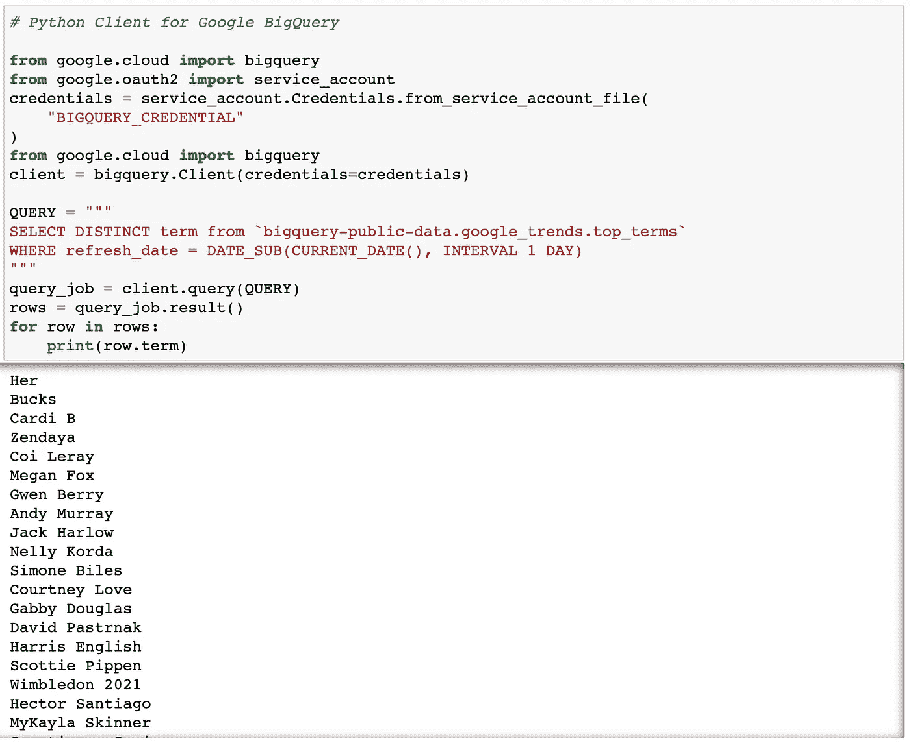
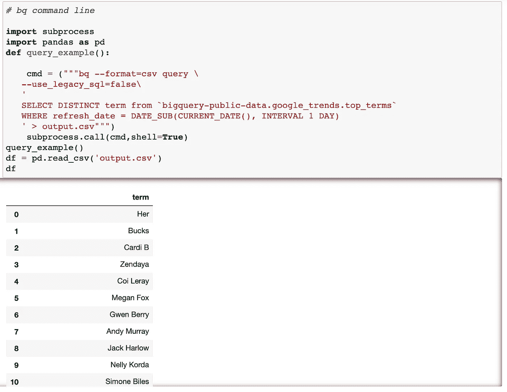
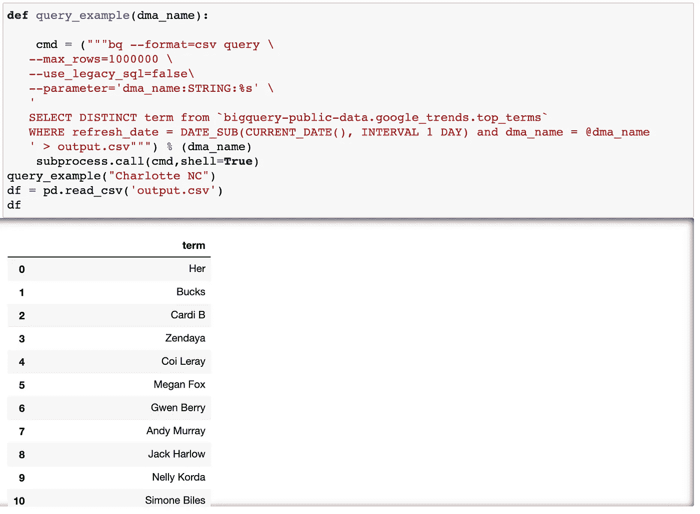

# 用 Python 查询 BigQuery 的 3 种方法

> 原文：<https://towardsdatascience.com/3-ways-to-query-bigquery-in-python-66838f45cb43?source=collection_archive---------5----------------------->

## *SQLAlchemy，用于 Google BigQuery 的 Python 客户端，以及 bq 命令行工具*


照片由[雷蒙·克拉文斯](https://unsplash.com/@raimondklavins?utm_source=unsplash&utm_medium=referral&utm_content=creditCopyText)在 [Unsplash](https://unsplash.com/?utm_source=unsplash&utm_medium=referral&utm_content=creditCopyText) 上拍摄

如何查询 BigQuery 数据？本文讨论了在 Python 中查询 BigQuery 数据的 3 种方法。希望你觉得有用。

# 环境

```
conda install notebook google-cloud-bigquery sqlalchemy pybigquery
```

# 资格证书

要在本地认证 Google Cloud，您需要安装 [Google Cloud SDK](https://cloud.google.com/sdk/docs/install) 并通过以下命令行登录/认证。更多信息可在[官方文档](https://googleapis.dev/python/google-api-core/latest/auth.html)中找到。

```
gcloud auth login
```

要通过凭证文件进行认证，您可以创建一个服务帐户，并从服务帐户获取凭证:进入 google cloud [服务帐户页面](https://console.cloud.google.com/iam-admin/serviceaccounts)，点击一个项目，点击“+创建服务帐户”，然后它将生成一个凭证 JSON 文件。在下面的例子中，我将这个凭证文件重命名为“BIGQUERY_CREDENTIAL”。

# BigQuery 的 SQLAlchemy

项目为 bigquery 实现了一个 SQLAlchemy 工具。SQLAlchemy 是用 Python 读取 SQL 数据的强大工具。以下是来自[文档](https://www.sqlalchemy.org/)的 SQLAlchemy 的描述:

*SQLAlchemy 是 Python SQL 工具包和对象关系映射器，为应用程序开发人员提供了 SQL 的全部功能和灵活性*。

要使用 SQLAlchemy，第一步是使用`create_engine()`建立连接。在这个函数的参数中，我们定义了我们试图连接到的数据库`"bigquery://"`和凭证文件的路径。如果您在本地运行它并在本地进行身份验证，那么您可以在没有凭据信息的情况下运行以下内容。如果输出数据很大，我们可以增加`arraysize`，默认为 5000。

在我们建立到 BigQuery 的连接之后，有多种方法可以查询数据。我的方法是使用 Pandas 的`pd.read_sql`,这样我可以直接得到 Pandas 的数据帧。在`pd.read_sql`函数中，我们需要的只是指定的查询和连接。



参数化我们的查询通常是有用的。SQLAlchemy 提供了一个内置函数`text()`，它接受查询作为输入，并支持[参数化](https://docs.sqlalchemy.org/en/14/core/tutorial.html#specifying-bound-parameter-behaviors)。或者，您可以在查询中将参数写成 f 字符串。

# Google BigQuery 的 Python 客户端

第二种方法是为 BigQuery 使用官方的 [Python 客户端。如果您在本地运行它并通过认证，那么您不需要定义凭证，并且`client=bigquery.Client()`将会正常工作。](https://googleapis.dev/python/bigquery/latest/index.html)



# bq 命令行工具

第三种方法是使用 subprocess 运行 bq 命令行工具。查询命令是`bq query`。我们可以向查询传递标志，将输出格式定义为 csv，并指定我们想要运行的查询。然后我们可以使用 subprocess 来运行 Python 中的命令行代码。



bq 命令行工具支持查询参数。在下面的例子中，我们传入`--parameter`标志来定义参数的名称、类型和值信息。在查询本身中，我们使用`@parameter_name`来指定一个参数。另一件需要注意的事情是，如果输出的行数太多，我们可以将`--max_rows`标志增加到一个较大的数字。



# 摘要

总之，我快速地通过三种方式在 Python 中查询 BigQuery。

第一种方法，SQLAlchemy 有许多很好的内置功能，并支持许多不同类型的数据库。对于在其他数据库上使用过 SQLAlchemy 并喜欢其特性的用户，您可能会喜欢使用 SQLAlchemy 方法来查询 BigQuery。

第二种方法是 Google BigQuery 的官方 Python 客户端，我个人认为它不太容易使用，文档可能会更好。我没怎么用过，所以我的印象可能是错误的。

最后，bq 命令行工具非常强大。它提供了广泛的功能，而不仅仅是查询数据。我知道很多人有顾虑，不喜欢使用子流程。所以用哪一个真的取决于你的喜好。

快乐大查询！

# 参考

[https://Google APIs . dev/python/Google API-core/latest/auth . html](https://googleapis.dev/python/google-api-core/latest/auth.html)[【https://github . com/Google APIs/python-bigquery-sqllcemy](https://github.com/googleapis/python-bigquery-sqlalchemy)[【https://www . sqllcemy . org/](https://www.sqlalchemy.org/)[【https://github . com/Google APIs/python-bigquery】](https://github.com/googleapis/python-bigquery)

由 Sophia Yang 于 2021 年 6 月 28 日