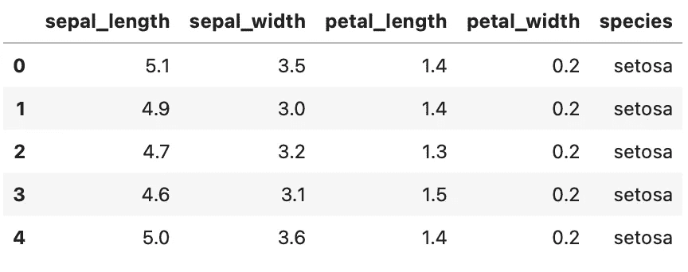
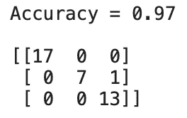
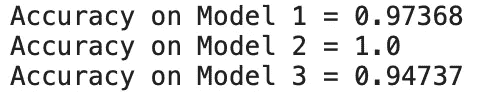
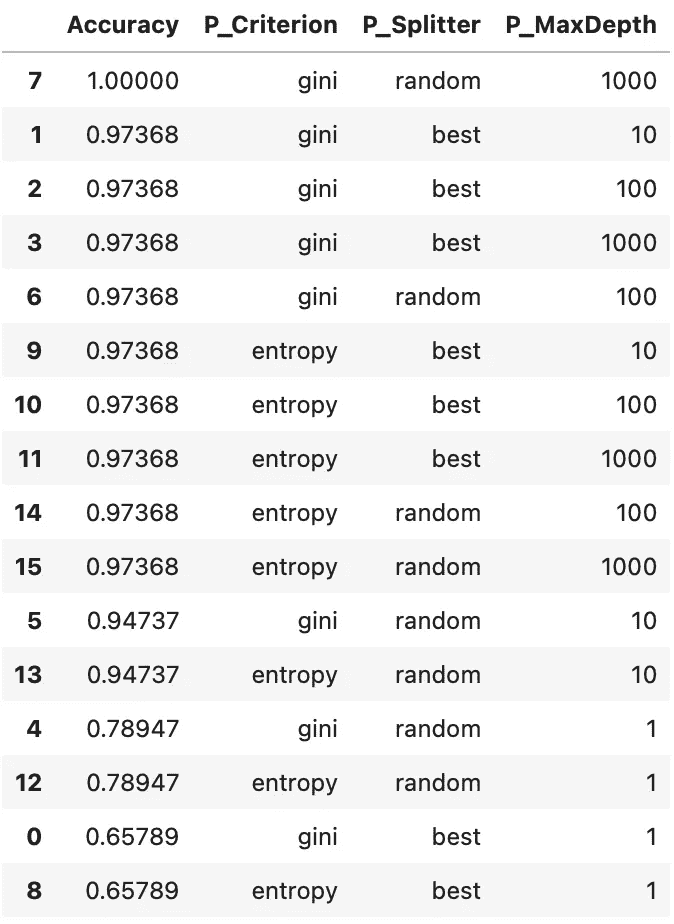
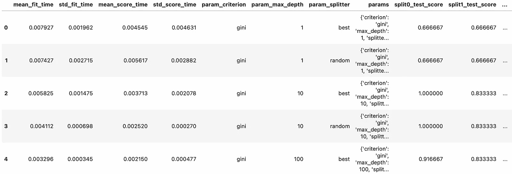
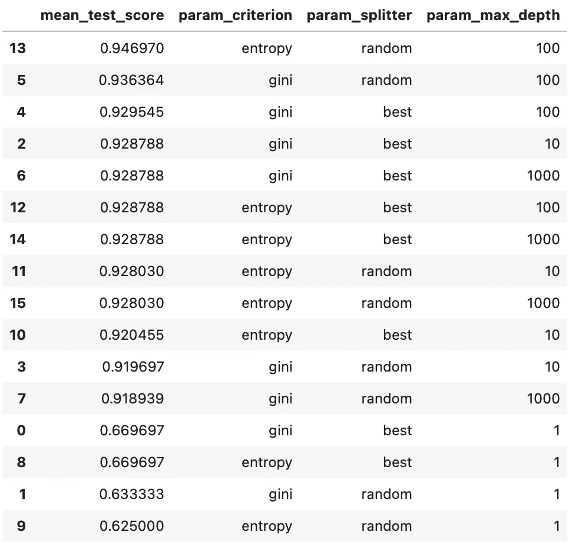
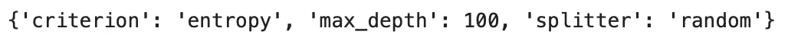

# 用 Python 调优机器学习模型超参数的 3 种方法

> 原文：<https://towardsdatascience.com/3-ways-to-tune-hyperparameters-of-machine-learning-models-with-python-cda64b62e0ac?source=collection_archive---------19----------------------->

## 从零开始到网格搜索—包括动手示例。

[马泰奥·卡塔内塞](https://unsplash.com/@matteocatanese?utm_source=unsplash&utm_medium=referral&utm_content=creditCopyText)在 [Unsplash](https://unsplash.com/s/photos/grid?utm_source=unsplash&utm_medium=referral&utm_content=creditCopyText) 上的照片

机器学习模型开箱即可相当准确。但通常情况下，精度可以通过超参数调整来提高。

超参数调整是一个通过调整超参数来提高模型准确性的漫长过程，这些值无法学习，需要在训练前指定。

今天，您将学习三种超参数调谐方法。您将从最手工的方法转向用 Scikit-Learn 库实现的`GridSearchCV`类。

这篇文章的结构如下:

*   数据集加载和准备
*   手动超参数调谐
*   基于环路的超参数调谐
*   使用 GridSearch 进行超参数调整
*   结论

你可以点击下载这篇文章的笔记本[。](https://github.com/daradecic/BDS-articles/blob/main/005_Hyperparameter_Tuning_GridSearch.ipynb)

# 数据集加载和准备

没必要在这里发疯。简单的数据集就可以了。您将使用直接从 web 加载的 Iris 数据集。

就库而言，您将需要 Pandas 来处理数据，以及 Scikit-Learn 中的几个类/函数。以下是如何加载库和数据集:

调用`head()`函数将显示以下数据帧子集:

图片 1 —虹膜数据集的头部(图片由作者提供)

数据集非常干净，所以不需要额外的准备。接下来，您将把它分成训练和测试子集。方法如下:

最后，让我们建立一个默认模型。它将向您展示使用默认超参数的模型有多精确，并且它将作为调整后的模型应该超越的基线。

下面是如何在训练集上训练决策树模型，获得准确率得分和混淆矩阵:

相应的准确度和混淆矩阵如下所示:

图片 2 —基线模型准确性和混淆矩阵(图片由作者提供)

简而言之——您需要一个在测试集上准确率超过 97%的模型。让我们看看超参数调优是否能做到这一点。

# 手动超参数调谐

您不需要专门的库来进行超参数调优。但这将是一个乏味的过程。

在开始之前，您需要知道可以优化哪些超参数。您可以在库文档中找到完整的列表。这里是决策树的[文档页面。在本文中，您将只针对这三个方面进行优化。这些是:](https://scikit-learn.org/stable/modules/generated/sklearn.tree.DecisionTreeClassifier.html)

*   `criterion`–衡量分割质量的函数，可以是*基尼*(默认)或*熵*
*   `splitter`–在每个节点选择拆分的策略，可以是*最佳*(默认)或*随机*
*   `max_depth`–一棵树的最大深度，一个整数值

您可以将一组超参数值定义为一个字典(键-值对)，然后根据它们构建单独的模型。方法如下:

以下是相应的精度:

图 3-手动调整模型的精确度(图片由作者提供)

总结一下——您已经设法超越了基线模型，但是这种方法是不可扩展的。想象一下，如果您想要测试 1000 种组合，这实际上是一个很小的数字——以这种方式编写代码不是一条路。接下来我们来改进一下。

# 基于环路的超参数调谐

您可以通过在列表中指定可能的超参数值来改进前面的解决方案。超参数有多少，列表就有多少。然后在嵌套循环中对模型进行训练和评估。

下面是一个示例代码片段:

如您所见，测试集上的模型精度和相应的超参数值作为字典存储在一个列表中，该列表后来被转换为数据框。很容易对数据框进行排序，并查看哪个超参数组合做得最好:

图 4 —手动调整模型的分数和超参数的数据框架(图片由作者提供)

总结一下——这种方法非常有效，但是您注定要使用嵌套循环。三个超参数没问题，但是想象一下优化十个。一定有更好的办法。

# 使用 GridSearch 进行超参数调整

Scikit-Learn 附带了`GridSearchCV`类，它让超参数调优变得非常有趣。优化可能需要很长时间(与类无关)，但是您可以不用手动编写东西。

您需要将超参数空间声明为一个字典，其中每个键都是超参数的名称，其值是可能值的列表。然后，您可以通过调用`fit()`函数，使用`GridSearchCV`类来找到一个最优集合。

这种方法还有内置交叉验证的好处，消除了结果中的“机会”。

以下是完整的代码片段:

然后，您可以将结果存储在 Pandas 数据框中(以便于检查)，方法如下:

这是数据框的一部分:

图 5 —网格搜索参数数据框(图片由作者提供)

让我们过滤此数据框，仅保留感兴趣的列—平均测试分数和已用超参数值，并按平均测试分数排序:

结果如下:

图 6 —使用 GridSearch 调整的模型的分数和超参数的数据框架(图片由作者提供)

如果您对检查多种组合感兴趣，这是一个很好的方法。如果您只想获得最佳价值，有一种更简单的方法:

该属性返回一个字典:

图片 7-最佳超参数(图片由作者提供)

可以直接把字典传给机器学习模型(使用拆包— `**dict_name`)。

这就是为机器学习算法找到最佳超参数有多容易。接下来让我们总结一下。

# 结论

最后一种方法将在大多数情况下完成工作。你可以手动进行优化，但这有什么意义呢？

网格搜索可能需要很长时间才能完成。假设你有 5 个参数，有 5 个可能的值。这是 55 种可能的组合(3125)。将交叉验证添加到图片中(假设 10 倍)，这就是你需要训练和评估的 31250 个模型。

对于这些情况，随机网格搜索可能是一个更好的选择。从代码角度来说，它与非随机化方法的工作原理相同，所以这就是今天没有讨论它的原因。

感谢阅读。

*喜欢这篇文章吗？成为* [*中等会员*](https://medium.com/@radecicdario/membership) *继续无限制学习。如果你使用下面的链接，我会收到你的一部分会员费，不需要你额外付费。*

<https://medium.com/@radecicdario/membership>  

## [加入我的私人邮件列表，获取更多有用的见解。](https://mailchi.mp/46a3d2989d9b/bdssubscribe)

# 了解更多信息

*   [2021 年学习数据科学的前 5 本书](/top-5-books-to-learn-data-science-in-2020-f43153851f14)
*   [SHAP:如何用 Python 解读机器学习模型](/shap-how-to-interpret-machine-learning-models-with-python-2323f5af4be9)
*   [三大分类机器学习指标—一劳永逸地消除准确性](/top-3-classification-machine-learning-metrics-ditch-accuracy-once-and-for-all-923beab025a4)
*   [ROC 和 AUC——如何评估机器学习模型](/roc-and-auc-how-to-evaluate-machine-learning-models-in-no-time-fb2304c83a7f)
*   [精确召回曲线:如何轻松评估机器学习模型](/precision-recall-curves-how-to-easily-evaluate-machine-learning-models-in-no-time-435b3dd8939b)

*原载于 2021 年 1 月 21 日 https://betterdatascience.com*<https://betterdatascience.com/3-ways-to-tune-hyperparameters/>**。**