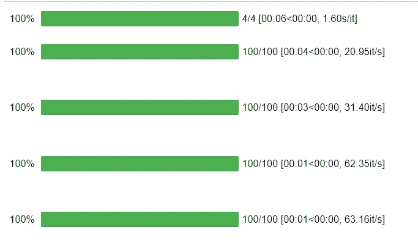
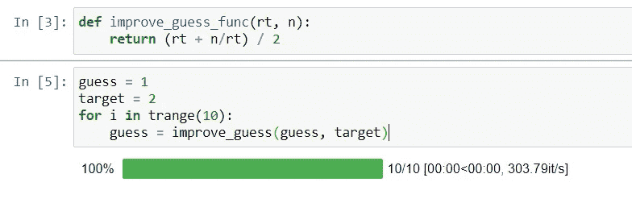

# 在 Python 中可视化循环进度的 3 种方法

> 原文：<https://towardsdatascience.com/3-ways-to-visualize-loop-progress-in-python-7eea7dfa512a?source=collection_archive---------13----------------------->

## 不要等待意想不到的结局


[沃洛德梅尔·赫里先科](https://unsplash.com/@lunarts?utm_source=medium&utm_medium=referral)在 [Unsplash](https://unsplash.com?utm_source=medium&utm_medium=referral) 拍摄的照片

在编程语言中，循环用于迭代一组对象。在迭代时，我们可以根据各种条件对每个对象采取不同的操作来完成任务。

有时，当列表非常大，或者列表中的对象维数很高时，处理列表需要很长时间。在这种情况下，就像打勾一样，我们通常会尝试打印索引号来检查列表的进度。

我们无法记住每次运行代码时循环的大小。为了解决这个问题，我们可以利用 python 库显示进度条来直观地检查进度，而不是打印列表索引来检查进度。

本文将介绍我们如何利用 python 库来制作进度条，并介绍我们可以使用该库的各种地方。

# tqdm——一个 Python 库

[tqdm](https://pypi.org/project/tqdm/) 源自阿拉伯语单词 *taqaddum* ，意为“进步”，是西班牙语中“我如此爱你”的缩写( *te quiero demasiado* )。

这个库帮助我们显示任何循环的进度条。它还支持嵌套循环功能，也可以用于[熊猫](https://pandas.pydata.org/)、[Keras](https://keras.io/)&[Jupyter 笔记本](https://jupyter.org/)以及许多[其他地方](https://pypi.org/project/tqdm/)。

让我们探索一些最佳实践，在这些实践中，我们通常使用这种方法来使我们的任务更易管理和更智能。

# 装置

在开始库使用部分之前，让我们首先使用 python 中的 pip 命令安装它。

```
pip install tqdm
```

就是这样。让我们探索一下可以利用`tqdm` 模块的一些领域。

# 使用第 1 部分— IPython/Jupyter 集成

我们可以利用 Jupyter 笔记本的`tqdm`模块来跟踪进度。在机器学习领域，当我们使用一组时期训练我们的模型时，为了可视化每个时期的完成进度，我们可以使用`tqdm`。

使用`tqdm.notebook`子模块支持 IPython/Jupyter。

```
from tqdm.notebook import trange, tqdm
from time import sleepfor i in trange(4): #first loop
    for j in tqdm(range(100)): #Nested loop
        sleep(0.01)
```



作者 Jupyter 笔记本截图

# 使用第 2 部分— Keras 集成

一个`keras callback`也可与`tqdm`一起使用，以可视化模型拟合的进度。我们可以如下使用它:

```
from tqdm.keras import TqdmCallback

...

model.fit(..., verbose=0, callbacks=[TqdmCallback()])
```

`keras callback`也有一个 display()方法，可以在拟合机器学习模型时与`tqdm`一起使用，如下所示:

```
from tqdm.keras import TqdmCallback
cbk = TqdmCallback(display=False)cbk.display()
model.fit(..., verbose=0, callbacks=[cbk])
```

# 使用第 3 部分-通用 Python 脚本

我们可以利用通用 python 的`tqdm`，编写任务脚本来可视化任务进度，包括从数据库中提取数据和可视化完整流程。范围是无限的。

```
def improve_guess_func(rt, n):
    return (rt + n/rt) / 2guess = 1
target = 2
for i in trange(10):
    guess = improve_guess(guess, target)
```



作者 Jupyter 笔记本截图

# 结论

本文到此为止。我们已经介绍了如何有效地使用 python 中的`tqdm`函数来可视化和跟踪循环在不同地方的进展。

我们可以在任何情况下使用这个函数，在这种情况下，我们不知道一个循环要花多少时间来处理它的元素。在那种情况下，`tdqm`扮演了一个很有希望的角色。

感谢阅读！

> *在你走之前……*

如果你喜欢这篇文章，并且想继续关注关于 **Python &数据科学**的更多**精彩文章**——请点击这里[https://pranjalai.medium.com/membership](https://pranjalai.medium.com/membership)考虑成为一名中级会员。

请考虑使用[我的推荐链接](https://pranjalai.medium.com/membership)注册。通过这种方式，会员费的一部分归我，这激励我写更多关于 Python 和数据科学的令人兴奋的东西。

还有，可以随时订阅我的免费简讯: [**普朗加尔的简讯**](https://pranjalai.medium.com/subscribe) 。