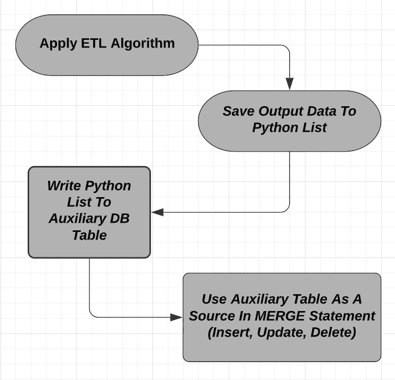
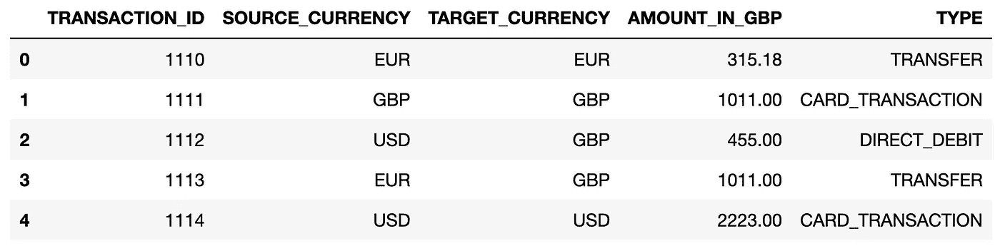
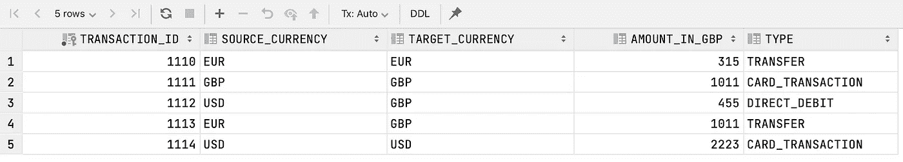

# 将 Python 列表写入雪花表的 3 种方法

> 原文：<https://towardsdatascience.com/3-ways-to-write-python-lists-to-a-snowflake-table-802318e56c64?source=collection_archive---------15----------------------->

## 了解如何存储可以用 SQL 查询的大量数据，从 Python 嵌套列表到雪花数据库


## 建议的点播课程:

*你是想通过成为* ***数据工程师*** *还是* ***机器学习工程师*** *来推进自己的职业生涯吗？我强烈建议您查看以下课程:*

*   [**Python 数据工程纳米学位**](https://imp.i115008.net/jWWEGv) **→** *精品课程！*
*   [***leet code In Python:50 算法编码面试问题***](https://click.linksynergy.com/deeplink?id=533LxfDBSaM&mid=39197&murl=https%3A%2F%2Fwww.udemy.com%2Fcourse%2Fleetcode-in-python-50-algorithms-coding-interview-questions%2F)**→最适合涉及算法的编码回合！**
*   *[***Python 高级编码问题(StrataScratch)***](https://platform.stratascratch.com/coding?via=antonello)***→****我找到的准备 Python 的最佳平台& SQL 编码面试到此为止！比 LeetCode 更好更便宜。**
*   *[**用 Python 练习编码面试题(60+题)**](https://datacamp.pxf.io/DV3mMd) **→** *列表、数组、集合、字典、map()、filter()、reduce()、iterable 对象。**

# ***简介***

*在构建数据管道时，您可能最终会在 Python 列表中存储大量数据。*

*通常，该对象采用列表的列表的形式，其中每个嵌套列表可以表示数据库表中的一行，并且属于它的每个元素可以被分配给特定的列:*

```
***lst** = [[x1, y1, z1], [x2, y2, z2], [x3, y3, z3],...,[xn, yn, zn]]*
```

*尽管 Python 列表不是存储数据的最有效方式，但使用它们来保存中间输出还是很方便的。*

*例如，假设您的管道是以这样一种方式编写的，它利用 Python 算法来操作和丰富数据(*，这种逻辑在 SQL* 中不容易复制)，并且算法的输出最终被附加到一个列表中。*

*但是，在某些时候，您可能需要将该列表的内容存储在数据库中。这通常发生在以下情况:*

*   *数据不需要进一步处理。可以提供给分析师进行报告。*
*   ***数据确实需要额外处理**。然而，使用 Python 列表不再是一种选择，因此您决定将中间结果保存在一个辅助表中。*

*根据您正在使用的数据库，可以应用多种策略。然而，在本教程中，我将向您展示使用将 Python 列表写入雪花数据库的 **3 种方法:***

*   *`snowflake.connector`自行打包；*
*   *`snowflake.connector`和`pandas`套餐的组合；*
*   *`snowflake.sqlAlchemy`和`pandas`套餐的组合。*

*在开始编写代码之前，让我们简要描述一下您在日常工作中可能会遇到的一个实际用例。*

*[](/3-nanodegrees-you-should-consider-to-advance-your-data-engineering-career-in-2021-baf597debc72) [## 3 门数据工程课程，在 2022 年推进您的职业发展

### 加入数据行业，改变角色或通过注册数据工程简单地学习前沿技术…

towardsdatascience.com](/3-nanodegrees-you-should-consider-to-advance-your-data-engineering-career-in-2021-baf597debc72) 

# 插入、更新或删除数据

在现实世界中，向目标表中插入新记录是不够的。同时，数据工程师通常还需要更新(*或删除*)其中已经存在的记录。

> 在现实世界中，向目标表中插入新记录是不够的。同时，数据工程师通常还需要更新(*或删除*)已经存在的记录。

在雪花中，这可以通过使用`MERGE INTO`语句来实现，引用[文档](https://docs.snowflake.com/en/sql-reference/sql/merge.html) " *根据第二个表(源)或子查询*中的值插入、更新和删除表中的值，其语法如下:

```
MERGE INTO *<target_table>* USING *<source>* ON *<join_expr>* { **matchedClause** | **notMatchedClause** }
```

令人烦恼的是，为了决定在`<target_table>`中插入哪些记录，更新(或删除)哪些记录，`MERGE INTO`语句要求`<source>`(读作:*您希望插入、更新或删除到目标表*中的新 *记录)作为标准表严格可检索，或者作为子查询进行查询。*

反过来，这也就意味着，截至目前，雪花**并不支持一个 Python 列表作为`USING`语句下的** `**<source>**`。

这正是数据需要额外处理，但使用 Python 列表不再可能的情况:嵌套的对象需要转换成其他格式并写入数据库表，然后后者才能用作合并的源。

下面描述了需要发生的事情的流程:



作者在 Lucidchart 上创建的流

这又把我们带回了最初的问题:**如何把 Python 列表写到雪花表？**要回答这个问题，我们先创建一个模拟数据集。

# 创建模拟 Python 列表

下面我所做的是创建一个`data_to_insert`列表，它本身包含五个子列表，其中存储了关于模拟金融交易的数据。

这个列表表示 ETL 管道的输出，它必须被写入雪花中的目标表。为了实现这一点，首先需要将该列表插入到一个辅助表中。

然后我把这个列表转换成一个`df_to_insert`熊猫数据框架，很快就会用到。正如所料，数据帧具有形状(5，5):



使用与 DataFrame 相同的列定义，我最终在 SnowFlake 中创建了一个空的辅助(`source_t`)表，现在可以存放数据了:

让我们看看如何通过 Python 连接到 SnowFlake 来填充它，以便通过游标对象执行 SQL 查询。

# 如何给雪花写一个 Python 列表

## 方法#1 | SF 连接器+ ExecuteMany()

将 Python 列表批量插入雪花表的第一种方法是通过`snowflake.connector`包连接到雪花。

一旦建立了连接(通过`external browser`认证或者通过`user + password`的组合)，您可以简单地将`INSERT`语句传递给`executemany()`方法:

现在，可以使用 SQL 检索最初存储在列表中的数据:

```
SELECT * FROM SCHEMA.SOURCE_T 
```



通过以下方式获得的输出

**优点:**`executemany()`方法非常简单，因为它只需要一个`INSERT`语句，不需要将列表转换成另一种格式。

**CONS:** 为了使这种方法成功，列表中的 [*最大表达式数必须是* ***< 16，385***](https://stackoverflow.com/questions/62541089/snowflake-connector-sql-compilation-error-maximum-number-of-expressions-in-a-li) ，这意味着如果您正在处理较大的批处理，这不是一个可以考虑的选项。

此外，对于您希望插入的每一列，您需要添加一个`%s`作为`VALUES()`语句的一部分，这使得键入操作有点重复，代码也不够优雅。

## 方法#2 | Pandas + SF 连接器+ WritePandas()

如果您正在处理大批量，我建议您:

*   通过`snowflake.connector`包连接雪花(和上面描述的一模一样)；
*   将 Python 列表转换成 pandas DataFrame(之前获得`df_to_insert`时也是这样做的)；
*   使用`write_pandas()`功能将`df_to_insert`写入表格:

**优点:**`write_pandas()`[在幕后高效地将数据保存在 Parquet 文件](https://docs.snowflake.com/en/user-guide/python-connector-api.html#write_pandas)中，然后使用`PUT`命令将这些文件上传到临时阶段，最后运行`COPY INTO <table>`命令将数据从文件复制到表中

**CONS:** 从内存的角度来看，将 Python 列表转换成 DataFrame 可能很麻烦。此外，`write_pandas()`不允许您指定当数据已经出现在表中时要做什么。这意味着，如果您希望每次运行时清空`source_t`，您将需要运行单独的`TRUNCATE TABLE`命令。

## 方法#3 | Pandas + SQLAlchemy + To_SQL()

当您可以自由选择建立与雪花连接的包时，我强烈建议您使用`sqlalchemy`和`snowflake.sqlalchemy`的组合来创建一个`engine`对象。

创建`engine`的好处在于，这是唯一一种在传递给`to_sql()` pandas 方法时工作良好的连接对象(然而，如果您试图传递用方法#1 和#2 创建的`db_conn_sf`连接对象，它将抛出一个错误)。

要将`df_to_insert`写入雪花表格，您可以使用类似于下面的脚本，在我看来这是一个很好的解决方案:

**优点:**当数据已经出现在`source_t`表中时，`to_sql()`方法比`write_pandas()`方法更先进。例如，在这种情况下，我将`if_exists`参数设置为等于`'replace’`，这样我就不需要单独的命令来截断表。

**CONS:** 另一方面，方法背后的算法在转换和存储记录时不如`write_pandas()`函数高效。在插入到`source_t`表之前，数据没有被压缩和保存到 Parquet 文件中，这意味着并行性不能被应用，并且在处理大批量数据时对内存的影响可能是相关的。

[](/how-to-connect-to-a-postgresql-database-with-python-using-ssh-tunnelling-d803282f71e7) [## 如何使用 SSH 隧道通过 Python 连接到 PostgreSQL 数据库

### 了解当需要 SSH 加密时，如何使用 Psycopg2 或 SQLAlchemy 查询 PostgreSQL 数据库

towardsdatascience.com](/how-to-connect-to-a-postgresql-database-with-python-using-ssh-tunnelling-d803282f71e7) 

# 结论

在本教程中，我已经和你分享了三种可以用来将 Python 列表写入雪花表的方法。现在数据在`source_t`中可用，我可以通过运行类似于 [this](https://gist.github.com/anbento0490/2e1f6126294a7f01cad14e36b1329ccb) 的`MERGE INTO`查询来完成我的管道上的工作。您可以使用它作为模板来处理您的项目。

但是我也想从你那里了解更多:你曾经面临过这样的问题吗？和..有没有用过其他方法把 Python 列表转换成雪花表？请随意发表评论😁

***给我的读者一个提示:*** *这篇文章包括附属链接，如果你购买的话，我可以从中赚取一小笔佣金，不需要额外的费用。**