# 30 个例子让你从新手变成高级熊猫用户

> 原文：<https://towardsdatascience.com/30-examples-to-get-you-from-a-novice-to-an-advanced-pandas-user-e6eb4e8750b7?source=collection_archive---------3----------------------->

## 全面和结构化的实用指南


照片由[恒电影](https://unsplash.com/@hengfilms?utm_source=unsplash&utm_medium=referral&utm_content=creditCopyText)在 [Unsplash](https://unsplash.com/@hengfilms?utm_source=unsplash&utm_medium=referral&utm_content=creditCopyText) 上拍摄

Pandas 是 Python 的一个数据分析和操作库。它是数据科学家和分析师中最受欢迎的工具之一。

熊猫可以处理整个数据分析管道。它提供了多种功能和方法来清理、转换、分析和绘制数据。在本文中，我们将做 30 个例子来演示每个步骤中最常用的函数。

我们将从基本操作开始，然后逐渐增加复杂性。前 4 个示例将涵盖创建您自己的数据框以供练习的不同方式。对于本文的剩余部分，我们将使用 Kaggle 上提供的墨尔本房屋数据集。

## 示例 1

`DataFrame`函数可用于使用 Python 字典创建数据框。键用作列，值代表行。

```
import numpy as np
import pandas as pddict_a = {
   "name": ["John", "Jane", "Emily"],
   "height": [178, 175, 177],
   "age": [25, 22, 27]
}df = pd.DataFrame(dict_a)df
```

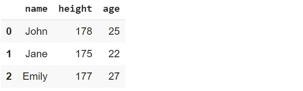

(图片由作者提供)

## 示例 2

在第一个例子中，我们只对字典值使用列表。也可以使用其他数据结构。

```
dict_b = {
   "date": pd.date_range("2020-01-01", periods=5, freq="D"),
   "store": "A",
   "sales": np.random.randint(50, 100, size=5)
}df = pd.DataFrame(dict_b)df
```

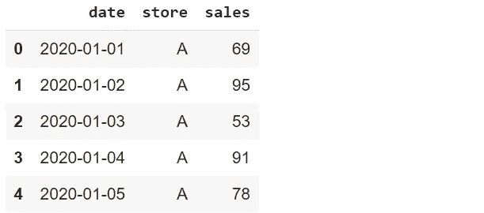

(图片由作者提供)

第一列包含连续 5 天的`DatetimeIndex`。第二列用相同的字符串填充，第三列用随机整数的 numpy 数组创建。

## 示例 3

如果您只需要一个由随机数组成的数据框，那么二维 numpy 数组比字典更实用。

```
df = pd.DataFrame(np.random.randint(0, 20, size=(3,4)))df
```

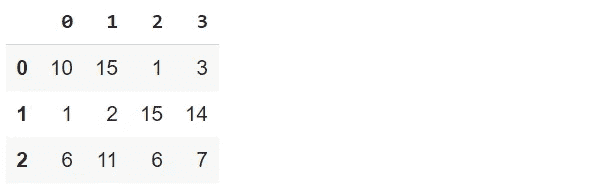

(图片由作者提供)

## 实例 4

如果没有定义列名，Pandas 会分配一个整数索引作为列名。我们总是可以使用`columns`参数定制列名。

```
df = pd.DataFrame(
   np.random.randint(0, 20, size=(3,4)),
   columns = list("ABCD")
)df
```

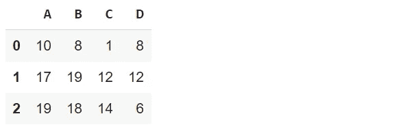

(图片由作者提供)

## 实例 5

对于其余的例子，我们将使用墨尔本住房[数据集](https://www.kaggle.com/dansbecker/melbourne-housing-snapshot)。让我们首先将数据集读入数据框并检查其大小。

```
df = pd.read_csv("/content/melb_housing.csv")print(df.shape)
(63023, 13)df.columns
Index(['Suburb', 'Address', 'Rooms', 'Type', 'Price', 'Method', 'SellerG','Date', 'Postcode', 'Regionname', 'Propertycount', 'Distance','CouncilArea'],dtype='object')
```

`read_csv`功能唯一需要的参数是文件路径。尽管它有许多可选参数。我们将在下面的例子中看到其中的一些。

数据帧有 63023 行和 13 列。我们可以通过在数据框上应用`columns`方法来检查列名。

## 实例 6

`read_csv`函数允许根据列或行选择数据集的一部分。我只需要郊区、地址、日期、类型、地区名称、距离和价格列

```
df = pd.read_csv(
   "/content/melb_housing.csv",
   usecols = ["Suburb", "Address", "Date", "Type", "Regionname",  
              "Distance", "Price"]
)df.head()
```

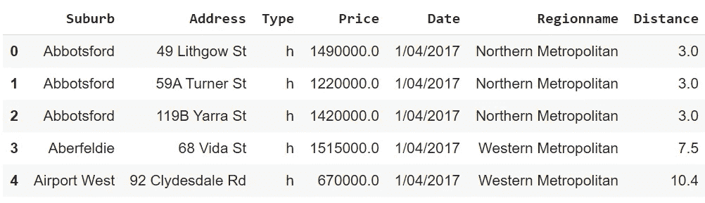

(图片由作者提供)

`usecols`参数用于选择特定的列。`head`方法显示数据帧的前 5 行。

## 例 7

有几个函数可以处理日期和时间。为了使用它们，日期必须以适当的数据类型存储。我们可以在创建数据框后随时更改数据类型。然而，更好的方法是在读取 csv 文件时解析日期。

```
df = pd.read_csv(
   "/content/melb_housing.csv",
   usecols = ["Suburb", "Address", "Date", "Type", "Regionname",  
              "Distance", "Price"],
   parse_dates = ["Date"]
)df.dtypes
Suburb                object 
Address               object 
Type                  object 
Price                float64 
Date          datetime64[ns] 
Regionname            object 
Distance             float64 df.head()
```

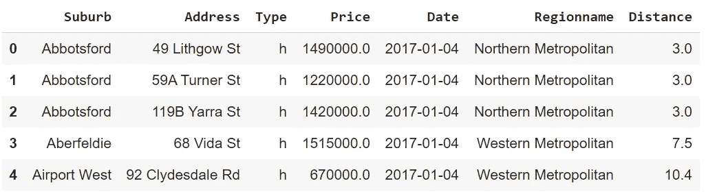

(图片由作者提供)

`dtypes`方法可以用来检查每一列的数据类型。

## 实施例 8

原始数据并不总是最理想的格式。我们很可能会遇到缺失的价值观。为了保持数据的准确性和一致性，正确检测和处理缺失值至关重要。

`isna`函数返回用布尔值填充的数据框，指明丢失的值。由于 True 被视为 1，我们可以应用 sum 函数来计算每一列中缺失值的数量。

```
df.isna().sum()Suburb            0 
Address           0 
Type              0 
Price         14590 
Date              0 
Regionname        0 
Distance          0
```

我们只在价格列中缺少值。

## 示例 9

`fillna`功能可用于替换丢失的值。有不同的方法来处理它们。最佳方案取决于手头的数据。

我们可以用列中值的平均值、中值或众数来填充缺失值。另一种选择是使用常数来替换丢失的值。

在某些情况下，我们可以选择删除缺少值的行或列。`dropna`功能用于此类任务。它还允许根据条件删除缺少值的行。例如，可以将其定制为删除缺失值超过 3 个的行。

因为数据集的焦点是价格列，所以我选择删除缺少价格的观察值(即行)。

```
df.dropna(axis=0, how="any", inplace=True)df["Price"].isna().sum()
0
```

`axis`参数选择行或列。默认值为 0(即行数)。`how`参数被设置为“any”以删除有任何缺失值的行。最后，将`inplace`参数设置为“真”以保存数据框中的更改。

## 实例 10

`astype`函数可用于改变列的数据类型。例如，我可能选择用整数而不是浮点数来表示价格。

```
df.Price = df.Price.astype("int")df.Price.dtypes
dtype('int64')
```

## 实施例 11

数据分析中的一个常见操作是基于现有列派生列。我们既可以更新一列中的值，也可以根据现有的值创建一个新的值。

例如，我将创建一个以百万为单位显示价格的列。简单用价格栏除以 100 万就可以算出来。

```
df["PriceMillion"] = df["Price"] / 1000000df.head()
```

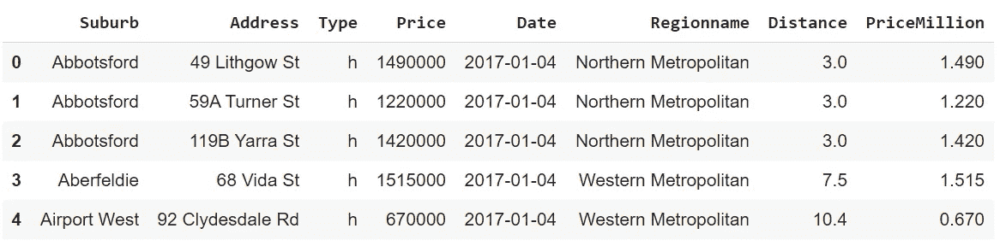

(图片由作者提供)

## 实例 12

正如我们在前面的示例中看到的，新列被添加到数据帧的末尾。但是，我希望它在价格栏旁边。

`insert`函数允许使用列索引在特定位置添加列。让我们首先删除新列，然后将其插入到所需的位置。

```
df.drop("PriceMillion", axis=1, inplace=True)df.insert(4, "PriceMillion", df["Price"] / 1000000)df.head()
```

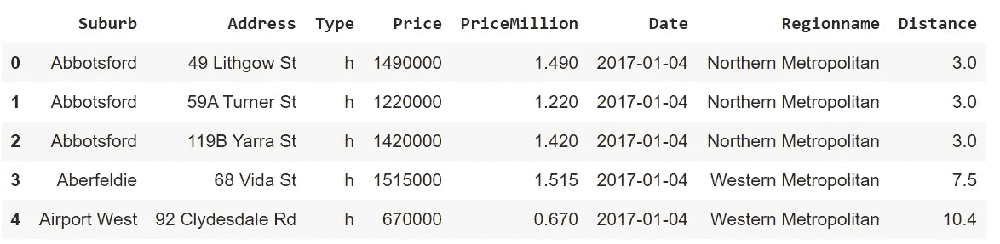

(图片由作者提供)

第一个参数指定新列的索引。另外两个参数是列名和值。

## 实施例 13

当处理分类变量时，我们可能需要检查列中的唯一值。考虑我们的数据框中的区域名称列。了解该列中有多少不同的值以及它们是什么会很有用。

`nunique`函数返回不同值的数量，而`unique`函数显示它们。

```
df.Regionname.nunique()
8df.Regionname.unique()
array(['Northern Metropolitan', 'Western Metropolitan',        'Southern Metropolitan', 'South-Eastern Metropolitan',        'Eastern Metropolitan', 'Northern Victoria', 'Eastern Victoria',        'Western Victoria'], dtype=object)
```

## 实施例 14

过滤观察值(即行)是数据分析的基本部分。我们试图通过根据某些条件检查数据来获得对数据的更好理解。

例如，我们可能想计算价格超过 100 万英镑的房子的数量。

```
len(df[df.PriceMillion > 1])
17268df[df.PriceMillion > 1]["Price"].count()
17268
```

我们使用列名在方括号内应用条件。必须使用数据框的名称指定列名。

`len`是一个内置的 Python 函数。当用于数据框时，它返回行数。`count`函数，顾名思义，计算一列中的项数。

## 实施例 15

上述方法还允许基于多个条件进行过滤。我们来查一下造价 100 万以上，类型为“u”的房子有多少？

```
len(df[(df.PriceMillion > 1) & (df.Type == "u")])
598
```

## 实施例 16

如果过滤器有几个值，我们可以使用`isin`功能。

```
suburbs = ['Abbotsford', 'Aberfeldie', 'Airport West', 'Albert Park', 'Albion']len(df[df.Suburb.isin(suburbs)])
661
```

我们创建一个所需值的列表，然后使用它进行过滤。

## 实例 17

Pandas 提供了几个函数和方法来处理文本数据。我们可以通过 str 访问器来使用它们。

我们也可以使用字符串方法进行过滤。让我们找到以字母 d 开头的郊区的房子。

```
suburb_D = df[df.Suburb.str.startswith("D")]suburb_D.head()
```

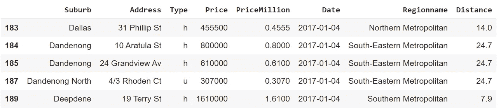

(图片由作者提供)

## 实施例 18

在前面的示例中，我们通过过滤原始数据框创建了一个数据框。正如我们在前 5 行中注意到的，这些行的索引与原始索引保持一致。

最好有一个从 0 开始的索引，这可以通过在过滤后应用`reset_index`函数来实现。

```
suburb_D = df[df.Suburb.str.startswith("D")].reset_index(drop=True)suburb_D.head()
```

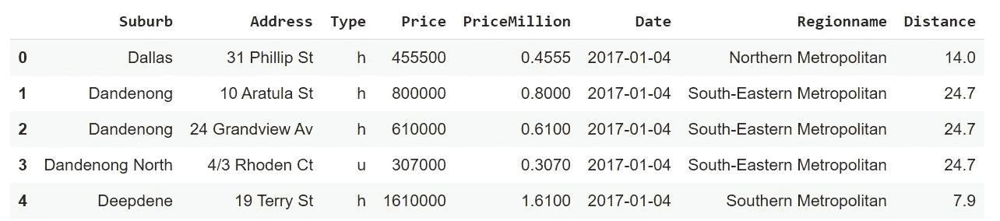

(图片由作者提供)

如果我们没有将`drop`参数设置为 True，那么原始索引将作为一个新列保存在数据框中。

## 实施例 19

另一种过滤行的方法是`query`函数。它接受字符串形式的条件，这在某些情况下可能更实用。

让我们使用与之前相同的过滤条件，以确保它能够准确工作。

```
len(df.query("PriceMillion > 1"))
17268len(df.query("PriceMillion > 1 and Type == 'u'"))
598
```

## 实施例 20

str 访问器提供了许多操作字符串的函数。常用的一个就是 split 函数。

例如，我们可以通过从 region name 列中提取第一个单词来创建 region group 列。这可以通过如下的分割功能来实现。

```
df["RegionGroup"] = df.Regionname.str.split(" ", expand=True)[0]df.head()
```

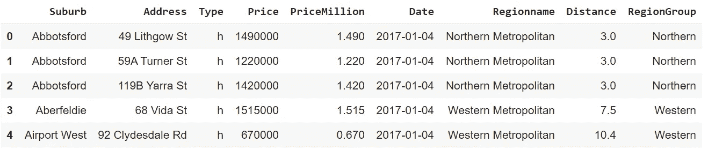

(图片由作者提供)

当设置为 True 时，`expand`参数在分割后为每个片段创建单独的列。我们使用索引 0 选择第一个单词。

## 实施例 21

另一个功能强大的访问器是 dt 访问器。它用于操作和处理日期和时间。

例如，我们可以从日期中提取月和年，如下所示。

```
df["Month"], df["Year"] = df["Date"].dt.month, df["Date"].dt.yeardf[["Date", "Year", "Month"]].head()
```

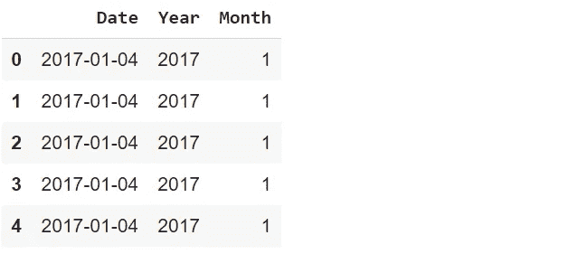

(图片由作者提供)

dt 访问器提供了许多函数和方法。我们不能在这里涵盖所有这些，但是请记住，dt 访问器是我们在处理日期和时间时使用的。

## 实施例 22

`groupby`函数在数据分析中经常使用。我们可以根据一些其他值来比较一列中的组或不同值。

例如，我们可以计算每个地区组的平均房价。我们选择感兴趣的列，并指定用于分组的列。然后，对每个组应用聚合函数。

```
df[["RegionGroup", "PriceMillion"]].groupby("RegionGroup").mean()
```

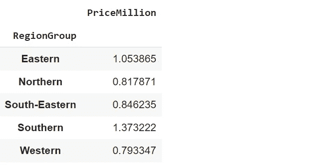

(图片由作者提供)

## 实施例 23

在前面的示例中，我们在应用`groupby`函数之前选择了 region group 和 price 列。如果我们将 groupby 函数应用于整个数据框，则聚合将应用于所有适当的列。

在计算平均值的情况下，我们将得到所有数值列的平均值。如果只需要对特定列执行聚合，则命名聚合更为实用。

```
df.groupby("RegionGroup", as_index=False)\
  .agg(avg_price = ("PriceMillion", "mean"))
```

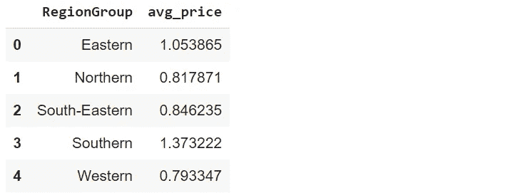

(图片由作者提供)

使用命名聚合的另一个优点是，我们可以为聚合列分配信息性名称。使用“avg_price”作为列名比只使用 price 更有意义。

我们可以使用`as_index`参数将组放在数据框的一列中，而不是作为索引。

## 实施例 24

`rank`函数用于根据列中的值为观察值(即行)分配等级。例如，我们可以根据价格对房屋进行排名。

```
df["Rank"] = df["Price"].rank(method="first",  
                              ascending=False).astype("int")df[["Price", "Rank"]].head()
```

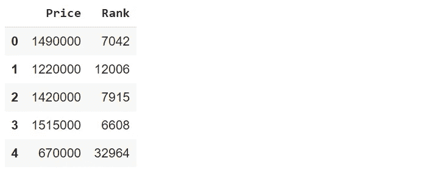

(图片由作者提供)

默认情况下，这些值按升序排列，但是我们可以使用`ascending`参数来改变这种行为。

## 实施例 25

`sort_values`函数根据给定列中的值对行进行排序。让我们用它来根据价格对房屋进行排序。

```
df.sort_values(by="Price", ascending=False)[["Price", "Rank"]].head()
```

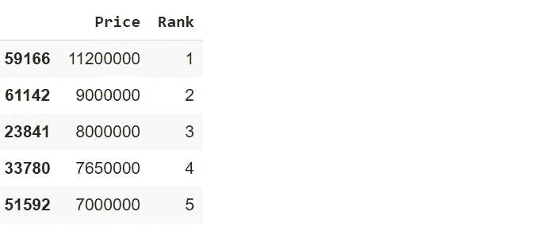

(图片由作者提供)

我想在排序后显示前 5 行，以确认在前面的例子中分配的等级。

## 实施例 26

`loc`和`iloc`方法用于选择数据框中的特定行和列。

*   iloc 通过索引工作
*   loc 按标签工作

让我们举几个例子来演示它们是如何使用的。

```
#rows between 5 and 10 , first 3 columns
df.iloc[5:10, :3]
```

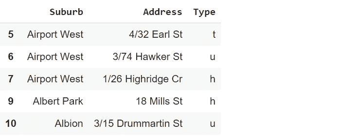

(图片由作者提供)

```
#rows between 20 and 25, address and price columns
df.loc[20:25, ["Address", "Price"]]
```

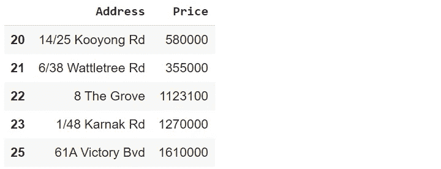

(图片由作者提供)

我们使用 loc 和 iloc 方法使用相同的值来选择行，因为默认情况下，行的标签是它们的索引。除非创建自定义索引，否则 loc 和 iloc 对行采用相同的值。

## 实施例 27

Pandas 不是一个数据可视化库，但它允许创建基本的绘图。它可以方便地快速生成用于数据分析的图表。

让我们通过绘制直方图来看看距离列的分布。

```
df.Distance.plot(
   kind="hist",
   figsize=(8,5),
   title = "Histogram of Distance"
)
```

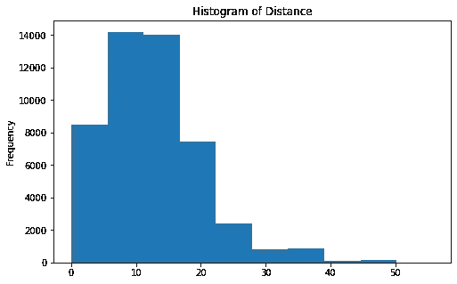

(图片由作者提供)

## 实施例 28

我们也可以画一个显示每日平均价格的线图。我们首先需要根据日期列对行进行分组，然后应用绘图函数。

```
df.groupby("Date").agg(price = ("Price", "mean")).plot(
   kind="line",
   figsize=(10,5),
   title = "Daily Average Price"
)
```

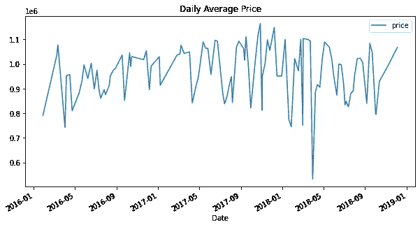

(图片由作者提供)

## 实施例 29

探索性数据分析中使用的另一个常用图是散点图。它概述了两个数值变量之间的相关性。

让我们也创建一个价格和距离列的散点图。

```
df.plot(
   kind="scatter",
   x="Price",
   y="Distance",
   figsize=(8,6)
)
```

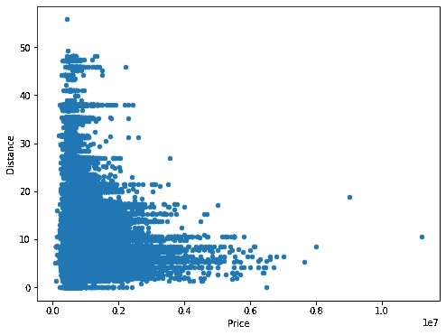

(图片由作者提供)

距离和价格是负相关的。这是有道理的，因为离市中心越近，房价越贵。

## 示例 30

最后一个例子是关于`sample`函数。在某些情况下，我们从大型数据集中随机抽取样本进行分析。

```
print(df.shape)
(48433, 12)df_sample = df.sample(frac=0.5)print(df_sample.shape)
(24216, 12)
```

我们取原始数据帧一半大小的样本。我们可以使用`n`参数获取一定行数的样本。

```
df_sample = df.sample(n=30000)print(df_sample.shape)
(30000, 12)
```

## 结论

我们做了 30 个例子，涵盖了熊猫常用的功能和方法。他们一定会给你提供相当不错的熊猫知识。

当然，除了这篇文章，还有更多关于熊猫的内容。当你需要的时候，你可以随时学习它们。

感谢您的阅读。如果您有任何反馈，请告诉我。