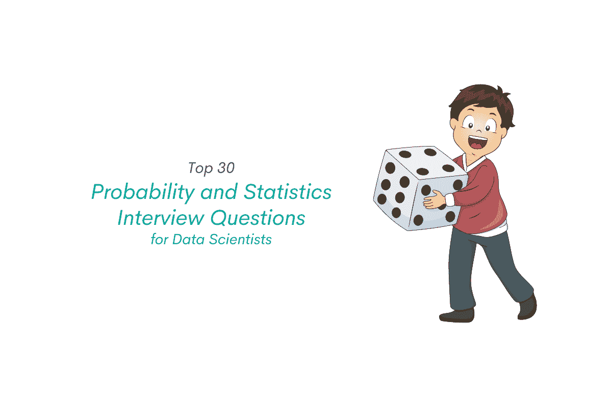
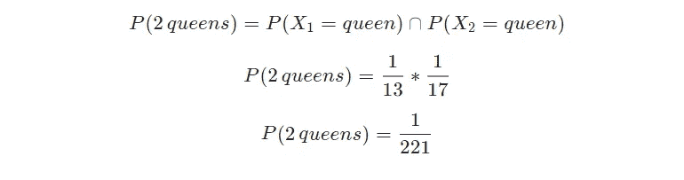
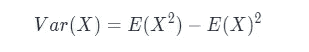
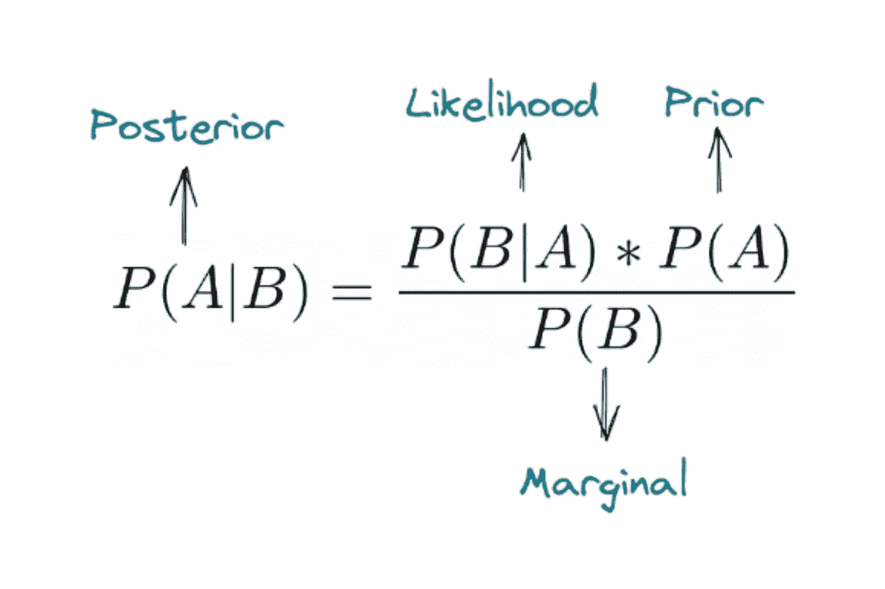

# 数据科学家的 30 个概率和统计面试问题

> 原文：<https://towardsdatascience.com/30-probability-and-statistics-interview-questions-for-data-scientists-7524622801a3?source=collection_archive---------5----------------------->

## *30 个概率和统计面试问题，可以帮助你提高技能，赢得数据科学面试*

作者在 [Canva](https://canva.com/) 上创建的图片

在数据科学面试中，关于统计或概率概念的问题可能很难处理。这是因为与产品问题不同，统计和概率问题有明确的正确或错误答案。这意味着你关于具体统计和概率概念的知识将在面试中得到充分的检验。因此，在数据科学面试之前，有必要温习一下你的统计学知识，做好充分的[准备。](https://www.stratascratch.com/blog/5-tips-to-prepare-for-a-data-science-interview/?utm_source=blog&utm_medium=click&utm_campaign=medium)

在这篇文章中，我们将通过提供来自不同公司的三十个相关面试问题以及解决方案来帮助你提高你的统计和概率技能。

请注意，在本文中，我们将只讨论面试问题及其解决方案。理论上的概念只简单解释一下。如果你想更新你关于统计和概率的理论知识，你可能想在这里查看我们的[统计和概率问题终极指南](https://www.stratascratch.com/blog/probability-and-statistics-interview-questions-and-answers/?utm_source=blog&utm_medium=click&utm_campaign=medium)。

所以，让我们直截了当地开始吧。

# 概率面试问题

在数据科学面试中，至少有三个常见的大概率话题:

1.  独立和从属事件
2.  排列和组合
3.  概率分布

我们将逐一讨论这三个主题。先说独立事件和从属事件。

## 独立和从属事件

在概率上，如果一个事件发生的概率不影响另一个事件发生的概率，那么这个事件可以说是一个独立事件。

独立事件最常见的例子是投掷两个不同的骰子或多次投掷一枚硬币。当我们掷硬币时，我们在第二次投掷中得到一条尾巴的概率不会受到第一次投掷结果的影响。我们得到尾巴的概率永远是 0.5。

同时，如果一个事件发生的概率影响另一个事件发生的概率，则该事件可以被称为从属事件。

从属事件的一个例子是从一副牌中抽牌。假设我们想知道从一副牌中得到红心的概率。如果你之前没有抽过牌，那么你得到红心的概率是 13/52。假设你在第一次听牌中拿到了一张黑桃。那么，你在第二次抽牌中得到红心的概率就不再是 13/52，而是 13/51，因为你从这副牌中抽了一张牌。

以下是来自不同公司的[数据科学面试问题](https://www.stratascratch.com/blog/data-science-interview-guide-questions-from-80-different-companies/?utm_source=blog&utm_medium=click&utm_campaign=medium)的示例，这些问题将在独立和非独立事件中测试我们的知识:

来自[脸书](https://platform.stratascratch.com/technical/2003-two-cards-same-suite?utm_source=blog&utm_medium=click&utm_campaign=medium)的问题:

*“从同一副牌中抽出两张有相同花色的牌的概率是多少？”*

这是从属事件的一个例子。在相关事件的情况下，两个事件发生的概率可以定义为:

这意味着事件 ***A*** 和事件 ***B*** 同时发生的概率等于事件 ***A*** 发生的概率乘以事件 ***B*** 发生的概率，给出事件 ***A*** 的结果。

在我们的例子中，一副牌中有四个花色，每个花色有 13 张牌。

在第一次抽牌中，我们拿到特定花色牌的概率是 13/52。在第二次抽牌时，我们得到与第一次相同套房的牌的概率不再是 13/52，而是 12/51。因此:

来自[简街](https://platform.stratascratch.com/technical/2278-pick-2-queens?utm_source=blog&utm_medium=click&utm_campaign=medium)的问题:

“从一副牌中选出 2 张皇后的概率是多少？”

这也是从属事件的一个例子。第一次抽牌，我们拿到皇后的概率是 4/52。如果我们在第一次抽牌中得到一个皇后，那么我们在第二次抽牌中得到另一个皇后的概率是 3/51。因此:

来自[脸书](https://platform.stratascratch.com/technical/2011-n-dices?utm_source=blog&utm_medium=click&utm_campaign=medium)的问题:

假设你有两个骰子。至少得一个 4 的概率有多大？”

与前面的问题不同，这个问题是独立事件的一个例子，因为投掷一个骰子的结果不会对投掷第二个骰子的结果产生任何影响。

假设:

**A** =在第一次骰子中得到 4
B=在第二次骰子中得到 4

独立事件 **A** 和 **B** 都发生的概率可以定义为:

并且得到至少一个 4 的概率可以用两个事件合并的概率来计算:

我们知道掷骰子得到任何特定结果的概率是⅙.因此，

来自脸书的问题:

三只蚂蚁坐在一个等边三角形的三个角上。每只蚂蚁随机选择一个方向，开始沿着三角形的边移动。没有蚂蚁相撞的概率是多少？”

虽然这是隐含的，但这是独立事件的情况。每只蚂蚁可以随机选择方向，要么向左，要么向右。一只蚂蚁向左走的决定不会影响另外两只蚂蚁向左还是向右走的决定。

既然决策是随机的，那么蚂蚁挑某个方向的概率就是 0.5。如果三只蚂蚁都向左走或都向右走，它们就不会相撞。

因此:

# 排列和组合

排列和组合可能听起来相似，我们可能在现实生活中互换使用这两个词。然而，它们在概念上有明显的区别，知道如何区分组合和排列是很重要的，因为它们有不同的公式。

排列和组合的一大区别是顺序的重要性。顺序在排列中很重要，但在组合中不重要。这个顺序的概念会在下面的数据科学面试问题的例子中有更深入的解释。

来自 [Kabbage](https://platform.stratascratch.com/technical/2027-essay-writing-cheaters?utm_source=blog&utm_medium=click&utm_campaign=medium) 的问题:

*“如何在一个 200 人的小组里发现谁在论文写作上作弊？”*

我们有不同的方法可以发现谁在考试中作弊。一种方法是逐个比较一对学生考试。

如果我们想一想，将学生 ***A*** 的考试与学生 ***B*** 的考试进行比较，与将学生 ***B*** 的考试与学生 ***A*** 的考试进行比较是一样的。换句话说， ***A*** ，***B******=******B***， ***A*** 。顺序不重要。

既然顺序不重要，那么我们就可以用组合的概念。组合的一般方程式是:

其中 ***n*** 是项目总数， ***k*** 是要订购的项目总数。

由于有 200 名学生，并且有两次考试要进行比较，因此我们有:

来自 IBM[的问题](https://platform.stratascratch.com/technical/2316-random-numbered-cards?utm_source=blog&utm_medium=click&utm_campaign=medium):

*“从一副编号从 1 到 100 的牌中，我们随机抽取两张牌。其中一张卡上的数字恰好是第二张卡上数字的两倍的概率是多少？”*

这个问题也可以用组合的概念来回答。这是因为当我们从同一副牌中抽出两张牌时，顺序并不重要。这意味着，如果我们在第一次抽牌中得到 10 号牌，在第二次抽牌中得到 40 号牌，这与我们在第一次抽牌中得到 40 号牌，在第二次抽牌中得到 10 号牌是一样的。

因此，通过将问题中已知的值代入组合方程，我们将得到:

这意味着我们有 4950 个组合对。

在这 4950 种组合中，一张卡是另一张卡的两倍的可能性是 50，因为我们总共有 100 张卡。因此，我们可以将概率计算为:

来自[峰值 6](https://platform.stratascratch.com/technical/2288-combinations-of-three?utm_source=blog&utm_medium=click&utm_campaign=medium) 的问题:

三个人，在一场比赛中获得第一、第二和第三名，有多少种不同的组合

在这个问题中，顺序实际上很重要，因为处于第一位置与处于第二或第三位置是不同的。

这意味着，如果我们有运动员 A、B、C 和位置 1、2、3，那么组成 ***A*** ， ***B*** ， ***C*** 不同于*， ***B*** ， ***A*** 也不是 ***B* 因此，我们在这个问题中处理排列的概念。***

*排列问题的一般方程是:*

**

*其中 ***n*** 是项目总数， ***k*** 是要订购的项目总数。*

*在问题中，我们有三名运动员和三个位置需要排序，因此:*

**

# *概率分布*

**

*作者创造的形象*

*在你去参加数据科学面试之前，关于概率分布的知识是必须的。关于概率分布的问题是最受欢迎的数据科学面试问题之一。*

*下面是一个测试你对概率分布的一般知识的面试问题:*

*来自 IBM[的问题](https://platform.stratascratch.com/technical/2048-non-gaussian-distribution?utm_source=blog&utm_medium=click&utm_campaign=medium):*

**“非高斯分布的数据集示例是什么？”**

*我们可以通过提供一个二项式分布数据的例子来回答这个问题，例如，你掷 1000 次硬币得到 500 个反面的频率，我们掷 10 次骰子得到 2 个 5 的频率，等等。*

*问题是，如果你一开始就不知道概率分布，你就无法回答这个问题。更糟糕的是，有很多不同的概率分布。那么我们需要知道所有的概率分布吗？*

*当然不是。*

*在所有概率分布中，二项式分布、均匀分布和高斯分布是数据科学面试中最常见的。如果你是概率分布的新手，你可以先从这三个开始，然后再扩展到其他的概率分布。*

*在数据科学面试中，通常会问两类与概率分布相关的问题:要么要求你计算分布的概率质量函数(PMF) /概率密度函数(PDF)，要么要求你计算分布的期望值。*

*先说二项分布。*

## *二项分布*

*二项式分布是离散概率分布的一种，它衡量某一事件在一定次数的试验中成功的概率。*

*二项分布的概率质量函数(PMF)如下:*

**

*其中 ***n*** 是试验次数， ***k*** 是成功次数。同时，二项分布的期望值可以计算如下:*

**

*以下是各公司的数据科学面试问题示例，涵盖了二项分布的概念。*

*来自[威瑞森无线](https://platform.stratascratch.com/technical/2175-throwing-dice?utm_source=blog&utm_medium=click&utm_campaign=medium)的问题:*

**“掷骰子 7 次得到 1 个 5 的概率有多大？”**

*这个问题可以通过简单地将数值代入二项式分布方程来回答。我们可以认为成功的次数是 1(因为我们看到的是 1/5)，而试验的次数是 7。同时，我们都知道，一掷中得 5 分的概率是⅙.因此:*

**

*来自[简街](https://platform.stratascratch.com/technical/2283-two-out-of-five?utm_source=blog&utm_medium=click&utm_campaign=medium)的问题:*

**“掷 5 次硬币获得 2 条尾巴的概率有多大？”**

*与前一个问题相同，这可以通过简单地将数值代入二项式分布的 PMF 方程来回答。在这种情况下，成功的次数是 2，因为我们要获得 2 条尾巴，而试验的总次数是 5。在每一次公平的掷硬币中得到一条尾巴的概率是 0.5。因此:*

**

*来自 [Lyft](https://platform.stratascratch.com/technical/2311-discount-coupons-usage?utm_source=blog&utm_medium=click&utm_campaign=medium) 的问题:*

**“给 N 个骑手一张打折券。使用优惠券的概率是 p，其中一张优惠券被使用的概率是多少？”**

*同样，这个问题也可以通过将数值代入二项式分布的 PMF 方程来回答。*

*从题中我们可以说成功次数为 1(因为只会使用一张券)物品数为 ***N*** ，而单次试吃成功的概率为 ***P*** 。*

*因此，*

**

*Lyft 提出的问题:*

**“给 N 个骑手一张 5 美元的折扣券。使用息票的概率是 p，公司的预期成本是多少？”**

*与上一个问题不同，现在我们需要用二项分布计算变量的期望值，而不是计算 PMF。我们可以通过将这些值代入二项分布的期望值方程来回答这个问题。*

*根据上面的等式，我们有 ***N*** 优惠券，使用优惠券的概率是 ***P*** 。*

*因此，预期值将是:*

**

*预期成本是:*

**

*来自[脸书](https://platform.stratascratch.com/technical/2188-serving-ads-within-newsfeed?utm_source=blog&utm_medium=click&utm_campaign=medium)的问题:*

**“我们有两个在新闻提要中投放广告的选项:
1。每 25 个故事中，就有一个是广告。每个故事都有 4%的几率成为广告。
对于每个选项，100 篇新闻报道中显示的广告的预期数量是多少？如果我们选择第二种方式，在 100 个故事中，用户只看到一个广告的可能性有多大？”**

*这个问题测试你对二项分布的期望值和 PMF 的知识。*

*第一个问题是，100 个新闻故事中显示的广告的预期数量，该问题是:*

**

*同时，第二个问题可以用二项式分布的 PMF 来回答，其中试验总次数为 100，成功总次数为 1(只有单个广告)，每个故事有 0.04 的概率成为广告。*

**

## *均匀分布*

*根据使用情况，均匀分布可以分为离散和连续概率分布。它衡量一个事件有 ***n*** 个可能结果的概率，其中每个 ***n*** 发生的可能性相等。正因为如此，它有一个平面的 PMF/PDF。*

*均匀分布的常见例子是投掷骰子。我们从六面骰子中得到任何一面的概率总是⅙.*

*离散均匀分布的期望值为:*

**

*其中 ***a*** 是最小可能结果， ***b*** 是最大结果。例如，当我们掷出 6 面骰子时，最小可能结果是 1，最大可能结果是 6。*

*以下是测试您对均匀分布的了解的数据科学面试问题示例。*

*来自[简街](https://platform.stratascratch.com/technical/2274-dice-expectations?utm_source=blog&utm_medium=click&utm_campaign=medium)的问题:*

**“掷骰子的期望值是多少？”**

*通过将这些值代入均匀分布的期望值公式，我们可以很容易地解决这个问题，如下所示:*

**

*来自沃尔玛的问题:*

**“假设你掷骰子，得到你想要的任何一张脸。现在假设你有机会掷出第二个骰子。如果你掷骰子，你将赢得你得到的任何牌面，但你将失去第一轮的收入。第二遍应该什么时候滚？”**

*这个问题在某种程度上是上一个问题的延伸。从上一个问题中您已经知道，一个 6 面骰子的期望值是:*

**

*要回答这个问题，我们需要这样想:*

*如果我们在第一次掷骰中得到超过 3.5(单次掷骰的期望值)，那么我们就不应该掷出第二次骰子并保留收益。同时，如果我们得到的少于 3.5，那么我们应该掷出第二个骰子。*

*来自 [PayPal](https://platform.stratascratch.com/technical/2314-larger-expected-value?utm_source=blog&utm_medium=click&utm_campaign=medium) 的问题:*

**“从一个均匀分布中抽取一个 1 到 N 之间的数并乘以它本身，或者从一个均匀分布中抽取两个 1 到 N 之间的数并乘以它们，哪个具有更大的期望值？”**

*这个问题可以解释为这两个中的任何一个:*

***第一种解读:取一个样本，将样本本身相乘，然后计算我们乘以样本后的期望值。***

*要回答这个问题，我们需要知道均匀分布变量的一般方差方程:*

**

*   *对于第一种情况，我们采样 1 到 ***N*** 之间的一个数，姑且称之为 ***X*** 。如果我们将这个 ***X*** 乘以自身，那么我们得到 ***X*** 并且它的期望值将是 ***E(X )*** 。*
*   *对于第二种情况，我们对 1 到 ***N*** 之间的两个数字进行独立采样，因此这两个数字相乘后的期望值将是***【X】*E(X)= E(X)**。*

*如果我们看上面的方差方程，我们知道方差的值应该总是正的。为了满足这个条件，那么***【X】***必须大于 ***E(X)*** 。因此，对 1 和 ***N*** 之间的一个数进行采样并乘以其自身的期望值总是较大。*

***第二种解释:取一个样本，计算该样本的期望值，然后将该期望值乘以自身。***

*   *对于第一种情况，我们首先从一个均匀分布中抽取一个介于 1 和***【N】***之间的数，然后我们将该数的期望值乘以自身，因此我们得到***【E(X)***。*
*   *对于第二种情况，我们对两个独立的数字进行采样，并将它们的期望值相乘，因此我们得到 ***E(X)* E(X) = E(X)** 。*

*因此，我们可以得出结论，这两种方法产生了相似的期望值。*

## *高斯分布*

*高斯分布或正态分布是一种钟形曲线，其特征在于两个参数:平均值和标准差。*

*关于正态分布的面试问题通常与推断统计学范围内的其他主题相关联，例如如何推断 p 值、样本大小、误差范围、置信区间和假设检验。*

*你可以在下一节看到这些面试问题的例子。*

# *统计学面试问题*

**

*作者在 [Canva](https://canva.com/) 上创建的图像*

*在数据科学访谈中，至少有三个大的统计学主题是经常被问到的，它们是:*

1.  *中心和价差的度量(平均值、方差、标准差)*
2.  *推论统计*
3.  *贝叶斯定理*

*先讨论一下中心和扩散的度量。*

**还有，查看我们的* [*综合统计小抄*](https://www.stratascratch.com/blog/a-comprehensive-statistics-cheat-sheet-for-data-science-interviews/?utm_source=blog&utm_medium=click&utm_campaign=medium) *了解统计和概率的重要术语和方程。**

# *均值、方差、标准差*

*中心度量(均值、中值、众数)和分布度量(方差、标准差)的概念是您在深入研究统计学之前应该掌握的首要概念。*

*这就是为什么关于这些概念的问题在数据科学面试中非常受欢迎。公司想知道你有没有统计学的基础知识。下面是一个询问这些概念的例子。*

*来自[脸书](https://platform.stratascratch.com/technical/2013-mean-median-age-in-mexico/?utm_source=blog&utm_medium=click&utm_campaign=medium)的问题:*

**“在墨西哥，如果取平均值和年龄中位数，哪个会高，为什么？”**

*这个问题测试你对中心度量概念的了解。为了找出平均值和中间值之间哪个会更高，我们需要找出墨西哥的年龄分布。*

*根据统计数据，墨西哥的年龄分布呈右偏分布。如果你看下图，右偏分布的平均值比中位数高。*

**

*作者创造的形象*

*因此，墨西哥的平均年龄高于中位年龄。*

*来自[微软](https://platform.stratascratch.com/technical/2243-definition-of-variance?utm_source=blog&utm_medium=click&utm_campaign=medium)的问题:*

**“方差的定义是什么？”**

*顾名思义，方差衡量数据集的数据点相对于其平均值的分布。下面是方差的一般等式:*

**

*其中 ***S*** 为方差， ***x*** 为样本， ***x 条*** 为样本均值， ***n*** 为样本总数。*

# *推断统计学*

*推断统计是数据科学面试中非常受欢迎的话题。这是因为通过在这个话题中问一个问题，公司可以在从数据中得出一些见解时衡量你的思维过程。*

*推断统计有不同的步骤和术语，如假设检验、置信区间、p 值、误差幅度和样本大小。*

*先说几个关于 p 值的例题。*

## *p 值*

*来自亚马逊的问题:*

*“你如何向工程师解释如何解释 p 值？”*

*国营农场的问题:*

**“什么是 p 值？如果您有一个不同的(大得多，例如 300 万条记录),您对 p 值的解释会改变吗？)数据集？”**

*p 值代表统计领域的概率值，通常用于假设检验。p 值描述了假设你的零假设为真，你刚刚观察到的数据有多不可能。*

*通常，我们在假设检验之前设定一个显著性水平。如果 p 值低于我们的显著性水平，那么我们拒绝零假设。同时，如果 p 值高于显著性水平，那么我们用我们的零假设。*

*如果数据集越来越大，对 p 值的解释不会改变，但更大的数据集意味着我们的 p 值结果更可靠、更可靠。*

## *置信区间、样本量和误差幅度*

*由于置信区间、样本大小和误差幅度之间的关系，它们的概念通常会一起出现，正如您将在以下置信区间等式中看到的:*

**

*上式中， ***X_bar*** 为样本均值， ***Z*** 为置信值， ***σ*** 为样本标准差， ***n*** 为样本量。*

*同时，误差范围可以定义为:*

**

*从上面可以看出，置信区间、误差幅度和样本大小值之间存在关系。这就是为什么这些术语之间的问题紧密联系在一起。*

*现在我们来看看谈论这些概念的面试问题。*

*来自[谷歌](https://platform.stratascratch.com/technical/2315-margin-of-error?utm_source=blog&utm_medium=click&utm_campaign=medium)的问题:*

**“对于样本量 n，误差幅度为 3。我们还需要多少样本才能将误差幅度降至 0.3？”**

*这个问题可以通过简单地将数值代入上面的误差范围公式来回答。*

**

*这意味着我们需要比初始样本量多 100 倍的样本，才能将误差幅度降至 0.3。*

*来自脸书的问题:*

**“假设脸书人口点击广告的点击率为 P。我们选择一个大小为 N 的样本，并检查样本的转化率，用 hat{P}表示，使概率(ABS(hat{P} — P) < DELTA ) = 95%的最小样本大小 N 是多少？换句话说，找到最小样本量 N，使得我们的样本估计值{P}在真实点击率 P 的增量内，置信度为 95%。”**

*这个问题测试我们关于置信区间、误差范围、样本大小和二项分布的知识。问题中的转换率遵循二项分布，这意味着我们需要用二项分布的方差平方根来估计标准差*。**

**二项式分布方差的一般公式为:**

****

**从这个问题中，我们知道我们有一个 95%的置信区间，这意味着 Z 值等于 1.96(参见 Z 表以获得该值)。将该方程代入方程误差范围，我们得到:**

****

**来自[特斯拉](https://platform.stratascratch.com/technical/2093-confidence-interval?utm_source=blog&utm_medium=click&utm_campaign=medium)的问题:**

**“有 100 种产品，其中 25 种是坏的。置信区间是多少？”**

**和上一个问题一样，这个问题也测试我们关于置信区间、误差范围、样本大小和二项分布的知识。**

**问题中陈述的问题遵循二项分布，所以我们需要从二项分布的期望值和二项分布的方差的标准差来计算样本均值。**

****

**一旦我们从二项式分布公式中计算出平均值和标准偏差，那么我们就可以将这些值代入置信区间的等式中来找出答案。**

****

## **假设检验**

**关于假设检验的面试问题通常以用例的形式出现。公司会给你一个关于他们产品的具体用例，他们会问你如何知道一种产品在市场上是否比另一种产品表现得更好。下面是这样的例子:**

**来自[脸书](https://platform.stratascratch.com/technical/2142-used-by-different-groups?utm_source=blog&utm_medium=click&utm_campaign=medium)的问题:**

***“我们有一种产品被两个不同的群体以不同的方式使用。
1。你的假设是什么？
2。你将如何着手检验你的假设？”***

**这个问题测试我们在进行假设检验时应该采取的不同步骤的知识。**

**下面是我们应该如何进行假设检验的分步示例:**

*   **阐明我们的零假设和替代假设**
*   **选择重要性级别。显著性水平可以根据我们的用例而变化。但是，我们可以选择默认值 0.05。**
*   **根据我们的数据计算样本平均值和样本标准误差。**
*   **计算与您的用例相对应的 t 统计，无论是配对 t 检验、总体均值的单样本 t 检验、双样本 t 检验、方差分析还是卡方检验。**
*   **如果结果检验的 p 值低于我们的显著性值，那么我们拒绝我们的零假设，支持另一个假设。同时，如果得到的 p 值高于显著性值，那么我们采用零假设。**

**来自亚马逊的问题:**

***“在 A/B 测试中，你如何检查对不同存储桶的分配是否真的是随机的？”***

**如果桶真的是随机分配的，那么在统计学方面，我们不会注意到每个桶中的变量样本之间有任何显著的差异。但是我们如何知道桶之间的样本差异是否显著呢？**

**我们可以用统计测试来衡量这一点。**

**如果我们观察的变量是连续变量，并且只有一种处理，我们可以使用双样本 t 检验。同时，如果有多种治疗方法，那么我们可以使用方差分析。**

**在进行统计测试后，我们将得到一个 p 值，我们可以使用这个 p 值来推断桶之间是否存在显著差异。**

# **贝叶斯定理**

**贝叶斯定理也是数据科学面试问题中经常被问到的。这种统计方法与我们在上面的推理统计部分看到的频率统计方法不同。事实上，一些公司可能会问你贝叶斯统计和频率统计的区别如下:**

**来自 [Yelp](https://platform.stratascratch.com/technical/2179-bayesian-vs-frequentist-statistics?utm_source=blog&utm_medium=click&utm_campaign=medium) 的问题:**

***“贝叶斯统计和频率统计的区别是什么？”***

**这两者的主要区别在于:**

*   **在频率统计中，推论被解释为长期频率。这意味着，如果我们重复试验无限次，我们要测量每次试验的平均值在总体的 95%置信区间内的次数。**
*   **在贝叶斯统计中，该过程被解释为一种主观信念。最后，我们的目标是基于数据的证据更新你的信念。**

**贝叶斯推理与我们人类如何进行推理有着相同的类比。一开始，我们总是对某事发生的可能性有一定程度的信心。然后，随着我们看到越来越多的证据，我们的信念也会更新。**

**贝叶斯法则中有四个基本术语:先验、后验、似然和边际，正如你从下面的等式中看到的。**

****

**下面是一些数据科学面试问题的例子，测试我们关于贝叶斯定理的知识。**

**来自[脸书](https://platform.stratascratch.com/technical/2005-raining-in-seattle?utm_source=blog&utm_medium=click&utm_campaign=medium)的问题:**

***“你即将登上去西雅图的飞机。你想知道你是否应该带一把伞。你打电话给住在那里的三个朋友，分别问他们是否在下雨。你的每个朋友都有 2/3 的机会对你说真话，1/3 的机会用谎言来搞乱你。三个朋友都告诉你“是的”下雨了。西雅图真的下雨的概率有多大？”***

**要回答这个问题，你需要对西雅图下雨的概率做一个假设。假设是 0.5。**

**我们的每个朋友都有⅔说出真相的机会，所以如果我们的朋友说西雅图会下雨，那么西雅图下雨的概率就是⅔.同样，假设我们的朋友说西雅图不会下雨，那么不下雨的概率也是⅔.**

**基于此，我们来定义一个事件如下:
- **A** =西雅图下雨
-**A’**=西雅图没下雨
- **Xi** =服从伯努利分布的随机变量，其中这个变量的值代表我们朋友的答案:下雨(1)或不下雨(0)**

**因此，假设我们的朋友用贝叶斯定理说西雅图会下雨，我们就可以估算出它下雨的概率。**

****

**来自脸书的问题:**

***“你从 100 个硬币中随机抽取一个硬币——1 个不公平硬币(正面朝上)，99 个公平硬币(正面朝下)，然后掷 10 次。如果结果是 10 个头，硬币不公平的概率是多少？”***

**要回答这个问题，我们需要定义一个事件:
**A** =硬币不公平
**A’**=硬币公平
**B** =随机掷硬币 10 次的结果是 10 个头。**

**定义上述事件后，我们可以将这些值代入贝叶斯方程，如下所示:**

****

**来自 [Zenefits](https://platform.stratascratch.com/technical/2058-marble-bucket?utm_source=blog&utm_medium=click&utm_campaign=medium) 的问题:**

**“1 号瓮中有 30 颗红色弹珠和 10 颗黑色弹珠。你在 2 号瓮中有 20 颗红色和 20 颗黑色弹珠。你从随机骨灰盒中取出一个弹球，发现它是红色的。它从 1 号瓮中取出的概率是多少？”**

**我们可以用与上一个问题相同的方法来回答这个问题，首先定义一个事件:**

****A** =弹珠从# 1
**A’**=弹珠从#2
**B** =弹珠是红色的**

**现在，在我们定义了上述事件之后，我们可以将这些值代入贝叶斯定理方程，如下所示:**

****

**[Lyft](https://platform.stratascratch.com/technical/2312-two-coupons?utm_source=blog&utm_medium=click&utm_campaign=medium) 的问题:**

***“给 2 个骑手一张折扣券。使用优惠券的概率是 p，假设他们中至少有一个人使用优惠券，那么两个骑手都使用优惠券的概率是多少？”***

**这个问题测试你关于两个概念的知识:贝叶斯定理和二项分布。**

**利用二项式分布的 PMF，恰好有一名乘客使用优惠券的概率可以计算如下。**

****

**他们使用优惠券的概率也可以用二项分布的 PMF 来计算。**

****

**至少一个优惠券被使用的概率是互斥事件的例子，这意味着:**

****

**接下来，像往常一样，我们需要定义一个事件，让我们更容易理解贝叶斯定理方程中的每一项代表什么。**

**A =至少一名乘客使用优惠券
**B** =两名乘客都使用优惠券**

**现在，我们可以将这些值代入贝叶斯定理方程，如下所示:**

****

**这是所有 30 个来自不同公司的概率统计面试问题。我们希望这些问题可以帮助您提高技能，在数据科学面试中胜出。请记住，解决统计和概率面试问题的能力不会来自一次静坐，而是来自你通过持续学习养成的习惯。**

***原载于***。****