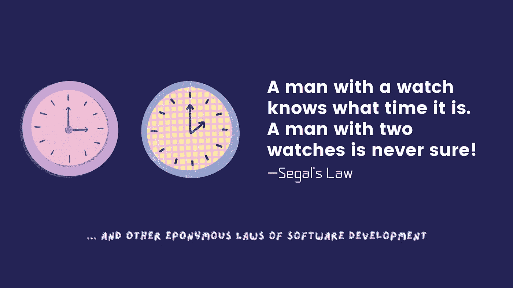

# 人人都爱忽视的 35 条软件开发法则

> 原文：<https://towardsdatascience.com/35-software-development-laws-everyone-loves-to-ignore-5ebba515852d?source=collection_archive---------9----------------------->

## 与 IT 相关的原则、格言和其他智慧的集合…

作者图片

软件开发是由范例和原则组织起来的终极学科，这些范例和原则不仅与编码实践和标准相关联，还与人类心理学的基本方面相关联，关注于实现平衡的软件开发过程。尽管我们将它们命名为与科学定律同名的定律，但它们是已经被证明是真实的观察结果，它们讽刺的本质使它们令人难忘——T2 墨菲定律是一个众所周知的例子，但还有很多这样的定律。

在这篇文章中，我根据我迄今为止的职业生涯，整理了一些我最感兴趣的。

# 论技术

*“我们倾向于高估一项技术的短期效果，而低估其长期效果”
—* ℝ𝕠𝕪 𝔸𝕞𝕒𝕣𝕒

*“任何足够先进的技术都无法与魔法区分开来”
——*ℂ𝕝𝕒𝕣𝕜𝕖'𝕤𝕋𝕙𝕚𝕣𝕕𝕃𝕒𝕨

*“机构会努力保存它们所解决的问题”*
— ℂ𝕝𝕒𝕪 𝕊𝕙𝕚𝕣𝕜𝕪

*“这个行业很奇怪:我们不仅没有从错误中吸取教训，也没有从成功中吸取教训”*
——𝕂𝕖𝕚𝕥𝕙𝔹𝕣𝕒𝕚𝕥𝕙𝕨𝕒𝕚𝕥𝕖

# 关于编程

*“提高资源使用的效率，就提高了该资源的使用率”*
— 𝕁𝕖𝕧𝕠𝕟'𝕤 ℙ𝕒𝕣𝕒𝕕𝕠𝕩

*“如果你把一堆乱七八糟的东西自动化，你就会得到一堆自动化的乱七八糟的东西”*
——ℝ𝕠𝕕𝕄𝕚𝕔𝕙𝕒𝕖𝕝

*“一个好的程序员总是在穿过单行道之前先看两边”*
——𝔻𝕠𝕦𝕘𝕃𝕚𝕟𝕕𝕖𝕣

*“任何你自己的代码，如果你已经有六个月或者更长时间没有看，那也可能是别人写的”*
——𝔼𝕒𝕘𝕝𝕖𝕤𝕠𝕟'𝕤𝕃𝕒𝕨

*“一个人的蹩脚软件是另一个人的全职工作”*
— 𝕁𝕖𝕤𝕤𝕚𝕔𝕒 𝔾𝕒𝕤𝕥𝕠𝕟

# 关于编写无错误代码

*“最便宜、最快、最可靠的组件是那些不存在的”*
— 𝔾𝕠𝕣𝕕𝕠𝕟 𝔹𝕖𝕝𝕝

*“如果调试是清除软件 bug 的过程，那么编程一定是把 bug 放进去的过程”*
— 𝔼𝕕𝕤𝕘𝕖𝕣 𝔻𝕚𝕛𝕜𝕤𝕥𝕣𝕒

*【删除的代码是调试过的代码】*
— 𝕁𝕖𝕗𝕗 𝕊𝕚𝕔𝕜𝕖𝕝

*“虫子潜伏在角落，聚集在边界”*
——𝔹𝕠𝕣𝕚𝕤𝔹𝕖𝕚𝕫𝕖𝕣

*“有两种方法可以写出没有错误的程序；*
——𝔸𝕝𝕒𝕟ℙ𝕖𝕣𝕝𝕚𝕤只有第三部作品

# 浅谈建筑与设计

 *—𝕃𝕒𝕣𝕣𝕪ℂ𝕠𝕟𝕤𝕥𝕒𝕟𝕥𝕚𝕟𝕖“雇人写代码来推销并不等同于雇人设计和构建持久、可用、可靠的软件”*

**“设计最难的部分是……把特征挡在外面”*
— 𝔻𝕠𝕟𝕒𝕝𝕕 ℕ𝕠𝕣𝕞𝕒𝕟*

**“一个建立在脆弱架构之上的软件系统，会因为自身成功的重量而沉没”*
——𝕋𝕙𝕖𝔸𝕣𝕔𝕙𝕚𝕞𝕖𝕕𝕖𝕒𝕟ℙ𝕣𝕚𝕟𝕔𝕚𝕡𝕝𝕖*

**“在软件可以重用之前，它首先必须是可用的”*
——ℝ𝕒𝕝𝕡𝕙𝕁𝕠𝕙𝕟𝕤𝕠𝕟*

**“一个有效的复杂系统总是被发现是从一个有效的简单系统进化而来的”*
——𝔾𝕒𝕝𝕝'𝕤𝕃𝕒𝕨*

# *根据要求*

**“在水面上行走和从一个规范开发软件都很容易，如果两者都冻结了”*
— 𝔼𝕕𝕨𝕒𝕣𝕕 𝔹𝕖𝕣𝕒𝕣𝕕*

**“用户永远也不会知道他们想要什么，直到系统投入生产之后(甚至可能那时都不知道)”*
——ℍ𝕦𝕞𝕡𝕙𝕣𝕖𝕪'𝕤𝕃𝕒𝕨*

**“改变规格以适应程序比反之更容易”*
— 𝔸𝕝𝕒𝕟 ℙ𝕖𝕣𝕝𝕚𝕤*

**“一个需求被认为越稳定，它被改变的概率就越大”*
—ℍ𝕖𝕚𝕤𝕖𝕟𝕓𝕖𝕣𝕘'𝕤ℙ𝕣𝕚𝕟𝕔𝕚𝕡𝕝𝕖*

**“增加选择的数量会对数地增加决策时间”*
— ℍ𝕚𝕔𝕜'𝕤 𝕃𝕒𝕨*

*“有手表的人知道现在是什么时候。一个有两只手表的人永远不会确定”
— 𝕊𝕖𝕘𝕒𝕝'𝕤 𝕃𝕒𝕨*

# *关于评估和时间管理*

**“前 90%的代码占了开发时间的前 90%。剩下的 10%代码占了另外 90%的开发时间”*
— 𝕋𝕠𝕞 ℂ𝕒𝕣𝕘𝕚𝕝𝕝*

**“从现在到项目完成的时间趋于恒定”*
— ℍ𝕒𝕣𝕥𝕣𝕖𝕖'𝕤 𝕃𝕒𝕨*

**“工作扩大以填补其完成的可用时间”*
— ℙ𝕒𝕣𝕜𝕚𝕟𝕤𝕠𝕟'𝕤 𝕃𝕒𝕨*

**“它总是比你想象的要长，即使你考虑到霍夫斯塔德定律”*
——ℍ𝕠𝕗𝕤𝕥𝕒𝕕𝕥𝕖𝕣'𝕤𝕃𝕒𝕨*

**“时间永远不够做好，但总有足够的时间重做”*
——𝕁𝕒𝕔𝕜𝔹𝕖𝕣𝕘𝕞𝕒𝕟*

# *浅谈项目管理*

**“给一个迟到的软件项目增加人力会让它迟到”*
—𝔹𝕣𝕠𝕠𝕜𝕤'𝕤 𝕃𝕒𝕨*

**“许多现象 80%的后果源于 20%的原因”*
—ℙ𝕒𝕣𝕖𝕥𝕠 ℙ𝕣𝕚𝕟𝕔𝕚𝕡𝕝𝕖*

 **“没有什么东西能按时或在预算内建成”———ℂ𝕙𝕖𝕠𝕡𝕤𝕃𝕒𝕨**

***“任何可能出错的事情都会出错”*
——𝕄𝕦𝕣𝕡𝕙𝕪'𝕤𝕃𝕒𝕨**

***“我一直发现，计划无用，但计划必不可少”*
— 𝔻𝕨𝕚𝕘𝕙𝕥 𝔼𝕚𝕤𝕖𝕟𝕙𝕠𝕨𝕖𝕣**

**软件开发社区大量创建和接受同名法律。我希望你喜欢反思这个集合。**

**感谢阅读！**

***我经常在媒体上写关于领导力、技术&的数据——如果你想阅读我未来的帖子，请*[*‘关注’我*](https://medium.com/@semika) *！***