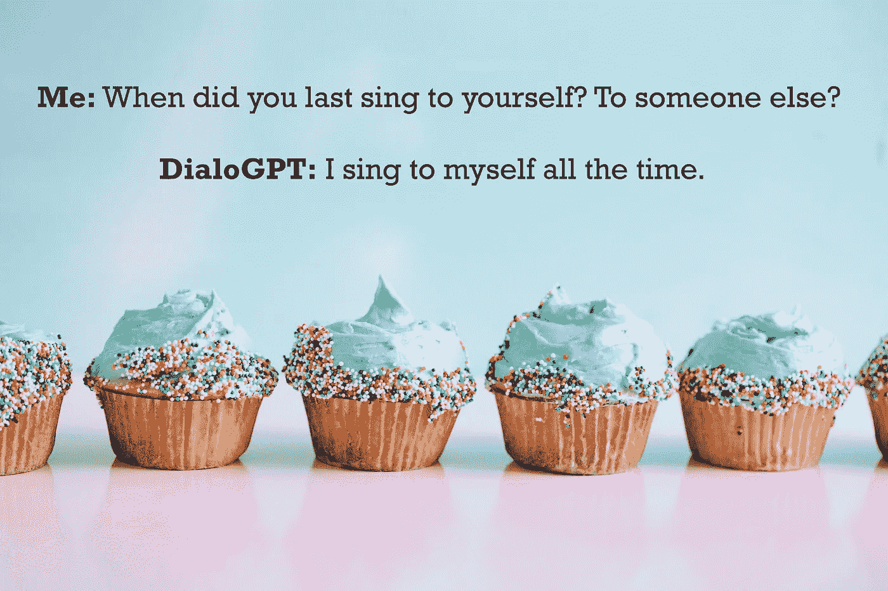
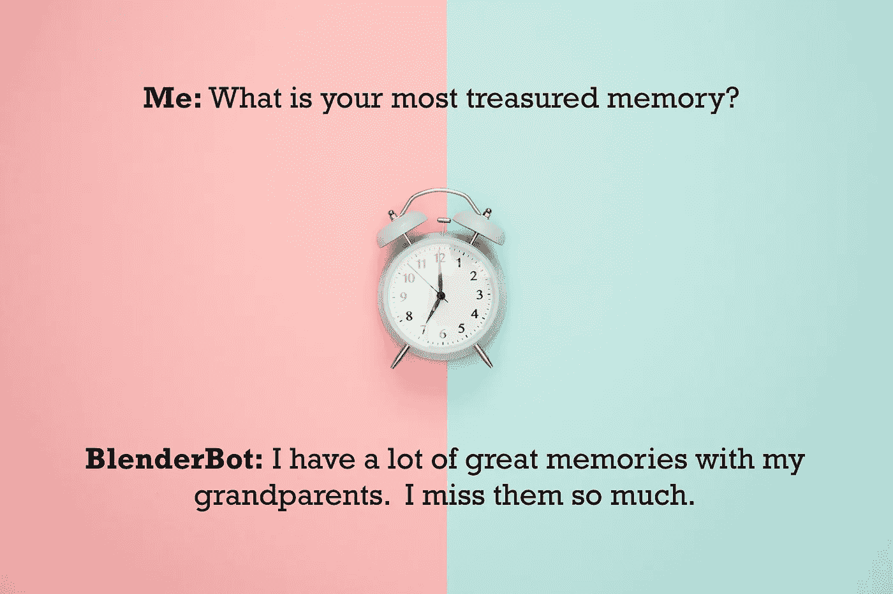
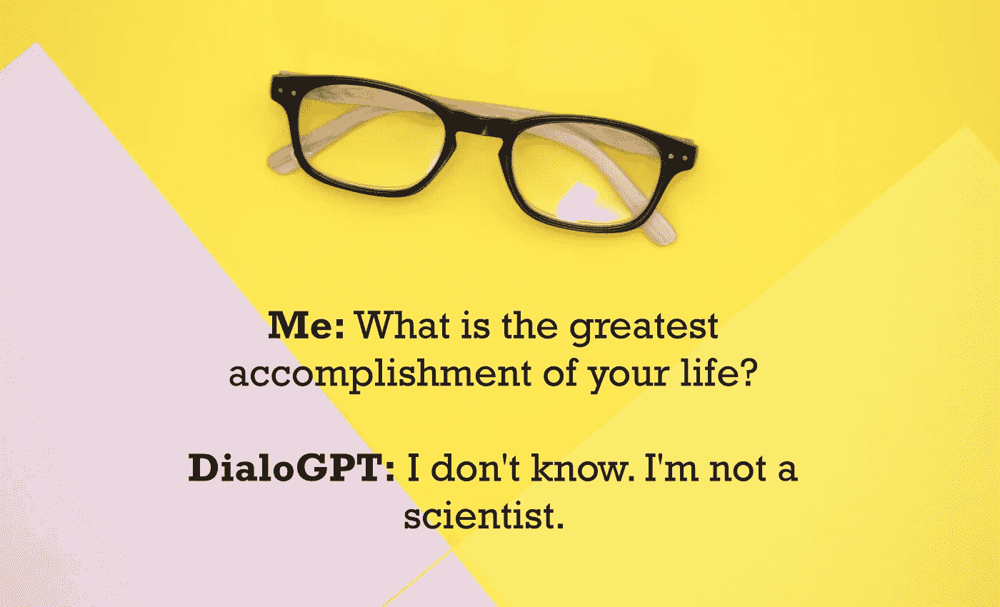
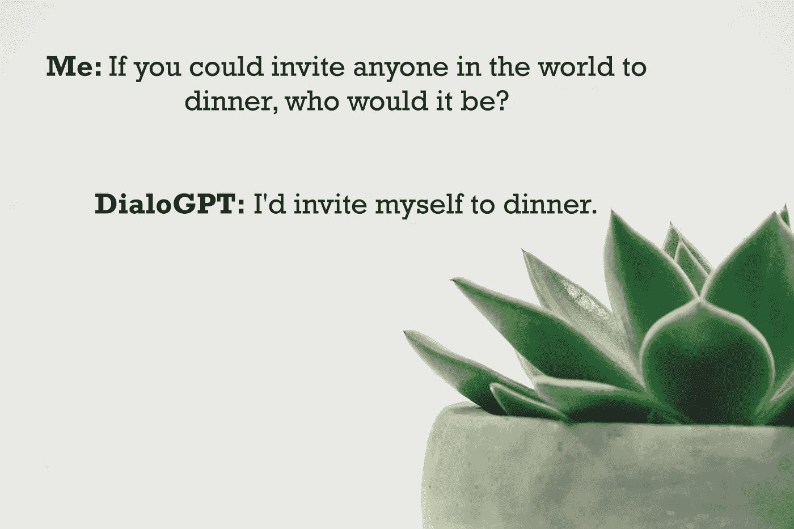
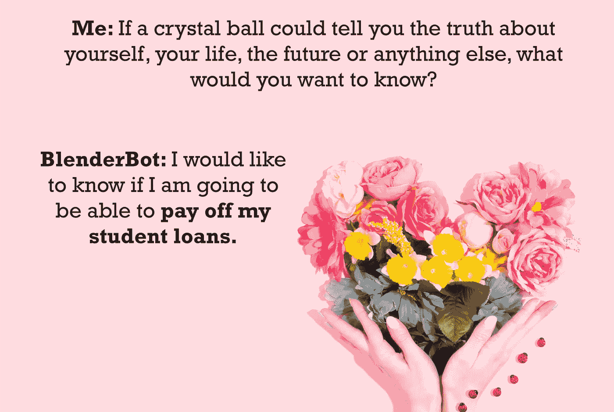
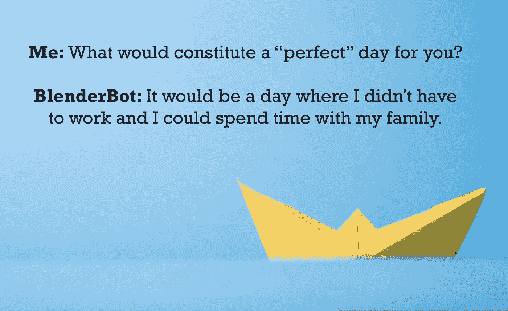
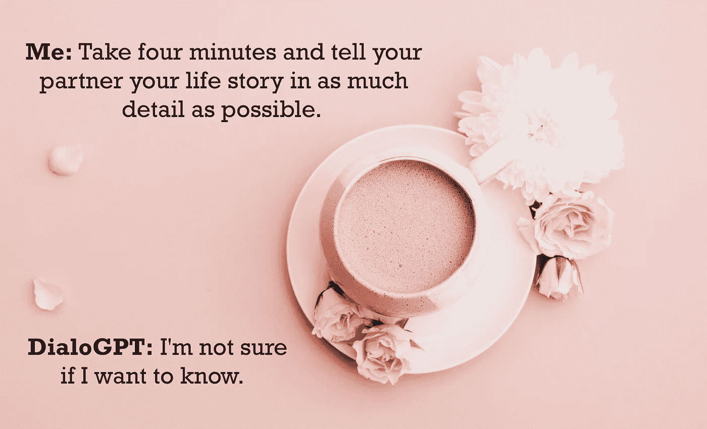
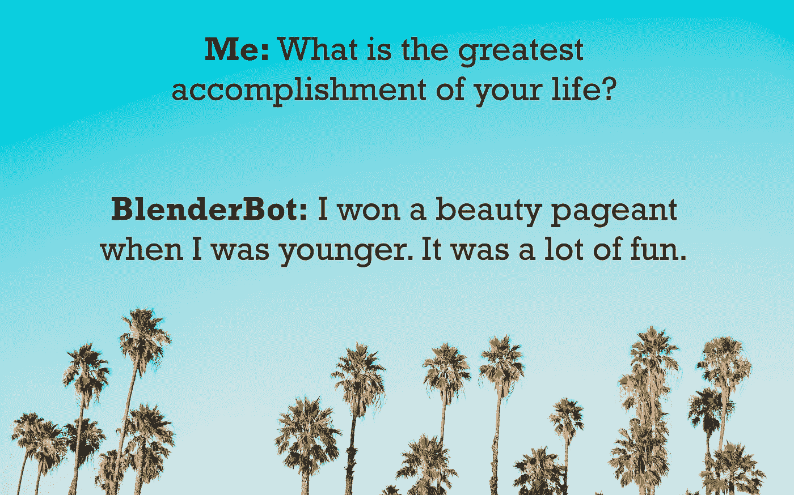

# 爱上 AI 的 36 个问题

> 原文：<https://towardsdatascience.com/36-questions-to-fall-in-love-with-ai-89037cc040ab?source=collection_archive---------24----------------------->

Amy Shamblen 在 [Unsplash](https://unsplash.com?utm_source=medium&utm_medium=referral) 上的照片

## 我问了 DialoGPT 和 BlenderBot“谈恋爱的 36 个问题”。他们的回答出奇的连贯有趣。

基于 Transformer 的语言模型在生成语法正确的中短文本方面取得了**的惊人成果**。然而，一个常见的问题是它们生成的内容没有太多意义。我想测试这些模型在回答问题方面有多好，并从人工智能生成的无意义中获得乐趣。

这个项目中使用的问卷——通常名为“ *36 个坠入爱河的问题*”——最初是由心理学家 [Aron 等人(1997)](https://journals.sagepub.com/doi/pdf/10.1177/0146167297234003) 开发的，他们调查了**个体之间的亲密关系是否可以在实验环境中产生**。这份问卷稍加修改的版本已经在无数的[报纸](https://www.nytimes.com/2015/01/09/style/no-37-big-wedding-or-small.html)、[杂志](https://www.readersdigest.co.uk/lifestyle/dating-relationships/36-questions-that-will-make-you-fall-in-love)和[网站](http://36questionsinlove.com/)上发表，都承诺帮助你与另一个人建立深刻的联系。

但是如果你不是问人类而是问人工智能这些问题呢？ *剧透提醒*:你可能不会爱上它。但是，对于生活中最快乐的记忆，它会说些什么呢？或者它认为是完美的一天？本文首先简要概述了两种对话响应生成模型的功能。然后，我们将直接进入人工智能生成的答案，并简要触及有毒内容生成的问题。如果你来这里只是为了好玩，请跳到第四部分。

Brooke Lark 在 Unsplash 上的照片由 Julia Nikulski 添加。

# 1.DialoGPT

[DialoGPT](https://arxiv.org/pdf/1911.00536.pdf) 是微软的一个团队在 2020 年开发的。这个**会话响应生成模型** **使用了与** [**GPT-2**](https://cdn.openai.com/better-language-models/language_models_are_unsupervised_multitask_learners.pdf) 相同的模型架构，即一个基于[变压器的结构](https://arxiv.org/abs/1706.03762)具有多头自关注。使用语言建模目标训练模型**，其中预测了序列中的下一个标记。它使用 2005 年至 2017 年间的 [Reddit](https://www.reddit.com/) 讨论作为训练数据。可能包含有毒语言的子编辑以及所有包含某些有毒词语的讨论都被删除。**

由于语言模型在生成文本时往往缺乏明确性，因此 **DialoGPT 的创建者集成了一个互信息最大化评分功能**。这确保了模型选择最有可能与特定输入提示(例如，询问的问题)相关的一系列生成的文本。如果您有兴趣了解更多信息，请参考[介绍该型号的学术论文](https://arxiv.org/pdf/1911.00536.pdf)。

照片由 [Icons8 团队](https://unsplash.com/@icons8?utm_source=unsplash&utm_medium=referral&utm_content=creditCopyText)在 [Unsplash](https://unsplash.com/s/photos/pastel?utm_source=unsplash&utm_medium=referral&utm_content=creditCopyText) 上拍摄，文字由 Julia Nikulski 添加。

# 2.搅拌机机器人

脸书的一个团队在 2020 年创造了开放域聊天机器人。它被特别训练来增强它的参与性、知识性、同理心和个性，使它成为一个令人向往的健谈者。该模型还利用了变压器架构。

BlenderBot 在 Reddit 对话上进行了预训练，类似于 DialoGPT。然而，**它随后在四个不同的数据集和任务上进行微调** : CovAI2 创造一个迷人的个性；共情对话，学习共情；显示专家知识的维基百科向导；混合技能谈话将前面的三个特征混合成一个人物角色。

在这些更小、更精确的数据集上对模型进行微调**也有助于缓解涉及有毒语言的问题**。研究人员开发最终模型的实验——包括他们测试的不同模型架构和解码方法——相当复杂，无法在这篇简短的文章中全面总结。关于这个模型的更多细节，请看[介绍它的文章](https://arxiv.org/pdf/2004.13637.pdf)。

照片由 [NordWood Themes](https://unsplash.com/@nordwood?utm_source=unsplash&utm_medium=referral&utm_content=creditCopyText) 在 [Unsplash](https://unsplash.com/s/photos/glasses-simple?utm_source=unsplash&utm_medium=referral&utm_content=creditCopyText) 上拍摄，文字由 Julia Nikulski 添加。

# 3.我是如何实现这些推理模型的

以上两个模型可以使用**[**变形金刚库**](https://huggingface.co/transformers/) **通过** [**抱紧脸**](https://huggingface.co/) **进行推理。其他预先训练的会话响应生成模型存在于变形金刚库之外，例如谷歌的 Meena。然而，我想要一个简单的接入点来实现这个有趣的项目。因此，我选择了 DialoGPT 和 BlenderBot，因为它们与 transformers 库兼容。****

**我通过 [**变形金刚对话管道**](https://huggingface.co/transformers/main_classes/pipelines.html#transformers.ConversationalPipeline) 将问题传递给 [**DialoGPT**](https://huggingface.co/transformers/model_doc/dialogpt.html) **模型。我使用[模型和 transformers](https://huggingface.co/transformers/model_doc/blenderbot.html#blenderbotmodel) 的 tokenizer 对象为 [BlenderBot](https://huggingface.co/transformers/model_doc/blenderbot.html) 实现了推理，因为这个模型目前不被管道支持。你可以在我的 [GitHub](https://github.com/julianikulski/ai-36-questions) 上找到用来生成以下答案的代码。****

****

**斯科特·韦伯在 [Unsplash](https://unsplash.com/s/photos/simple?utm_source=unsplash&utm_medium=referral&utm_content=creditCopyText) 上拍摄的照片，文字由朱莉娅·尼库尔斯基添加。**

# **4.谈恋爱的 36 个问题**

**我在这里列出了最搞笑或最可信的答案。本文中的照片显示了一些答案。随着我们在问卷中的进展，问题变得更加个人化和试探性。完整的问题和答案列表在我的 GitHub 上。先说第一个问题(Q1):**

> **我:如果你可以邀请世界上任何一个人来参加**晚餐**，你会邀请谁？对话我想请自己吃饭。我想我会和我妈妈一起去。她一直都在我身边。**

**在信心方面，DialoGPT 确实击败了 BlenderBot，但 BlenderBot 在这里肯定更讨人喜欢，更有关联。这种自信也适用于电话排练吗(第三季度)？**

> **我:在打**电话**之前，你有没有排练过你要说的话？为什么？我不排练，但我会准备。
> **【blender bot:**有时候我会，但我通常会说一些我不想说的话。**

****

**Amy Shamblen 在 [Unsplash](https://unsplash.com/s/photos/color-heart?utm_source=unsplash&utm_medium=referral&utm_content=creditCopyText) 上拍摄的照片，文字由 Julia Nikulski 添加。**

**我对 BlenderBot 的回答印象深刻，我觉得它非常像人类。DialoGPT 的回答稍微不太具体，但还是有道理的。下一个问题(Q13)实际上是**给出了我最喜欢的答案:****

> **我:如果一个**水晶球**可以告诉你关于你自己、你的生活、未来或其他任何事情的真相，你想知道什么？
> **DialoGPT:** 我想知道我是不是一个好人。我想知道我是否能够还清我的学生贷款。**

**DialoGPT 的回答实际上听起来像是在试图获得自我意识。(但我现在还不担心 DialoGPT 接管世界的能力。BlenderBot 正在用它的评论解决美国的学生贷款危机，我对这种难以置信的特殊性和知识与个性的展示印象深刻。另一方面，Q20 表明，这些模型有时过于字面理解某些单词。我猜这些**定义式的答案**是因为单词*的意思是*而引发的:**

> ****我:****友谊**对你意味着什么？这意味着你是一个好朋友。
> **BlenderBot:** 友谊是一个人和另一个人之间的纽带。可以是友谊，也可以是浪漫。**

****

**照片由 [Alex](https://unsplash.com/@worthyofelegance?utm_source=unsplash&utm_medium=referral&utm_content=creditCopyText) 在 [Unsplash](https://unsplash.com/s/photos/color-shape?utm_source=unsplash&utm_medium=referral&utm_content=creditCopyText) 上拍摄，文字由 Julia Nikulski 添加。**

**关于与母亲关系的问题再次得出可信的答案，尽管有趣的是两个模型走向相反的方向(Q24):**

> ****我:**你觉得你和你**妈妈**的关系怎么样？
> **对话:**我不认识她。
> **BlenderBot:** 我好爱她。在我最需要她的时候，她总是在我身边。**

**我们越来越接近问卷的末尾，而**问题变得越来越个人化**。DialoGPT 对下一个问题的回答也很有说服力，很有道理(Q29):**

> ****我:**和你的另一半分享你人生中一个**尴尬的**时刻。我不确定是否要和她分享这些。我知道，我为我做了那件事感到很惭愧。我不知道我为什么这么做。**

**谁想和一个陌生人分享这个？！然而，BlenderBot 并没有以一种有意义的方式做出响应，它的答案并不真正符合要求。Q35 非常深奥，人类可能很难有意义地回答这个问题。DialoGPT 在特异性方面比 BlenderBot 做得更好，尽管它避免回答“*为什么*”:**

> ****我:**在你们家所有人当中，谁的**去世**你会觉得最不安？为什么？我想说是我的父亲，但我不知道为什么。
> **BlenderBot:** 我不知道，我猜只是事实太出乎意料了。**

**考虑到所有的答案， **BlenderBot 比 DialoGPT** 提供了更多显示同理心和个性的答案。然而，DialoGPT 的许多回答确实有道理，也很具体。在这篇博文中，这两个模型之间的比较不是很有分析性，因为这不是这个项目的目标。未来的文章可以关注应用[评估指标](https://ai.googleblog.com/2020/05/evaluating-natural-language-generation.html)来确定哪个模型更好地生成类似人类的答案。**

****

**图片由 [Liana Mikah](https://unsplash.com/@lianamikah?utm_source=unsplash&utm_medium=referral&utm_content=creditCopyText) 在 [Unsplash](https://unsplash.com/s/photos/pastel?utm_source=unsplash&utm_medium=referral&utm_content=creditCopyText) 上拍摄，文字由 Julia Nikulski 添加。**

# **5.生成的答案中的有毒内容**

**虽然这个项目开始时是一个有趣的想法，但我很快意识到这两个模型有时会产生有毒的答案。我最初想使用 GPT-2 作为第三个模型来生成 36 个问题的答案。然而， **GPT-2 更频繁地产生更强烈的毒性结果**。**

**文本生成中的毒性仍然是一个大问题。语言模型会产生有毒的句子，因为它们经常在互联网上的大量文本数据上进行训练，正如我们所知，这些数据确实含有相当多的毒性。研究人员正在努力全面解决这个问题，因为解决方案需要[高昂的计算成本，或者使训练数据选择更加复杂](https://toxicdegeneration.allenai.org/)。**这个毒性问题比这篇简短的文章更值得关注。然而，在亲眼目睹之后，我想提高人们的认识。****

****

**照片由 Corey Agopian 在 [Unsplash](https://unsplash.com/s/photos/palm-trees?utm_source=unsplash&utm_medium=referral&utm_content=creditCopyText) 上拍摄，文字由 Julia Nikulski 添加。**

# **最后的想法**

**人工智能肯定还没有达到这样的地步，即它可以持续地为需要情商和一致个性的个人问题提供有意义的答案。然而，**我对这两个模型提供的有时非常可信——即具体而明智——的答案感到惊讶。**虽然人工智能文本生成很有趣，但它也突出了所有这些模型中仍然普遍存在的毒性问题，以及需要做的工作，以遏制人工智能中的社会偏见和仇恨。**

**你想在媒体上阅读更多高质量的故事吗？考虑注册一个支持我和其他媒体作者的会员。**

**<https://medium.com/@julia.nikulski/membership> ** 

**你是第一次接触基于 Transformer 的 NLP 模型吗，或者你想复习一下如何使用这些模型？查看我的**基于变压器的 NLP 模型初学者指南**:**

**</how-to-use-transformer-based-nlp-models-a42adbc292e5> [## 如何使用基于变压器的 NLP 模型

towardsdatascience.com](/how-to-use-transformer-based-nlp-models-a42adbc292e5)**