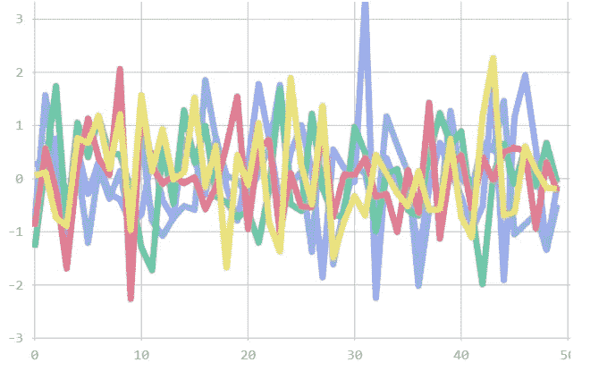
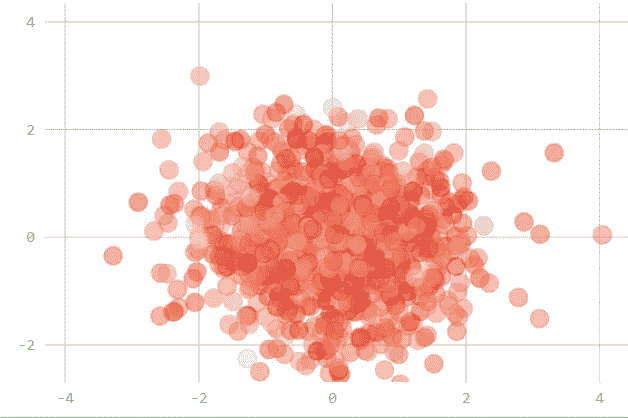
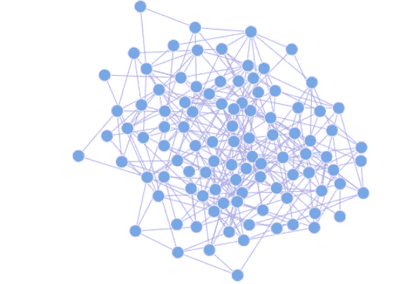

# 三维交互式数据可视化

> 原文：<https://towardsdatascience.com/3d-interactive-data-visualization-45912b0e5685?source=collection_archive---------26----------------------->

## 使用 Lightning 创建高度互动的可视化效果


来源:作者

数据可视化有助于分析数据中肉眼不可见的隐藏模式。它有助于理解数据行为和数据关联。有各种各样的可视化工具可用于分析数据，如条形图、散点图等。

交互式可视化有助于生成更多见解，因为我们可以放大或缩小可视化，还可以控制不同的数据点。它给观众带来视觉上的冲击。强烈建议在演示中使用这些可视化效果。

Lightning 是一个开源的 Python 库，用于创建高度交互和有用的数据可视化。它提供了我们可以创建的各种各样的图表和绘图。

在这篇文章中，我们将探索闪电并使用它创建一些可视化。

让我们开始吧…

# 安装所需的库

我们将从使用 pip 安装来安装 Lightning 开始。下面给出的命令将使用 pip 安装 Lightning。

```
pip install lightning
```

# 导入所需的库

在这一步中，我们将导入创建可视化所需的所有库。

```
from lightning import Lightning
from numpy import random
```

# 创建图表

现在，我们将从创建一些图表开始，并探索如何创建这些图表。为了创建可视化，我们将使用随机函数创建我们自己的数据。

在创建可视化之前，我们需要初始化闪电。

1.  **折线图**

```
series = random.randn(5, 50)
lgn.line(series)
```



来源:作者

2.**散点图**

```
x = random.randn(1000)
y = random.randn(1000)
v = random.randn(1000)lgn.scatter(x, y, alpha=0.5, values=v, colormap='Reds')
```



来源:作者

3.**网络图**

```
mat = random.rand(100,100)
mat[mat<0.97] = 0lgn.force(mat)
```



来源:作者

4.**地理地图**

```
states = ["NA", "AK", "AL", "AR", "AZ", "CA", "CO","CT",
          "DC","DE","FL","GA","HI","IA","ID","IL","IN",
          "KS","KY","LA","MA","MD","ME","MI","MN","MO",
          "MS","MT","NC","ND","NE","NH","NJ","NM","NV",
          "NY","OH","OK","OR","PA","RI","SC","SD","TN",
          "TX","UT","VA","VI","VT","WA","WI","WV","WY"]
values = random.randn(len(states))lgn.map(states, values, colormap='Greens')
```


来源:作者

在这里，您可以清楚地看到我们使用 Lightning 创建的不同图表和绘图。所有这些图表都具有高度的交互性和视觉吸引力。尝试使用不同的数据集，创建不同的可视化效果，并在回复部分告诉我您的意见。

本文是与 [Piyush Ingale](https://medium.com/u/40808d551f5a?source=post_page-----45912b0e5685--------------------------------) 合作的。

# 在你走之前

***感谢*** *的阅读！如果你想与我取得联系，请随时通过 hmix13@gmail.com 联系我或我的* [***LinkedIn 个人资料***](http://www.linkedin.com/in/himanshusharmads) *。可以查看我的*[***Github***](https://github.com/hmix13)**简介针对不同的数据科学项目和包教程。还有，随意探索* [***我的简介***](https://medium.com/@hmix13) *，阅读我写过的与数据科学相关的不同文章。**