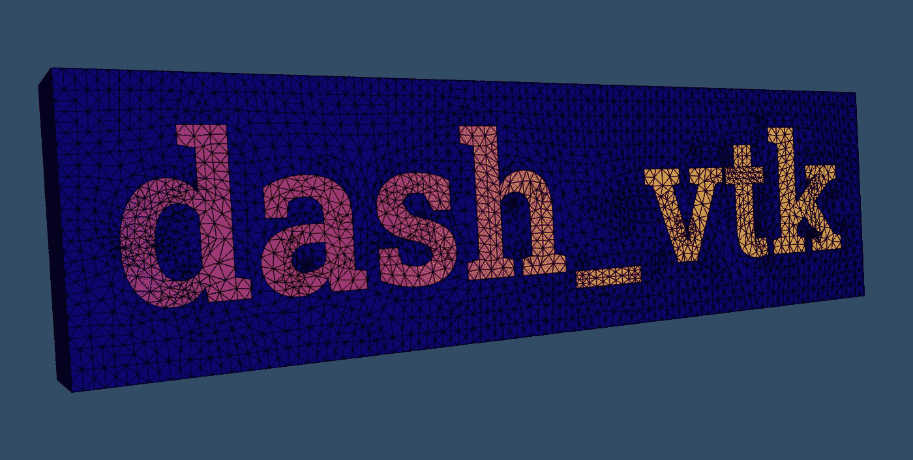
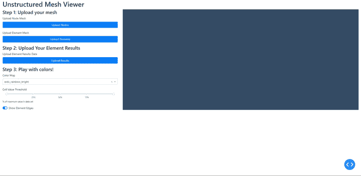

# 使用 python & dash_vtk 在浏览器中创建三维网格模型

> 原文：<https://towardsdatascience.com/3d-mesh-models-in-the-browser-using-python-dash-vtk-e15cbf36a132?source=collection_archive---------12----------------------->

## 使用 python 和 Dash、pyvista 和 dash_vtk 库在浏览器中导入和查看非结构化网格数据的快速示例



看，妈妈！没有彩虹的网！

# **简介**

[Python](https://www.python.org/) 无需真正介绍。它很成熟，有很多强大的库，易于阅读和编码。 [Plotly 的 Dash](https://dash.plotly.com/introduction) 框架是一种仅使用 python 开发 web 应用程序的简单易用的方式。 [VTK](https://vtk.org/about/#overview) 是一个带有 python 端口的成熟 C++ 3D 库，而 [VTK.js](https://vtk.org/flavors/#web) 是为利用 webGL 的浏览器重新实现的 VTK。VTK & Plotly 最近宣布发布 [dash_vtk](https://github.com/plotly/dash-vtk) 并举办[网络研讨会](https://go.plotly.com/dash-vtk)展示它能做什么。

几年前，我涉足 VTK-python，使用 pyQt 构建了几个应用程序，可以显示和切片结构有限元分析网格和结果。最近，我一直在使用 Dash 将许多与分析相关的工具或数据库整合到网络应用中。为什么？对于初学者来说，更容易得到一些互动和好看的东西。长相可能不是一切，但肯定是有意义的！网络应用程序也更容易控制和更新(没有旧的副本四处浮动)，Plotly 图形库看起来很好，没有太多的调整。

这个新工具集缺少的一点是良好的 3D 可视化。Plotly 有一些功能，我还过得去，但它有点缺乏 3D 模型支持。所以当我听说 dash_vtk 的时候我很兴奋！我可以将我的 3D 结果整合到一些新的应用程序中，除了…..对于 vtk 所说的*非结构化网格*，我没有看到太多的支持或讨论。*非结构化网格*是由不同元素类型&形状(六面体、四面体、四边形等)组成的普通 3D 网格，网格距离不一定是规则的，任何网格中可以混合元素形状。这是在一般物理零件的结构分析中使用的最常见(如果不是唯一)的网格类型。所以我决定试试能否将我所记得的以前与 VTK(通过 python)一起工作的一点点经验应用到 dash_vtk 中。

本文将介绍如何创建一个 Dash web 应用程序，它允许用户上传网格文件(节点和元素数据)并查看结果。为了保持它相对简短和集中，我将假设读者对 Dash 有些熟悉。如果没有，查看官方的 [Dash 教程](https://dash.plotly.com/installation)和文档，上面有很多例子。

下面是 gif 图片，展示了应用程序的运行。[这里是 github 回购](https://github.com/shkiefer/dash_vtk_unstructured)的链接。



旋转模型！呜呜呜。

# 欢迎 Pyvista！

VTK 不是一个超级用户友好的图书馆，至少对我这样的新手来说是这样。有演员，地图绘制者，控制器，各种各样的对象需要被创建和连接，以便能够显示和交互一些 3D 数据。在开始探索 dash_vtk 后不久，我找到了 [pyvista 库](https://docs.pyvista.org/index.html)(很容易找到，在 dash_vtk 文档中提到了很多)。Pyvista 要么在我最后一次使用 VTK 时不存在，要么就是我没有找到它。我很高兴它的存在，我真诚地感谢开发者。这使得使用 VTK 对象变得更加容易和熟悉。

引用 pyvista 文档:

> PyVista 是…
> 
> *“人类的 VTK”*:可视化工具包[的高级 API(VTK)](https://vtk.org/)
> 
> 空间数据集的网格数据结构和过滤方法
> 
> 3D 绘图变得简单，专为大型/复杂数据几何图形而构建

# 将网格和结果引入 VTK

将非结构化网格从其他工具导入 VTK 的基本工作流程是:

1.  导出相对于公共坐标系的格网 id 和位置
2.  导出元素 id 和关联的节点
3.  将节点排序/元素拓扑映射为 VTK 顺序
4.  重新编号/重新索引，以便元素和网格 id 与其各自列表中的索引位置相匹配

要将任何其他源网格转换为 VTK，您需要知道元素节点排序和连接。您将需要重新排列分配给每个元素的网格，以便它们按照 VTK 期望的顺序排列，否则您将得到扭曲的元素。没有人想要扭曲的元素。这些链接显示了 VTK 订购:

1.  [点、线、&线状要素](https://raw.githubusercontent.com/Kitware/vtk-examples/gh-pages/src/Testing/Baseline/Python/GeometricObjects/TestLinearCellDemo.png)
2.  [二次+元素](https://raw.githubusercontent.com/Kitware/vtk-examples/gh-pages/src/Testing/Baseline/Cxx/GeometricObjects/TestIsoparametricCellsDemo.png)

## 从 Ansys Mechanical 中获取网格数据

我使用 [Ansys Mechanical](https://www.ansys.com/products/structures/ansys-mechanical) 进行大部分的结构分析。它不是开源的，也绝对不便宜。如果您不使用它和/或不关心我如何获取数据，请随意跳过这一部分。这不是主要的焦点，所以我会很简短。从 Ansys mechanical 导出数据的步骤如下:

1.  创建一个名为“选择”的节点，其中包含所需零件/实体的所有节点。一个名为选择的*工作表* *可以帮助将实体转换为节点。*
2.  对元素重复步骤 1
3.  右键单击这些*命名选择*，并选择*导出测试文件*
4.  创建一个具有相同感兴趣主体的结果对象。一旦求解完成，右击并再次*导出文本文件*

下面是这个应用程序设置处理的每个文件的前几行。

## 该功能

我们将使用`[dcc.Upload](https://dash.plotly.com/dash-core-components/upload)`组件允许用户上传文件到网络应用程序。当使用这些组件时，文件对象作为 base64 字符串传递，并且必须被解码。一旦解码，它们可以被添加到一个`io.StringIO`对象中，并像文件名一样使用。我在回调函数之外创建了一个函数来处理 base64 字符串数据，并将其转换为可以与 dash_vtk 一起使用的 VTK / pyvista 对象。

下面是一个函数的简化版本，它的主要工作是将我们的网格数据转换成 VTK 格式。我们走一遍吧！

该函数至少需要 2 个文件来创建网格，还需要一个结果文件。让我们从创建网格开始。在前几行中，我们将 base64 字符串解码并读入一个 [Pandas](https://pandas.pydata.org/) Dataframe。在第 7–10 行，我们正在重新索引，以便节点 id 与节点列表中的位置相匹配，但允许在开始处有一个偏移。如果网格(或正在处理的部分)不连续，这有助于保持从节点到单元和结果的对齐。

请参见 repo 以转换和重新索引 base64 对象中的元素数据。我们还需要定义每个元素的节点数，对于这些数据，我们可以从元素名称中提取(例如 Tet10)。

在这个要点的第 18 行，我们有一个将元素名映射到 VTK 元素类型的字典。这些键特定于 Ansys Mechanical 导出，您可以用您的工具 FE 工具命名的元素类型来替换它们。在第 25 行，我们执行到元素数据帧的映射，并删除任何没有被映射的元素。此时，我们有了一个节点数据框架和元素数据框架，并使用我们需要的所有信息进行了重新索引。

在第 28 行，我们将需要的节点数据帧部分转换成只包含 XYZ 位置的 2D numpy 数组。对于元素，我们需要一个单独的数组，只包含 VTK 元素类型:`cell_types`。接下来，我们将元素 dataframe 的节点 id 部分转换为 numpy 数组，并减去最小的网格 id。这也是由于 VTK 使用位置作为映射，而不是显式 id。然后我们将每个元素的节点数放在修改后的节点标识数组前面，得到一个 2D 数组:

```
[
[n_nodes, node_index_1, node_index_2, node_index_3....],
[n_nodes, node_index_1, node_index_2, node_index_3....],
...
]
```

Pyvista 希望这是一个扁平的列表，所以我们在第 37 行使用了`ravel()`。如果您的网格是不同元素类型(具有不同数量的节点)的混合，那么您将在该数组中拥有 nan。我们在第 39 行删除它们，然后转换成`int`并将它们(连同点数组和单元格类型列表)传递给 pyvista 的 UnstructuredGrid 函数。Pyvista 让我们可以轻松地使用 numpy 数组，而不必转换成 VTK 数据对象。我们现在有了一个非结构化的网格对象！

现在我们需要添加元素结果。

这个要点是从上一个停止的地方开始的。我们有一个`uGrid`非结构化网格物体。如果对这个函数的调用包含一个结果文件，那么我们就进入这个逻辑块，将结果添加到网格中。

该要点的第 2–12 行从`base64`对象导入数据，并重新索引以再次将结果映射到列表中的适当位置，这样位置和相关的元素 id 是相同的。这里我们用 0.0 填充缺失的值。然后我们转换成一个 numpy 数组。第 15 行是我们可以看到 pyvista 易用性的地方，只需给`uGrid`对象一个名字(这里我用的是`‘my_array’`)并传递 numpy 数组！很简单。我们返回`uGrid`对象和 colorscale 的最小/最大数据范围(或默认值)。

现在我们有了一个可以返回 pyvista UnstructuredGrid 对象(有或没有结果)的函数，然后我们可以将它传递给 dash_vtk！是时候布局应用了。

# 布局应用程序

我真的很喜欢用 d[ash _ bootstrap _ components](https://dash-bootstrap-components.opensource.faculty.ai/)来布局我的应用。这使得它们看起来很漂亮，只需要很少的工作。非常感谢那些开发者！

这个应用程序分为两个主要部分。左边是 upload & UI 组件，右边是 dash_vtk 的视图对象。

第 8、19 和 31 行有节点、元素和元素结果的上传组件。第 44 行有下拉菜单，用于在绘制结果时控制轮廓。这个功能是爱从 [dash_vtk 示例](https://github.com/plotly/dash-vtk/blob/master/demos/pyvista-terrain-following-mesh/app.py)中提取的。在第 52 行，我们有了*R*[*ange slider*](https://dash.plotly.com/dash-core-components/rangeslider)，它允许用户只显示落在…..范围。范围从 0 开始定义。-1.0，相对于结果集中的最大值。在第 68 行，我们有一个清单，打开和关闭图中的元素边缘。我很喜欢*dash _ bootstrap _ components*的开关模式！无论如何，我似乎很少需要两个以上的选项，而且很简洁。

这里(第 81 行)我嵌套了 dash_vtk。查看几个分区中的对象。当直接在`dash_bootstrap_component` divs 中工作时，这似乎有点麻烦(或者说对我来说不明显)。我再次利用 dash_vtk 示例进行 div 设置。

# 安排回访

回调有点…没创意。当然还有改进和提高效率的余地。它基本上由 1 个大型多输出回调驱动，利用一些[高级回调](https://dash.plotly.com/advanced-callbacks)技术来确定哪个回调被触发，然后检查上传的状态并有选择地更新。如果节点和元素都已上传，我还使用一个`dcc.Store`对象来存储条件。这个基本逻辑允许用户上传一个新的网格文件(节点或元素)，在已经有一个网格的情况下，它清除其他文件。这样，您就不会混合和匹配元素和节点文件，否则会引发错误。这不是很好，但是很有效。

场景 5(网格但没有结果)和场景 6(网格和结果)是使用我们之前设置的函数的有趣场景。在场景 5 中，我们调用`ns_export_to_uGrid`函数，然后使用 dash_vtk 辅助函数`dash_vtk.to_mesh_state`将`uGrid` pyvista/VTK 对象转换成 dash_vtk 可以使用的东西。我们将这个*网格状态*对象发送到一个 *dash_vtk 中。网格*对象，该对象位于 *dash_vtk 中。我们发送回 *dash_vtk 的 geometry representation*对象。查看布局中的*对象。我还为纯网格视图设置了一些*不透明度*和*边缘可见性*属性。

在场景 6 中，我们做了很多与场景 5 相同的事情，并为网格获得了一个基本的`mesh_state1`对象(没有结果)。除此之外，我们基于 *RangeSlider* 值执行一些阈值处理来创建一个新的网格`thresh`。Pyvista 不喜欢用 0 执行相对阈值函数。或者 1。所以我们有一些逻辑来选择如何处理 0。或者 1。在*范围内，Slider* 值被传递给回调函数(第 59–69 行)。Pyvista 通过允许我们直接在网格对象上设置阈值来帮助我们。在有了一些关于香草 VTK-python 的经验之后，我花了一段时间来理解这一点。当我们将新的`thresh` 对象(也是一个非结构化网格对象)发送到`dash_vtk.to_mesh_state` 函数时，我们使用可选的 kwarg `field_to_keep` ，并给它一个我们在将结果添加到`uGrid`对象时分配回的结果数组的名称(带有一个无聊的名称`my_array`)。

现在我们有 2 个`mesh_state`对象，一个没有结果，一个有。在第 80 行，我创建了一个`dash_vtk.GeometryRepresentation`对象，基本上和场景 5 中的一样，只是属性有所调整。这里我们有`edgeVisbility`到`False`和`opacity`下降到 0.15。这创建了一个像幽灵一样的部分，所以当你查看网格的很小的子集时，你仍然可以告诉元素在哪里(空间中的一些浮动元素没有什么帮助)。对于阈值化的`mesh_state` 对象，我们根据用户输入为`colorMapPreset`和`edgeVisibility`分配一些设置(它们被传递给回调函数)。我们将同一个网格的 2 个`dash_vtk.GeometryRepresentation`对象发送回 1 个`dash_vtk.View`对象，这样就可以工作了！

# 3D 很酷，但是…..为什么？

好问题！除了以一种新的方式旋转模型之外，您可能想知道为什么要在自定义的 web 应用程序中查看 3D 非结构化网格对象。如果您已经在使用另一个工具进行求解，它可能内置了一些预处理/后处理工具，对吗？

这是真的，但是有几个原因可以让你这么做(至少我能想到):

1.  你已经编译了 [Nastran-95 源代码](https://github.com/nasa/NASTRAN-95)并且有了一个很好的结构解算器，但是没有办法查看网格或者结果。
2.  您有一些自定义标准，您在原始求解程序之外发布了过程，并希望显示这些标准(例如特殊材料的失败标准)
3.  您执行叠加来合并来自原始解算器的单位载荷结果，但是在原始软件之外执行，并且想要在一个视图中显示多个载荷情况下的最坏情况(逐个元素)结果。

`dash_vtk`正在积极开展工作。我使用 0.0.7 版本构建了最初的应用程序，但注意到 0.0.9 版本已经发布了。看看吧，也许已经有更多的功能了！

好吧，我希望你发现这是有帮助的，并感谢你花时间阅读！

谢谢大家！