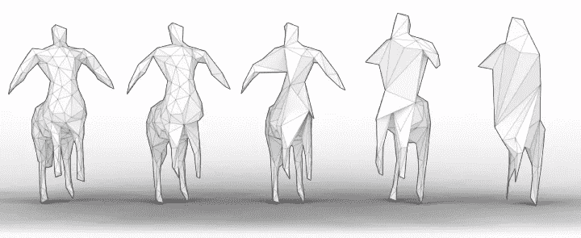
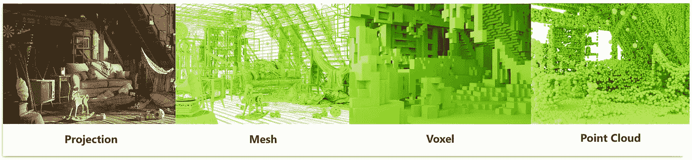
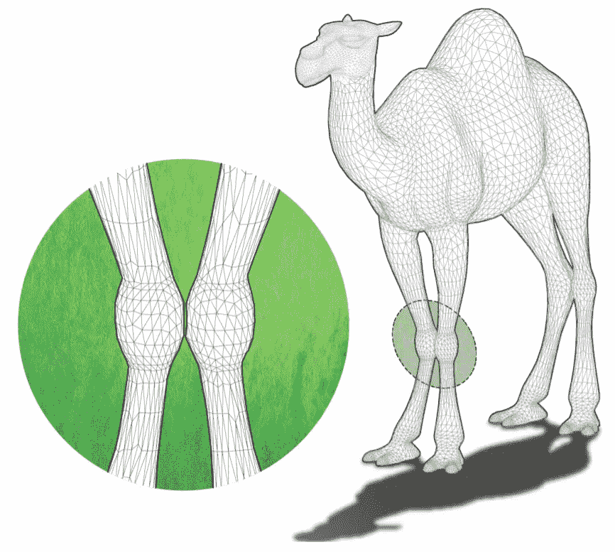
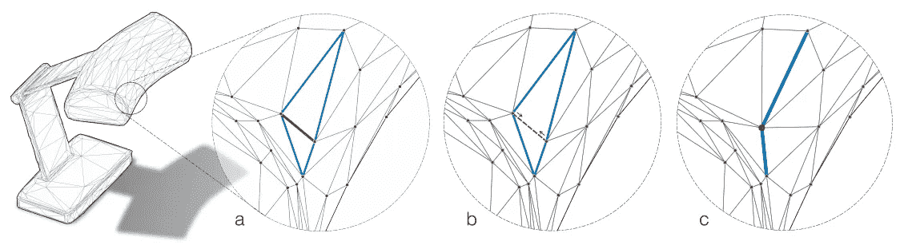
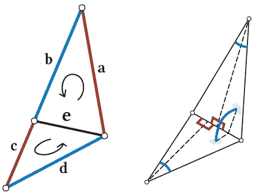
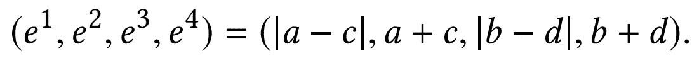
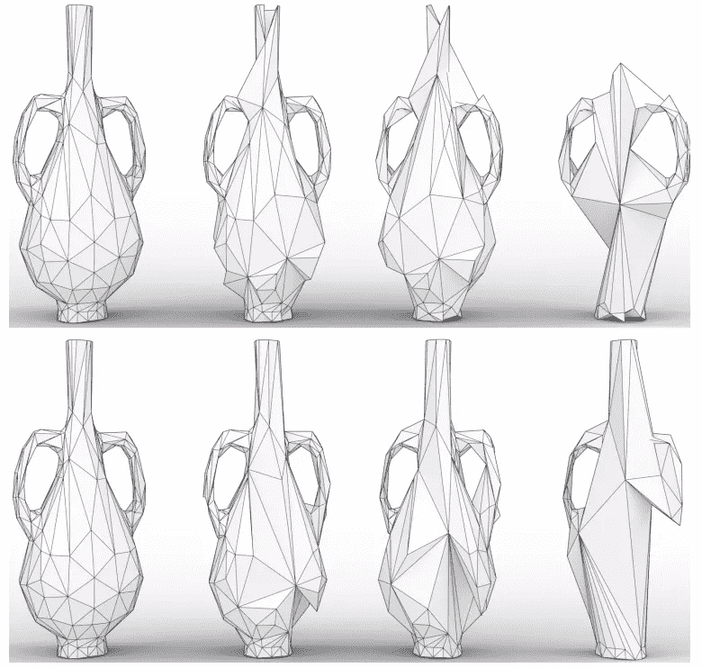

# 基于 MeshCNN 和 PyTorch 的三维物体分类与分割

> 原文：<https://towardsdatascience.com/3d-object-classification-and-segmentation-with-meshcnn-and-pytorch-3bb7c6690302?source=collection_archive---------8----------------------->

## MeshCNN 引入了网格池操作，使我们能够将 CNN 应用于 3D 模型。

连续的网格池操作应用于一个半人马的 3D 模型【来自 [MeshCNN 项目页面](https://ranahanocka.github.io/MeshCNN/)】。

对 3D 数据应用机器学习不像对图像那样简单。3D 数据有多种表示方式，但选择决定了您可以采用哪种学习策略。在这篇文章中我讲述了一个特别有趣的(至少对我来说😆)战略叫做 [MeshCNN:一个有优势的网络](https://paperswithcode.com/paper/meshcnn-a-network-with-an-edge)。本文描述了一个通用框架，用于处理分类和分割任务的三维模型。也许它最有趣的特征是它的**网格汇集**操作，这使我们能够在多个尺度上组合网格的特征(类似于视觉 CNN)。这是一个学习的操作，逐渐将模型减少到对给定任务最有用的边缘。MeshCNN 结合了每种流行的 3D 表示的许多最佳特性。然而，在我们进入细节之前，让我们通过对 3D 表示的简要回顾来了解那些属性是什么。

# 3D 数据表示

深度学习的 3D 网格表示方式最好是什么？与 2D RGB 图像不同，对于最佳表现形式并没有共识。这个问题很难回答，因为表征的选择决定了我们必须采取的学习方法。对于分类示例，您可以将模型从 3D 空间投影到 2D 影像中，并应用标准的 2D 卷积。您可以将模型占据的 3D 空间表示为体素网格，从而允许您应用 3D 卷积。您可以简单地将网格的顶点作为 3D 点云进行采样，并应用专门的方法，如 [PointNet++或](https://paperswithcode.com/paper/pointnet-deep-hierarchical-feature-learning) [3D 点胶囊网络](https://paperswithcode.com/paper/3d-point-capsule-networks)。甚至还有像 [PolyGen](https://arxiv.org/abs/2002.10880) 这样的方法可以直接处理模型的顶点和面，我在之前的文章[用 PolyGen 和 PyTorch](/generating-3d-models-with-polygen-and-pytorch-4895f3f61a2e) 生成 3D 模型中提到过。

3D 网格的最典型表示[来自 NVIDIA 的[高岭土库，根据](https://github.com/NVIDIAGameWorks/kaolin) [Apache 许可证版本授权。2.0](https://www.apache.org/licenses/LICENSE-2.0.html) 并编辑添加文字】。

## 推断

一些最早的 3D 深度学习研究直接绕过 3D 表示问题，并简单地将 3D 模型投影到 2D 图像中。这使得 3D 数据服从于经典的视觉 CNN 方法。例如，[中描述的用于 3D 形状识别的多视图卷积神经网络](https://arxiv.org/abs/1505.00880)的方法将一个模型投射到 12 个独特的视点中，并汇集它们的激活以产生一个 softmax 分数。在 ModelNet40 数据集上，他们报告了 90.1%的可靠分类准确率。根据[项目网站](https://modelnet.cs.princeton.edu/)的说法，ModelNet40 数据集上迄今为止的最佳性能为 97.37%，这来自一篇名为 [RotationNet:使用来自无监督视点的多视图进行联合对象分类和姿态估计](https://arxiv.org/abs/1603.06208)的论文。与上一篇论文类似，它在多个视图上训练以预测对象类别，但同时也预测视点，将其视为潜在变量。它能够有效地预测对象类别和视点，甚至对真实世界的对象也是如此。

虽然简单而优雅，但是投影表示 a)没有考虑模型的完整拓扑结构，b)对应该如何查看模型做出假设，以及 c)没有为分割之类的非全局任务提供直接的解决方案。

## 三维像素

体素方法在不牺牲卷积的情况下解决了投影方法的许多问题。通过将 3D 空间划分为多个面元来创建密集的占用网格，如果每个面元位于模型内，则为每个面元分配一个布尔值。网格布局很容易应用 3D 卷积。可能最早使用这种表示的论文是 [3D ShapeNets:一种体积形状的深度表示](https://arxiv.org/abs/1406.5670)，该论文实际上介绍了 ModelNet40 数据集。在这项研究中，他们试图通过从单个深度图像预测 3D 体素来恢复对象的 3D 结构，并取得了非常显著的结果。

从 3D 体素分类是另一回事。虽然您可以获得不错的结果，但缺点是在空白空间上有过多的卷积，因为空间的占用率非常低。最重要的是，模型分辨率会对权重的数量进行立体缩放，因此在大多数情况下，大于 256x256x256 的大小是不切实际的，即使是在显著利用空间稀疏性的情况下，例如在 [OctNet:在高分辨率下学习深度 3D 表示](https://arxiv.org/abs/1611.05009)中。在这篇论文中，他们在 ModelNet40 上实现了大约 86%的准确率，并在速度和内存消耗方面有了很大的改进。高分辨率体素空间是昂贵的，但是低分辨率体素空间挤压了模型拓扑的潜在有用的精细细节。

## 点云

很多方法侧重于直接处理矢量点云。例如，在 2019 年的论文[中，作者使用他们的方法在 ModelNet40 任务上实现了 89.3%的准确率。3D 点云表示的优势在于其多功能性，因为从激光雷达扫描到创作的 3D 模型，一切都可以表示为 3D 点云。即使是经典的 PointNet 和 PointNet++模型也可以在分类任务上取得相当好的结果(在上面的论文中为 88.0%)。缺点是大多数点云方法完全忽略了表面。如果没有面，就无法知道网格的真实拓扑，因为任何向量集都不会唯一地定义一组面。](https://paperswithcode.com/paper/spherical-kernel-for-efficient-graph)

这只骆驼的膝盖如此之近，以至于在不知道模型表面的情况下，它们可能无法分开，也就是它的脸【来自 [MeshCNN 论文](https://ranahanocka.github.io/MeshCNN/)的图 3】。

ModelNet40 上表现最好的方法之一来自一种称为[关系形状卷积神经网络的方法，用于点云分析](https://arxiv.org/abs/1904.07601)，达到 93.6%的准确率。这种方法被称为 RS-CNN，它试图从几何先验中推断给定点云的底层拓扑结构，从而赋予模型对其输入点的空间感知能力。该模型取得了良好的性能，可以应用于点云和网格。然而，即使网格信息可用，它也没有利用网格信息的机制。

# MeshCNN

有没有一种方法可以直接研究网格，而不牺牲有价值的拓扑信息，不增加体素的计算成本，或者对如何查看它做出假设？MeshCNN 提出的解决方案是通过将 3D 模型视为图形或流形来共同研究顶点及其连接或边。这种方法定义了 3D 网格边缘上的卷积和池层，允许我们或多或少地使用卷积神经网络的标准工具集。最终，他们能够在来自 [SHREC 11 数据集](http://reuter.mit.edu/blue/papers/shrec11/shrec11.pdf)的 30 个类别上实现 98.6%的准确性(他们没有报告 ModelNet40 的准确性)，以及在对象部分和人体数据集上令人印象深刻的分割性能。 [MeshCNN 源代码](https://github.com/ranahanocka/MeshCNN)由作者提供，如果你想参考他们的实现。

网格汇集操作的描述【来自 [MeshCNN 论文](https://ranahanocka.github.io/MeshCNN/)的图 2】。A)三角形网格的给定边(红色)正好有 4 个邻居(蓝色)。b)池化操作通过合并其两个顶点来溶解该边，这又合并了溶解边的任一侧的边对，c)产生 2 条边。

任何防水 3D 网格的边恰好入射到两个面上(边界或非流形边除外)。如果网格是三角形的(即它的所有面正好有 3 条边)，那么连接到任何边的两个入射面将总是接触总共 5 条边。这种一致性使得三角形网格对于机器学习技术特别方便。因此，MeshCNN 假设我们的模型都是三角形的流形网格。典型的 3D 重建方法如摄影测量、结构光扫描和激光扫描产生三角形网格，因此该方法可以直接应用于这种数据。创作的网格通常包含四边形或 n 边形，通常在 Maya 或 Blender 中单击几下就可以转化为三角形网格。

如果我们可以定义一条边和它的 4 个邻居的卷积，我们可以随后建立一个卷积神经网络来处理整个网格。面临的挑战是定义一组具有以下属性的操作:

*   必须对顶点或边顺序保持不变(局部或全局)。
*   必须对相似性变换(即网格平移、旋转和缩放)保持不变。
*   必须传达给定顶点或边与其邻居的关系及其在网格全局结构中的位置。

## 网格卷积

边缘及其邻居(左)【来自 [MeshCNN 论文](https://ranahanocka.github.io/MeshCNN/)的图 4】。边缘 *a、c(红色)和 b、d(蓝色)是相对的一对。*注意逆时针符号表示边缘对的严格排序，这样 a *总是在 b 之前，c 在 d* 之前。给定边(右侧)的输入要素也被设计为对于边的排序不变。

首先让我们看看卷积运算本身。给定一条边和 4 个邻居，每个邻居都有自己的特征，卷积需要对这些边的顺序保持不变。本文采用的简单解决方案是使用对称函数定义卷积。它们处理相对于中心边缘 *e* 逆时针排序的相对边缘对(例如 *a、c* 和 *b、d* ，并在应用卷积之前取它们的有限和与差:

等变特征组合的公式[等式。2 摘自 [MeshCNN 论文](https://ranahanocka.github.io/MeshCNN/)。

等变卷积码。

## 网格输入特征

然而，我们还没有解决一个关键问题。我们从什么特征开始？在应用第一次卷积之前，我们必须创建一个类似于 2D 影像中 RGB 通道的输入要素表示。为此，作者简单地为总共 5 个输入特征的每个面定义了*二面角*(两个邻接面之间的角度)*对称对角*(对角的角度，已排序以保持顺序不变)，以及两个*边长比*(每个三角形的高/底比，也已排序)。

输入要素的代码。

## 网状池

最后，让我们看看池操作。池只是将边的两个顶点合并在一起，将给定邻域的 5 条边折叠成 2 条。两个新边的特征仅仅是它们以前的边的特征的平均值。例如，上图中我们的两条新边的特征将是 *avg(a，b，e)* 和 *avg(c，d，e)* 。

但是我们如何决定哪些边应该折叠呢？每个网格池层都使用要保留的目标边数进行实例化(使用代码中的`--pool_res`参数)。网格池图层只是根据边要素的平方大小对边进行排序。然后，它反复折叠网格边，直到达到目标边数。

网状池学习保留对给定任务最有信息的边[来自 MeshCNN 论文的图 1]。“有柄或无柄”任务(顶部)的池保留花瓶中的柄，而“有颈或无颈”任务保留花瓶的颈部。

由于网格池操作是学习的，它授予模型学习权重的自由，该权重为给定的任务进行优化。还有一个恢复池化的网格取消池化操作，这对于分段任务是必不可少的。这意味着网络必须跟踪在 U-Net 型分段网络的编码器阶段完成的汇集操作。MeshCNN 通过跟踪网格的`history_data`属性中的边折叠操作来实现这一点。

## 体系结构

网络架构由`MResConv`层组成，每一层由一个初始网格卷积(MeshConv)、几个连续的 ReLU+BatchNorm+MeshConv 层、一个残差连接和后面的另一个 ReLU 组成。网络遵循一个`MResConv` +Norm+ `MeshPool`的模式数次，才在任务层结束。对于分类，任务层是简单的全局平均池，后面是两个完全连接的层。分段网络是一个 U-Net 类型的编码器-解码器。

# 结论

等变卷积运算、不变输入特征和学习网格池运算使 MeshCNN 成为一个特别有趣的模型，具有以下主要优势:

*   比旧方法更有效，参数更少。
*   利用网格的拓扑结构(即顶点和面信息)，而不是将其视为点云。
*   网格卷积保留了卷积的便利属性，但允许应用于图形数据。3D 网格的 5 个输入特征类似于输入图像的 RGB 特征。
*   对旋转、平移和缩放不变(参见论文的第 5.4 节)。
*   网格池(即学习的边折叠)允许网络通过将 5 个边折叠成 2 个边并溶解两个面来学习任务特定的池。

如果您渴望亲自尝试，我鼓励您查看作者提供的 [MeshCNN](https://github.com/ranahanocka/MeshCNN) 源代码。它是用 PyTorch 编写的，并提供了许多有用的脚本来在本文讨论的各种数据集上试用该模型。我发现它很干净，很容易使用，所以如果你很好奇想看看引擎盖下的话，值得看一看。一如既往，感谢阅读，继续学习！